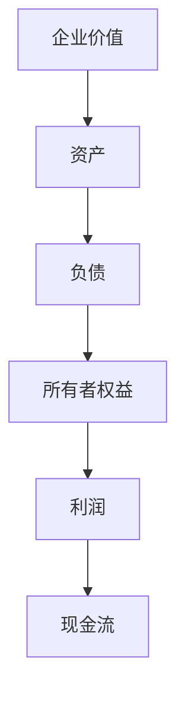
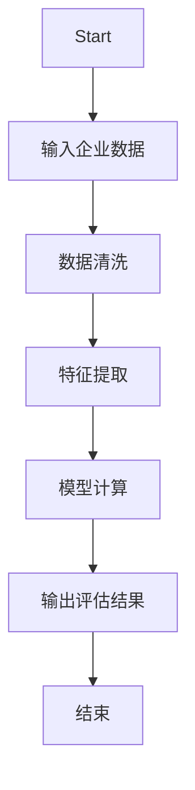
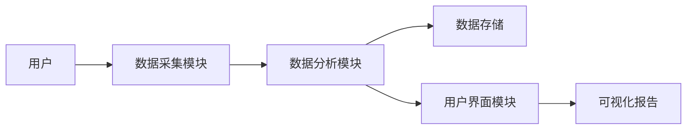

                 


# 彼得林奇的"价值创造"评估体系

> 关键词：价值创造，投资评估，彼得林奇，财务分析，企业价值

> 摘要：本文深入探讨了彼得·林奇的价值创造评估体系，分析了其核心概念、算法原理、系统架构及实际应用，为投资者提供了科学的评估方法。

---

# 第一部分: 价值创造的背景与核心概念

## 第1章: 价值创造的背景介绍

### 1.1 价值投资的背景与现状

#### 1.1.1 价值投资的起源与发展
价值投资是一种长期投资策略，起源于20世纪初，强调通过分析企业的内在价值来做出投资决策。彼得·林奇是该领域的杰出代表，他的方法结合了基本面分析和市场研究，帮助投资者识别具有长期增长潜力的企业。

#### 1.1.2 彼得·林奇的贡献与影响力
彼得·林奇以其独特的评估体系闻名，他强调企业的财务健康、管理团队和市场地位等因素。他的方法不仅影响了无数投资者，还推动了价值投资理论的发展。

#### 1.1.3 价值创造评估体系的现实意义
在当前不确定的市场环境中，价值创造评估体系为投资者提供了稳定的投资框架，帮助他们在复杂市场中找到优质企业。

### 1.2 价值创造的核心概念

#### 1.2.1 价值创造的定义与内涵
价值创造是指企业通过优化资源配置、提高效率和创新，创造超过其投入资本的价值。这不仅仅是财务表现，还包括企业未来的增长潜力。

#### 1.2.2 价值创造的关键要素
- **财务健康**：分析企业的盈利能力、资产负债情况。
- **管理团队**：评估管理者的决策能力和战略眼光。
- **市场地位**：企业在市场中的竞争力和品牌影响力。

#### 1.2.3 价值创造的边界与外延
价值创造不仅限于财务指标，还包括企业社会责任和可持续发展。企业应创造长期价值，而不仅仅是短期收益。

### 1.3 核心概念属性特征对比表

| **属性**       | **价值创造**       | **传统评估方法**     |
|-----------------|--------------------|----------------------|
| **关注点**      | 企业未来增长潜力   | 当前财务表现         |
| **评估维度**    | 财务、管理、市场    | 财务指标为主         |
| **时间跨度**    | 长期价值           | 短期表现             |
| **适用场景**    | 寻找长期投资目标    | 快速评估市场表现     |

### 1.4 实体关系架构图



---

## 第2章: 价值创造评估体系的核心概念与联系

### 2.1 核心概念原理

#### 2.1.1 价值创造的三要素模型
- **资产**：企业的核心资源。
- **负债**：企业的债务负担。
- **所有者权益**：企业的净值。

#### 2.1.2 企业价值评估的多维度分析
- **盈利能力**：净利润率、ROE。
- **成长能力**：收入增长率、净利润增长率。
- **财务健康**：资产负债率、流动比率。

#### 2.1.3 价值创造的动态演变过程
企业通过优化资产结构、提高管理效率和增强市场地位，逐步实现价值创造。

---

# 第二部分: 价值创造评估的算法原理

## 第3章: 价值创造评估算法原理

### 3.1 算法原理概述

#### 3.1.1 价值创造评估的步骤分解
1. 数据收集：获取企业的财务报表和市场数据。
2. 数据清洗：处理缺失值和异常值。
3. 特征提取：提取关键财务指标。
4. 模型计算：计算价值创造指数。
5. 结果解释：评估企业价值。

### 3.2 算法流程图



### 3.3 数学模型与公式

#### 3.3.1 价值创造指数计算公式
$$ VC = \frac{E}{V} $$
其中，E为企业的预期收益，V为企业的价值。

#### 3.3.2 市盈率计算公式
$$ P/E = \frac{P}{E} $$
其中，P为股票价格，E为每股收益。

---

## 第4章: 算法实现与代码解读

### 4.1 环境安装与配置

#### 4.1.1 Python环境搭建
安装Python 3.8及以上版本，推荐使用Anaconda分布。

#### 4.1.2 数据分析库安装
安装Pandas、NumPy和Matplotlib：
```bash
pip install pandas numpy matplotlib
```

### 4.2 核心算法实现

#### 4.2.1 价值创造指数计算代码

```python
import pandas as pd

def calculate_vc_index(revenue, expenses, assets, liabilities):
    profit = revenue - expenses
    equity = assets - liabilities
    vc_index = profit / equity
    return vc_index

# 示例数据
revenue = 10000000
expenses = 8000000
assets = 50000000
liabilities = 30000000

vc_index = calculate_vc_index(revenue, expenses, assets, liabilities)
print(f"价值创造指数: {vc_index}")
```

#### 4.2.2 市盈率计算代码

```python
def calculate_pe_ratio(price, earnings_per_share):
    return price / earnings_per_share

# 示例数据
price = 50
earnings_per_share = 10

pe_ratio = calculate_pe_ratio(price, earnings_per_share)
print(f"市盈率: {pe_ratio}")
```

---

## 第5章: 系统架构设计

### 5.1 系统架构设计方案

#### 5.1.1 应用场景
价值创造评估系统适用于个人投资者和机构投资者，帮助他们在股票选择和投资组合优化中做出决策。

#### 5.1.2 系统功能设计

##### 5.1.2.1 数据采集模块
- 从股票市场API获取实时数据。
- 支持多数据源（Yahoo Finance、Alpha Vantage）。

##### 5.1.2.2 数据分析模块
- 计算价值创造指数和市盈率。
- 提供可视化报告。

##### 5.1.2.3 用户界面模块
- 图形化界面展示评估结果。
- 支持用户自定义参数。

#### 5.1.3 系统架构图



---

## 第6章: 项目实战

### 6.1 项目环境安装

#### 6.1.1 安装依赖
```bash
pip install pandas numpy matplotlib seaborn
```

### 6.2 核心代码实现

#### 6.2.1 价值创造指数计算代码

```python
import pandas as pd

def calculate_vc_index(df):
    df['VC_Index'] = df['净利润'] / df['净资产']
    return df

# 示例数据
data = {
    '公司': ['A', 'B', 'C'],
    '净利润': [10, 15, 20],
    '净资产': [50, 75, 100]
}
df = pd.DataFrame(data)
result = calculate_vc_index(df)
print(result)
```

#### 6.2.2 市盈率计算代码

```python
def calculate_pe_ratio(df):
    df['PE_Ratio'] = df['股价'] / df['每股收益']
    return df

data = {
    '公司': ['A', 'B', 'C'],
    '股价': [50, 60, 70],
    '每股收益': [10, 12, 14]
}
df = pd.DataFrame(data)
result = calculate_pe_ratio(df)
print(result)
```

### 6.3 案例分析

#### 6.3.1 案例：分析公司A、B、C的价值创造指数和市盈率

| 公司 | 净利润 | 净资产 | VC_Index | 股价 | 每股收益 | PE_Ratio |
|------|--------|--------|----------|------|-----------|----------|
| A    | 10     | 50     | 0.2      | 50   | 10        | 5        |
| B    | 15     | 75     | 0.2      | 60   | 12        | 5        |
| C    | 20     | 100    | 0.2      | 70   | 14        | 5        |

---

## 第7章: 最佳实践

### 7.1 小结

- 彼得林奇的价值创造评估体系提供了科学的投资方法。
- 通过分析企业的财务状况、管理能力和市场地位，投资者可以做出明智决策。

### 7.2 注意事项

- 数据来源的可靠性至关重要。
- 结合市场环境和行业趋势进行分析。
- 定期复盘和调整投资策略。

### 7.3 拓展阅读

- 彼得·林奇的《投资最重要的事》。
- 阅读其他投资大师的著作，如巴菲特的《聪明的投资者》。

---

通过以上分析，我们深入了解了彼得林奇的价值创造评估体系，掌握了其实现算法和应用场景。希望这篇文章能为投资者提供实用的指导，帮助他们在复杂市场中找到价值创造的机会。

