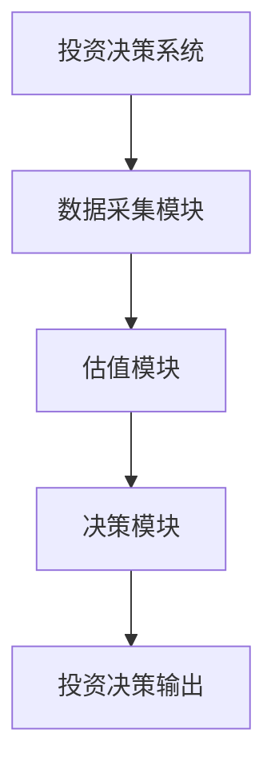
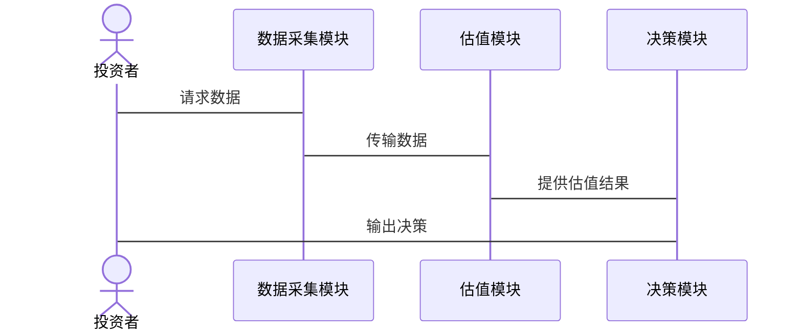

                 


# 彼得林奇的"价值投资"vs"成长投资"

---

## 关键词：
价值投资、成长投资、彼得林奇、投资策略、风险管理、内在价值、成长性分析

---

## 摘要：
本文将详细探讨彼得林奇的价值投资与成长投资之间的异同，从核心概念、数学模型、系统架构设计、实战案例等多维度进行分析，帮助读者更好地理解这两种投资策略的特点及其在实际操作中的应用。通过对比分析，本文旨在为投资者提供一个清晰的思路，以便在不同的市场环境下做出更明智的投资决策。

---

## 第1章: 价值投资与成长投资的背景与核心概念

### 1.1 投资的基本概念与分类

#### 1.1.1 投资的基本定义
投资是指将资金投入某一资产或项目，以期在未来获得收益或资本增值的行为。投资的核心目标是通过合理的资源配置，实现财富的保值与增值。

#### 1.1.2 价值投资与成长投资的定义
- **价值投资**：强调以低于内在价值的价格买入优质资产，通过安全边际的保护来实现长期收益。
- **成长投资**：关注具有高成长潜力的公司，通过长期持有这些公司来分享其成长带来的收益。

#### 1.1.3 价值投资与成长投资的异同
- **相同点**：两者都属于长期投资策略，注重基本面分析，追求资本的长期增值。
- **不同点**：价值投资更注重安全边际和当前价值，而成长投资更注重未来的成长潜力和盈利能力。

---

### 1.2 价值投资的核心理念

#### 1.2.1 价值投资的起源与发展
价值投资的起源可以追溯到本杰明·格雷厄姆和戴维·多德的理论，彼得林奇在其基础上进一步完善了这一理念。价值投资的核心是寻找市场价格低于内在价值的股票，通过长期持有实现收益。

#### 1.2.2 价值投资的核心原则
- **安全边际**：买入价格低于内在价值的资产，确保即使市场波动也不会损失本金。
- **注重基本面**：分析公司的财务状况、盈利能力、行业地位等，选择优质的公司。
- **长期持有**：避免频繁交易，降低交易成本，享受复利效应。

#### 1.2.3 价值投资的适用场景
- 市场低迷时期，股票价格被低估。
- 经济周期的低谷阶段，寻找价值被忽视的公司。

---

### 1.3 成长投资的核心理念

#### 1.3.1 成长投资的起源与发展
成长投资起源于20世纪60年代，以菲德·费雪为代表人物。成长投资的核心是寻找具有高成长潜力的公司，通过长期持有分享其成长带来的收益。

#### 1.3.2 成长投资的核心原则
- **高成长潜力**：选择那些销售收入和利润持续增长的公司。
- **行业地位**：关注市场领导地位强的公司，这些公司具有更强的竞争优势。
- **估值合理性**：虽然成长性强，但估值过高的公司也存在风险。

#### 1.3.3 成长投资的适用场景
- 市场繁荣时期，高成长公司表现出色。
- 新兴行业或技术创新驱动的市场环境中，成长潜力大的公司更容易实现高增长。

---

## 第2章: 价值投资的核心概念与数学模型

### 2.1 价值投资的核心概念

#### 2.1.1 知识价值与市场价值
- **知识价值**：公司未来创造利润的能力。
- **市场价值**：市场价格反映市场对公司的估值。

#### 2.1.2 安全边际的概念
安全边际是指股票的市场价格低于其内在价值的部分，确保在市场价格波动时，投资者不会遭受损失。

#### 2.1.3 内在价值的计算
内在价值是基于公司未来现金流的现值计算得出的，公式如下：

$$ V = \frac{CF}{r - g} $$

其中：
- \( CF \)：未来现金流
- \( r \)：折现率
- \( g \)：现金流增长率

---

### 2.2 价值投资的数学模型

#### 2.2.1 内在价值公式
$$ V = \frac{CF}{r - g} $$

#### 2.2.2 安全边际计算
安全边际 = 内在价值 - 市场价格

#### 2.2.3 股票估值的步骤
1. **分析公司基本面**：收入、利润、资产负债表等。
2. **预测未来现金流**：基于历史数据和行业趋势。
3. **计算内在价值**：使用DCF模型（ discounted cash flow model）。
4. **比较市场价格**：判断是否低于内在价值。

---

### 2.3 价值投资的案例分析

#### 2.3.1 彼得林奇的经典案例
彼得林奇在管理麦哲伦基金期间，通过价值投资策略实现了卓越的业绩。例如，他买入被市场低估的股票，如美国汽车公司，最终获得超额收益。

#### 2.3.2 内在价值计算的实战应用
以某公司为例，假设其未来现金流为 $100万，折现率为10%，增长率为5%。则内在价值为：

$$ V = \frac{100}{0.10 - 0.05} = 2000万 $$

如果市场价格为1800万，则安全边际为200万。

---

## 第3章: 成长投资的核心概念与数学模型

### 3.1 成长投资的核心概念

#### 3.1.1 市场领导地位的定义
市场领导地位是指公司在行业中具有强大的竞争优势，能够持续获得市场份额和利润。

#### 3.1.2 盈利能力与成长性的关系
盈利能力是衡量公司成长性的关键指标，高成长公司通常具有稳定的盈利能力。

#### 3.1.3 市盈率与市净率的分析
- **市盈率（P/E）**：反映了市场对公司盈利能力的估值。
- **市净率（P/B）**：反映了市场对公司资产价值的估值。

---

### 3.2 成长投资的数学模型

#### 3.2.1 市盈率公式
$$ P/E = \frac{P}{E} $$

其中：
- \( P \)：股票价格
- \( E \)：每股收益

#### 3.2.2 市净率公式
$$ P/B = \frac{P}{B} $$

其中：
- \( B \)：每股净资产

#### 3.2.3 成长性预测模型
$$ g = \frac{ROE \times (1 - 股权乘数)}{1} $$

其中：
- \( ROE \)：净资产收益率
- 股权乘数：衡量公司的杠杆程度

---

### 3.3 成长投资的案例分析

#### 3.3.1 美国运通的案例
美国运通是一家具有强大市场领导地位的公司，通过其信用卡业务实现了持续增长。彼得林奇在其成长阶段买入并长期持有，获得了丰厚的回报。

#### 3.3.2 微软的案例
微软作为科技行业的领导者，具有强大的研发能力和市场地位。通过分析其盈利能力和发展前景，成长投资者可以选择合适的时机买入。

---

## 第4章: 价值投资与成长投资的比较分析

### 4.1 投资目标的比较

#### 4.1.1 价值投资的目标
价值投资的目标是通过买入低于内在价值的股票，实现长期稳定的收益。

#### 4.1.2 成长投资的目标
成长投资的目标是通过买入具有高成长潜力的股票，实现资本的长期增值。

---

### 4.2 投资策略的比较

#### 4.2.1 价值投资的买入策略
- 买入价格低于内在价值的股票。
- 选择基本面稳定、行业地位稳固的公司。

#### 4.2.2 成长投资的买入策略
- 买入具有高成长潜力的股票。
- 关注行业趋势和技术创新。

---

### 4.3 投资风险的比较

#### 4.3.1 价值投资的风险
- 市场波动可能导致短期内价格低于内在价值。
- 选择错误的公司可能导致长期亏损。

#### 4.3.2 成长投资的风险
- 高成长股票估值过高，市场波动可能导致大幅回撤。
- 高成长公司的未来盈利可能不及预期。

---

### 4.4 投资周期的比较

#### 4.4.1 价值投资的长期性
价值投资强调长期持有，通常需要耐心等待市场回归内在价值。

#### 4.4.2 成长投资的中期性
成长投资关注公司的成长周期，通常需要中长期持有，以分享公司的成长收益。

---

## 第5章: 价值投资与成长投资的系统架构设计

### 5.1 投资决策的系统模型

#### 5.1.1 系统输入：市场数据与公司基本面
- 市场数据：股票价格、成交量、市场指数等。
- 公司基本面：收入、利润、资产负债表等。

#### 5.1.2 系统处理：估值模型与策略选择
- 估值模型：DCF模型、市盈率、市净率等。
- 策略选择：根据市场环境选择价值或成长策略。

#### 5.1.3 系统输出：投资决策
- 买入、卖出或持有某只股票的决策。

---

### 5.2 系统功能设计

#### 5.2.1 数据采集模块
- 数据来源：股票市场数据、公司财务报表等。
- 数据处理：清洗、转换和存储。

#### 5.2.2 估值模块
- 内在价值计算：DCF模型。
- 安全边际计算：市场价格与内在价值对比。
- 成长性分析：市盈率、市净率等指标。

#### 5.2.3 决策模块
- 价值投资决策：基于安全边际。
- 成长投资决策：基于成长潜力和估值。

---

### 5.3 系统架构设计

#### 5.3.1 系统架构图


#### 5.3.2 系统接口设计
- 数据接口：与数据源（如股票交易平台）连接。
- 决策接口：输出买入、卖出或持有的指令。

#### 5.3.3 系统交互序列图


---

## 第6章: 价值投资与成长投资的实战案例分析

### 6.1 价值投资的实战案例

#### 6.1.1 案例背景
某公司基本面良好，但市场价格被低估。

#### 6.1.2 投资决策
- 计算内在价值：假设内在价值为10元，市场价格为8元。
- 安全边际：2元。
- 决策：买入该股票。

#### 6.1.3 实战分析
通过长期持有，公司股价回归内在价值，投资者获得收益。

---

### 6.2 成长投资的实战案例

#### 6.2.1 案例背景
某科技公司具有高成长潜力，市盈率合理。

#### 6.2.2 投资决策
- 分析市盈率：假设市盈率为15，合理。
- 判断成长性：预计未来三年利润增长30%。
- 决策：买入该股票。

#### 6.2.3 实战分析
通过长期持有，公司股价随业绩增长而上涨，投资者获得收益。

---

## 第7章: 价值投资与成长投资的系统实现与应用

### 7.1 系统实现

#### 7.1.1 系统环境
- 开发工具：Python、Jupyter Notebook
- 数据源：Yahoo Finance API
- 依赖库：pandas、numpy、scipy

#### 7.1.2 核心代码实现
```python
import pandas as pd
import numpy as np

# 内在价值计算函数
def calculate_intrinsic_value(cf, r, g):
    return cf / (r - g)

# 安全边际计算函数
def calculate_margin_of_safety(iv, price):
    return iv - price

# 成长性预测函数
def predict_growth(roa, equity_multiplier):
    return roa * (1 - equity_multiplier)
```

#### 7.1.3 代码应用解读
- `calculate_intrinsic_value`：基于现金流计算内在价值。
- `calculate_margin_of_safety`：判断买入价格是否低于内在价值。
- `predict_growth`：预测公司的成长潜力。

---

## 第8章: 价值投资与成长投资的总结与展望

### 8.1 本章总结
本文通过详细分析彼得林奇的价值投资与成长投资，探讨了两者的异同及其在实际投资中的应用。通过系统架构设计和实战案例分析，为投资者提供了一个全面的视角，帮助其在不同的市场环境下做出更明智的投资决策。

### 8.2 最佳实践
- **风险管理**：无论选择哪种策略，都需注重风险控制，避免过度集中投资。
- **策略选择**：根据市场环境和个人风险偏好，选择适合自己的投资策略。
- **长期投资**：无论是价值投资还是成长投资，都需要耐心和长期持有。

### 8.3 展望
未来，随着科技的进步和市场的变化，价值投资与成长投资将更加结合，投资者需要不断学习和适应新的市场环境，以实现更好的投资回报。

---

## 附录: 进一步阅读与学习

### 1. 经典书籍
- 《巴菲特的思维方式》
- 《彼得林奇的投资哲学》

### 2. 在线资源
- 彼得林奇投资策略的在线课程
- 投资分析工具和软件

### 3. 讨论与交流
- 加入投资论坛，与同行交流经验
- 参加投资讲座和研讨会

---

通过本文的分析，读者可以更好地理解价值投资与成长投资的区别与联系，并在实际投资中灵活运用这些策略，实现财富的长期增值。

