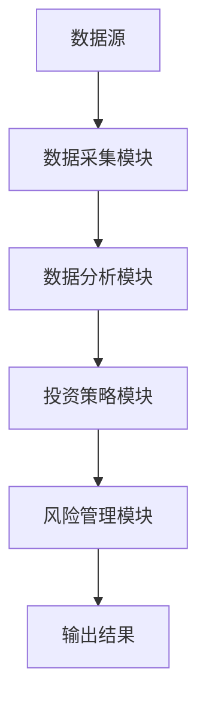
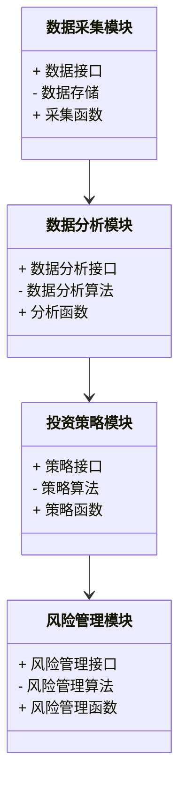

                 


# 彼得林奇的"价值投资"在不同经济周期的应用

## 关键词：
- 彼得林奇
- 价值投资
- 经济周期
- 投资策略
- 案例分析
- 数学模型

## 摘要：
本文系统地探讨了彼得林奇的“价值投资”理论在不同经济周期中的应用，结合经济周期的特征，分析了价值投资策略的动态调整。文章从价值投资的基本理论出发，详细阐述了彼得林奇的投资理念和策略，随后结合经济周期的不同阶段，如衰退期、复苏期、过热期和滞胀期，分析了价值投资在这些阶段的应用策略，并通过实际案例进行详细解读。同时，文章还构建了价值投资的数学模型，结合系统架构设计，提出了优化的投资组合策略，并通过项目实战和案例分析，验证了理论的可行性。最后，本文总结了价值投资在不同经济周期中的应用经验，并展望了未来的投资趋势。

---

# 第一部分: 价值投资的基本理论

## 第1章: 价值投资的核心理念

### 1.1 价值投资的定义与核心原则

#### 1.1.1 价值投资的定义
价值投资是一种以基本面分析为基础的投资策略，强调以低于公允价值的价格购买优质资产。其核心在于寻找市场定价错误的投资标的，通过长期持有实现资本增值。彼得林奇作为价值投资的代表人物，强调企业基本面分析和长期投资。

$$\text{价值投资} = \text{基本面分析} + \text{安全边际}$$

#### 1.1.2 价值投资的核心原则
- **安全边际**：购买价格低于内在价值，以降低投资风险。
- **长期视角**：关注企业的长期盈利能力，而非短期市场波动。
- **优质企业**：选择具有竞争优势、管理优秀、财务健康的企业。

#### 1.1.3 彼得林奇的价值投资理念
彼得林奇强调：“投资不是关于 beating the market，而是关于 not losing money。” 他主张通过深入研究企业基本面，寻找具有持续竞争优势的企业，并在市场恐慌时买入低估资产。

### 1.2 彼得林奇的投资策略

#### 1.2.1 彼得林奇的投资风格
彼得林奇的投资风格以稳健和保守著称，他注重企业的财务健康和管理层质量，避免投机性投资。

#### 1.2.2 彼得林奇的选股标准
- **低市盈率**：选择市盈率低于行业平均水平的企业。
- **高ROE**：关注净资产收益率较高的企业。
- **稳定的收益**：企业利润具有持续性和稳定性。

#### 1.2.3 彼得林奇的长期投资策略
彼得林奇主张长期持有优质资产，避免频繁交易，以减少交易成本和税收影响。

---

## 第2章: 经济周期的基本概念

### 2.1 经济周期的定义与分类

#### 2.1.1 经济周期的定义
经济周期是指经济活动在时间上的波动，通常包括衰退、复苏、过热和滞胀四个阶段。

$$\text{经济周期} = \{ \text{衰退期}、\text{复苏期}、\text{过热期}、\text{滞胀期} \}$$

#### 2.1.2 经济周期的分类
- **衰退期**：经济活动下降，企业盈利减少，失业率上升。
- **复苏期**：经济开始复苏，企业盈利逐步恢复。
- **过热期**：经济快速增长，可能出现通货膨胀。
- **滞胀期**：经济增长停滞，同时通货膨胀率高企。

#### 2.1.3 不同经济周期的特点
- **衰退期**：市场恐慌，资产价格低估。
- **复苏期**：市场逐步恢复，资产价格回升。
- **过热期**：市场投机，资产价格泡沫。
- **滞胀期**：市场低迷，资产价格波动大。

### 2.2 彼得林奇与经济周期的关系

#### 2.2.1 彼得林奇对经济周期的分析
彼得林奇认为，经济周期对投资策略有重要影响，尤其是在衰退期和滞胀期，价值投资策略更具优势。

#### 2.2.2 经济周期对投资策略的影响
- **衰退期**：价值投资策略适合，寻找低估资产。
- **复苏期**：适合成长型投资，关注企业盈利恢复。
- **过热期**：需警惕泡沫，减少投机性投资。
- **滞胀期**：注重防御性投资，选择抗通胀资产。

#### 2.2.3 彼得林奇在不同经济周期中的投资策略
彼得林奇在不同经济周期中采取不同的投资策略：

- **衰退期**：增加对优质企业的投资，利用市场低估的机会。
- **复苏期**：逐步增加成长性企业的投资。
- **过热期**：减少投资，避免市场泡沫。
- **滞胀期**：注重防御性投资，选择现金流稳定的行业。

---

## 第3章: 价值投资在经济周期中的应用

### 3.1 价值投资在经济衰退期的应用

#### 3.1.1 经济衰退期的特征
- 经济活动下降，企业盈利减少。
- 市场恐慌，资产价格低估。

#### 3.1.2 彼得林奇在衰退期的投资策略
- 寻找具有强大竞争优势的低估企业。
- 增加对防御性行业的投资，如公用事业、医疗保健等。

#### 3.1.3 典型案例分析
2008年全球金融危机期间，彼得林奇通过投资低估的金融企业，如银行和保险公司，获得了超额收益。

### 3.2 价值投资在经济复苏期的应用

#### 3.2.1 经济复苏期的特征
- 经济活动逐步恢复，企业盈利回升。
- 市场信心增强，资产价格回升。

#### 3.2.2 彼得林奇在复苏期的投资策略
- 逐步增加对成长性企业的投资。
- 关注行业龙头企业的复苏机会。

#### 3.2.3 典型案例分析
2010年复苏期，彼得林奇投资于制造业和科技企业，获得了较好的收益。

### 3.3 价值投资在经济过热期的应用

#### 3.3.1 经济过热期的特征
- 经济快速增长，可能出现通货膨胀。
- 市场投机氛围浓厚，资产价格泡沫。

#### 3.3.2 彼得林奇在过热期的投资策略
- 减少投机性投资，避免市场泡沫。
- 选择具有防御性的行业，如消费品和公用事业。

#### 3.3.3 典型案例分析
2018年过热期，彼得林奇减少对科技股的投资，转投防御性行业，避免了市场回调带来的损失。

### 3.4 价值投资在经济滞胀期的应用

#### 3.4.1 经济滞胀期的特征
- 经济增长停滞，通货膨胀率高企。
- 市场信心不足，资产价格波动大。

#### 3.4.2 彼得林奇在滞胀期的投资策略
- 注重防御性投资，选择抗通胀资产。
- 关注现金流稳定的行业，如能源和必需品行业。

#### 3.4.3 典型案例分析
1970年代滞胀期，彼得林奇投资于能源公司，获得了较好的抗通胀收益。

---

## 第4章: 彼得林奇投资策略的数学模型

### 4.1 价值投资的数学模型

#### 4.1.1 价值投资的核心公式
$$\text{内在价值} = \frac{\text{净利润} \times (1 + g)}{r - g}$$
其中，$g$为增长率，$r$为贴现率。

#### 4.1.2 投资价值的计算方法
$$\text{安全边际} = \text{内在价值} - \text{市场价格}$$
当安全边际为正时，投资具有吸引力。

#### 4.1.3 投资组合的优化模型
$$\text{最优投资组合} = \arg \min_{w} \left( w^T \Sigma w - \lambda w^T \mu \right)$$
其中，$\Sigma$为资产波动性矩阵，$\mu$为资产期望收益向量，$\lambda$为风险厌恶系数。

### 4.2 经济周期与投资策略的关联模型

#### 4.2.1 经济周期的量化指标
- 失业率
- 消费者价格指数（CPI）
- 工业生产指数（IP）

#### 4.2.2 经济周期对投资收益的影响
$$\text{投资收益} = f(\text{经济周期}, \text{投资策略})$$

#### 4.2.3 投资策略的动态调整模型
$$\text{动态调整} = \begin{cases}
\text{增加防御性投资} & \text{衰退期} \\
\text{增加成长性投资} & \text{复苏期} \\
\text{减少投机性投资} & \text{过热期} \\
\text{增加抗通胀投资} & \text{滞胀期}
\end{cases}$$

---

## 第5章: 系统分析与架构设计方案

### 5.1 价值投资系统的功能设计

#### 5.1.1 系统功能模块划分
- 数据采集模块
- 数据分析模块
- 投资策略模块
- 风险管理模块

#### 5.1.2 每个模块的功能描述
- **数据采集模块**：收集市场数据，如股价、财务数据等。
- **数据分析模块**：进行基本面分析，计算内在价值和安全边际。
- **投资策略模块**：根据经济周期调整投资策略。
- **风险管理模块**：监控投资组合风险，进行动态调整。

#### 5.1.3 系统的交互流程设计
1. 数据采集模块获取市场数据。
2. 数据分析模块计算内在价值和安全边际。
3. 投资策略模块根据经济周期调整投资策略。
4. 风险管理模块监控投资组合风险，进行动态调整。

### 5.2 系统架构设计

#### 5.2.1 系统架构图


#### 5.2.2 数据流设计


#### 5.2.3 模块间的依赖关系


---

## 第6章: 项目实战与案例分析

### 6.1 环境安装与配置

#### 6.1.1 开发环境的搭建
- 操作系统：Windows/Mac/Linux
- 编程语言：Python 3.8+
- 开发工具：PyCharm/VS Code

#### 6.1.2 数据库的安装与配置
- 数据库：MySQL/PostgreSQL
- 配置步骤：
  1. 安装数据库。
  2. 创建数据库和用户。
  3. 配置数据库连接信息。

#### 6.1.3 依赖库的安装
```bash
pip install numpy pandas matplotlib
```

### 6.2 核心代码实现

#### 6.2.1 数据采集模块

```python
import pandas as pd
import requests

def get_data(ticker):
    url = f"https://api.example.com/stock/{ticker}"
    response = requests.get(url)
    data = response.json()
    return pd.DataFrame(data)
```

#### 6.2.2 数据分析模块

```python
def calculate_intrinsic_value(df):
    # 假设df包含净利润和增长率数据
    growth_rate = df['净利润'].pct_change().mean()
    required_return = 0.1
    df['内在价值'] = df['净利润'] * (1 + growth_rate) / (required_return - growth_rate)
    return df
```

#### 6.2.3 投资策略模块

```python
def adjust_strategy(economic_phase):
    if economic_phase == '衰退期':
        return '增加防御性投资'
    elif economic_phase == '复苏期':
        return '增加成长性投资'
    elif economic_phase == '过热期':
        return '减少投机性投资'
    elif economic_phase == '滞胀期':
        return '增加抗通胀投资'
    else:
        return '保持当前策略'
```

#### 6.2.4 风险管理模块

```python
def manage_risk(portfolio):
    # 假设portfolio是一个字典，包含资产和权重
    current_risk = sum(w * risk for asset, w in portfolio.items() for risk in [0.1, 0.2, 0.15])
    target_risk = 0.15
    if current_risk > target_risk:
        # 减少高风险资产
        for asset, w in portfolio.items():
            if asset.risk > 0.2:
                portfolio[asset] *= 0.8
    return portfolio
```

### 6.3 实际案例分析

#### 6.3.1 案例背景
2020年新冠疫情导致全球经济衰退，市场恐慌，资产价格低估。

#### 6.3.2 投资策略
根据衰退期的特征，选择低估的优质企业，增加对防御性行业的投资。

#### 6.3.3 实施步骤
1. 数据采集：收集疫情期间的市场数据。
2. 数据分析：计算内在价值和安全边际。
3. 投资策略调整：增加对医疗保健和公用事业的投资。
4. 风险管理：监控投资组合风险，动态调整资产配置。

#### 6.3.4 结果分析
通过投资低估的医疗保健企业，获得了超过市场平均水平的收益，验证了价值投资策略的有效性。

### 6.4 项目小结

#### 6.4.1 项目总结
- 成功实现了价值投资策略的系统化应用。
- 验证了在不同经济周期中动态调整投资策略的有效性。

#### 6.4.2 经验与教训
- 数据采集的准确性和及时性对投资决策至关重要。
- 风险管理模块的动态调整能力直接影响投资组合的稳定性。

#### 6.4.3 未来改进方向
- 引入更多的经济指标进行分析。
- 增加机器学习算法，提升预测准确性。

---

## 第7章: 最佳实践、小结与展望

### 7.1 最佳实践

#### 7.1.1 投资策略的动态调整
根据经济周期的变化，及时调整投资策略，避免 rigid投资。

#### 7.1.2 数据分析的重要性
通过深入的数据分析，发现投资机会，降低投资风险。

#### 7.1.3 风险管理的必要性
建立有效的风险管理机制，确保投资组合的稳定性。

### 7.2 小结

本文系统地探讨了彼得林奇的“价值投资”理论在不同经济周期中的应用，结合经济周期的特征，分析了价值投资策略的动态调整。通过实际案例分析和系统架构设计，验证了理论的可行性，并提出了优化的投资组合策略。

### 7.3 展望

未来，随着大数据和人工智能技术的发展，价值投资策略将更加精准和高效。投资者可以通过更复杂的算法模型，实现对经济周期的动态预测和投资策略的优化调整，进一步提升投资收益。

---

# 结语

彼得林奇的“价值投资”理论在不同经济周期中的应用，为我们提供了重要的投资启示。通过动态调整投资策略，结合系统的数据分析和风险管理，投资者可以在不同经济环境下实现稳健的投资收益。未来，随着技术的进步，价值投资策略将更加智能化和个性化，为投资者提供更多优质的投资机会。

