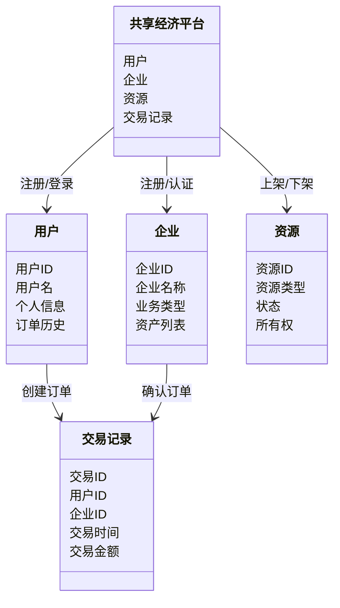
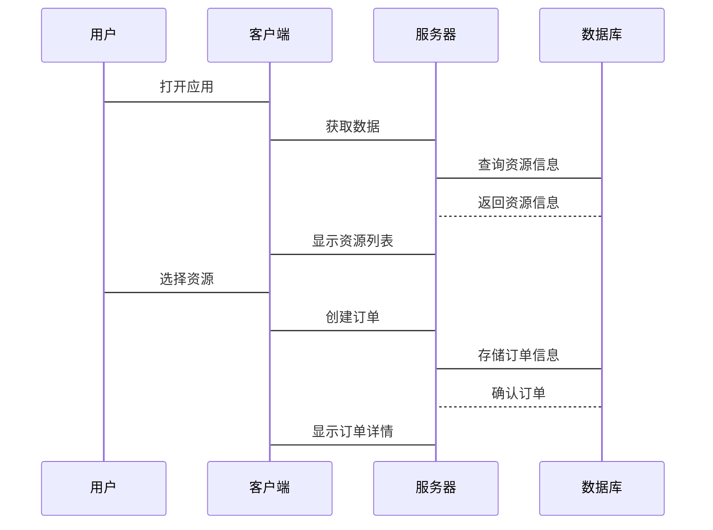

                 


# 彼得林奇的"价值投资"在共享经济中的调整

> **关键词**：价值投资、彼得林奇、共享经济、投资策略、经济模式  
> **摘要**：本文探讨了彼得林奇的价值投资理念在共享经济中的应用，分析了共享经济的模式与挑战，并结合系统设计和实际案例，展示了如何将价值投资策略应用于共享经济领域，寻找具有长期增长潜力的企业。

---

## 第一部分：引言

### 第1章：引言

#### 1.1 价值投资与共享经济的概述

##### 1.1.1 价值投资的定义与核心理念

价值投资是一种以企业内在价值为基础的投资策略，强调购买被市场低估的股票。其核心理念是寻找具有持续竞争优势和良好管理的企业，注重长期价值而非短期波动。

##### 1.1.2 共享经济的基本概念与模式

共享经济是一种通过共享资源来提高效率和创造价值的经济模式，主要通过数字平台实现资源的优化配置。其典型模式包括资源共享、服务共享和平台共享。

##### 1.1.3 本书的研究背景与意义

随着共享经济的快速发展，传统投资策略在该领域的应用面临挑战。本文旨在探讨彼得林奇的价值投资理念如何在共享经济中调整和应用，为企业和投资者提供新的视角和策略。

---

#### 1.2 彼得林奇的价值投资策略

##### 1.2.1 彼得林奇的生平与投资理念

彼得林奇是著名投资经理，强调基本面分析和长期投资。他认为投资者应选择具有持续增长潜力和良好管理的企业，避免短期市场波动的影响。

##### 1.2.2 价值投资的核心原则与方法

价值投资强调安全边际、长期持有和深入分析。彼得林奇通过对企业财务状况、行业地位和管理层能力的评估，寻找具有长期增长潜力的企业。

##### 1.2.3 彼得林奇的成功案例分析

通过分析彼得林奇的成功投资案例，如可口可乐和喜诗糖果，展示其投资策略的有效性。

---

#### 1.3 本书的结构与目标

##### 1.3.1 本书的主要内容概述

本文将探讨价值投资在共享经济中的应用，分析共享经济的模式与挑战，并结合系统设计和实际案例，展示如何将价值投资策略应用于共享经济领域。

##### 1.3.2 本书的目标读者与应用场景

本文适合投资者、企业家和研究人员，特别是对共享经济和价值投资感兴趣的专业人士。

##### 1.3.3 本书的创新点与价值

本文的独特之处在于将传统投资理念与新兴经济模式结合，为投资者提供新的视角和策略。

---

## 第二部分：价值投资的理论基础

### 第2章：价值投资的理论基础

#### 2.1 价值投资的核心理论

##### 2.1.1 股票的价值评估与市场定价

股票的内在价值基于企业的盈利能力、成长潜力和财务状况。市场定价可能偏离内在价值，为投资者提供机会。

##### 2.1.2 股东价值与企业长期增长

企业应注重股东价值，通过持续增长和良好管理为股东创造价值。

##### 2.1.3 安全边际的概念与应用

安全边际是股票的内在价值与市场价格之间的差额，确保投资的安全性。

#### 2.2 彼得林奇的投资策略

##### 2.2.1 高质量企业的识别标准

彼得林奇关注企业的财务健康、行业地位和管理层能力，寻找具有持续增长潜力的企业。

##### 2.2.2 股票筛选与投资组合管理

通过基本面分析和行业研究，筛选出优质股票，构建多元化投资组合，分散风险。

##### 2.2.3 风险控制与长期投资

注重风险控制，避免过度集中投资，坚持长期投资，抵御短期市场波动。

#### 2.3 价值投资与共享经济的结合

##### 2.3.1 共享经济的商业模式与价值创造

共享经济通过平台优化资源配置，降低交易成本，创造新价值。

##### 2.3.2 价值投资在共享经济中的适用性

价值投资的核心理念适用于共享经济，需结合其特点进行调整。

##### 2.3.3 共享经济中的长期价值评估

评估共享经济企业的长期价值，需考虑其市场定位、商业模式和竞争优势。

---

## 第三部分：共享经济的模式与挑战

### 第3章：共享经济的基本模式

#### 3.1 共享经济的定义与特点

##### 3.1.1 共享经济的概念与分类

共享经济包括资源分享、服务共享和平台共享，涉及多个领域如交通、住宿和教育。

##### 3.1.2 共享经济的参与者与利益相关者

包括平台、供应商、消费者和监管机构，各方利益需平衡。

##### 3.1.3 共享经济的经济与社会影响

优化资源配置，促进经济效率，但也面临监管和隐私等问题。

#### 3.2 共享经济的主要模式

##### 3.2.1 资源共享模式

如共享办公空间，通过共享资源降低使用成本。

##### 3.2.2 服务共享模式

如共享交通，通过平台匹配供需。

##### 3.2.3 平台共享模式

如共享住宿平台，连接房东与租客，降低交易成本。

#### 3.3 共享经济的挑战与风险

##### 3.3.1 监管风险

政策变化可能影响共享经济的运营。

##### 3.3.2 市场风险

竞争激烈可能导致利润率下降。

##### 3.3.3 信任风险

平台的信用体系和用户信任是关键。

---

## 第四部分：系统分析与架构设计

### 第4章：系统分析与架构设计

#### 4.1 系统功能设计

##### 4.1.1 领域模型（Mermaid类图）



#### 4.2 系统架构设计（Mermaid架构图）


#### 4.3 系统接口设计

##### 4.3.1 用户接口

- 注册/登录接口
- 订单创建接口
- 个人信息管理接口

##### 4.3.2 企业接口

- 资源上架/下架接口
- 订单确认/取消接口
- 企业信息管理接口

#### 4.4 系统交互流程（Mermaid序列图）



---

## 第五部分：项目实战

### 第5章：项目实战

#### 5.1 环境安装与代码实现

##### 5.1.1 环境安装

- 安装Python 3.x
- 安装Django框架
- 安装MySQL数据库

##### 5.1.2 核心代码实现

```python
from django.shortcuts import render, redirect
from django.contrib.auth.decorators import login_required
from .models import Resource, Transaction

@login_required
def create_order(request, resource_id):
    user = request.user
    resource = Resource.objects.get(id=resource_id)
    # 创建交易记录
    transaction = Transaction(user=user, resource=resource)
    transaction.save()
    return redirect('order_confirmation', transaction.id)

def order_confirmation(request, transaction_id):
    transaction = Transaction.objects.get(id=transaction_id)
    return render(request, 'order_confirmation.html', {'transaction': transaction})
```

#### 5.2 案例分析

##### 5.2.1 案例背景

分析一家共享办公空间平台，评估其商业模式和财务状况。

##### 5.2.2 数据分析

通过财务报表分析企业的盈利能力、成长潜力和财务健康状况。

##### 5.2.3 投资决策

基于价值投资理念，评估该平台是否具备长期投资价值。

---

## 第六部分：总结与展望

### 第6章：总结与展望

#### 6.1 总结

本文探讨了彼得林奇的价值投资理念在共享经济中的应用，分析了共享经济的模式与挑战，并结合系统设计和实际案例，展示了如何将价值投资策略应用于共享经济领域。

#### 6.2 展望

未来，随着共享经济的不断发展，价值投资在其中的应用将更加广泛。投资者需要持续关注行业动态和企业基本面，以把握长期投资机会。

---

**结论**：彼得林奇的价值投资理念为共享经济提供了新的视角和策略。通过系统的分析和实际案例的分析，投资者可以在共享经济中找到具有长期增长潜力的企业，实现稳健的投资回报。

