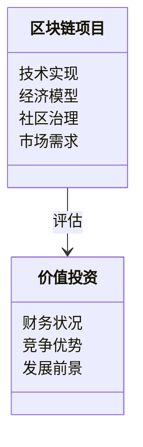

                 


# 彼得林奇的"价值投资"在区块链项目中的调整思路

## 关键词：价值投资，区块链项目，彼得林奇，投资策略，风险管理

## 摘要：本文探讨了如何将彼得林奇的价值投资理念应用于区块链项目中。通过对区块链项目的独特特性和评估指标的分析，提出了一套调整后的投资策略，并结合实际案例进行了详细分析，为投资者提供了实用的指导。

---

## 第一部分：引言

### 1.1 区块链与价值投资的结合

#### 1.1.1 区块链技术的基本概念

区块链是一种分布式账本技术，通过去中心化和加密算法确保数据的安全性和透明性。它通过智能合约实现了无需信任的自动化交易，广泛应用于加密货币、DeFi（去中心化金融）、NFT（非同质化代币）等领域。

#### 1.1.2 价值投资的核心理念

价值投资强调以低于内在价值的价格买入优质资产，关注企业的基本面、竞争优势和长期发展前景。彼得林奇作为价值投资的代表人物，提倡深入研究企业，寻找具有持续竞争优势的企业进行投资。

#### 1.1.3 区块链项目与传统投资的异同

区块链项目的独特性在于其技术驱动的特性，项目价值与技术创新、社区治理和网络效应密切相关。与传统投资相比，区块链项目的风险更高，但潜在回报也更大。

---

### 1.2 区块链项目的特点与挑战

#### 1.2.1 区块链项目的去中心化特性

去中心化是区块链的核心特征，这意味着没有单一的控制中心，依赖于社区的共识和治理。这使得项目的成功不仅依赖于技术，还依赖于社区的参与和信任。

#### 1.2.2 区块链项目的透明性与信任机制

区块链的透明性使得项目的交易记录可追溯，但这也带来了信息过载和隐私泄露的风险。信任机制的建立需要通过技术创新和社区治理来实现。

#### 1.2.3 区块链项目的高风险与高回报

区块链项目具有高风险，尤其是在市场波动剧烈的情况下。但成功的项目可能带来高回报，特别是在技术创新和市场扩展方面。

---

## 第二部分：价值投资的基本理论

### 2.1 彼得林奇的价值投资方法

#### 2.1.1 彼得林奇的投资理念

彼得林奇强调长期投资，寻找那些具有持续竞争优势的企业。他认为，市场短期是投票器，长期是称重机，价值终将回归。

#### 2.1.2 彼得林奇的选股标准

- **财务健康**：关注企业的盈利能力、资产负债表和现金流。
- **竞争优势**：寻找具有独特竞争优势的企业。
- **管理层**：管理层的诚信和能力是企业成功的关键。

#### 2.1.3 彼得林奇的长期投资策略

长期投资需要耐心和信心，避免短期市场的波动干扰。通过持续的研究和跟踪，寻找那些被市场低估的优质资产。

---

### 2.2 企业基本面分析

#### 2.2.1 企业的财务状况分析

分析企业的收入、利润、资产负债表和现金流，评估企业的财务健康状况。

#### 2.2.2 企业的竞争优势分析

研究企业的市场地位、品牌影响力、技术壁垒和成本优势。

#### 2.2.3 企业的未来发展前景

评估企业的战略规划、市场扩张能力和创新能力。

---

## 第三部分：区块链项目的价值评估指标

### 3.1 区块链项目的独特评估维度

#### 3.1.1 技术成熟度评估

评估区块链项目的技术实现难度、代码质量、团队技术背景和技术创新性。

#### 3.1.2 社区治理能力评估

评估社区的活跃度、治理机制和社区成员的参与度。

#### 3.1.3 团队背景与执行力评估

团队的背景、经验和执行力是项目成功的关键因素。

#### 3.1.4 代币经济模型分析

分析代币的发行机制、分配方式和激励机制，评估其经济可持续性。

#### 3.1.5 市场需求与供给分析

研究市场对区块链项目的实际需求和供给情况，评估项目的市场潜力。

#### 3.1.6 网络效应与生态系统评估

评估项目的网络效应和生态系统建设，判断其是否具备可持续发展的能力。

---

### 3.2 区块链项目的市场与经济模型

#### 3.2.1 代币经济模型分析

代币经济模型是区块链项目的核心，涉及代币的发行、流通和激励机制。需要分析代币的供给、需求和价值驱动因素。

#### 3.2.2 市场需求与供给分析

研究市场对区块链项目的实际需求和供给情况，评估项目的市场潜力。

#### 3.2.3 网络效应与生态系统的评估

评估项目的网络效应和生态系统建设，判断其是否具备可持续发展的能力。

---

## 第四部分：价值投资在区块链项目中的调整思路

### 4.1 传统价值投资指标的调整

#### 4.1.1 PE、PB、PS等估值指标的适用性

传统的PE（市盈率）、PB（市净率）、PS（市销率）等估值指标在区块链项目中可能不完全适用，需要结合项目的独特特性进行调整。

#### 4.1.2 现金流分析的特殊性

区块链项目的现金流分析需要考虑代币的流动性和市场接受度，同时关注项目的盈利模式和收入来源。

#### 4.1.3 股东权益分析的创新性

区块链项目的权益分析需要考虑代币的持有者结构和治理机制，评估代币的权益分配和治理效率。

---

### 4.2 区块链项目的风险管理策略

#### 4.2.1 投资组合的分散化策略

通过分散投资降低风险，避免将所有资金投入到单一项目中。

#### 4.2.2 项目生命周期的风险控制

在项目生命周期的不同阶段，采取不同的风险管理措施，如早期项目需要关注技术实现和社区治理，后期项目需要关注市场扩展和生态建设。

#### 4.2.3 市场波动性的应对策略

通过长期持有和定投策略应对市场的短期波动，避免频繁交易带来的成本和风险。

---

## 第五部分：系统分析与架构设计方案

### 5.1 问题场景介绍

区块链项目的评估需要综合考虑技术、市场、社区和经济等多个维度，构建一个系统的评估框架。

### 5.2 系统功能设计

#### 5.2.1 领域模型



---

### 5.3 系统架构设计


---

### 5.4 系统接口设计

- 投资者接口：提供项目评估工具和数据接口。
- 社区接口：提供治理机制和社区参与工具。
- 市场接口：提供市场数据和交易接口。

---

## 第六部分：项目实战

### 6.1 环境安装

安装必要的工具和环境，如Solidity编译器、以太坊节点、区块链浏览器等。

### 6.2 系统核心实现源代码

```solidity
// 投资评估合同
contract InvestmentAssessment {
    struct Project {
        string name;
        uint256 marketCap;
        uint256 revenue;
        uint256 profit;
        uint256 teamStrength;
        uint256 communityEngagement;
    }

    function assessProject(Project memory project) public returns (uint256) {
        // 计算综合评分
        return (project.marketCap * 3 + project.revenue * 2 + project.profit * 2 + project.teamStrength * 1 + project.communityEngagement * 1) / 10;
    }
}
```

### 6.3 代码应用解读与分析

上述代码定义了一个评估项目的智能合约，根据市场资本、收入、利润、团队实力和社区参与度计算综合评分。投资者可以根据评分结果做出投资决策。

### 6.4 实际案例分析

以以太坊为例，分析其技术实现、经济模型、社区治理和市场表现，评估其投资价值。

### 6.5 项目小结

通过实际案例分析，验证调整后的价值投资策略在区块链项目中的有效性。

---

## 第七部分：结论

### 7.1 最佳实践 tips

- **长期投资**：避免短期市场的波动干扰，关注项目的长期发展。
- **分散投资**：通过分散投资降低风险。
- **持续学习**：保持对区块链技术和市场的学习和研究。

### 7.2 小结

本文探讨了如何将彼得林奇的价值投资理念应用于区块链项目中，提出了调整后的投资策略，并通过实际案例进行了验证。

### 7.3 注意事项

- 区块链项目具有高风险，投资者需谨慎决策。
- 评估项目时需综合考虑技术、市场、社区和经济等多个维度。

### 7.4 拓展阅读

建议阅读彼得林奇的《投资最重要的事情》和相关区块链技术书籍，深入理解价值投资和区块链项目的结合。

---

## 结语

通过本文的分析和探讨，读者可以更好地理解如何将传统的价值投资理念应用于区块链项目中，从而做出更明智的投资决策。

