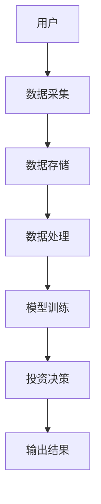
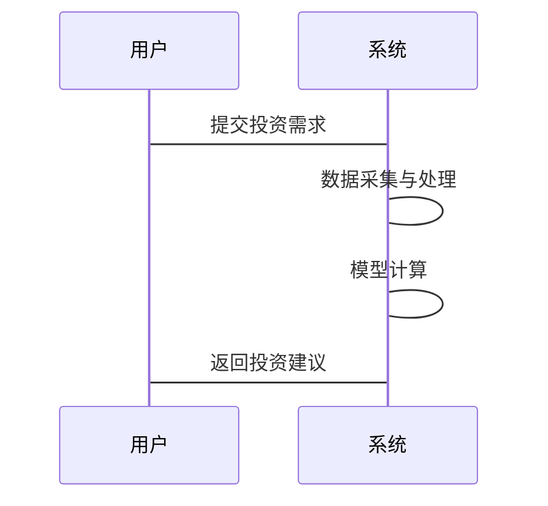

                 


# 彼得林奇的"价值投资"在数字经济时代的重新定义

> 关键词：价值投资，数字经济，彼得·林奇，数字资产，投资策略

> 摘要：本文探讨了彼得·林奇的传统价值投资理念在数字经济时代的演变与应用。通过分析数字经济的特点，重新定义价值投资的核心要素，并结合实际案例，提出适应数字时代的投资策略。

---

## 第一部分：价值投资的背景与核心理念

### 第1章：价值投资的起源与发展

#### 1.1 价值投资的定义与核心理念
- 价值投资的起源与核心思想
- 彼得·林奇的价值投资体系
- 数字经济时代的价值投资新挑战

#### 1.2 彼得·林奇的投资理念
- 长期投资与价值发现
- 避免短期波动的策略
- 选股标准与投资组合管理

#### 1.3 数字经济时代的价值投资背景
- 数字经济的特点与发展趋势
- 数字经济对传统价值投资的影响
- 数字经济中的投资机会与风险

---

## 第二部分：价值投资在数字经济中的核心概念与联系

### 第2章：数字经济中的价值评估模型

#### 2.1 传统价值投资模型的分析
- 市盈率与市净率的定义与计算
- 股息率与股息支付率的分析
- 企业盈利能力与成长性评估

#### 2.2 数字经济中的价值评估新维度
- 数字资产的价值评估
- 科技公司的无形资产与研发投入
- 用户粘性与网络效应的量化

#### 2.3 价值评估模型的对比与优化
- 传统模型与数字经济模型的对比
- 数字经济模型的优化与创新
- 新模型的数学公式与应用场景

---

### 第3章：数字资产的价值评估框架

#### 3.1 数字资产的分类与特征
- 比特币、以太坊等数字资产的特性
- 代币经济与去中心化金融（DeFi）的分析

#### 3.2 数字资产的价值评估指标
- 技术实现的复杂性与安全性
- 用户基数与活跃度
- 项目团队的背景与执行力

#### 3.3 数字资产的风险评估与投资策略
- 市场波动性分析
- 法律与监管风险
- 技术风险与升级能力

---

## 第三部分：价值投资的算法与系统设计

### 第4章：数字经济中的价值评估算法

#### 4.1 传统价值评估算法的回顾
- 市盈率、市净率等指标的计算公式
- 投资组合优化的数学模型

#### 4.2 数字经济中的改进算法
- 基于机器学习的价值评估模型
- 时间序列分析与预测算法

#### 4.3 算法实现与案例分析
- 使用Python实现价值评估算法
- 数字资产价格预测的实例分析

---

### 第5章：价值投资的系统架构设计

#### 5.1 系统功能设计
- 数据采集模块：获取数字资产的市场数据
- 数据处理模块：清洗与特征提取
- 模型构建模块：训练价值评估模型
- 投资决策模块：生成投资建议

#### 5.2 系统架构图


#### 5.3 系统接口设计
- API接口定义
- 数据格式与传输协议

#### 5.4 系统交互流程


---

## 第四部分：项目实战与案例分析

### 第6章：数字资产投资实战

#### 6.1 环境安装与数据准备
- Python环境搭建
- 数据集获取与预处理

#### 6.2 系统核心实现
```python
def calculate_value(asset_data):
    # 示例代码：计算数字资产的价值评分
    return asset_data * 0.7 + asset_data.technical_indicators * 0.3
```

#### 6.3 实际案例分析
- 分析比特币与以太坊的投资价值
- 对比传统企业与数字资产的投资策略

#### 6.4 投资策略优化
- 动态调整投资组合
- 风险控制与止损机制

---

## 第五部分：总结与展望

### 第7章：总结与未来趋势

#### 7.1 全文总结
- 价值投资在数字经济中的核心变化
- 数字经济时代投资策略的优化方向

#### 7.2 未来展望
- 新技术对投资策略的影响
- 数字经济中的投资机会与挑战

---

### Tips:
- 在数字经济时代，价值投资需要结合新兴技术与市场特点，灵活调整策略。
- 投资者应注重长期价值，同时关注技术风险与监管变化。

---

通过以上目录结构，我们可以系统地分析彼得·林奇的价值投资理念在数字经济中的应用，结合实际案例和算法模型，为投资者提供深度的理论与实践指导。

