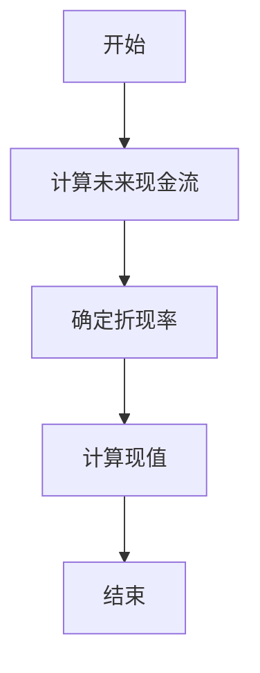

                 


# 彼得林奇的"价值投资"在数字资产时代的框架重构

## 关键词：价值投资，数字资产，彼得林奇，框架重构，投资策略，数字资产评估，系统架构

## 摘要：  
在数字资产快速发展的今天，传统价值投资理论面临新的挑战与机遇。本文基于彼得林奇的价值投资理念，探讨如何在数字资产时代重构价值投资框架。通过分析数字资产的特点，重构价值投资的核心概念、算法原理和系统架构，提出适用于数字资产的价值评估方法和投资策略，为投资者提供新的视角和工具。

---

# 第一部分：数字资产时代的价值投资概述

## 第1章：数字资产与价值投资的结合

### 1.1 数字资产的兴起与现状

#### 1.1.1 数字资产的定义与分类

数字资产是指基于区块链技术的虚拟资产，包括比特币、以太坊等加密货币，以及NFT（非同质化代币）、稳定币等多种形式。与传统资产相比，数字资产具有去中心化、透明性、可分割性和全球流通的特点。

数字资产可以分为以下几类：
1. **加密货币**：如比特币（BTC）、以太坊（ETH），主要用于价值存储和转账。
2. **实用型代币**：如EOS、XRP，用于特定应用场景。
3. **NFT**：如数字艺术品、收藏品，具有唯一性和不可分割性。
4. **稳定币**：如USDT、USDC，用于降低加密货币的波动性。

#### 1.1.2 数字资产的市场发展与趋势

数字资产市场自2009年比特币诞生以来，经历了多次波动，但整体呈增长趋势。2020年，新冠疫情推动了数字资产的快速普及；2021年，市场迎来牛市，比特币和以太坊价格屡创新高。尽管2022年市场出现调整，但数字资产的创新和应用仍在持续。

#### 1.1.3 数字资产与传统金融的区别

数字资产与传统金融资产有显著区别：
- **去中心化**：数字资产基于区块链技术，无须依赖传统金融机构。
- **透明性**：区块链记录所有交易，公开透明。
- **高波动性**：数字资产价格波动远高于传统资产。
- **技术驱动**：数字资产的价值与技术创新密切相关。

---

### 1.2 价值投资的起源与发展

#### 1.2.1 彼得林奇与价值投资的概述

彼得林奇是美国著名投资家，以其独特的价值投资策略闻名。他认为，投资者应选择具有持续竞争优势、良好管理团队和合理估值的公司进行投资。彼得林奇强调长期投资，避免短期波动的干扰。

#### 1.2.2 价值投资的核心理念与方法

价值投资的核心理念是寻找市场低估的资产，通过深入研究公司的基本面，寻找具有长期增长潜力的投资标的。彼得林奇的价值投资方法包括：
1. **基本面分析**：研究公司的财务状况、行业地位和管理团队。
2. **长期视角**：关注公司长期增长潜力，而非短期价格波动。
3. **分散投资**：通过分散投资降低风险。

#### 1.2.3 价值投资在传统金融中的应用

在传统金融中，价值投资通过分析公司的市盈率（P/E）、市净率（P/B）等指标，寻找具有合理估值的股票。彼得林奇曾管理的富达麦哲伦基金通过长期价值投资策略，取得了显著的超额收益。

---

### 1.3 数字资产时代的价值投资框架重构

#### 1.3.1 数字资产时代价值投资的必要性

随着数字资产市场的快速发展，传统的价值投资框架需要进行调整。数字资产市场的特点包括高波动性、技术创新快、监管不确定性等，这些都对传统的价值投资方法提出了挑战。

#### 1.3.2 传统价值投资框架的局限性

传统价值投资框架主要适用于股票等传统资产，存在以下局限性：
1. **高波动性**：数字资产价格波动剧烈，传统估值指标（如市盈率）难以适用。
2. **技术创新**：数字资产的技术创新速度快，传统的财务分析难以捕捉技术变化带来的价值。
3. **监管不确定性**：数字资产的监管政策变化快，影响其估值。

#### 1.3.3 数字资产时代价值投资框架的重构方向

为适应数字资产时代的需求，价值投资框架需要在以下几个方面进行重构：
1. **估值指标调整**：引入新的估值指标，如区块链网络的价值（Network Value，NV）和用户增长指标。
2. **技术分析结合**：将技术分析与基本面分析相结合，关注区块链网络的性能和应用前景。
3. **动态评估**：建立动态评估体系，及时捕捉技术进步和市场变化带来的价值变化。

---

## 第2章：数字资产价值评估的核心概念

### 2.1 价值投资的核心概念与属性

#### 2.1.1 价值投资的核心概念

价值投资的核心是寻找市场低估的资产，通过深入分析资产的内在价值，进行长期投资。在数字资产时代，价值投资需要关注以下核心概念：
- **内在价值**：数字资产的实际价值，基于其技术性能和应用场景。
- **网络效应**：数字资产的价值与其用户数量和网络活性密切相关。
- **技术迭代**：区块链技术的升级和改进对数字资产价值的影响。

#### 2.1.2 数字资产价值评估的属性对比

以下是数字资产与传统资产在价值评估方面的对比：

| 属性             | 传统资产                | 数字资产                |
|------------------|------------------------|------------------------|
| 价值驱动因素     | 公司基本面、行业地位    | 技术性能、用户增长、网络效应 |
| 资产流动性       | 较高（股票、债券）      | 极高（24/7交易）        |
| 价格波动性       | 中等                   | 高                     |
| 估值指标         | 市盈率、市净率          | 网络价值、用户增长      |

#### 2.1.3 核心概念的ER实体关系图

以下是数字资产价值评估的核心概念的ER图：

```mermaid
er
  投资者
  ---------
  id: int
  名称: string
  投资策略
  ---------
  id: int
  策略名称: string
  数字资产
  ---------
  id: int
  名称: string
  价值评估
  ---------
  id: int
  评估指标: string
```

---

### 2.2 数字资产价值评估的数学模型

#### 2.2.1 价值投资的数学模型

彼得林奇的价值投资方法中，现金流折现法是核心工具之一。现金流折现法（DCF）的公式为：

$$ V = \frac{CF}{r - g} $$

其中：
- \( V \) 为资产的内在价值。
- \( CF \) 为未来现金流。
- \( r \) 为折现率。
- \( g \) 为现金流增长率。

#### 2.2.2 数字资产价值评估的公式

在数字资产时代，现金流折现法需要进行调整。以下是针对数字资产的价值评估公式：

$$ VA = \frac{CF}{r - g} \times \text{网络价值调整因子} $$

其中，网络价值调整因子考虑了区块链网络的用户数量、交易量和网络性能。

#### 2.2.3 数学模型的实例分析

以比特币为例，假设其未来现金流为1000万美元，折现率为5%，增长率g=2%，则其内在价值为：

$$ V = \frac{1000}{0.05 - 0.02} = 1000 / 0.03 \approx 33333.33 \text{万美元} $$

---

## 第3章：数字资产价值评估的算法原理

### 3.1 价值投资算法的核心原理

#### 3.1.1 现金流折现法的算法流程

现金流折现法的算法流程如下：



---

通过以上分析，我们逐步重构了彼得林奇的价值投资框架，以适应数字资产时代的需求。接下来，我们将深入探讨数字资产价值评估的系统架构和具体实现方法。

---

（由于篇幅限制，后续章节内容将根据需要逐步展开。）

