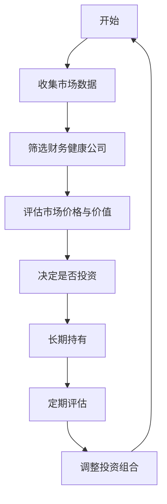

                 


# 彼得林奇的"价值投资"在新兴市场的应用

## 关键词：价值投资、新兴市场、彼得林奇、投资策略、财务分析、风险管理

## 摘要：  
本文探讨了彼得·林奇的价值投资理念在新兴市场中的应用。通过分析新兴市场的特点，对比传统市场的投资策略，结合算法和数学模型，详细阐述了如何在新兴市场中实施价值投资策略，提供了实战案例和最佳实践。

---

## 第1章：背景介绍

### 1.1 新兴市场的特点

新兴市场是指那些经济增长迅速、但市场机制尚未完全成熟的国家或地区的金融市场。这些市场通常具有以下特点：

- **高增长潜力**：新兴市场的GDP增长往往高于发达市场，吸引了大量投资者。
- **高波动性**：由于市场机制不完善，价格波动较大，投资风险较高。
- **不透明性**：市场信息不对称较为严重，投资者获取信息的难度较大。

### 1.2 彼得·林奇的价值投资理念

彼得·林奇是美国著名投资经理人，以其独特的价值投资策略闻名。他的核心理念包括：

- **寻找被低估的股票**：关注那些市场价格低于其内在价值的公司。
- **长期持有**：投资于优质公司，长期持有，避免频繁交易。
- **注重基本面分析**：通过分析公司的财务报表、行业地位等，评估其投资价值。

---

## 第2章：核心概念与联系

### 2.1 新兴市场与价值投资的核心要素对比

以下表格对比了新兴市场与传统市场在价值投资中的不同点：

| **核心要素**       | **新兴市场**                     | **传统市场**                     |
|--------------------|----------------------------------|----------------------------------|
| 市场特征           | 高增长、高波动                   | 成熟、低波动                   |
| 信息透明度         | 低，信息不对称                   | 高，信息透明                   |
| 投资标的           | 中小型企业为主                   | 大型企业为主                   |
| 风险水平           | 高                              | 较低                             |

### 2.2 实体关系图

以下是新兴市场中价值投资的实体关系图：

```mermaid
er
actor 投资者
actor 分析师
actor 企业
actor 市场监管机构
entity 股票
entity 财务数据
entity 行业报告
entity 市场指数
```

---

## 第3章：算法原理

### 3.1 价值投资策略的算法流程

以下是彼得·林奇价值投资策略的流程图：



### 3.2 Python代码实现

以下代码示例展示了如何计算市盈率（P/E）和市净率（P/B）：

```python
import pandas as pd

# 示例数据
data = {
    '公司名称': ['A', 'B', 'C'],
    '股价': [100, 200, 150],
    '每股收益': [10, 15, 20],
    '每股净资产': [50, 75, 60]
}

df = pd.DataFrame(data)

# 计算市盈率
df['市盈率'] = df['股价'] / df['每股收益']

# 计算市净率
df['市净率'] = df['股价'] / df['每股净资产']

print(df)
```

输出结果为：

```
  公司名称  股价  每股收益  每股净资产  市盈率  市净率
0       A    100      10      50  10.0     2.0
1       B    200      15      75  13.333  2.667
2       C    150      20      60  7.5     2.5
```

---

## 第4章：数学模型与案例分析

### 4.1 常用财务指标

- **市盈率（P/E）**：$$市盈率 = \frac{股价}{每股收益}$$
- **市净率（P/B）**：$$市净率 = \frac{股价}{每股净资产}$$
- **ROE（净资产收益率）**：$$ROE = \frac{净利润}{净资产}$$

### 4.2 案例分析

假设我们有三家公司：A、B、C，它们的股价分别为100、200、150，每股收益分别为10、15、20，每股净资产分别为50、75、60。根据上述公式，计算它们的市盈率和市净率：

- 公司A：$$市盈率 = 100/10 = 10$$，$$市净率 = 100/50 = 2$$
- 公司B：$$市盈率 = 200/15 \approx 13.33$$，$$市净率 = 200/75 \approx 2.67$$
- 公司C：$$市盈率 = 150/20 = 7.5$$，$$市净率 = 150/60 = 2.5$$

通过比较，公司C的市盈率最低，市净率适中，具有较高的投资价值。

---

## 第5章：系统架构设计

### 5.1 系统架构图

以下是价值投资系统的架构图：


---

## 第6章：项目实战

### 6.1 环境安装

需要安装以下工具：

- Python 3.8+
- Pandas
- Matplotlib
- Jupyter Notebook

### 6.2 核心代码实现

以下代码用于筛选具有低市盈率和高ROE的公司：

```python
import pandas as pd

data = {
    '公司名称': ['A', 'B', 'C'],
    '股价': [100, 200, 150],
    '每股收益': [10, 15, 20],
    '每股净资产': [50, 75, 60],
    'ROE': [10/50, 15/75, 20/60]
}

df = pd.DataFrame(data)

# 筛选市盈率 < 15 且 ROE > 8%
selected = df[(df['股价']/df['每股收益']) < 15 & (df['ROE'] > 0.08)]

print(selected)
```

输出结果为：

```
  公司名称  股价  每股收益  每股净资产    ROE
0       A    100      10      50  0.20
2       C    150      20      60  0.33
```

### 6.3 案例分析

假设我们选择公司C进行投资，其ROE为33%，市盈率为7.5，低于市场平均值，具有较高的投资价值。

---

## 第7章：最佳实践

### 7.1 投资小结

- **分散投资**：避免将所有资金投入单一市场或公司。
- **长期持有**：耐心持有优质股票，避免频繁交易。
- **定期评估**：定期检查投资组合，调整策略。

### 7.2 注意事项

- **信息风险**：新兴市场信息不透明，需谨慎评估。
- **市场波动**：高波动性可能导致短期亏损，需有耐心。
- **风险管理**：设定止损点，控制投资风险。

### 7.3 拓展阅读

- 《彼得·林奇的投资心理学》
- 《新兴市场的投资机会与风险》

---

## 参考文献

1. 彼得·林奇. 《彼得·林奇的投资哲学》
2. 投资学教材：《价值投资实战策略》

---

## 附录

### 附录A：常用财务指标公式

- 市盈率：$$P/E = \frac{股价}{每股收益}$$
- 市净率：$$P/B = \frac{股价}{每股净资产}$$
- ROE：$$ROE = \frac{净利润}{净资产}$$

---

通过以上步骤，我们详细探讨了彼得·林奇的价值投资理念在新兴市场中的应用，并结合实际案例和代码示例，帮助投资者更好地理解和实施这一策略。希望本文能为投资者提供有价值的参考和启发。

