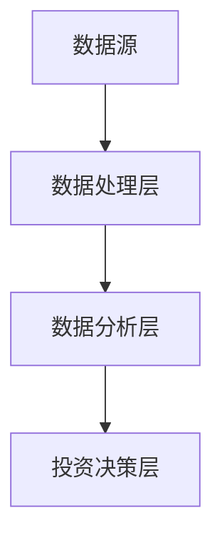
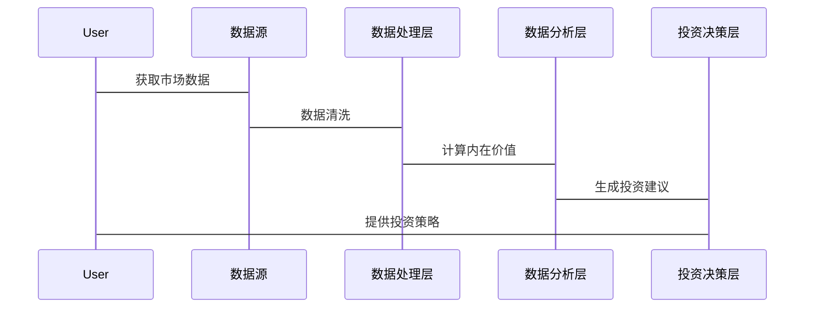

                 


# 彼得林奇的"价值投资"在新兴行业的调整

> 关键词：价值投资，彼得林奇，新兴行业，投资策略，风险控制

> 摘要：本文通过分析彼得林奇的价值投资理念，探讨其在新兴行业的调整与应用。文章从价值投资的核心概念出发，结合新兴行业的特点，详细阐述了价值投资在新兴行业的核心逻辑、策略和实际操作方法。同时，文章还分析了新兴行业投资中的风险控制和长期策略。

---

## 第一部分：价值投资与新兴行业的背景介绍

### 第1章：价值投资的基本概念

#### 1.1 价值投资的定义与核心理念
- 价值投资是一种基于对公司内在价值的评估，寻找市场价低于内在价值的投资策略。
- 彼得林奇的核心理念是：寻找那些被市场低估的优秀公司，长期持有，等待市场重新认识其价值。

#### 1.2 彼得林奇的价值投资策略
- **分散投资**：避免将所有资金投入单一行业或公司。
- **长期持有**：关注公司的长期价值，而非短期波动。
- **深入研究**：对公司基本面进行细致分析，包括财务状况、行业地位等。

#### 1.3 价值投资的核心要素与边界
- 核心要素：公司财务健康、行业地位、管理层能力、市场前景。
- 边界：避免盲目跟风，关注基本面而非市场情绪。

---

### 第2章：新兴行业的特点与投资机会

#### 2.1 新兴行业的定义与分类
- 新兴行业是指在技术进步、市场需求变化或政策支持下快速发展的行业。
- 分类：科技、生物技术、新能源、人工智能等领域。

#### 2.2 新兴行业的特点
- 高成长性：新兴行业通常具有较高的增长率。
- 不确定性：市场波动大，行业变化快。
- 技术驱动：技术创新是新兴行业发展的核心动力。

#### 2.3 新兴行业与传统行业的对比
| 特性         | 新兴行业               | 传统行业               |
|--------------|------------------------|------------------------|
| 市场成熟度   | 低                     | 高                     |
| 技术依赖度   | 高                     | 低                     |
| 市场波动性   | 高                     | 低                     |
| 投资风险     | 高                     | 中                     |

---

## 第二部分：价值投资与新兴行业的核心概念与联系

### 第3章：价值投资与新兴行业的核心概念对比

#### 3.1 价值投资的核心概念
- **内在价值**：公司未来现金流的现值。
- **安全边际**：市场价格与内在价值之间的差距。
- **长期视角**：关注公司的长期发展潜力。

#### 3.2 新兴行业的核心概念
- **成长潜力**：新兴行业通常具有较高的增长潜力。
- **技术壁垒**：新兴行业依赖技术创新，技术壁垒高。
- **市场渗透**：新兴行业需要通过市场渗透逐步扩大市场份额。

#### 3.3 价值投资与新兴行业的联系
- 新兴行业的高成长性为价值投资者提供了潜在的高回报机会。
- 价值投资的核心理念可以帮助投资者在新兴行业中找到被低估的优质公司。

---

## 第三部分：价值投资与新兴行业的算法原理

### 第4章：价值投资的算法原理

#### 4.1 价值投资的核心算法
- **内在价值计算**：使用DCF模型（ discounted cash flow model）计算公司的内在价值。
- **安全边际计算**：市场价格与内在价值的差额作为安全边际。

#### 4.2 新兴行业的算法分析
- **行业增长预测**：基于历史数据和市场趋势，预测新兴行业的未来增长率。
- **财务指标分析**：通过ROE（净资产收益率）、ROA（资产收益率）等指标评估公司的财务健康状况。

#### 4.3 数学模型与公式
- DCF模型公式：
  $$ \text{内在价值} = \sum_{t=1}^{n} \frac{\text{现金流}}{(1 + r)^t} + \frac{\text{终值}}{(1 + r)^n} $$
- 安全边际公式：
  $$ \text{安全边际} = \text{内在价值} - \text{市场价格} $$

---

### 第5章：新兴行业的系统分析与架构设计

#### 5.1 系统功能设计
- 数据收集模块：收集新兴行业的市场数据、公司财务数据。
- 数据分析模块：使用算法对数据进行分析，评估公司的内在价值。
- 投资决策模块：基于分析结果，制定投资策略。

#### 5.2 系统架构设计


#### 5.3 系统交互设计


---

## 第四部分：价值投资与新兴行业的项目实战

### 第6章：项目实战分析

#### 6.1 环境安装
- 需要安装Python、Pandas、Matplotlib等工具。

#### 6.2 核心实现代码
```python
import pandas as pd
import numpy as np

# 示例数据：新兴行业公司的财务数据
data = {
    '公司': ['A', 'B', 'C'],
    '收入': [100, 200, 150],
    '净利润': [20, 30, 25],
    'ROE': [15, 20, 18]
}

df = pd.DataFrame(data)

# 计算内在价值（简化模型）
def calculate_intrinsic_value(df):
    df['内在价值'] = df['收入'] * 0.1 + df['净利润'] * 0.2
    return df

df = calculate_intrinsic_value(df)
print(df)
```

#### 6.3 案例分析
- 以科技行业为例，分析某新兴科技公司的投资价值。
- 使用DCF模型计算公司内在价值，制定投资策略。

---

## 第五部分：总结与展望

### 第7章：总结与展望

#### 7.1 总结
- 彼得林奇的价值投资理念在新兴行业中的应用需要结合行业特点进行调整。
- 新兴行业的高成长性和不确定性要求投资者更加注重风险控制和长期视角。

#### 7.2 注意事项
- 避免盲目跟风，注重基本面分析。
- 定期调整投资组合，应对市场变化。

#### 7.3 拓展阅读
- 《彼得林奇的投资哲学》
- 《新兴行业的市场分析与投资策略》

---

通过本文的分析，读者可以更好地理解彼得林奇的价值投资理念，并将其应用于新兴行业的投资实践中。希望本文能为投资者提供有价值的参考和启发。

