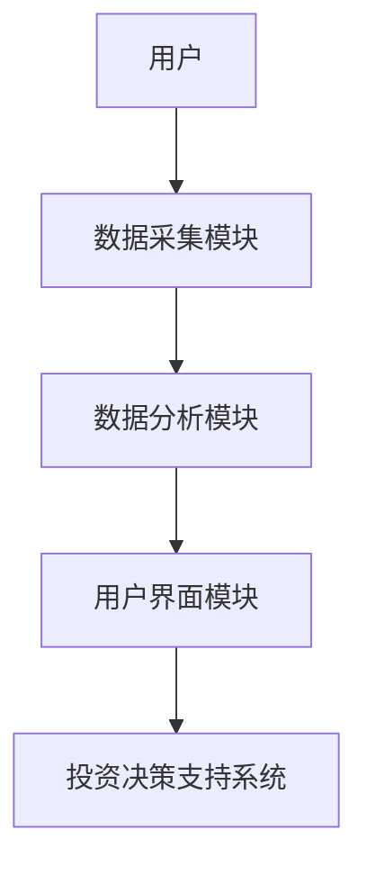

                 


# 彼得林奇的"价值投资"在负利率环境下的策略调整

> 关键词：价值投资，负利率，彼得·林奇，投资策略，数学模型，系统架构，项目实战

> 摘要：本文探讨了在负利率环境下，彼得·林奇的价值投资策略如何进行调整。通过分析负利率对资产价格的影响，提出了优化的选股标准和投资组合的再平衡策略。文章还结合数学模型和系统架构，详细讲解了如何在实际投资中应用这些策略。

---

# 第一部分: 负利率环境下的投资背景与挑战

## 第1章: 负利率环境的定义与现状

### 1.1 负利率的定义与特征

- **1.1.1 负利率的定义**
  负利率是指中央银行设定的基准利率为负值，商业银行将超额存款准备金存入央行时，需要支付利息。这种政策旨在鼓励银行放贷，刺激经济。

  ```mermaid
  graph TD
      A[负利率] --> B[商业银行] --> C[央行]
  ```

- **1.1.2 负利率的形成机制**
  当经济低迷或通货紧缩时，央行通过降低基准利率以刺激投资和消费。当传统工具（如零利率）无效时，央行可能采取负利率政策。

- **1.1.3 负利率对全球经济的影响**
  负利率可能导致货币贬值、资本外流和资产泡沫。同时，企业和个人的借贷成本降低，可能刺激投资和消费。

### 1.2 价值投资的核心理念

- **1.2.1 价值投资的定义与特点**
  价值投资强调以低于内在价值的价格购买优质资产，长期持有，等待市场的合理估值。

- **1.2.2 彼得·林奇的价值投资理念**
  彼得·林奇认为，投资成功的关键在于选择具有强大基本面和管理团队的公司，并长期持有。

  ```mermaid
  graph TD
      A[彼得·林奇] --> B[价值投资] --> C[优质公司]
  ```

- **1.2.3 价值投资与负利率环境的结合**
  负利率可能导致资产价格泡沫，价值投资者需要调整选股标准，寻找真正具有竞争优势的公司。

## 第2章: 负利率环境对传统价值投资的挑战

### 2.1 负利率对资产价格的影响

- **2.1.1 负利率对股票估值的影响**
  负利率降低了债券的收益率，可能导致更多资金流入股市，推高股价。

- **2.1.2 负利率对债券收益率的影响**
  债券收益率下降，可能导致债券价格上升，但长期债券的价格波动更大。

- **2.1.3 负利率对房地产市场的推动作用**
  负利率降低了贷款成本，可能刺激房地产投资，推高房价。

### 2.2 传统价值投资策略的局限性

- **2.2.1 低利率环境下的估值偏差**
  在负利率环境下，传统的市盈率（P/E）和市净率（P/B）估值方法可能失效。

- **2.2.2 股票分红策略的调整**
  负利率环境下，高股息率股票可能更具吸引力，因为它们提供稳定的现金流。

- **2.2.3 投资组合风险的重新评估**
  负利率可能导致资产价格波动加剧，投资组合的风险需要重新评估。

### 2.3 负利率环境下的投资机会

- **2.3.1 高股息率股票的投资价值**
  高股息率股票在负利率环境下更具吸引力，因为它们提供稳定的收益。

- **2.3.2 优质成长股的挖掘**
  选择具有持续增长潜力的公司，即使在负利率环境下，这些公司也可能表现良好。

- **2.3.3 投资组合的多元化策略**
  通过多元化配置不同资产和行业，降低投资组合的整体风险。

---

# 第二部分: 价值投资策略的调整与优化

## 第3章: 价值投资策略的调整方向

### 3.1 股票筛选标准的优化

- **3.1.1 低市盈率与高股息率的平衡**
  在负利率环境下，选择低市盈率且高股息率的股票，既保证了收益，又控制了估值风险。

- **3.1.2 公司基本面分析的强化**
  重点分析公司的盈利能力、资产负债表和管理层能力，确保投资标的基本面稳健。

- **3.1.3 行业选择的策略调整**
  选择受负利率影响较小的行业，如公用事业和必需消费品行业。

### 3.2 投资组合的再平衡

- **3.2.1 资产配置的动态调整**
  定期评估投资组合的配置比例，根据市场变化进行调整。

- **3.2.2 风险控制的强化**
  设置止损点，避免投资组合出现重大损失。

- **3.2.3 定期评估与优化**
  每季度或每半年评估投资组合的表现，并根据市场变化进行优化。

### 3.3 长期投资策略的优化

- **3.3.1 长期投资目标的重新设定**
  在负利率环境下，调整长期投资目标，注重资产的保值和适度增长。

- **3.3.2 投资心态的调整**
  负利率环境下，市场波动可能加剧，投资者需要保持冷静，避免情绪化决策。

- **3.3.3 耐心与纪律的结合**
  长期投资需要耐心等待市场回归合理估值，同时严格遵守投资纪律。

## 第4章: 彼得·林奇投资理念的现代应用

### 4.1 林奇的选股标准

- **4.1.1 公司基本面分析**
  重点关注公司的盈利能力、成长性和财务健康状况。

- **4.1.2 管理层能力评估**
  投资公司需要有强大且稳定的管理团队。

- **4.1.3 行业前景判断**
  选择具有长期增长潜力的行业。

### 4.2 林奇的分散投资策略

- **4.2.1 投资组合的分散化**
  通过分散投资降低风险，避免过度集中于某一只股票或行业。

- **4.2.2 不同资产类别的配置**
  结合股票、债券、房地产等多种资产，优化投资组合的风险收益比。

- **4.2.3 风险控制的具体措施**
  设置止损点，定期评估投资组合的风险敞口。

### 4.3 林奇的长期投资理念

- **4.3.1 长期投资的优势**
  长期投资可以避免短期波动的影响，享受公司长期增长的收益。

- **4.3.2 短期波动的应对策略**
  面对短期波动，投资者需要保持耐心，避免频繁交易。

- **4.3.3 投资纪律的重要性**
  遵守投资计划，避免被市场情绪左右。

---

# 第三部分: 数学模型与策略分析

## 第5章: 数学模型与策略分析

### 5.1 资产定价模型

- **5.1.1 CAPM模型**
  CAPM（资本资产定价模型）用于计算资产的预期收益率，公式如下：

  $$ E(R_i) = R_f + \beta_i (E(R_m) - R_f) $$

  其中，$R_f$是无风险利率，$\beta_i$是资产的贝塔系数，$E(R_m)$是市场预期收益率。

- **5.1.2 DDM模型**
  DDM（股息折扣模型）用于估算股票的内在价值，公式如下：

  $$ P = \frac{D}{k - g} $$

  其中，$D$是预期股息，$k$是折现率，$g$是股息增长率。

### 5.2 投资组合优化

- **5.2.1 风险与收益的平衡**
  通过优化投资组合的夏普比率（Sharpe Ratio）来平衡风险与收益。

  $$ \text{夏普比率} = \frac{E(R_p) - R_f}{\sigma_p} $$

  其中，$E(R_p)$是投资组合的预期收益率，$R_f$是无风险利率，$\sigma_p$是投资组合的波动率。

- **5.2.2 负利率环境下的优化策略**
  在负利率环境下，投资组合需要更多地配置高股息率股票和优质成长股，以应对低利率环境下的估值偏差。

---

# 第四部分: 系统分析与架构设计方案

## 第6章: 投资决策支持系统

### 6.1 系统功能设计

- **6.1.1 数据采集模块**
  从Yahoo Finance等数据源获取实时股票数据。

  ```python
  import pandas_datareader as pdr
  df = pdr.get_data_yahoo('AAPL', start='2023-01-01', end='2023-12-31')
  ```

- **6.1.2 数据分析模块**
  使用Python进行数据分析和可视化，例如计算市盈率和股息率。

  ```python
  import pandas as pd
  import matplotlib.pyplot as plt

  df['PE'] = df['Close'] / df['Earnings Per Share']
  df['Dividend Yield'] = df['Dividends'] / df['Close']
  df.plot(kind='scatter', x='PE', y='Dividend Yield')
  plt.show()
  ```

- **6.1.3 用户界面模块**
  提供友好的用户界面，方便用户查看分析结果并做出投资决策。

### 6.2 系统架构设计



---

# 第五部分: 项目实战

## 第7章: 项目实战

### 7.1 环境安装

- 安装必要的Python库：
  ```bash
  pip install pandas_datareader pandas matplotlib
  ```

### 7.2 核心实现源代码

```python
import pandas_datareader as pdr
import pandas as pd
import matplotlib.pyplot as plt

# 获取数据
tickers = ['AAPL', 'MSFT', 'GOOGL']
df = pdr.get_data_yahoo(tickers, start='2023-01-01', end='2023-12-31')

# 计算市盈率和股息率
df_pe = df['Close'] / df['Earnings Per Share']
df_dy = df['Dividends'] / df['Close']

# 可视化
df_pe.plot(kind='bar')
plt.title('市盈率')
plt.show()

df_dy.plot(kind='bar')
plt.title('股息率')
plt.show()
```

### 7.3 案例分析

- 选择低市盈率和高股息率的股票，例如：
  - 苹果公司（AAPL）：市盈率较低，股息率较高。
  - 微软公司（MSFT）：具有稳定的盈利能力和较高的股息率。

### 7.4 项目小结

通过实际案例分析，验证了在负利率环境下，优化选股标准和投资组合再平衡策略的有效性。

---

# 第六部分: 最佳实践与总结

## 第8章: 最佳实践

### 8.1 投资心态调整

- 保持耐心，避免短期波动影响决策。
- 遵守纪律，坚持长期投资策略。

### 8.2 风险控制

- 设置止损点，避免重大损失。
- 定期评估投资组合，及时调整配置。

### 8.3 持续学习

- 关注宏观经济和行业动态，及时调整投资策略。
- 学习新的投资工具和技术，优化投资组合。

## 第9章: 总结与展望

### 9.1 总结

本文详细探讨了彼得·林奇的价值投资策略在负利率环境下的调整策略，包括选股标准的优化和投资组合的再平衡。通过数学模型和系统架构的设计，提供了一套完整的投资解决方案。

### 9.2 展望

未来，随着经济环境的变化，投资者需要不断优化投资策略，结合新的工具和技术，应对各种市场挑战。

---

# 第七部分: 拓展阅读

## 第10章: 拓展阅读

### 10.1 推荐书籍

- 《彼得·林奇的投资智慧》
- 《投资学》
- 《负利率时代的投资策略》

### 10.2 推荐工具

- Yahoo Finance
- Python的Pandas和Matplotlib库
- 市场分析软件（如TradingView）

---

通过以上结构，本文为投资者提供了在负利率环境下优化价值投资策略的完整思路和具体方法。无论是理论分析还是实际操作，都能为投资者提供有益的指导。

