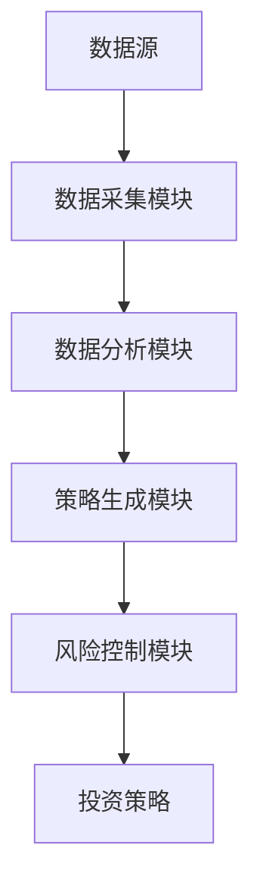

                 

# 彼得林奇的"价值投资"在零利率长期化背景下的策略调整

> 关键词：彼得林奇，价值投资，零利率长期化，投资策略，防御性投资

> 摘要：在零利率长期化的背景下，传统的价值投资策略需要进行相应的调整。本文将从彼得林奇的价值投资理念出发，分析零利率长期化对投资环境的影响，并提出相应的策略调整建议，包括防御性投资策略的强化、选股标准的优化以及长期投资策略的调整。同时，本文还将通过系统化的方法，结合数学模型和实际案例，详细阐述这些策略的具体实现和效果。

---

# 第一部分: 零利率长期化背景下的投资环境

## 第1章: 零利率长期化背景下的投资环境

### 1.1 零利率长期化的定义与特征

零利率长期化是指中央银行将基准利率长期维持在零或接近零的水平，以刺激经济增长和应对通缩压力。这一政策在近年来全球金融危机和经济低迷的背景下尤为明显。零利率长期化对经济和投资环境有着深远的影响。

#### 1.1.1 零利率长期化的定义

零利率长期化（Zero Interest Rate Policy, ZIRP）是一种货币政策工具，指中央银行将基准利率设定在零或接近零的水平，以降低借款成本，刺激经济增长。长期化意味着这种政策可能会持续数年甚至更长时间。

#### 1.1.2 零利率长期化对经济的影响

零利率长期化对经济的影响是多方面的，主要包括：
- **降低债务负担**：企业和个人的债务利息支出减少，缓解了债务压力。
- **刺激投资**：低利率降低了企业的融资成本，鼓励投资和扩张。
- **资产价格膨胀**：低利率导致资金流向股市和房地产市场，推高资产价格。

#### 1.1.3 零利率长期化对投资环境的改变

在零利率长期化的背景下，传统投资策略面临挑战：
- **低回报率**：债券等固定收益资产的回报率接近零，难以满足投资需求。
- **资产泡沫风险**：资金大量流向股市和房地产，增加了资产泡沫的风险。
- **通货膨胀压力**：低利率可能导致通货膨胀上升，影响资产的实际回报。

---

### 1.2 零利率长期化对价值投资的影响

价值投资是一种以基本面分析为基础的投资策略，强调以低于内在价值的价格购买优质资产。彼得林奇是价值投资的代表人物，其策略在零利率长期化背景下需要进行调整。

#### 1.2.1 价值投资的核心理念

价值投资的核心理念包括：
- **寻找被市场低估的资产**：通过基本面分析，找到市场价格低于内在价值的资产。
- **长期持有优质资产**：价值投资者倾向于长期持有优质资产，等待市场重新评估其价值。
- **注重安全边际**：在买入资产时，留出足够的安全边际，以应对市场波动和不确定性。

#### 1.2.2 零利率长期化对价值投资策略的挑战

零利率长期化对价值投资策略的挑战主要体现在：
- **资产回报率下降**：低利率环境下，债券等固定收益资产的回报率下降，影响投资组合的整体回报。
- **资产价格波动加剧**：低利率导致市场流动性过剩，资产价格波动加大，增加了投资风险。
- **估值模型的适用性**：传统的估值模型（如股息折扣模型）在低利率环境下可能需要调整，以反映新的市场环境。

#### 1.2.3 价值投资在低利率环境下的适应性

为了适应低利率环境，价值投资者需要调整策略：
- **增加防御性资产配置**：增加债券等防御性资产的比例，以应对市场波动。
- **优化选股标准**：在选股时更加注重企业的盈利能力和财务健康状况，寻找那些能够在低利率环境下稳定增长的企业。
- **加强风险控制**：通过分散投资和设置止损点，降低投资组合的整体风险。

---

### 1.3 彼得林奇投资理念的回顾与分析

彼得林奇是价值投资的代表人物，其投资理念在投资界具有重要影响。

#### 1.3.1 彼得林奇的价值投资原则

彼得林奇的价值投资原则包括：
- **注重基本面分析**：通过分析企业的财务报表和行业地位，寻找具有竞争优势的企业。
- **长期持有优质资产**：彼得林奇强调长期投资，避免频繁交易。
- **注重安全边际**：在买入资产时，留出足够的安全边际，以应对市场波动。

#### 1.3.2 彼得林奇投资策略的特点

彼得林奇的投资策略具有以下特点：
- **分散投资**：通过分散投资降低风险。
- **注重企业质量**：选择那些具有强大财务状况和竞争优势的企业。
- **长期持有**：彼得林奇倾向于长期持有优质资产，等待市场重新评估其价值。

#### 1.3.3 彼得林奇策略在低利率环境下的适用性

在低利率环境下，彼得林奇的策略需要进行调整：
- **增加防御性资产配置**：增加债券等防御性资产的比例，以应对市场波动。
- **优化选股标准**：在选股时更加注重企业的盈利能力和财务健康状况，寻找那些能够在低利率环境下稳定增长的企业。
- **加强风险控制**：通过分散投资和设置止损点，降低投资组合的整体风险。

---

## 第2章: 价值投资的核心概念与数学模型

### 2.1 价值投资的核心概念

价值投资的核心概念包括：
- **内在价值**：资产的真实价值，独立于市场价格。
- **安全边际**：市场价格与内在价值之间的差距，提供了投资的安全性。
- **成长性**：企业未来增长的潜力。

#### 2.1.1 价值投资的定义

价值投资是一种以基本面分析为基础的投资策略，强调以低于内在价值的价格购买优质资产。

#### 2.1.2 价值投资的核心要素

价值投资的核心要素包括：
- **内在价值**：通过基本面分析确定资产的真实价值。
- **安全边际**：市场价格与内在价值之间的差距。
- **竞争优势**：企业相对于竞争对手的优势。

#### 2.1.3 价值投资与成长投资的区别

价值投资与成长投资的主要区别在于：
- **投资目标**：价值投资者追求低于内在价值的价格，而成长投资者则追求高成长潜力的企业。
- **投资期限**：价值投资者倾向于长期投资，而成长投资者则更关注短期增长。
- **风险偏好**：价值投资者更注重安全边际，而成长投资者则更关注企业的成长潜力。

---

### 2.2 价值投资的数学模型

价值投资的数学模型主要包括：
- **股票内在价值的计算公式**
- **投资组合的期望收益计算**
- **风险调整后的收益模型**

#### 2.2.1 股票内在价值的计算公式

股票的内在价值可以通过股息折扣模型（Dividend Discount Model, DDM）计算：
$$ V = \frac{D}{r - g} $$
其中：
- \( D \) 为预期股息
- \( r \) 为折现率
- \( g \) 为股息增长率

#### 2.2.2 投资组合的期望收益计算

投资组合的期望收益可以通过以下公式计算：
$$ E(r) = \sum w_i r_i $$
其中：
- \( w_i \) 为资产 \( i \) 的权重
- \( r_i \) 为资产 \( i \) 的预期收益

#### 2.2.3 风险调整后的收益模型

夏普比率（Sharpe Ratio）用于衡量风险调整后的收益：
$$ Sharpe Ratio = \frac{E(r_p) - r_f}{\sigma_p} $$
其中：
- \( E(r_p) \) 为投资组合的预期收益
- \( r_f \) 为无风险利率
- \( \sigma_p \) 为投资组合的收益波动率

---

### 2.3 核心概念对比分析

#### 2.3.1 价值投资与成长投资的对比

价值投资与成长投资的主要区别如下：
| 对比维度 | 价值投资 | 成长投资 |
|----------|----------|----------|
| 投资目标 | 低于内在价值的价格 | 高成长潜力的企业 |
| 投资期限 | 长期投资 | 短期投资 |
| 风险偏好 | 低风险 | 高风险 |

#### 2.3.2 高利率与低利率环境下的策略对比

高利率与低利率环境下的策略对比：
| 对比维度 | 高利率环境 | 低利率环境 |
|----------|----------|----------|
| 资产配置 | 债券比例高 | 股票比例高 |
| 投资策略 | 保守型 | 进攻型 |
| 风险控制 | 严格 | 较松 |

#### 2.3.3 不同市场周期下的策略对比

不同市场周期下的策略对比：
| 对比维度 | 牛市 | 熊市 |
|----------|----------|----------|
| 投资策略 | 买入优质资产 | 增加防御性资产 |
| 资产配置 | 股票比例高 | 债券比例高 |
| 风险控制 | 较松 | 严格 |

---

## 第3章: 零利率长期化背景下的策略调整

### 3.1 零利率长期化对投资策略的影响

零利率长期化对投资策略的影响包括：
- **资产配置调整**：增加防御性资产的比例。
- **股票估值变化**：低利率环境下，股票的内在价值可能被高估。
- **债券投资机会**：低利率环境下，债券的收益下降。

#### 3.1.1 零利率长期化对资产配置的影响

在零利率长期化背景下，资产配置需要进行调整：
- **增加防御性资产**：增加债券等防御性资产的比例，以应对市场波动。
- **减少高风险资产**：减少股票等高风险资产的比例，以降低投资风险。
- **分散投资**：通过分散投资降低整体风险。

#### 3.1.2 零利率长期化对股票估值的影响

低利率环境下，股票的估值可能被高估：
- **股息折扣模型的适用性**：低利率环境下，股息折扣模型的假设可能不再成立，导致股票估值偏高。
- **市场流动性的影响**：低利率环境下，市场流动性增加，可能导致股票价格被推高。

#### 3.1.3 零利率长期化对债券投资的影响

低利率环境下，债券投资的影响包括：
- **收益下降**：债券的票面利率可能接近零，导致收益下降。
- **再投资风险**：低利率环境下，再投资风险增加，因为未来的债券收益率可能更低。

---

### 3.2 价值投资策略的调整方向

在零利率长期化背景下，价值投资者需要调整策略：
- **增加防御性资产配置**：增加债券等防御性资产的比例。
- **优化股票选择标准**：在选股时更加注重企业的盈利能力和财务健康状况。
- **加强风险控制措施**：通过分散投资和设置止损点，降低投资组合的整体风险。

#### 3.2.1 防御性投资策略的强化

防御性投资策略的强化包括：
- **增加债券比例**：增加债券等防御性资产的比例，以应对市场波动。
- **选择高分红企业**：选择那些能够提供稳定股息收入的企业，增加投资组合的收益。
- **分散投资**：通过分散投资降低整体风险。

#### 3.2.2 优化股票选择标准

优化股票选择标准包括：
- **注重企业盈利**：选择那些具有稳定盈利能力和良好财务状况的企业。
- **关注行业地位**：选择那些在行业中具有竞争优势的企业。
- **考虑估值合理性**：在选择股票时，综合考虑市盈率、市净率等估值指标，确保股票价格合理。

#### 3.2.3 加强风险控制措施

加强风险控制措施包括：
- **设置止损点**：在投资组合中设置止损点，以应对市场波动。
- **分散投资**：通过分散投资降低整体风险。
- **定期调整投资组合**：定期审视投资组合，进行必要的调整。

---

### 3.3 彼得林奇策略的优化与创新

在零利率长期化背景下，彼得林奇的策略需要进行优化与创新：
- **防御性投资策略的强化**：增加防御性资产的比例，降低投资风险。
- **长期持有策略的调整**：在长期持有策略的基础上，适当调整投资组合，以应对市场变化。
- **选股标准的动态优化**：根据市场环境的变化，动态调整选股标准，选择那些能够在低利率环境下稳定增长的企业。

#### 3.3.1 防御性投资策略的强化

防御性投资策略的强化包括：
- **增加债券比例**：增加债券等防御性资产的比例，以应对市场波动。
- **选择高分红企业**：选择那些能够提供稳定股息收入的企业，增加投资组合的收益。
- **分散投资**：通过分散投资降低整体风险。

#### 3.3.2 长期持有策略的调整

长期持有策略的调整包括：
- **定期审视投资组合**：定期审视投资组合，进行必要的调整，以应对市场变化。
- **动态调整股票选择标准**：根据市场环境的变化，动态调整选股标准，选择那些能够在低利率环境下稳定增长的企业。
- **加强风险控制**：通过设置止损点和分散投资，降低投资组合的整体风险。

#### 3.3.3 选股标准的动态优化

选股标准的动态优化包括：
- **注重企业盈利**：选择那些具有稳定盈利能力和良好财务状况的企业。
- **关注行业地位**：选择那些在行业中具有竞争优势的企业。
- **考虑估值合理性**：在选择股票时，综合考虑市盈率、市净率等估值指标，确保股票价格合理。

---

## 第4章: 系统化投资策略的构建与分析

### 4.1 投资分析系统的架构设计

投资分析系统的架构设计包括：
- **系统功能模块划分**：包括数据采集、数据分析、策略生成和风险控制模块。
- **系统数据流图**：展示数据在系统中的流动和处理过程。
- **系统架构图**：展示系统的整体架构和各模块之间的关系。

#### 4.1.1 系统功能模块划分

系统功能模块划分包括：
- **数据采集模块**：负责采集市场数据，包括股票价格、债券收益率等。
- **数据分析模块**：对采集的数据进行分析，生成投资策略。
- **策略生成模块**：根据分析结果生成投资策略。
- **风险控制模块**：对投资策略进行风险评估和调整。

#### 4.1.2 系统数据流图

系统数据流图如下：

#### 4.1.3 系统架构图

系统架构图如下：

---

### 4.2 投资策略的系统化实现

投资策略的系统化实现包括：
- **数据采集**：从数据源采集市场数据，包括股票价格、债券收益率等。
- **数据分析**：对采集的数据进行分析，生成投资策略。
- **策略生成**：根据分析结果生成投资策略。
- **风险控制**：对投资策略进行风险评估和调整。

#### 4.2.1 数据采集

数据采集包括：
- **股票价格数据**：从数据源采集股票价格数据，包括开盘价、收盘价、最高价、最低价等。
- **债券收益率数据**：从数据源采集债券收益率数据，包括到期收益率、当前收益率等。
- **市场指数数据**：从数据源采集市场指数数据，包括道琼斯指数、纳斯达克指数等。

#### 4.2.2 数据分析

数据分析包括：
- **基本面分析**：对企业的财务报表进行分析，评估企业的盈利能力和财务状况。
- **技术分析**：对股票价格走势进行技术分析，预测未来的价格走势。
- **市场情绪分析**：分析市场情绪，预测市场的未来走势。

#### 4.2.3 策略生成

策略生成包括：
- **选股策略**：根据分析结果生成选股策略，选择那些具有竞争优势和良好财务状况的企业。
- **资产配置策略**：根据市场环境生成资产配置策略，优化投资组合。
- **风险管理策略**：根据市场风险生成风险管理策略，降低投资组合的整体风险。

---

### 4.3 投资系统实现与案例分析

投资系统实现与案例分析包括：
- **环境安装**：安装必要的开发环境和工具。
- **核心代码实现**：实现投资策略的核心代码，包括数据采集、数据分析和策略生成模块。
- **代码应用解读与分析**：解读核心代码，分析其功能和实现细节。
- **实际案例分析**：通过具体案例分析，展示投资策略的实际应用和效果。

#### 4.3.1 环境安装

环境安装包括：
- **安装Python**：安装Python编程语言，版本建议为3.8或更高。
- **安装数据采集工具**：安装数据采集工具，如BeautifulSoup、requests等。
- **安装数据分析工具**：安装数据分析工具，如Pandas、NumPy等。
- **安装可视化工具**：安装可视化工具，如Matplotlib、Seaborn等。

#### 4.3.2 核心代码实现

核心代码实现包括：
- **数据采集模块**：从数据源采集市场数据，包括股票价格、债券收益率等。
- **数据分析模块**：对采集的数据进行分析，生成投资策略。
- **策略生成模块**：根据分析结果生成投资策略。
- **风险控制模块**：对投资策略进行风险评估和调整。

#### 4.3.3 代码应用解读与分析

代码应用解读与分析包括：
- **数据采集模块**：解读数据采集模块的代码，分析其功能和实现细节。
- **数据分析模块**：解读数据分析模块的代码，分析其功能和实现细节。
- **策略生成模块**：解读策略生成模块的代码，分析其功能和实现细节。
- **风险控制模块**：解读风险控制模块的代码，分析其功能和实现细节。

#### 4.3.4 实际案例分析

实际案例分析包括：
- **案例背景**：介绍案例的背景和目标。
- **数据采集与处理**：展示数据采集和处理的过程。
- **策略生成与优化**：展示策略生成和优化的过程。
- **结果分析**：分析策略的效果和投资回报。

---

## 第5章: 项目实战

### 5.1 环境安装与配置

环境安装与配置包括：
- **安装Python**：安装Python编程语言，版本建议为3.8或更高。
- **安装数据采集工具**：安装数据采集工具，如BeautifulSoup、requests等。
- **安装数据分析工具**：安装数据分析工具，如Pandas、NumPy等。
- **安装可视化工具**：安装可视化工具，如Matplotlib、Seaborn等。

### 5.2 核心代码实现

核心代码实现包括：
- **数据采集模块**：从数据源采集市场数据，包括股票价格、债券收益率等。
- **数据分析模块**：对采集的数据进行分析，生成投资策略。
- **策略生成模块**：根据分析结果生成投资策略。
- **风险控制模块**：对投资策略进行风险评估和调整。

### 5.3 代码应用解读与分析

代码应用解读与分析包括：
- **数据采集模块**：解读数据采集模块的代码，分析其功能和实现细节。
- **数据分析模块**：解读数据分析模块的代码，分析其功能和实现细节。
- **策略生成模块**：解读策略生成模块的代码，分析其功能和实现细节。
- **风险控制模块**：解读风险控制模块的代码，分析其功能和实现细节。

### 5.4 实际案例分析

实际案例分析包括：
- **案例背景**：介绍案例的背景和目标。
- **数据采集与处理**：展示数据采集和处理的过程。
- **策略生成与优化**：展示策略生成和优化的过程。
- **结果分析**：分析策略的效果和投资回报。

---

## 第6章: 小结

### 6.1 投资启示

在零利率长期化背景下，传统的价值投资策略需要进行调整。通过增加防御性资产配置、优化股票选择标准和加强风险控制措施，可以有效应对低利率环境下的投资挑战。

### 6.2 未来趋势

未来，随着全球经济环境的变化，价值投资策略需要不断创新和优化。通过系统化的方法和技术创新，可以进一步提高投资效率和效果。

### 6.3 注意事项

在实际投资过程中，投资者需要根据自身的风险承受能力和投资目标，选择适合自己的投资策略。同时，需要注意市场风险和流动性风险，确保投资组合的安全性和稳定性。

### 6.4 拓展阅读

建议投资者进一步阅读相关书籍和文献，深入了解价值投资和低利率环境下的投资策略。同时，可以通过参加投资培训和研讨会，提高自己的投资能力和水平。

---

通过以上步骤，我们详细分析了彼得林奇的"价值投资"在零利率长期化背景下的策略调整，并通过系统化的方法和实际案例分析，展示了如何在低利率环境下优化投资策略，提高投资回报。

