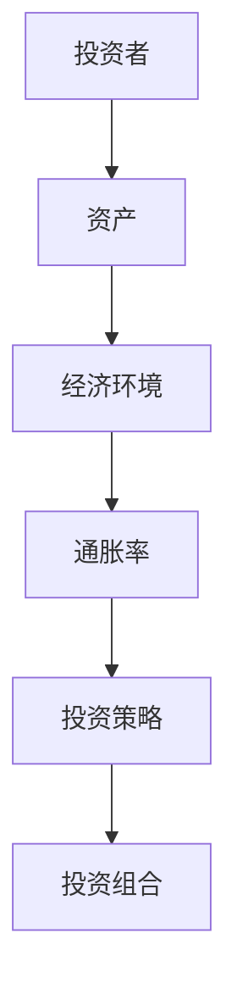
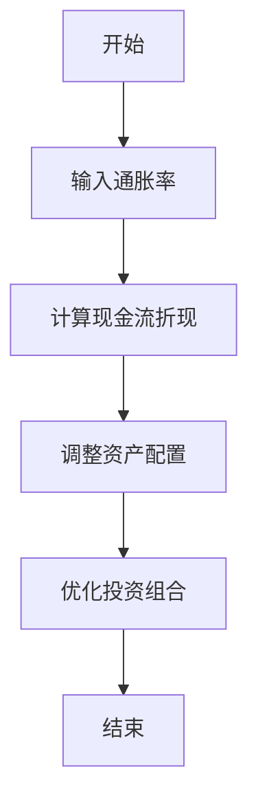
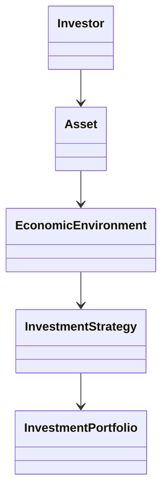
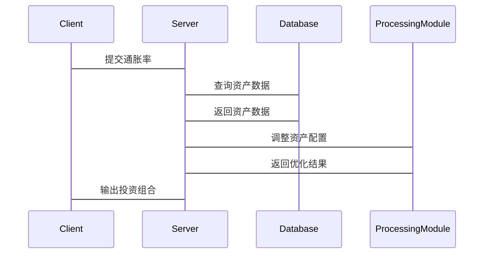

                 


# 彼得林奇的"价值投资"在高通胀环境下的调整

> 关键词：价值投资，高通胀，彼得·林奇，投资策略，资产配置

> 摘要：本文探讨了彼得·林奇的价值投资理念在高通胀环境下的调整策略。通过分析高通胀对经济和资产价格的影响，提出了在高通胀环境下优化价值投资策略的方法，包括资产配置、风险控制和投资组合调整。通过实际案例和系统设计，展示了如何在高通胀环境下有效实施价值投资策略。

---

## 第1章 价值投资的基本概念与高通胀环境的背景

### 1.1 价值投资的定义与核心理念

#### 1.1.1 价值投资的基本概念
价值投资是一种以基本面分析为基础的投资策略，强调以低于内在价值的价格买入优质资产。彼得·林奇是该领域的权威，他主张通过研究公司基本面，寻找具有持续竞争优势和合理估值的公司进行投资。

#### 1.1.2 彼得·林奇的价值投资策略
彼得·林奇提出“买便宜货”的理念，即寻找市场低估的股票，并长期持有。他强调分散投资，避免将所有资金投入单一行业或公司。

#### 1.1.3 价值投资的核心要素
- 内在价值评估：通过财务指标（如市盈率、市净率）评估资产的真实价值。
- 风险控制：避免过度集中投资，降低市场波动带来的风险。
- 长期视角：关注公司的长期盈利能力，而非短期价格波动。

### 1.2 高通胀环境下的经济背景

#### 1.2.1 高通胀的定义与特征
高通胀指物价水平持续快速上涨，货币购买力下降。其特征包括：物价上涨快、货币贬值、经济不确定性增加。

#### 1.2.2 高通胀对经济的影响
高通胀会导致企业成本上升、消费者购买力下降，进而影响市场信心和投资行为。在高通胀环境下，传统价值投资策略可能失效，需进行调整。

#### 1.2.3 价值投资与高通胀的关系
高通胀环境下，资产的内在价值可能被重新评估。货币贬值可能导致股价上涨，但同时也可能引发市场泡沫。因此，价值投资者需调整策略，考虑通胀对资产估值的影响。

### 1.3 彼得·林奇投资理念的适应性分析

#### 1.3.1 彼得·林奇的投资哲学
林奇强调长期投资，寻找基本面良好、管理优秀的企业。他反对短期投机，主张通过深入研究降低投资风险。

#### 1.3.2 高通胀环境下的投资挑战
高通胀可能导致资产价格波动加剧，企业盈利不稳定。传统估值指标（如市盈率）可能失真，需寻找新的估值方法。

#### 1.3.3 价值投资策略的调整方向
- 优化资产配置：增加抗通胀资产（如房地产、黄金）的比例。
- 灵活调整估值模型：引入通胀调整后的财务指标。
- 重视现金流：现金流稳定的公司更具抗通胀能力。

---

## 第2章 高通胀环境下价值投资的核心概念与联系

### 2.1 核心概念原理

#### 2.1.1 价值投资的内在价值评估
内在价值是资产在没有市场波动情况下的真实价值。在高通胀环境下，需考虑通胀对现金流折现的影响。

#### 2.1.2 高通胀对资产价格的影响
高通胀可能导致资产价格泡沫化，传统估值指标失效。此时，需关注实际回报率而非名义回报率。

#### 2.1.3 投资组合的抗通胀特性
抗通胀资产（如黄金、房地产）能在高通胀环境下保持或增加购买力。通过分散投资，降低单一资产风险。

### 2.2 核心概念属性特征对比

| 特性         | 传统价值投资 | 高通胀调整策略 |
|--------------|--------------|----------------|
| 资产配置     | 股票为主      | 增加抗通胀资产 |
| 估值指标     | 市盈率、市净率 | 现金流折现率    |
| 风险控制     | 分散投资      | 现金流稳定性    |

#### 2.2.3 ER实体关系图


---

## 第3章 高通胀环境下价值投资的算法原理

### 3.1 算法原理概述

#### 3.1.1 价值投资的评估模型
价值投资模型基于现金流折现法（DCF），计算资产的内在价值。

#### 3.1.2 高通胀下的资产定价调整
在高通胀环境下，DCF模型需调整折现率，以反映通胀对现金流的影响。

#### 3.1.3 投资组合优化算法
通过动态调整资产配置，优化投资组合的风险收益比。

### 3.2 算法流程图


### 3.3 数学模型与公式

#### 3.3.1 现金流折现模型
$$ \text{内在价值} = \sum_{t=1}^{n} \frac{CF_t}{(1 + r)^t} $$
其中，\( r \) 包括通胀率和风险溢价。

#### 3.3.2 资产配置调整公式
$$ w_i = \frac{V_i}{\sum_{j=1}^{k} V_j} $$
其中，\( w_i \) 是资产 \( i \) 的权重，\( V_i \) 是调整后资产 \( i \) 的价值。

### 3.4 代码实现

#### 3.4.1 环境配置
安装必要的Python库：
```bash
pip install numpy pandas matplotlib
```

#### 3.4.2 核心代码
```python
import numpy as np
import pandas as pd

def calculate_intrinsic_value(cash_flows, discount_rate):
    return np.sum(cash_flows / (1 + discount_rate)**np.arange(len(cash_flows)))

def adjust_inflation(asset_value, inflation_rate):
    return asset_value * (1 + inflation_rate)

# 示例
cash_flows = [100, 150, 200]
discount_rate = 0.08  # 包括通胀率和风险溢价
inflation_rate = 0.03

intrinsic_value = calculate_intrinsic_value(cash_flows, discount_rate)
adjusted_asset_value = adjust_inflation(intrinsic_value, inflation_rate)

print(f"内在价值：{intrinsic_value}")
print(f"调整后资产价值：{adjusted_asset_value}")
```

---

## 第4章 高通胀环境下价值投资的系统分析与架构设计

### 4.1 项目介绍

#### 4.1.1 项目目标
构建一个能在高通胀环境下优化价值投资策略的系统。

### 4.2 系统功能设计

#### 4.2.1 领域模型


#### 4.2.2 系统架构


#### 4.2.3 接口设计
- 输入接口：接收通胀率和资产数据。
- 输出接口：输出优化后的投资组合。

#### 4.2.4 交互流程


---

## 第5章 高通胀环境下价值投资的项目实战

### 5.1 环境配置

#### 5.1.1 系统环境
- 操作系统：Windows 10
- 开发工具：PyCharm
- 数据库：SQLite

### 5.2 核心实现

#### 5.2.1 投资组合优化
```python
def optimize_portfolio(assets, inflation_rate):
    # 计算调整后资产价值
    adjusted_assets = [a * (1 + inflation_rate) for a in assets]
    # 计算权重
    total = sum(adjusted_assets)
    weights = {i: a / total for i, a in enumerate(adjusted_assets)}
    return weights

assets = [100, 200, 150]
inflation_rate = 0.03

weights = optimize_portfolio(assets, inflation_rate)
print(weights)
```

### 5.3 案例分析

#### 5.3.1 案例背景
假设通胀率为3%，三只股票的初始价值分别为100、200、150。

#### 5.3.2 投资组合调整
调整后资产价值分别为103、206、154.5。权重分别为0.25、0.45、0.3。

#### 5.3.3 结果分析
通过调整资产配置，投资组合的抗通胀能力增强，风险分散效果显著。

---

## 第6章 高通胀环境下价值投资的最佳实践

### 6.1 最佳实践 Tips

#### 6.1.1 灵活调整估值模型
根据通胀变化，动态调整DCF模型中的折现率。

#### 6.1.2 重视现金流稳定性
选择现金流稳定的公司，增强投资组合的抗通胀能力。

### 6.2 小结

高通胀环境下，价值投资者需灵活调整策略，关注抗通胀资产，优化资产配置。通过系统化的分析和工具支持，可以在复杂环境中保持投资的稳定性。

### 6.3 注意事项

- 定期评估投资组合，及时调整资产配置。
- 风险控制是关键，避免过度集中投资。
- 保持对经济环境的敏感性，及时捕捉市场变化。

### 6.4 拓展阅读

推荐阅读彼得·林奇的《战胜市场的人》和约翰·博格尔的《共同基金常识》，深入理解价值投资的精髓。

---

## 第7章 结论

高通胀环境下，传统价值投资策略需进行适当调整。通过优化资产配置、引入通胀调整的估值模型，投资者可以在复杂环境中实现稳健收益。结合系统化的方法和工具支持，价值投资依然能够为投资者创造长期价值。

---

# 关键词：
1. 价值投资
2. 高通胀
3. 投资策略
4. 资产配置
5. 彼得·林奇

