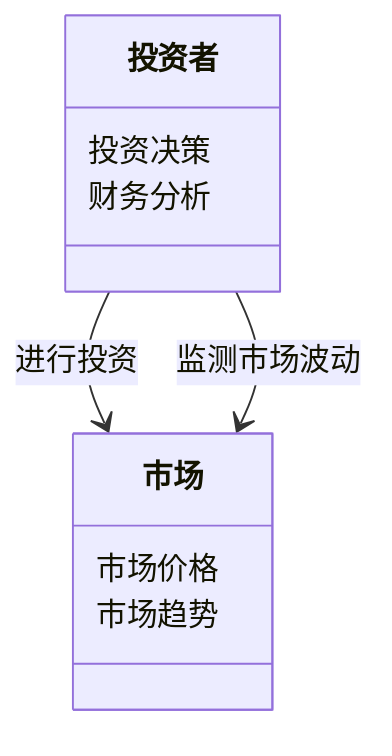
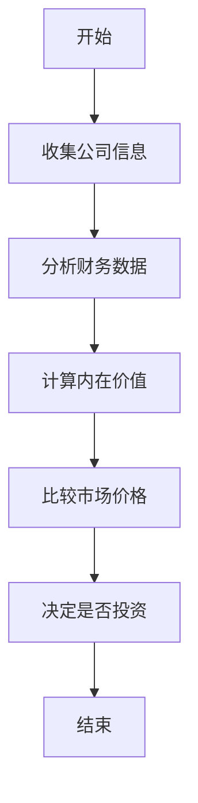
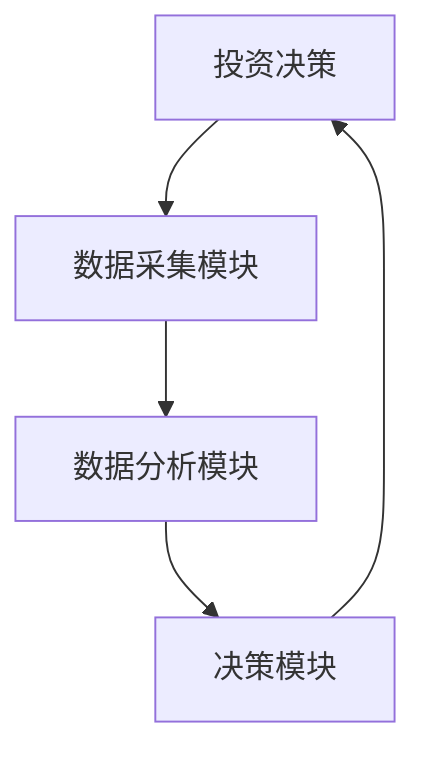

                 


# 彼得林奇的"价值投资"实践指南

> 关键词：彼得林奇、价值投资、投资策略、投资分析、投资决策、投资指南

> 摘要：本文深入分析了彼得·林奇的价值投资理念，结合实际案例和数学模型，详细阐述了价值投资的核心概念、算法原理、系统架构以及项目实战。文章旨在为投资者提供实用的指导，帮助其在投资决策中做出明智的选择。

---

## 第一部分: 价值投资的背景与核心概念

### 第1章: 价值投资的基本概念

#### 1.1 价值投资的定义与背景

价值投资是一种基于公司基本面分析的投资策略，旨在通过识别市场低估的公司来实现长期的超额收益。这一策略的核心在于寻找那些市场价格低于其内在价值的公司。彼得·林奇是该领域的著名投资者，他的成功经验为众多投资者提供了宝贵的指导。

#### 1.2 彼得·林奇的投资理念

彼得·林奇认为，成功的投资依赖于对公司基本面的深入研究和对市场趋势的准确判断。他强调长期投资的重要性，避免短期市场波动的干扰。林奇的成功在于他对公司财务状况的细致分析和对行业趋势的敏锐洞察。

#### 1.3 价值投资的核心要素

- **安全边际**：安全边际是市场价格与内在价值之间的差距，确保在市场波动中投资者的本金安全。
- **内在价值**：内在价值是基于公司未来现金流的现值计算得出的公司真实价值。
- **市场先生**：市场先生是格雷厄姆提出的一个隐喻，指市场的波动性和不可预测性。

---

### 第2章: 核心概念与联系

#### 2.1 核心概念原理

价值投资的核心在于通过分析公司的财务数据，计算其内在价值，并与市场价格进行比较。安全边际的存在为投资者提供了风险缓冲，确保在市场价格波动时仍能获得收益。

#### 2.2 核心概念对比分析

以下是不同投资策略的核心要素对比：

| 投资策略 | 核心要素         | 计算方式                         |
|----------|------------------|----------------------------------|
| 价值投资 | 内在价值、安全边际 | 现金流折现法、市场价格与内在价值差额 |
| 技术分析 | 趋势、形态       | 价格图表、技术指标               |

#### 2.3 实体关系图

以下是投资者与市场之间的实体关系图：



---

## 第二部分: 价值投资的数学模型与算法原理

### 第3章: 价值投资的数学模型与算法原理

#### 3.1 内在价值的计算公式

内在价值的计算通常采用现金流折现模型（DCF）。以下是公式：

$$ V = \sum_{t=1}^{n} \frac{CF_t}{(1+r)^t} $$

其中，\( V \) 为内在价值，\( CF_t \) 为第 \( t \) 年的现金流，\( r \) 为折现率。

#### 3.2 安全边际的计算

安全边际的计算公式为：

$$ Margin\ of\ Safety = \frac{Intrinsic\ Value - Market\ Value}{Market\ Value} $$

#### 3.3 价值投资的决策流程

以下是价值投资的决策流程图：



---

## 第三部分: 价值投资的系统分析与架构设计

### 第4章: 价值投资的系统分析与架构设计

#### 4.1 投资决策系统架构

以下是投资决策系统的功能模块图：

```mermaid
classDiagr
    class 投资决策系统 {
        数据采集模块
        数据分析模块
        决策模块
    }
```

#### 4.2 系统架构图

以下是系统架构图：



---

## 第四部分: 价值投资的项目实战

### 第5章: 价值投资的项目实战

#### 5.1 环境安装

为了进行价值投资分析，首先需要安装必要的工具和库，例如Python和Pandas库。

#### 5.2 核心代码实现

以下是计算内在价值的Python代码示例：

```python
def calculate_intrinsic_value(cash_flows, discount_rate):
    return sum(cf / (1 + discount_rate)**t for t, cf in enumerate(cash_flows))
```

#### 5.3 案例分析

假设某公司的未来现金流如下：

| 年份 | 现金流 |
|------|--------|
| 1    | 100    |
| 2    | 150    |
| 3    | 200    |

折现率为5%，计算其内在价值：

$$ V = \frac{100}{1.05} + \frac{150}{1.05^2} + \frac{200}{1.05^3} $$

---

## 第五部分: 最佳实践与小结

### 第6章: 最佳实践与小结

#### 6.1 最佳实践

- 定期回顾投资组合，重新评估公司的内在价值。
- 保持对市场的关注，但避免频繁交易。
- 结合宏观经济环境进行投资决策。

#### 6.2 小结

彼得·林奇的价值投资策略为投资者提供了一种系统化的方法，通过深入分析公司的基本面，识别市场低估的投资机会。本文通过理论分析和实际案例，详细阐述了这一策略的核心要素和实施步骤，为投资者提供了实用的指导。

---

通过以上结构，文章详细讲解了彼得·林奇的价值投资理念，结合数学模型和实际案例，为投资者提供了深入的指导。

