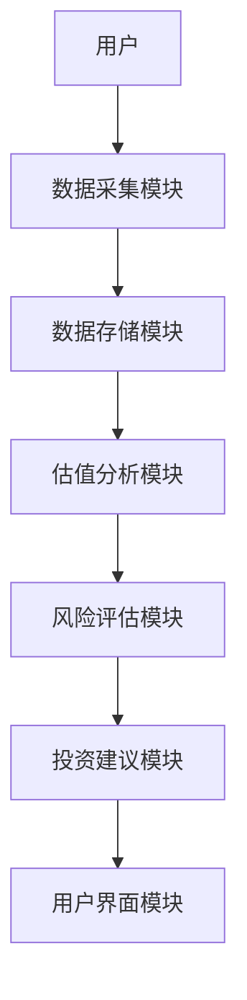

                 


# 彼得林奇的"价值陷阱"修正方法

## 关键词：彼得林奇、价值陷阱、投资策略、修正方法、风险管理、投资组合优化

## 摘要：本文详细探讨了彼得·林奇提出的“价值陷阱”概念，分析其特征、形成原因及修正方法。通过数学模型、系统架构和实际案例，揭示如何识别和避免价值陷阱，优化投资组合，降低风险，实现稳健投资回报。

---

## 第1章：价值陷阱的基本概念

### 1.1 价值陷阱的定义

#### 1.1.1 核心概念
- **价值陷阱**：看似估值低，实则存在重大缺陷，无法带来预期收益的投资标的。
- **内在价值**：基于财务状况和市场环境计算的合理价格，与市场价格差异显著时可能存在价值陷阱。

#### 1.1.2 问题背景
- 投资者追求低价投资，忽视潜在风险，导致投资亏损。
- 彼得·林奇强调，识别价值陷阱是投资成功的关键。

#### 1.1.3 核心要素
| 要素 | 描述 |
|------|------|
| 低估值 | 市场价格低于内在价值 |
| 重大缺陷 | 公司基本面存在严重问题 |
| 风险 | 投资者可能因忽略缺陷而遭受损失 |

### 1.2 投资中的常见问题

#### 1.2.1 误区
- 仅看表面估值，忽视公司基本面。
- 对市场过度乐观，低估风险。

#### 1.2.2 表现
- 投资标的股价远低于行业平均水平。
- 公司财务状况恶化，如高负债、低利润率。

#### 1.2.3 影响
- 投资组合表现不佳，甚至亏损。
- 投资者信心下降，错失优质投资机会。

### 1.3 重要性

#### 1.3.1 核心地位
- 价值陷阱识别是投资决策的基础。
- 影响投资组合的风险和收益平衡。

#### 1.3.2 提升收益
- 避免低效投资，优化资产配置。
- 提高投资决策的准确性和可靠性。

#### 1.3.3 修正方法的必要性
- 避免重大损失，保护投资本金。
- 通过修正方法提升长期投资收益。

---

## 第2章：识别价值陷阱的关键特征

### 2.1 低估值的陷阱

#### 2.1.1 定义与特征
- 低估值：市场价格显著低于内在价值。
- 陷阱：公司存在严重问题，如管理不善或行业衰退。

#### 2.1.2 典型案例分析
- 公司A：股价远低于行业平均水平，但财务状况恶化，难以扭亏为盈。

#### 2.1.3 风险提示
- 股价反弹的可能性较低。
- 公司问题难以在短期内解决。

### 2.2 高负债的风险

#### 2.2.1 定义与特征
- 高负债：公司债务负担过重，超出其偿债能力。
- 风险：经济下行时，还款压力巨大，可能导致破产。

#### 2.2.2 风险分析
- 负债率过高，现金流不足以覆盖债务。
- 利息支出过高，影响公司盈利。

#### 2.2.3 典型案例
- 公司B：负债率超过80%，现金流为负，面临破产风险。

### 2.3 行业周期的影响

#### 2.3.1 定义与特征
- 行业周期：经济周期波动导致行业兴衰。
- 影响：周期性行业波动大，价值陷阱易出现。

#### 2.3.2 行业衰退期
- 需求下降，供给过剩，价格战激烈。
- 企业利润骤减，难以偿还债务。

#### 2.3.3 典型案例
- 公司C：行业衰退期，公司订单减少，库存积压，现金流为负。

---

## 第3章：分析价值陷阱的成因

### 3.1 财务报表分析

#### 3.1.1 核心指标
- 负债率：负债总额/资产总额。
- 利息覆盖率：EBITDA/利息支出。

#### 3.1.2 财务健康度
- 利润率：净利润/收入。
- 现金流：经营活动现金流是否为正。

#### 3.1.3 案例分析
- 公司D：财务报表显示高负债、低利润率、负现金流，存在严重问题。

### 3.2 市场情绪的影响

#### 3.2.1 投资者情绪波动
- 过度乐观：忽视风险，追求高收益。
- 过度悲观：错失优质投资机会。

#### 3.2.2 市场周期
- 牛市：投资者容易忽视风险，追求高收益。
- 熊市：投资者过于谨慎，错失投资良机。

#### 3.2.3 案例分析
- 投资者在牛市中忽视公司基本面，买入高负债公司，导致亏损。

### 3.3 管理层问题

#### 3.3.1 管理层能力
- 管理不善：战略错误，管理混乱。
- 信息披露不透明：财务造假，隐瞒问题。

#### 3.3.2 内部治理
- 公司治理结构不合理，内部监督失效。
- 管理层决策失误，导致公司亏损。

#### 3.3.3 案例分析
- 公司E：管理层决策失误，导致公司连续亏损，难以扭亏。

---

## 第4章：修正价值陷阱的方法

### 4.1 估值方法的选择

#### 4.1.1 市盈率（P/E）
- 公式：市盈率 = 股价 / 每股收益。
- 应用：用于评估公司股价是否合理。
- 案例：公司F，市盈率远低于行业平均，但实际盈利不佳。

#### 4.1.2 市净率（P/B）
- 公式：市净率 = 股价 / 每股净资产。
- 应用：适用于银行、地产等行业。
- 案例：公司G，市净率极低，但资产质量差。

#### 4.1.3 现金流分析
- 公式：自由现金流 = 经营活动现金流 - 资本支出。
- 应用：评估公司持续盈利能力。
- 案例：公司H，现金流为负，难以维持经营。

### 4.2 风险管理技巧

#### 4.2.1 风险分散
- 投资组合多样化，降低单一投资风险。
- 案例：投资多个行业和公司，分散风险。

#### 4.2.2 设置止损点
- 确定最大亏损承受能力，及时止损。
- 案例：设定止损点，避免重大损失。

#### 4.2.3 持股集中度
- 避免过度集中，控制单一投资比例。
- 案例：投资分散，降低风险。

### 4.3 行业研究的重要性

#### 4.3.1 行业趋势分析
- 研究行业周期，判断投资时机。
- 案例：行业处于衰退期，避免投资。

#### 4.3.2 竞争分析
- 分析行业竞争格局，评估公司竞争力。
- 案例：公司I，行业竞争激烈，难以生存。

#### 4.3.3 政策影响
- 关注政策变化，评估对公司的影响。
- 案例：政策调整，导致行业利润下降。

---

## 第5章：数学模型与案例分析

### 5.1 估值模型

#### 5.1.1 现金流折现模型（DCF）
- 公式：内在价值 = 现金流 / 折现率。
- 应用：评估公司未来现金流的现值。
- 案例：公司J，DCF模型显示内在价值低于市场价格。

#### 5.1.2 市盈率模型
- 公式：目标股价 = 市盈率 × 净利润。
- 应用：适用于盈利稳定的公司。
- 案例：公司K，市盈率合理，但净利润持续下降。

### 5.2 风险评估公式

#### 5.2.1 风险价值（VaR）
- 公式：VaR = √(σ² × 投资金额)。
- 应用：评估投资组合的最大可能损失。
- 案例：投资组合VaR为5%，即在95%的置信水平下，最大损失为5%。

#### 5.2.2 风险调整后收益（RAR）
- 公式：RAR = (收益 - 无风险收益率) / 风险。
- 应用：比较不同投资的风险调整后收益。
- 案例：投资L，RAR低于无风险收益率，风险过高。

### 5.3 案例分析

#### 5.3.1 案例1：公司M
- 问题：高负债，现金流为负。
- 修正：避免投资，寻找其他机会。

#### 5.3.2 案例2：公司N
- 问题：行业衰退，需求下降。
- 修正：减少投资，分散风险。

---

## 第6章：系统架构与项目实战

### 6.1 系统功能设计

#### 6.1.1 功能模块
- 数据采集：收集公司财务数据、行业信息。
- 估值分析：应用DCF模型、市盈率模型等。
- 风险评估：计算VaR、RAR等指标。
- 投资建议：基于分析结果，提供投资建议。

#### 6.1.2 系统架构图


#### 6.1.3 系统接口设计
- 数据接口：与金融数据供应商对接，获取实时数据。
- 用户接口：提供友好的用户界面，展示分析结果。

### 6.2 项目实战

#### 6.2.1 环境安装
- 安装Python、Pandas、Matplotlib等工具。
- 配置数据源，如Yahoo Finance API。

#### 6.2.2 核心代码实现

```python
import pandas as pd
import numpy as np
import matplotlib.pyplot as plt

# 示例数据
data = {'公司': ['A', 'B', 'C'],
        '市盈率': [15, 20, 10],
        '市净率': [2, 3, 1],
        '负债率': [0.5, 0.6, 0.4]}
df = pd.DataFrame(data)

# 计算风险价值（VaR）
def calculate_var(returns, confidence_level=0.95):
    sorted_returns = np.sort(returns)
    var_index = int(len(sorted_returns) * (1 - confidence_level))
    var = sorted_returns[var_index]
    return var

# 分析价值陷阱
results = []
for company in df['公司']:
    pe = df[df['公司'] == company]['市盈率'].values[0]
    pb = df[df['公司'] == company]['市净率'].values[0]
    debt_ratio = df[df['公司'] == company]['负债率'].values[0]
    
    # 判断是否为价值陷阱
    if pe < 15 and pb < 2 and debt_ratio > 0.5:
        results.append(company)
        
print("价值陷阱公司:", results)
```

#### 6.2.3 实际案例分析
- 使用上述代码分析公司数据，识别价值陷阱。
- 结果显示公司C为价值陷阱，需避免投资。

---

## 第7章：总结与注意事项

### 7.1 全书总结
- 彼得·林奇的“价值陷阱”概念提醒投资者，低估值不等于好投资。
- 识别和修正价值陷阱需要全面分析公司基本面、行业环境和市场情绪。

### 7.2 投资注意事项
- 避免仅看表面估值，忽视公司基本面。
- 保持理性，避免情绪化决策。
- 定期复盘，及时调整投资策略。

### 7.3 未来趋势与拓展阅读
- 关注新技术在投资分析中的应用，如人工智能、大数据分析。
- 推荐阅读彼得·林奇的《投资最重要的事情》。

---

通过本文的详细分析和实际案例，读者可以更好地识别和避免价值陷阱，优化投资组合，实现稳健的投资回报。

