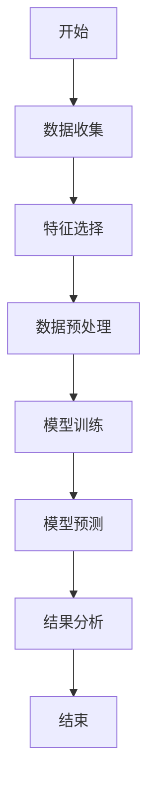
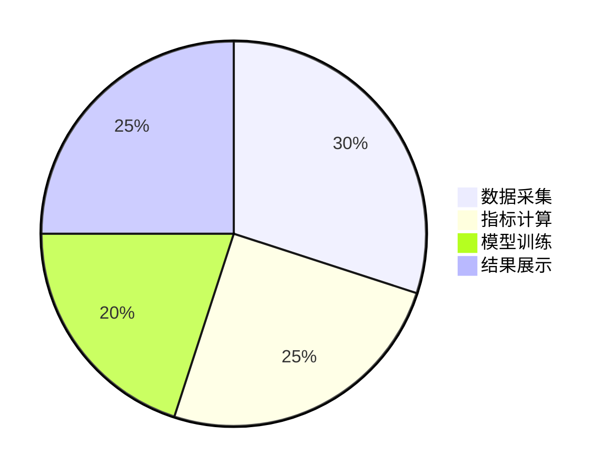

                 


# 彼得林奇的"价值陷阱"在不同市场周期的表现

## 关键词：价值陷阱、彼得林奇、市场周期、投资策略、价值投资、风险管理

## 摘要：  
彼得·林奇是全球著名的价值投资者，他在投资生涯中总结出了“价值陷阱”这一概念，指的是看似具有投资价值但实际存在严重问题的股票。本文将深入探讨价值陷阱在不同市场周期中的表现，结合彼得林奇的理论和实际案例，分析其在牛市、熊市和经济波动中的特征，并提出避免价值陷阱的策略。文章还将从技术角度出发，结合数学模型和算法，帮助投资者更好地识别和规避价值陷阱。

---

# 第一部分: 背景介绍

## 第1章: 价值陷阱的核心概念

### 1.1 价值投资的基本概念  
价值投资是一种以基本面分析为基础的投资策略，强调以低于内在价值的价格买入优质资产。彼得·林奇是价值投资的代表人物之一，他主张投资具有强大基本面和竞争优势的公司，同时避免那些看似便宜但实际存在问题的股票。

**价值陷阱的定义与特征**  
价值陷阱是指那些表面上看似便宜（如低市盈率、低市净率），但实际存在严重问题（如业绩下滑、管理不善、行业衰退）的股票。投资者容易被其低廉的价格所迷惑，买入后却可能面临更大的损失。

### 1.2 价值陷阱的形成机制  
价值陷阱的形成通常与市场情绪、行业周期和公司基本面密切相关。例如，在市场低迷时，某些公司可能因为行业衰退或管理问题导致股价大幅下跌，但其内在价值并未恢复，反而可能进一步恶化。

### 1.3 价值陷阱的经济周期表现  
在不同的经济周期中，价值陷阱的表现有所不同：  
- **牛市**：市场情绪高涨，投资者容易忽视基本面，导致一些高估值但基本面不佳的股票成为价值陷阱。  
- **熊市**：许多公司因经济衰退而陷入困境，价值陷阱的数量可能增加，但一些优质股也可能被错杀。  
- **经济波动**：行业周期性波动可能导致某些行业更容易出现价值陷阱，例如传统制造业在技术革命中的转型期。

---

## 第2章: 彼得林奇的价值陷阱理论

### 2.1 彼得林奇的投资哲学  
彼得·林奇强调长期投资和对公司基本面的深入分析。他认为，投资者应该关注公司的财务健康状况、竞争优势和管理层能力，而不是仅仅关注股价的短期波动。

**价值陷阱的识别标准**  
彼得·林奇总结了以下几点：  
- 公司的盈利能力持续下降。  
- 公司的市场份额被竞争对手蚕食。  
- 公司的财务状况恶化（如高负债、低现金流）。  
- 公司所在的行业处于衰退期或竞争激烈。  

### 2.2 价值陷阱的经典案例分析  
以美国运通为例，20世纪90年代互联网兴起后，信用卡行业面临转型压力，美国运通的股价一度被市场低估，但其核心业务并未受到根本性冲击，最终证明不是价值陷阱。

### 2.3 如何避免价值陷阱  
彼得·林奇建议投资者：  
- 深入研究公司基本面，关注财务报表中的关键指标（如ROE、现金流、负债率）。  
- 分析管理层的决策能力和战略规划。  
- 长期跟踪公司的经营状况，避免短期波动的干扰。

---

# 第二部分: 数学模型与算法原理

## 第3章: 价值陷阱的数学模型

### 3.1 价值陷阱的识别模型  
我们可以通过以下步骤构建一个简单的价值陷阱识别模型：  
1. **数据收集**：收集目标公司的财务数据（如市盈率、市净率、ROE、现金流等）。  
2. **指标计算**：计算各项指标的百分位数（如市盈率低于市场中位数可能被视为低估）。  
3. **风险评估**：结合行业周期和公司基本面，评估公司是否具有潜在风险。  

**数学模型示例**：  
假设市场中位数市盈率为15，若某公司市盈率为12，但其ROE低于行业平均值，则可能属于价值陷阱。

### 3.2 价值陷阱的预测算法  
我们可以使用逻辑回归模型来预测股票是否为价值陷阱。以下是模型的流程：  
1. **特征选择**：选择关键的财务指标（如市盈率、市净率、ROE、现金流）。  
2. **数据预处理**：标准化数据，处理缺失值。  
3. **模型训练**：使用逻辑回归算法，将股票分为“价值陷阱”和“非价值陷阱”。  
4. **结果分析**：评估模型的准确率和召回率。

**Python代码示例**：  
```python
import pandas as pd
from sklearn.linear_model import LogisticRegression
from sklearn.metrics import classification_report

# 数据预处理
data = pd.read_csv('financial_data.csv')
data = data.dropna()

# 特征选择
features = ['PE', 'PB', 'ROE', 'CFPS']
target = 'is_value_trap'

X = data[features].values
y = data[target].values

# 模型训练
model = LogisticRegression()
model.fit(X, y)

# 模型预测
y_pred = model.predict(X)

# 结果分析
print(classification_report(y, y_pred))
```

### 3.3 算法原理与流程图  
以下是一个简化的价值陷阱预测流程图（使用Mermaid语法）：  


---

# 第三部分: 系统分析与架构设计

## 第4章: 系统架构设计方案

### 4.1 系统功能设计  
我们设计一个价值陷阱识别系统，主要包括以下功能模块：  
- **数据采集**：从数据库或API获取公司财务数据。  
- **指标计算**：计算各项财务指标并进行百分位数排名。  
- **模型训练**：使用逻辑回归等算法进行分类。  
- **结果展示**：将预测结果可视化，帮助投资者识别价值陷阱。

### 4.2 系统架构图  
以下是系统的整体架构图（使用Mermaid语法）：  


### 4.3 系统接口设计  
系统主要接口包括：  
- `get_financial_data(company)`：获取单个公司的财务数据。  
- `calculate_indicators(data)`：计算各项财务指标。  
- `train_model(X, y)`：训练逻辑回归模型。  
- `predict_trap(model, X)`：预测股票是否为价值陷阱。

---

## 第5章: 项目实战

### 5.1 环境安装  
需要安装Python、Pandas、Scikit-learn等库，具体安装命令如下：  
```bash
pip install numpy pandas scikit-learn
```

### 5.2 核心代码实现  
以下是价值陷阱识别系统的核心代码：  
```python
import pandas as pd
from sklearn.linear_model import LogisticRegression
from sklearn.metrics import classification_report

# 数据采集
data = pd.read_csv('financial_data.csv')

# 特征选择
features = ['PE', 'PB', 'ROE', 'CFPS']
target = 'is_value_trap'

X = data[features].values
y = data[target].values

# 模型训练
model = LogisticRegression()
model.fit(X, y)

# 模型预测
y_pred = model.predict(X)

# 结果分析
print(classification_report(y, y_pred))
```

### 5.3 案例分析  
以柯达公司为例，分析其在胶片行业的衰退期是否属于价值陷阱。  
- **背景**：20世纪90年代，柯达在胶片行业占据主导地位，但由于技术进步（数码相机的普及），其市场份额逐渐被侵蚀。  
- **数据**：假设柯达的市盈率为10，低于行业平均值，但ROE和现金流持续下滑。  
- **结论**：柯达属于价值陷阱，投资者应避免买入。

---

## 第6章: 总结与展望

### 6.1 总结  
价值陷阱是投资者在价值投资过程中需要特别警惕的现象。彼得·林奇的理论为我们提供了重要的启示：深入分析公司基本面、关注行业周期，并结合数学模型和算法，可以帮助我们更好地识别和规避价值陷阱。

### 6.2 展望  
未来的研究可以进一步结合人工智能技术，如使用深度学习模型进行更复杂的预测，或开发实时监控系统，帮助投资者在不同市场周期中动态识别价值陷阱。

---

通过本文的分析，投资者可以更好地理解价值陷阱在不同市场周期中的表现，并采取有效的策略来规避风险，实现长期稳健的投资回报。

