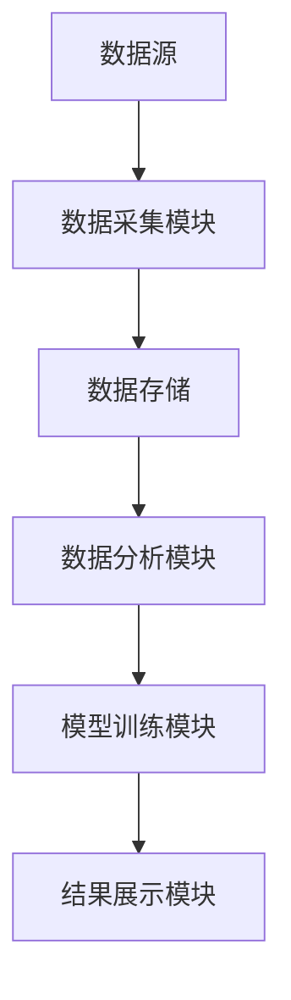

                 


好的，我明白了。接下来我会按照您的要求，逐步构建这篇文章的目录大纲。让我们先从文章的基本信息开始。

---

# 彼得林奇的"价值陷阱"在新兴市场中的识别技巧

> 关键词：价值陷阱、彼得林奇、新兴市场、投资策略、风险管理、财务分析、机器学习

> 摘要：本文深入探讨了彼得林奇提出的“价值陷阱”概念在新兴市场中的表现形式和识别方法。通过结合定量分析和案例研究，文章详细阐述了如何在新兴市场中识别价值陷阱，分析了其形成机制，并提出了相应的防范策略。此外，本文还探讨了如何利用现代技术手段（如机器学习）来提升价值陷阱的识别能力。

---

## 第一部分: 价值陷阱的定义与背景

### 第1章: 价值陷阱的核心概念

#### 1.1 价值陷阱的定义
- 什么是价值陷阱？
- 价值陷阱与价值投资的区别
- 价值陷阱的常见特征

#### 1.2 价值陷阱的形成机制
- 市场情绪对企业估值的影响
- 估值偏差的常见原因
- 投资者心理与行为偏差

#### 1.3 新兴市场中的价值陷阱
- 新兴市场的特点与挑战
- 新兴市场中价值陷阱的特殊性
- 行业周期与政策风险的影响

---

## 第二部分: 价值陷阱的识别方法

### 第2章: 基于财务数据的识别方法

#### 2.1 财务指标分析
- 市盈率（P/E）与市净率（P/B）分析
- 资产负债率与周转率分析
- 现金流与利润匹配度分析

#### 2.2 行业分析与竞争格局
- 行业周期与企业定位
- 市场集中度与竞争强度
- 行业政策与法规影响

#### 2.3 企业基本面的综合评估
- 盈利能力分析（ROE、净利润率）
- 偿债能力分析（资产负债率、流动比率）
- 现金流健康度分析

---

### 第3章: 价值陷阱的数学模型与算法原理

#### 3.1 价值陷阱识别的数学模型
- 基于多因子模型的分析
- 市场情绪与估值偏差的量化模型
- 基于机器学习的分类模型

#### 3.2 算法原理与实现
- 数据预处理与特征选择
- 模型训练与优化（逻辑回归、随机森林）
- 模型验证与评估（准确率、召回率、F1分数）

#### 3.3 案例分析
- 某新兴市场的价值陷阱案例
- 数据驱动的分析与结论

---

## 第三部分: 价值陷阱的防范策略

### 第4章: 投资者如何避免价值陷阱

#### 4.1 建立合理的投资框架
- 投资目标与风险偏好
- 资产配置与分散化投资
- 长期投资与价值发现

#### 4.2 强化基本面分析能力
- 财务数据的深度挖掘
- 行业趋势与企业定位的分析
- 宏观经济与政策风险的评估

#### 4.3 风险管理与心理控制
- 投资组合的风险分散
- 心理行为的自我控制
- 价值陷阱的早期预警

---

## 第四部分: 系统架构与技术实现

### 第5章: 价值陷阱识别的系统架构设计

#### 5.1 系统功能设计
- 数据采集模块（财务数据、市场数据）
- 数据分析模块（财务指标计算、模型训练）
- 结果展示模块（可视化分析、案例报告）

#### 5.2 系统架构图
- 使用Mermaid绘制系统架构图


#### 5.3 系统接口设计
- 数据接口（API）设计
- 模型接口（函数接口）设计
- 用户界面（UI）设计

---

## 第五部分: 项目实战与案例分析

### 第6章: 项目实战

#### 6.1 环境安装
- 安装Python与相关库（Pandas、NumPy、Scikit-learn）
- 数据获取与清洗（使用Python代码）

#### 6.2 核心实现
- 财务指标计算（代码示例）
```python
import pandas as pd

def calculate_pe_ratio(df):
    df['PE_Ratio'] = df['Price'] / df['Earnings_Per_Share']
    return df

# 示例数据
data = {
    'Price': [10, 20, 30, 40],
    'Earnings_Per_Share': [2, 3, 4, 5]
}
df = pd.DataFrame(data)
calculate_pe_ratio(df)
```

#### 6.3 案例分析
- 某新兴市场的价值陷阱案例
- 数据驱动的分析与结论

---

## 第六部分: 总结与最佳实践

### 第7章: 总结与小结

#### 7.1 文章核心内容回顾
- 价值陷阱的定义与特征
- 新兴市场中的识别方法
- 防范策略与技术实现

#### 7.2 投资者的注意事项
- 避免情绪化投资
- 加强基本面分析能力
- 重视风险管理与分散化

#### 7.3 拓展阅读与学习资源
- 推荐书籍与论文
- 在线课程与投资社区
- 数据分析工具与平台

---

以上是文章的目录大纲，每个部分都包含了详细的子内容和具体的实现方法。希望这个大纲能够满足您的需求！如果需要进一步调整或补充，请随时告诉我。

