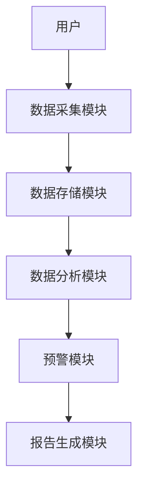

                 

# 彼得林奇的"价值陷阱"在新兴科技泡沫中的识别技巧

## 关键词：价值陷阱，彼得林奇，科技泡沫，投资策略，风险管理

## 摘要：本文深入探讨了彼得林奇提出的“价值陷阱”概念，并分析了其在新兴科技泡沫中的识别技巧。通过结合技术分析和基本面分析，本文提出了一个系统化的识别框架，包括市场情绪分析、财务数据评估和投资策略优化。同时，本文通过实际案例分析，展示了如何利用这些方法在科技泡沫中规避价值陷阱，并制定有效的风险管理策略。

---

# 引言

## 1. 彼得林奇的价值陷阱概述

### 1.1 价值陷阱的基本概念

- 价值陷阱是指那些看似具有吸引力但实际存在严重问题的投资标的，可能导致投资者蒙受损失。
- 彼得林奇强调，价值投资者需要警惕那些表面上看似便宜但实际基本面不佳的公司。

### 1.2 科技泡沫与价值陷阱的关系

- 科技行业的高增长潜力吸引了大量投资者，但也导致了高估值和泡沫的形成。
- 在科技泡沫中，许多公司可能会掉入价值陷阱，表现为高估值、低业绩和财务数据异常。

---

# 第二部分：科技泡沫的背景分析

## 2. 科技泡沫的形成机制

### 2.1 科技行业的独特性

- **高增长潜力**：科技行业的技术创新和快速迭代带来了巨大的增长机会。
- **高风险特性**：科技行业的投资具有高度不确定性，失败率较高。
- **周期性分析**：科技行业经历了多次周期性波动，泡沫的形成和破裂具有一定的规律性。

### 2.2 泡沫形成的驱动因素

- **市场情绪的驱动**：投资者的乐观情绪和羊群效应导致资产价格虚高。
- **投资者心理的驱动**：贪婪和恐惧心理交替作用，推动市场泡沫的形成。
- **媒体宣传的驱动**：媒体的过度宣传和炒作加剧了市场的非理性行为。

### 2.3 价值陷阱的特征分析

- **高估值与低业绩的矛盾**：公司估值远高于其实际盈利能力。
- **财务数据的异常表现**：收入增长放缓、利润下滑、现金流恶化。
- **市场情绪的过度乐观**：投资者对公司前景的过度乐观导致股价虚高。

---

## 3. 价值陷阱的核心特征

### 3.1 价值陷阱的核心特征

- **高估值与低业绩的矛盾**：公司估值远高于其实际盈利能力。
- **财务数据的异常表现**：收入增长放缓、利润下滑、现金流恶化。
- **市场情绪的过度乐观**：投资者对公司前景的过度乐观导致股价虚高。

### 3.2 价值陷阱的识别维度

- **基本面分析**：通过财务指标（如市盈率、市净率、ROE等）评估公司的真实价值。
- **技术分析**：通过股价走势、成交量等技术指标判断市场的非理性波动。
- **市场情绪分析**：通过媒体、社交媒体等渠道监测投资者情绪的变化。

---

## 4. 科技泡沫中的价值陷阱识别框架

### 4.1 识别框架的核心要素

- **市场情绪分析**：通过媒体、社交媒体等渠道监测投资者情绪的变化。
- **财务数据评估**：通过公司财报分析收入、利润、现金流等关键指标。
- **投资策略优化**：结合市场情绪和技术分析，制定合理的投资策略。

### 4.2 识别框架的实施步骤

1. **数据收集**：收集科技公司的财务数据和市场数据。
2. **指标计算**：计算市盈率、市净率等关键指标。
3. **市场情绪分析**：通过文本挖掘技术分析媒体和社交媒体的情绪倾向。
4. **风险评估**：结合财务数据和市场情绪，评估公司的潜在风险。
5. **投资决策**：根据风险评估结果，制定相应的投资策略。

---

## 5. 价值陷阱识别的系统架构设计

### 5.1 系统功能设计

- **数据采集模块**：收集公司财务数据和市场数据。
- **数据分析模块**：计算关键指标并生成报告。
- **预警模块**：根据指标变化触发预警。

### 5.2 系统架构设计

### 5.3 系统接口设计

- 数据接口：提供API用于数据采集和分析。
- 用户接口：提供可视化界面供用户查看报告和预警信息。

---

## 6. 投资策略与风险管理

### 6.1 投资策略优化

- **分散投资**：避免将所有资金投入单一科技公司。
- **长期投资**：选择基本面良好的公司进行长期持有。
- **风险管理**：设置止损点，控制风险敞口。

### 6.2 风险管理的实现

- **止损机制**：当股价跌破设定阈值时，自动卖出。
- **仓位控制**：根据市场波动调整持仓比例。

---

## 7. 实战案例分析

### 7.1 案例一：社交媒体平台XYZ

- **背景**：XYZ在社交媒体领域迅速崛起，吸引了大量投资者。
- **识别过程**：通过财务数据和技术分析发现，公司收入增长放缓，市盈率远高于行业平均水平。
- **结论**：XYZ掉入价值陷阱，投资者应避免投资。

### 7.2 案例二：人工智能公司ABC

- **背景**：ABC在人工智能领域具有领先技术。
- **识别过程**：通过财务数据分析发现，公司现金流稳定，收入增长强劲。
- **结论**：ABC具有较高的投资价值，不属于价值陷阱。

---

## 8. 总结与展望

### 8.1 总结

- 本文提出了在新兴科技泡沫中识别价值陷阱的系统化方法。
- 通过结合基本面分析、技术分析和市场情绪分析，投资者可以有效识别和规避价值陷阱。

### 8.2 展望

- 随着科技行业的快速发展，价值陷阱的识别将面临更多挑战。
- 未来的研究可以进一步结合大数据和人工智能技术，提高识别的准确性和效率。

---

## 参考文献

- 彼得林奇的书籍和论文。
- 相关科技行业的研究报告。
- 学术期刊中的相关文献。

---

通过以上详细的内容，本文为投资者提供了一个全面的框架，帮助他们在新兴科技泡沫中识别价值陷阱，制定有效的投资策略。希望本文的内容能为投资者在复杂多变的市场中提供有价值的参考和指导。

