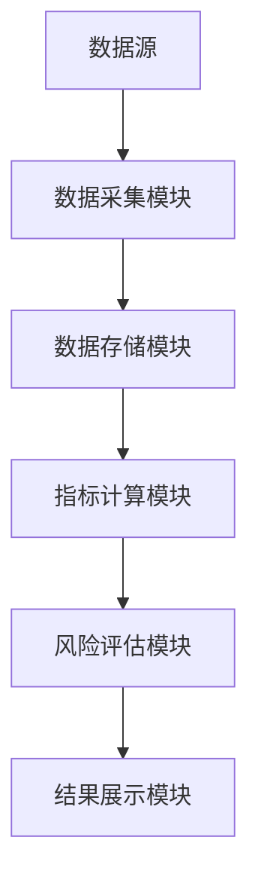
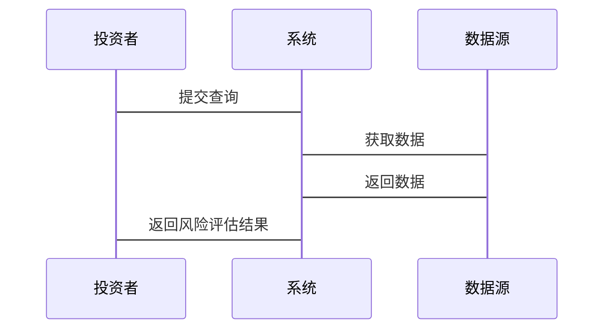

                 


# 彼得林奇的"价值陷阱"在新兴科技股中的识别指标体系

## 关键词：价值陷阱、新兴科技股、投资指标、彼得林奇、风险管理

## 摘要：本文系统阐述了彼得林奇提出的“价值陷阱”概念在新兴科技股投资中的应用，构建了一个基于财务指标、市场指标和前瞻性指标的多维度识别体系，结合实际案例和系统架构设计，帮助投资者有效识别和规避价值陷阱，提升投资决策的科学性和准确性。

---

# 第一部分：彼得林奇的"价值陷阱"概述

## 第1章：价值陷阱的定义与特征

### 1.1 价值陷阱的定义

#### 1.1.1 价值陷阱的定义与内涵
价值陷阱是指那些表面上看似具有投资价值，但实际上存在隐藏问题或风险的股票。投资者如果未能深入分析其基本面，可能会误判其价值，导致投资损失。

#### 1.1.2 价值陷阱的核心特征
- **低估值**：市盈率、市净率等估值指标低于行业平均水平。
- **高增长**：公司收入和利润增长率较高，但可能不可持续。
- **隐藏风险**：如资产负债表恶化、管理问题或行业政策变化。

#### 1.1.3 价值陷阱与价值投资的区别
- 价值投资寻找被市场低估的优质公司，而价值陷阱看似低估，但公司本身存在问题。

### 1.2 价值陷阱在新兴科技股中的表现

#### 1.2.1 新兴科技股的高增长与高风险
- 新兴科技行业通常具有高增长潜力，但也伴随着高波动性和高风险。
- 创新失败、竞争加剧或政策变化可能导致公司基本面迅速恶化。

#### 1.2.2 价值陷阱在科技股中的常见形式
- **技术创新风险**：技术迭代快，公司可能因技术落后而被淘汰。
- **市场竞争加剧**：新兴行业容易吸引大量竞争者，导致市场份额被抢占。
- **商业模式不成熟**：部分科技公司可能依赖不稳定的商业模式。

#### 1.2.3 价值陷阱的典型案例分析
- **案例一**：某新兴科技公司因技术专利纠纷导致业绩大幅下滑。
- **案例二**：某科技股因行业政策变化导致估值大幅下降。

---

## 第2章：价值陷阱的形成机制

### 2.1 价值陷阱的形成原因

#### 2.1.1 市场情绪的影响
- 投资者在市场狂热时可能忽视基本面，导致高估某些股票的价值。
- 市场恐慌时，优质股也可能被错杀。

#### 2.1.2 公司基本面的变化
- 公司内部管理问题、财务状况恶化或业务模式失败可能导致业绩大幅下滑。

#### 2.1.3 行业周期的影响
- 新兴行业可能处于周期性波动中，行业整体环境的变化会影响公司价值。

### 2.2 价值陷阱的识别难点

#### 2.2.1 信息不对称的问题
- 投资者难以全面掌握公司的内部信息，容易被表面数据误导。

#### 2.2.2 市场波动的干扰
- 短期市场波动可能掩盖公司基本面的真实情况，影响判断。

#### 2.2.3 投资者认知偏差的影响
- 过度自信、从众心理等认知偏差可能导致投资者忽视潜在风险。

---

## 第3章：价值陷阱对投资者的影响

### 3.1 价值陷阱对个人投资者的影响

#### 3.1.1 资金损失的风险
- 误判价值陷阱可能导致本金损失，尤其在高波动性市场中风险更大。

#### 3.1.2 投资心理的负面影响
- 频繁的市场波动和投资失败可能导致投资者信心下降，影响后续投资决策。

#### 3.1.3 投资目标的偏离
- 为避免价值陷阱，投资者可能被迫调整投资策略，偏离原有的投资目标。

### 3.2 价值陷阱对机构投资者的影响

#### 3.2.1 机构投资决策的复杂性
- 机构投资者需要管理大量资金，对新兴科技股的投资决策更加复杂。

#### 3.2.2 机构投资者的声誉风险
- 如果投资失败，机构可能面临投资者的信任危机，影响机构声誉。

#### 3.2.3 机构投资者的合规风险
- 机构投资者需要遵守严格的合规要求，误判价值陷阱可能导致合规问题。

---

# 第二部分：新兴科技股的特征与价值评估

## 第4章：新兴科技股的行业分析

### 4.1 新兴科技行业的定义与范围

#### 4.1.1 新兴科技行业的界定
- 新兴科技行业通常指那些基于新技术或新模式的新兴产业，如人工智能、区块链、生物技术等。

#### 4.1.2 新兴科技行业的分类
- 根据技术领域可分为人工智能、大数据、云计算、物联网等。

#### 4.1.3 新兴科技行业的增长潜力
- 新兴科技行业通常具有较高的增长潜力，但也伴随着高风险。

### 4.2 新兴科技股的市场表现

#### 4.2.1 新兴科技股的历史表现
- 新兴科技股在过去几年中表现优异，但波动性较大。

#### 4.2.2 新兴科技股的波动性分析
- 新兴科技股的波动性通常较高，受到市场情绪和技术变革的影响。

#### 4.2.3 新兴科技股的估值方法
- 采用相对估值和绝对估值相结合的方法，如市盈率、市净率和现金流折现模型。

### 4.3 新兴科技股的行业周期分析

#### 4.3.1 行业生命周期的影响
- 新兴科技行业通常处于成长期，但也可能因技术瓶颈或政策变化而快速进入衰退期。

#### 4.3.2 行业政策的影响
- 政府政策的变化可能对新兴科技行业产生重大影响，如补贴、税收优惠或行业监管。

---

## 第5章：新兴科技股的价值评估指标

### 5.1 财务指标分析

#### 5.1.1 收益能力分析
- 营业收入增长率、净利润增长率、毛利率等指标反映了公司的盈利能力。

#### 5.1.2 资产质量分析
- 资产负债率、应收账款周转率等指标反映了公司的财务健康状况。

#### 5.1.3 负债与流动性分析
- 短期债务覆盖率、流动比率等指标反映了公司的偿债能力和流动性。

### 5.2 市场指标分析

#### 5.2.1 市盈率分析
- 市盈率（P/E）= 股价 / 每股净利润，反映了市场对公司盈利能力的预期。

#### 5.2.2 市净率分析
- 市净率（P/B）= 股价 / 每股净资产，反映了市场对公司资产价值的评估。

#### 5.2.3 市销率分析
- 市销率（P/S）= 股价 / 每股收入，反映了市场对公司收入能力的评估。

### 5.3 前瞻性指标分析

#### 5.3.1 研发投入分析
- 研发投入占收入的比例反映了公司技术创新能力。

#### 5.3.2 市场占有率分析
- 市场占有率反映了公司在行业中的竞争地位。

#### 5.3.3 产品生命周期分析
- 产品生命周期的不同阶段（导入期、成长期、成熟期、衰退期）会影响公司的增长潜力。

---

## 第6章：新兴科技股的估值模型

### 6.1 现金流折现模型

#### 6.1.1 FCFF模型
- FCFF（Free Cash Flow to Firm）= 净利润 + 折旧和摊销 - 资本支出。

#### 6.1.2 FCFE模型
- FCFE（Free Cash Flow to Equity）= 净利润 + 折旧和摊销 - 资本支出 + 偿还债务。

#### 6.1.3 WACC计算
- 加权平均资本成本（WACC）= (权益成本 × 权益占比) + (债务成本 × 债务占比) × (1 - 税率)。

### 6.2 相对估值模型

#### 6.2.1 市盈率倍数法
- 市盈率倍数法 = 市盈率 × 同行业可比公司平均市盈率。

#### 6.2.2 市净率倍数法
- 市净率倍数法 = 市净率 × 同行业可比公司平均市净率。

#### 6.2.3 EV/EBITDA倍数法
- EV/EBITDA倍数法 = 企业价值（EV） / 息税折旧及摊销前利润（EBITDA）。

### 6.3 混合估值模型

#### 6.3.1 结合现金流与相对估值的模型
- 综合使用现金流折现模型和相对估值模型，对目标公司进行估值。

#### 6.3.2 不同行业特点的估值调整
- 根据行业特点进行估值调整，如高成长行业给予更高的市盈率倍数。

#### 6.3.3 估值结果的验证与修正
- 通过历史数据验证估值模型的准确性，并根据市场变化进行动态调整。

---

# 第三部分：价值陷阱识别指标体系的构建

## 第7章：价值陷阱识别的核心指标

### 7.1 财务指标体系

#### 7.1.1 收入质量分析
- 收入质量 = (营业收入 - 营业成本) / 营业收入。

#### 7.1.2 利润质量分析
- 利润质量 = 净利润 / 营业收入。

#### 7.1.3 财务健康度分析
- 财务健康度 = (流动资产 - 存货) / 流动负债。

### 7.2 市场指标体系

#### 7.2.1 市场情绪分析
- 市场情绪指数 = 市场成交量 / 市场指数。

#### 7.2.2 相对估值指标
- 相对估值指标 = 公司估值指标 / 同行业可比公司平均估值指标。

#### 7.2.3 市场风险溢价
- 市场风险溢价 = 市场收益率 - 无风险收益率。

### 7.3 前瞻性指标体系

#### 7.3.1 技术创新指标
- 技术创新指标 = 研发投入 / 收入。

#### 7.3.2 市场扩张指标
- 市场扩张指标 = 新客户增长率 / 行业增长率。

#### 7.3.3 管理层稳定性
- 管理层稳定性 = 高管变动率 / 三年内高管变动次数。

---

## 第8章：新兴科技股价值陷阱识别的系统架构设计

### 8.1 系统功能设计

#### 8.1.1 数据采集模块
- 数据源：股票价格、财务数据、行业数据、市场情绪数据。
- 数据预处理：清洗、转换、标准化。

#### 8.1.2 指标计算模块
- 计算财务指标、市场指标和前瞻性指标。
- 使用公式：$$ \text{市盈率} = \frac{\text{股价}}{\text{每股净利润}} $$。

#### 8.1.3 风险评估模块
- 评估公司基本面风险、行业风险和市场风险。
- 使用公式：$$ \text{风险评分} = \alpha \times \text{财务风险} + \beta \times \text{市场风险} $$。

### 8.2 系统架构设计

#### 8.2.1 系统架构图


#### 8.2.2 系统交互设计


---

## 第9章：价值陷阱识别的算法实现

### 9.1 算法原理

#### 9.1.1 算法选择
- 使用机器学习算法，如逻辑回归、随机森林等，对价值陷阱进行分类。

#### 9.1.2 数据预处理
- 数据清洗、特征选择、数据标准化。

#### 9.1.3 模型训练
- 使用训练数据训练分类模型。
- 使用公式：$$ P(y=1|x) = \sigma(\beta_0 + \beta_1 x_1 + \beta_2 x_2 + \dots + \beta_n x_n) $$，其中 $\sigma$ 是sigmoid函数。

#### 9.1.4 模型评估
- 使用准确率、召回率、F1分数等指标评估模型性能。

### 9.2 算法实现

#### 9.2.1 数据准备
```python
import pandas as pd
data = pd.read_csv('data.csv')
X = data.drop(columns=['value_traps'])
y = data['value_traps']
```

#### 9.2.2 模型训练
```python
from sklearn.linear_model import LogisticRegression
model = LogisticRegression()
model.fit(X, y)
```

#### 9.2.3 模型预测
```python
import numpy as np
new_data = np.array([[x1, x2, ..., xn]])
prediction = model.predict(new_data)
```

#### 9.2.4 模型评估
```python
from sklearn.metrics import accuracy_score
accuracy = accuracy_score(y_test, model.predict(X_test))
print(f'准确率: {accuracy}')
```

---

## 第10章：项目实战

### 10.1 实战环境安装

#### 10.1.1 环境配置
- 安装Python、Jupyter Notebook、Pandas、Scikit-learn等工具。

#### 10.1.2 数据获取
- 使用Yahoo Finance获取新兴科技股数据。

### 10.2 核心实现

#### 10.2.1 数据清洗
```python
# 删除缺失值
data.dropna(inplace=True)
```

#### 10.2.2 特征选择
```python
# 选择关键特征
features = ['市盈率', '市净率', '研发投入']
X = data[features]
```

#### 10.2.3 模型训练与预测
```python
from sklearn.model_selection import train_test_split
X_train, X_test, y_train, y_test = train_test_split(X, y, test_size=0.2)
model.fit(X_train, y_train)
```

### 10.3 实战案例分析

#### 10.3.1 案例选择
- 选择某新兴科技公司，分析其财务数据、市场数据和行业数据。

#### 10.3.2 指标计算
- 计算市盈率、市净率、研发投入等指标。

#### 10.3.3 风险评估
- 使用模型预测该公司的价值陷阱概率。

### 10.4 小结

#### 10.4.1 实战总结
- 通过实际案例分析，验证模型的有效性。

#### 10.4.2 模型优化
- 根据实际结果调整模型参数，提高预测准确性。

---

## 第11章：最佳实践

### 11.1 小结

- 通过本文的分析，投资者可以更好地识别新兴科技股中的价值陷阱。

### 11.2 注意事项

- **数据质量**：确保数据来源可靠，避免因数据错误导致误判。
- **模型局限性**：机器学习模型可能无法捕捉所有风险因素，需结合人工分析。
- **持续监控**：市场环境和公司基本面会变化，需持续监控和调整投资策略。

### 11.3 拓展阅读

- 推荐阅读彼得林奇的《投资最重要的事情》，深入理解价值投资的本质。
- 关注科技行业的最新动态，了解行业趋势和政策变化。

---

# 结语

识别新兴科技股中的价值陷阱需要投资者具备扎实的财务分析能力和敏锐的市场洞察力。通过构建多维度的指标体系和使用先进的算法模型，投资者可以更科学地评估公司的价值，避免陷入价值陷阱。希望本文提供的方法和工具能为投资者在新兴科技股投资中提供有益的参考。

--- 

**THE END**

