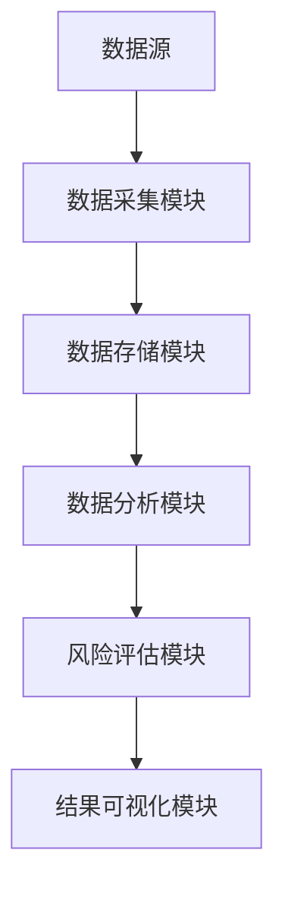

                 


# 彼得林奇的"价值陷阱"在新能源汽车行业中的识别指标

> 关键词：价值陷阱，新能源汽车行业，财务指标，市场竞争力，政策影响，技术评估，投资风险

> 摘要：本文探讨了彼得林奇提出的“价值陷阱”概念在新能源汽车行业的应用，通过分析财务指标、市场竞争力、政策环境和技术创新等关键因素，识别潜在的价值陷阱，并提供了一套系统化的识别方法和数学模型，帮助投资者和企业避免误判，优化投资决策。

---

# 第一部分：背景介绍

## 第1章：价值陷阱的核心概念

### 1.1 价值陷阱的定义与特征

#### 1.1.1 价值陷阱的定义
价值陷阱是彼得林奇在其投资理论中提出的一个概念，指的是那些看似便宜但实际存在严重问题的企业或投资标的。这些标的通常会误导投资者，使其误判其价值，最终导致损失。

#### 1.1.2 价值陷阱的核心特征
- **表面 cheap**：表面上看，企业的市盈率、市净率等估值指标低于行业平均水平。
- **隐藏问题**：企业可能存在财务困境、市场需求下降、政策风险、技术落后等问题。
- **误导性信号**：一些关键指标看似良好，但掩盖了企业的潜在风险。

#### 1.1.3 价值陷阱的形成机制
价值陷阱的形成通常与行业周期、市场波动和企业自身问题密切相关。例如，行业处于下行周期时，企业可能通过降价或减少研发投入来维持表面的盈利能力，但这种策略可能掩盖了长期的竞争力下降问题。

---

### 1.2 新能源汽车行业的价值陷阱识别

#### 1.2.1 新能源汽车行业的现状与挑战
- **行业增长迅速**：新能源汽车行业近年来增长迅速，吸引了大量资本和企业进入。
- **竞争激烈**：行业内竞争日益激烈，企业盈利能力受到挤压。
- **政策依赖**：行业高度依赖政府补贴和政策支持，政策变化可能对行业产生重大影响。

#### 1.2.2 价值陷阱在新能源汽车行业的表现形式
- **虚假的财务指标**：企业可能通过调整会计准则或隐藏成本来虚增利润。
- **技术落后**：部分企业可能在技术上落后，无法应对行业的技术变革。
- **市场需求下降**：部分企业可能因为产品定位不当或市场需求变化而面临销售困境。

#### 1.2.3 识别价值陷阱的重要性
在新能源汽车行业中识别价值陷阱，可以帮助投资者和企业管理者避免误判，优化投资决策，降低风险。

---

# 第二部分：价值陷阱的构成要素与联系

## 第2章：价值陷阱的构成要素

### 2.1 价值陷阱的关键指标

#### 2.1.1 财务指标
- **市盈率（P/E）**：衡量企业股价与盈利之间的关系。
- **市净率（P/B）**：衡量企业股价与资产之间的关系。
- **毛利率**：反映企业产品盈利能力。
- **净利率**：衡量企业整体盈利能力。

#### 2.1.2 行业竞争力
- **市场份额**：企业在市场中的占有率。
- **竞争对手分析**：分析竞争对手的优劣势。
- **技术创新**：企业的研发投入和技术储备。

#### 2.1.3 政策环境
- **政府补贴**：政府对新能源汽车行业的支持政策。
- **政策变化**：政策的调整对企业的影响。
- **行业标准**：行业的技术标准和法规要求。

#### 2.1.4 技术创新
- **研发投入**：企业的研发投入占比。
- **技术储备**：企业的技术专利和储备。
- **技术路线**：企业的技术发展方向。

#### 2.1.5 市场需求
- **市场规模**：行业整体市场规模。
- **消费者偏好**：消费者对产品的偏好和需求变化。
- **市场增长率**：行业的增长速度。

### 2.2 价值陷阱构成要素的联系

#### 2.2.1 财务指标与行业竞争力的关系
财务指标是行业竞争力的重要体现，但单独的财务指标无法全面反映企业的竞争力。例如，高毛利率可能掩盖了市场需求下降的问题。

#### 2.2.2 技术创新与市场需求的互动
技术创新可以提升企业的市场竞争力，但市场需求的变化也会反过来影响技术创新的方向和效果。

#### 2.2.3 政策环境对企业的长期影响
政策环境对企业的生存和发展有重要影响，尤其是在新能源汽车行业，政策补贴和技术标准的变化可能对企业的财务状况和市场竞争力产生重大影响。

---

# 第三部分：价值陷阱的识别算法

## 第3章：价值陷阱的识别算法

### 3.1 数据挖掘与分析

#### 3.1.1 数据收集与预处理
- **数据来源**：包括企业财务数据、行业研究报告、政策文件等。
- **数据清洗**：去除重复数据、处理缺失值、标准化数据。

#### 3.1.2 关键指标的特征提取
- **财务指标分析**：分析毛利率、净利率等指标的变化趋势。
- **市场竞争力分析**：分析市场份额和竞争对手的情况。
- **政策环境分析**：分析政策变化对企业的影响。

### 3.2 算法原理讲解

#### 3.2.1 算法流程
1. 数据收集与预处理。
2. 特征提取与指标分析。
3. 建立数学模型进行风险评估。
4. 结果分析与决策。

#### 3.2.2 数学模型
$$
风险评分 = \sum_{i=1}^{n} (权重_i \times 指标_i)
$$
其中，$权重_i$ 是各个指标的权重，$指标_i$ 是各个指标的评分。

---

# 第四部分：数学模型

## 第4章：数学模型

### 4.1 价值陷阱风险评分系统

#### 4.1.1 模型构建
$$
风险评分 = \sum_{i=1}^{n} (权重_i \times 指标_i)
$$

#### 4.1.2 指标权重分配
- 财务指标：权重 0.4
- 市场竞争力：权重 0.3
- 技术创新：权重 0.2
- 政策环境：权重 0.1

### 4.2 风险评估模型

#### 4.2.1 风险评估公式
$$
风险等级 = \begin{cases}
低风险 & \text{if 风险评分 < 60} \\
中风险 & \text{if 60 ≤ 风险评分 < 80} \\
高风险 & \text{if 风险评分 ≥ 80}
\end{cases}
$$

---

# 第五部分：系统分析与架构设计

## 第5章：系统分析与架构设计

### 5.1 系统功能设计

#### 5.1.1 系统架构
- **数据采集模块**：负责收集企业财务数据、行业报告、政策文件等。
- **数据分析模块**：对数据进行清洗、特征提取和建模分析。
- **风险评估模块**：根据模型计算风险评分并输出结果。
- **可视化模块**：将分析结果以图表形式展示。

### 5.2 系统架构图


---

# 第六部分：项目实战

## 第6章：项目实战

### 6.1 案例分析

#### 6.1.1 案例背景
某新能源汽车企业，财务指标显示毛利率较高，但市场需求下降，政策补贴减少。

#### 6.1.2 数据分析
- 财务指标：毛利率 25%，净利率 5%。
- 市场竞争力：市场份额下降 10%。
- 技术创新：研发投入占比 3%，专利数量少。

#### 6.1.3 风险评分
$$
风险评分 = 0.4 \times 25 + 0.3 \times 20 + 0.2 \times 10 + 0.1 \times 15 = 20.5
$$

风险等级：中风险。

### 6.2 代码实现

#### 6.2.1 环境安装
- Python 3.8+
- 数据处理库：Pandas、NumPy
- 可视化库：Matplotlib、Seaborn
- 算法库：Scikit-learn

#### 6.2.2 核心代码
```python
import pandas as pd
import numpy as np

# 数据加载
data = pd.read_csv('new_energy_car_data.csv')

# 特征提取
features = data[['毛利率', '净利率', '市场份额', '研发投入占比', '专利数量']]
target = data['风险等级']

# 模型训练
from sklearn.linear_model import LinearRegression
model = LinearRegression()
model.fit(features, target)

# 风险评分计算
new_case = [[25, 5, 20, 10, 15]]
risk_score = model.predict(new_case)
print(risk_score)
```

---

# 第七部分：最佳实践与总结

## 第7章：最佳实践

### 7.1 投资建议
- **关注财务指标**：避免仅关注表面的估值指标，要深入分析企业的盈利能力。
- **重视技术创新**：选择具有技术优势的企业，避免技术落后的企业。
- **关注政策变化**：及时了解政策变化，避免因政策调整而遭受损失。

### 7.2 小结
在新能源汽车行业中识别价值陷阱，需要综合考虑财务指标、市场竞争力、政策环境和技术创新等多个因素。通过系统化的识别方法和数学模型，可以帮助投资者和企业管理者做出更明智的决策。

### 7.3 注意事项
- 风险评分模型仅供参考，实际投资需结合市场变化和企业实际情况。
- 数据分析需结合行业专家意见，避免片面判断。

### 7.4 拓展阅读
- 彼得林奇的《价值投资入门》
- 新能源汽车行业的深度研究报告

---

# 结语

识别价值陷阱是新能源汽车行业中的一项重要任务，通过系统化的分析和数学模型的构建，可以帮助投资者和企业避免误判，优化投资决策。希望本文的内容能够为读者提供有价值的参考和启发。

