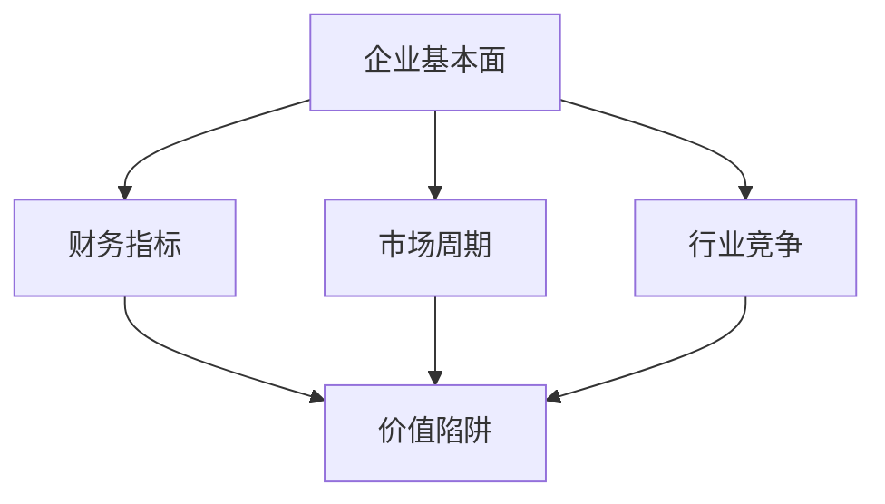
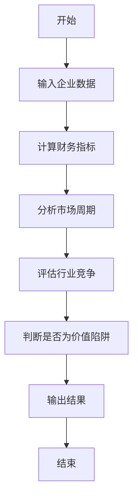
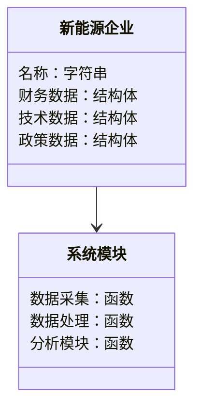
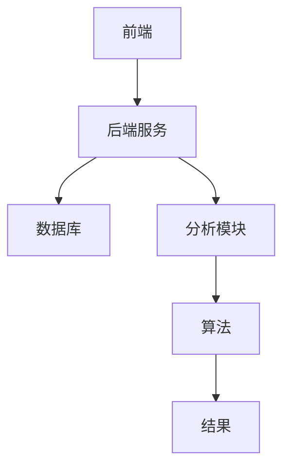
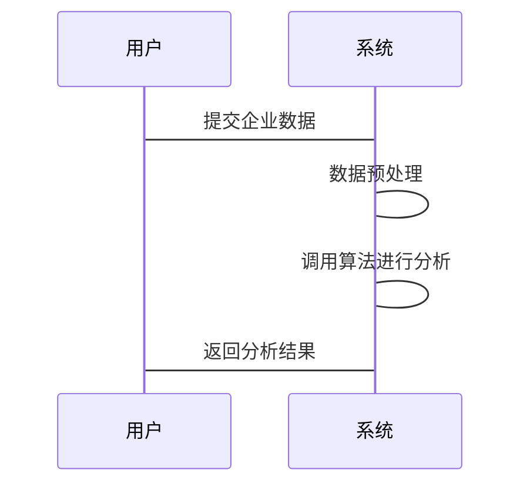

                 


# 彼得林奇的"价值陷阱"在新能源行业中的识别方法

## 关键词
- 彼得林奇、价值陷阱、新能源行业、财务指标分析、技术分析、行业政策、投资策略

## 摘要
本文深入探讨了彼得林奇的“价值陷阱”理论在新能源行业中的应用。通过分析新能源行业的特点和挑战，结合财务指标、技术实力和行业政策等因素，设计了一种识别价值陷阱的算法。本文还详细讲解了系统架构设计和项目实战案例，为投资者提供了实用的识别方法和策略建议。

## 第一部分: 背景介绍与核心概念

### 第1章: 价值陷阱的基本概念

#### 1.1 价值陷阱的定义与特征
- **1.1.1 价值陷阱的定义**
  价值陷阱是指那些表面上看似便宜，但实际上存在严重问题，无法长期盈利的公司或投资标的。这些公司可能因为短期的市场波动或虚假的财务数据而被误判。

- **1.1.2 价值陷阱的核心特征**
  - 财务数据虚假或不可持续
  - 市场周期性波动掩盖了真实风险
  - 行业竞争激烈，技术落后或创新不足

- **1.1.3 价值陷阱的边界与外延**
  价值陷阱的外延包括财务造假、政策风险和市场竞争等多重因素，其边界在于如何准确识别和预测这些因素对投资标的长期影响。

#### 1.2 彼得·林奇的"价值陷阱"理论
- **1.2.1 彼得·林奇的投资者理念**
  彼得·林奇强调长期投资和基本面分析，认为投资者应选择那些具有持续竞争优势和良好管理的公司。

- **1.2.2 价值陷阱在投资中的表现**
  价值陷阱通常表现为低估值但高风险，投资者容易被表面的低市盈率或低市净率所迷惑，忽视了公司的实际经营问题。

- **1.2.3 价值陷阱的识别与规避**
  通过深入分析公司的财务数据、行业地位和技术实力，可以有效识别和规避价值陷阱。

#### 1.3 新能源行业的现状与挑战
- **1.3.1 新能源行业的定义与范围**
  新能源行业包括太阳能、风能、生物质能、电动汽车、储能技术等领域，是一个快速发展的行业。

- **1.3.2 新能源行业的投资机会**
  新能源行业具有广阔的市场前景和政策支持，是未来经济发展的重要方向。

- **1.3.3 新能源行业中的价值陷阱**
  新能源行业也存在许多价值陷阱，如技术落后、政策变化、财务造假等问题。

### 第2章: 新能源行业中的价值陷阱识别

#### 2.1 新能源行业的主要参与者
- **2.1.1 上游资源企业**
  包括原材料供应企业，如锂、镍等金属的供应商。

- **2.1.2 中游制造企业**
  包括电池制造、设备制造等企业。

- **2.1.3 下游应用企业**
  包括新能源汽车、电站运营等企业。

#### 2.2 新能源行业的关键指标分析
- **2.2.1 财务指标分析**
  - 营业收入增长率
  - 净利润率
  - 负债率

- **2.2.2 行业政策分析**
  - 政府补贴政策
  - 环保政策
  - 产业扶持政策

- **2.2.3 技术创新分析**
  - 研发投入比例
  - 技术专利数量
  - 技术领先地位

#### 2.3 价值陷阱在新能源行业的具体表现
- **2.3.1 财务造假与虚假增长**
  公司通过虚假销售或虚增收入来掩盖实际的经营问题。

- **2.3.2 政策风险与市场波动**
  政策变化可能导致行业的重大调整，部分企业难以适应政策变化。

- **2.3.3 技术落后与市场竞争**
  技术创新不足的企业在激烈竞争中难以生存，容易成为价值陷阱。

## 第二部分: 核心概念与联系

### 第3章: 价值陷阱的核心概念原理

#### 3.1 价值陷阱的核心要素
- **3.1.1 企业基本面分析**
  包括财务状况、盈利能力、管理团队等因素。

- **3.1.2 市场周期分析**
  包括行业的周期性波动和市场趋势。

- **3.1.3 行业竞争分析**
  包括市场竞争格局、企业市场份额等。

#### 3.2 价值陷阱的属性特征对比
- **3.2.1 表格对比：价值陷阱与非价值陷阱的特征**
  | 特性         | 价值陷阱         | 非价值陷阱         |
  |--------------|------------------|--------------------|
  | 财务指标      | 虚假或不可持续    | 真实且可持续        |
  | 技术实力      | 落后或创新不足    | 具有技术优势        |
  | 行业政策      | 政策风险大        | 政策支持稳定        |

- **3.2.2 图表分析：价值陷阱的核心要素关系**
  图表展示了企业基本面、市场周期和行业竞争三者之间的相互作用关系。

#### 3.3 ER实体关系图


## 第三部分: 算法原理讲解

### 第4章: 价值陷阱识别算法

#### 4.1 算法原理
- **4.1.1 算法目标**
  根据企业的财务数据、行业政策和技术实力，判断其是否为价值陷阱。

- **4.1.2 算法步骤**
  1. 数据预处理：清洗和标准化数据。
  2. 财务指标评分：根据各项财务指标对企业的财务状况进行评分。
  3. 技术实力评分：根据技术专利数量和研发投入比例进行评分。
  4. 行业政策评分：根据政策支持力度和政策风险进行评分。
  5. 综合评分：将各项评分按权重相加，综合判断是否为价值陷阱。

- **4.1.3 算法输入与输出**
  - 输入：企业的财务数据、技术数据和行业政策数据。
  - 输出：是否为价值陷阱的判断结果。

#### 4.2 算法流程图


#### 4.3 算法实现代码
```python
def identify_value_traps(company_data):
    # 数据预处理
    cleaned_data = preprocess_data(company_data)
    
    # 财务指标评分
    financial_score = calculate_financial_score(cleaned_data)
    
    # 技术实力评分
    tech_score = calculate_tech_score(cleaned_data)
    
    # 行业政策评分
    policy_score = calculate_policy_score(cleaned_data)
    
    # 综合评分
    total_score = financial_score * 0.4 + tech_score * 0.3 + policy_score * 0.3
    
    # 判断是否为价值陷阱
    if total_score < 0.6:
        return "是"
    else:
        return "否"

def preprocess_data(data):
    # 数据清洗和标准化
    pass

def calculate_financial_score(data):
    # 财务指标评分
    pass

def calculate_tech_score(data):
    # 技术实力评分
    pass

def calculate_policy_score(data):
    # 行业政策评分
    pass
```

#### 4.4 算法数学模型
$$
\text{综合评分} = \alpha \times \text{财务指标} + \beta \times \text{技术实力} + \gamma \times \text{行业政策}
$$
其中，$$\alpha + \beta + \gamma = 1$$，权重根据实际情况调整。

## 第四部分: 系统分析与架构设计方案

### 第5章: 问题场景介绍

#### 5.1 问题场景
在新能源行业中，投资者需要准确识别价值陷阱，以避免因短期误判而造成重大损失。

### 第5.2 系统功能设计

#### 5.2.1 领域模型


#### 5.2.2 系统架构设计


#### 5.2.3 系统接口设计
- 数据接口：从公开数据源获取企业的财务、技术和政策数据。
- 分析接口：调用算法进行分析，并返回结果。

#### 5.2.4 系统交互流程


## 第五部分: 项目实战

### 第6章: 项目实战

#### 6.1 环境安装
- 安装Python、Flask、MongoDB等工具。

#### 6.2 核心代码实现
```python
from flask import Flask, request, jsonify
import pymongo

app = Flask(__name__)
client = pymongo.MongoClient('mongodb://localhost:27017/')
db = client['new_energy']

@app.route('/identify', methods=['POST'])
def identify():
    data = request.json
    company_data = preprocess_data(data)
    result = identify_value_traps(company_data)
    return jsonify({'result': result})

if __name__ == '__main__':
    app.run(debug=True)
```

#### 6.3 案例分析
选择一家新能源公司，分析其财务、技术和政策数据，判断其是否为价值陷阱。

#### 6.4 项目总结
通过实际案例分析，验证算法的有效性，并总结经验教训。

## 第六部分: 最佳实践 tips

### 第7章: 最佳实践 tips

#### 7.1 小结
- 准确识别价值陷阱需要综合考虑财务、技术和政策等多个因素。
- 算法模型需要根据实际情况进行调整和优化。

#### 7.2 注意事项
- 数据来源必须可靠，避免因数据错误导致误判。
- 定期更新模型参数，以适应市场变化。

#### 7.3 拓展阅读
- 彼得·林奇的《投资之道》
- 新能源行业的相关研究报告

## 结语
通过本文的系统分析和实战案例，投资者可以更好地识别新能源行业中的价值陷阱，制定更科学的投资策略。未来，随着新能源行业的不断发展，识别价值陷阱的方法和工具也将不断优化和创新。

