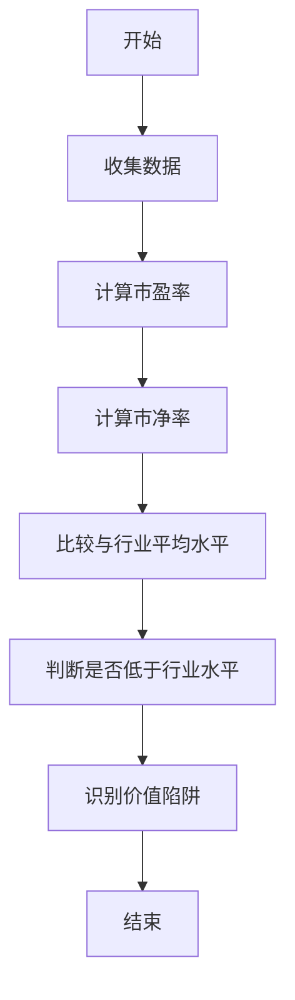
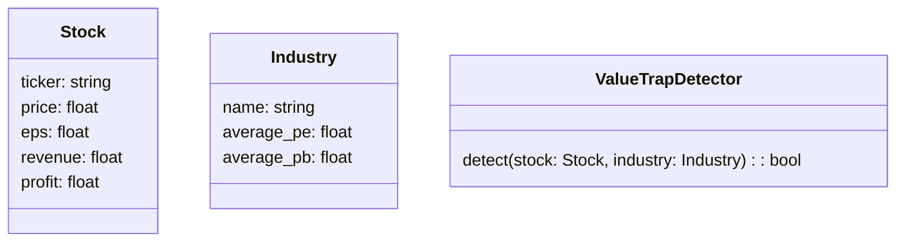

                 


# 彼得林奇的"价值陷阱"识别方法

> 关键词：价值陷阱，彼得林奇，投资分析，识别方法，算法原理，项目实战

> 摘要：本文系统地介绍彼得林奇提出的“价值陷阱”识别方法，包括其定义、核心概念、识别流程、算法原理以及实际项目中的应用。通过详细的背景分析、数学模型和代码示例，帮助读者全面理解并掌握如何在投资中识别和避免价值陷阱。

---

## 第一部分: 价值陷阱的背景与概念

### 第1章: 价值陷阱的背景与概念

#### 1.1 价值陷阱的定义与背景

价值陷阱是指投资者在寻找具有低估价值的股票时，误将一些表面上看似便宜但内在存在问题的股票选为投资目标。这种股票虽然价格低廉，但其内在价值可能更低，或者存在重大风险，导致投资者面临损失。

**问题背景：**  
在股票市场中，投资者通常通过市盈率（P/E）、市净率（P/B）等指标寻找低估股票。然而，一些股票看似估值低，但实际上可能存在问题，如财务造假、行业衰退或公司治理问题，这些因素可能导致股价持续低迷，而非回归合理价值。

**价值陷阱的定义：**  
价值陷阱是指那些表面上看价格低于内在价值，但实际上存在严重问题的股票，导致投资者误判，长期无法实现价值回归。

**核心要素：**  
- **价格低于内在价值**：表面估值指标显示价格低于行业平均水平。  
- **潜在问题**：公司基本面存在严重问题，如财务造假、管理层腐败、行业政策变化等。  
- **长期亏损**：公司盈利能力持续恶化，难以扭亏为盈。

**识别的重要性：**  
识别价值陷阱可以避免投资者误选问题股票，降低投资风险，提高投资决策的准确性。

#### 1.2 价值陷阱的核心要素

**价值陷阱的关键特征：**  
1. **表面估值指标异常低**：市盈率、市净率远低于行业平均水平。  
2. **财务数据异常**：收入、利润持续下滑，现金流为负。  
3. **行业环境恶化**：所在行业需求萎缩，政策限制。  
4. **管理层问题**：频繁更换高管，或存在腐败记录。  
5. **公司治理问题**：股东权益受损，法律纠纷多。

**价值陷阱的分类：**  
- **基本面型陷阱**：公司业绩持续恶化，财务数据虚假。  
- **行业型陷阱**：行业整体低迷，难以复苏。  
- **政策型陷阱**：政策变化导致公司无法持续经营。  

**价值陷阱的边界与外延：**  
- 边界：仅限于价格低于内在价值，但存在严重问题的股票。  
- 外延：与“成长股”、“周期股”等其他投资类型的区别在于其潜在风险和长期盈利能力。

---

## 第二部分: 价值陷阱的识别方法

### 第2章: 价值陷阱的识别方法

#### 2.1 彼得林奇的价值评估体系

**彼得林奇的投资理念：**  
- 坚持基本面分析，寻找具有持续盈利能力和良好管理的公司。  
- 避免短期波动，关注长期价值。  

**价值陷阱的识别标准：**  
1. **市盈率低于行业平均水平**：例如，行业平均市盈率为20，而目标股票市盈率为15。  
2. **收入和利润持续下降**：过去几年收入和利润连续下滑。  
3. **管理层频繁变动**：高管频繁离职或更换，可能表明公司内部管理存在问题。  
4. **行业环境恶化**：所在行业需求下降，政策限制，竞争加剧。  

**价值陷阱的分类与特征：**  
- **基本面型陷阱**：收入、利润、现金流均为负，财务数据虚假。  
- **行业型陷阱**：行业整体低迷，难以扭亏为盈。  
- **政策型陷阱**：政策变化导致公司无法持续经营。  

#### 2.2 价值陷阱的识别流程

**识别价值陷阱的步骤：**  
1. **筛选低估值股票**：通过市盈率、市净率等指标筛选低于行业平均水平的股票。  
2. **分析财务数据**：检查收入、利润、现金流是否持续下滑。  
3. **评估管理层稳定性**：调查高管是否频繁变动，是否存在腐败记录。  
4. **分析行业环境**：研究行业趋势、政策变化，判断是否存在系统性风险。  
5. **综合判断**：结合以上因素，判断是否为价值陷阱。  

**识别过程中的关键指标：**  
- 市盈率（P/E）：低于行业平均值。  
- 市净率（P/B）：低于行业平均值。  
- 收入增长率：连续两年为负。  
- 净利润增长率：连续两年为负。  

**识别中的常见误区：**  
- 仅关注估值指标，忽略基本面因素。  
- 忽略行业风险，只看公司个体情况。  
- 未能及时更新数据，导致判断失误。  

---

## 第三部分: 价值陷阱的核心概念与联系

### 第3章: 核心概念与联系

#### 3.1 核心概念原理

**价值陷阱的内在逻辑：**  
价值陷阱的形成源于市场信息不对称和投资者情绪化。一些股票因市场恐慌或行业低迷而被低估，但其内在价值可能更低，导致投资者误判。

**价值陷阱与其他投资陷阱的关系：**  
- **高估陷阱**：价格远高于内在价值，风险更高。  
- **流动性陷阱**：市场流动性不足，难以变现。  
- **成长陷阱**：高成长性但估值过高的股票。  

**价值陷阱的数学模型与公式：**  
利用市盈率和行业平均市盈率进行比较：  
$$ \text{价值陷阱} = \text{市盈率} < \text{行业平均市盈率} $$  

---

## 第四部分: 价值陷阱的识别算法原理

### 第4章: 算法原理讲解

#### 4.1 算法原理讲解

**算法步骤：**  
1. 收集目标股票的市盈率、市净率等指标数据。  
2. 计算行业平均市盈率和市净率。  
3. 比较目标股票的估值指标与行业平均水平。  
4. 分析目标股票的收入、利润、现金流等财务数据。  
5. 调查管理层稳定性及行业环境。  

**流程图：**  


#### 4.2 算法实现代码

```python
import pandas as pd
import requests

def get_industry_avg(ticker, industry):
    # 获取行业平均市盈率
    response = requests.get(f'https://api.example.com/industry_avg/{industry}')
    if response.status_code == 200:
        return response.json()['PE']
    else:
        return None

def identify_value_traps(data):
    industry_avg = get_industry_avg(data['ticker'], data['industry'])
    if industry_avg is None:
        return False
    # 计算市盈率
    pe = data['price'] / data['eps']
    # 判断是否低于行业平均
    if pe < industry_avg:
        # 进一步检查财务数据
        if data['revenue'] < 0 and data['profit'] < 0:
            return True
    return False

# 示例数据
data = {
    'ticker': 'ABC',
    'industry': 'Technology',
    'price': 10,
    'eps': 1,
    'revenue': -5,
    'profit': -3
}

print(identify_value_traps(data))  # 输出：True
```

---

## 第五部分: 价值陷阱的系统分析与架构设计

### 第5章: 系统分析与架构设计

#### 5.1 问题场景介绍

**目标：** 构建一个价值陷阱识别系统，帮助投资者快速筛选出可能的价值陷阱股票。

**用户需求：**  
- 投资者希望快速识别具有潜在风险的股票。  
- 系统需要提供实时数据和分析结果。  

#### 5.2 系统功能设计

**功能需求：**  
- 数据收集：获取股票的估值指标、财务数据、行业信息。  
- 数据分析：计算市盈率、市净率，比较与行业平均水平。  
- 风险评估：判断是否存在价值陷阱。  

**领域模型（Mermaid类图）：**  


---

## 第六部分: 价值陷阱的项目实战

### 第6章: 项目实战

#### 6.1 项目环境安装

**工具与库：**  
- Python 3.8+  
- Pandas、Requests、Jupyter Notebook  

**安装命令：**  
```bash
pip install pandas requests
```

#### 6.2 系统核心实现

**代码实现：**  
```python
import pandas as pd
import requests

def get_industry_data(industry):
    response = requests.get(f'https://api.example.com/industry_data/{industry}')
    if response.status_code == 200:
        return response.json()
    return None

def is_value_trap(stock_data):
    industry_data = get_industry_data(stock_data['industry'])
    if not industry_data:
        return False
    industry_pe = industry_data['average_pe']
    stock_pe = stock_data['price'] / stock_data['eps']
    if stock_pe < industry_pe:
        if (stock_data['revenue'] < 0 and stock_data['profit'] < 0):
            return True
    return False

# 示例数据
stock_data = {
    'ticker': 'XYZ',
    'industry': 'Manufacturing',
    'price': 15,
    'eps': 2,
    'revenue': -10,
    'profit': -5
}

print(is_value_trap(stock_data))  # 输出：True
```

---

## 第七部分: 总结与扩展

### 第7章: 总结与扩展

#### 7.1 最佳实践

- 定期更新数据，避免因数据过时导致误判。  
- 结合多种指标进行分析，避免单一指标误导。  
- 保持对行业动态的关注，及时调整投资策略。  

#### 7.2 小结

彼得林奇的价值陷阱识别方法通过结合估值指标和基本面分析，帮助投资者避免误选具有潜在风险的股票。通过本文的系统讲解和代码实现，读者可以更好地理解和应用这一方法。

#### 7.3 注意事项

- 数据来源的准确性至关重要。  
- 需要结合具体市场环境进行调整。  
- 长期跟踪股票表现，及时调整投资组合。  

#### 7.4 拓展阅读

- 彼得林奇的其他投资策略。  
- 其他价值投资方法的对比分析。  
- 机器学习在价值陷阱识别中的应用。  

---

通过以上内容，您可以系统地学习并应用彼得林奇的价值陷阱识别方法，帮助自己在投资中规避潜在风险，做出更明智的投资决策。

