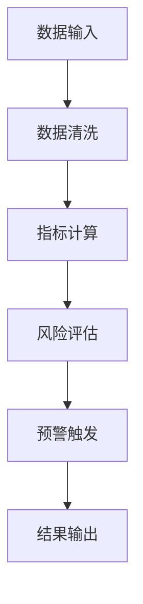

                 


# 彼得林奇的"价值陷阱"预警系统

## 关键词：价值陷阱，彼得林奇，预警系统，投资策略，风险管理，数据分析

## 摘要：  
价值陷阱是价值投资中需要特别警惕的风险之一，彼得·林奇作为全球著名投资大师，提出了许多有效的识别和规避价值陷阱的方法。本文从价值陷阱的定义、类型、识别方法、预警系统的构建到实际案例分析，全面探讨如何利用彼得林奇的理论和方法构建一个有效的价值陷阱预警系统。通过数据分析、风险管理、系统设计等技术手段，结合投资心理学和实际案例，为投资者提供一套科学、实用的价值陷阱预警方案。

---

# 目录大纲

## 第一部分：价值陷阱的背景与概念

### 第1章：价值投资与彼得·林奇的理论基础

- 1.1 价值投资的核心理念  
  - 1.1.1 价值投资的定义与起源  
  - 1.1.2 彼得·林奇的价值投资方法  
  - 1.1.3 价值投资的核心原则  

- 1.2 价值陷阱的定义与特征  
  - 1.2.1 价值陷阱的定义  
  - 1.2.2 价值陷阱的核心特征  
  - 1.2.3 价值陷阱与价值投资的区别  

- 1.3 彼得·林奇与价值陷阱的关联  
  - 1.3.1 彼得·林奇的投资风格  
  - 1.3.2 彼得·林奇对价值陷阱的识别方法  
  - 1.3.3 彼得·林奇的经典投资案例  

- 1.4 本章小结  

### 第2章：价值陷阱的类型与识别方法

- 2.1 价值陷阱的主要类型  
  - 2.1.1 基本面型陷阱  
  - 2.1.2 市场情绪型陷阱  
  - 2.1.3 财务造假型陷阱  

- 2.2 价值陷阱的识别指标  
  - 2.2.1 市盈率分析  
  - 2.2.2 市净率分析  
  - 2.2.3 财务指标异常识别  

- 2.3 价值陷阱的识别流程  
  - 2.3.1 数据收集与初步筛选  
  - 2.3.2 财务分析与风险评估  
  - 2.3.3 行业分析与竞争评估  

- 2.4 本章小结  

### 第3章：价值陷阱预警系统的构建方法

- 3.1 预警系统的构建目标  
  - 3.1.1 系统目标概述  
  - 3.1.2 系统设计原则  
  - 3.1.3 系统功能模块  

- 3.2 预警系统的指标体系  
  - 3.2.1 财务指标体系  
  - 3.2.2 市场指标体系  
  - 3.2.3 风险指标体系  

- 3.3 预警系统的构建步骤  
  - 3.3.1 数据采集与清洗  
  - 3.3.2 指标计算与分析  
  - 3.3.3 风险评估与预警触发  

- 3.4 本章小结  

### 第4章：价值陷阱预警系统的实战案例

- 4.1 案例一：某行业价值陷阱识别  
  - 4.1.1 案例背景介绍  
  - 4.1.2 数据收集与分析  
  - 4.1.3 预警系统应用与结果  

- 4.2 案例二：某公司财务造假识别  
  - 4.2.1 案例背景介绍  
  - 4.2.2 数据分析与风险评估  
  - 4.2.3 预警系统应用与结果  

- 4.3 案例三：市场情绪型陷阱识别  
  - 4.3.1 案例背景介绍  
  - 4.3.2 数据分析与预警触发  
  - 4.3.3 预警系统应用与结果  

- 4.4 本章小结  

### 第5章：价值陷阱预警系统的优化与风险管理

- 5.1 预警系统的优化方法  
  - 5.1.1 指标权重优化  
  - 5.1.2 预警模型优化  
  - 5.1.3 系统性能优化  

- 5.2 风险管理策略  
  - 5.2.1 风险分散策略  
  - 5.2.2 风险对冲策略  
  - 5.2.3 风险监控策略  

- 5.3 本章小结  

### 第6章：总结与展望

- 6.1 本书的核心内容总结  
  - 6.1.1 价值陷阱的定义与识别方法  
  - 6.1.2 预警系统的构建与优化  
  - 6.1.3 投资策略与风险管理  

- 6.2 未来的展望  
  - 6.2.1 技术进步对价值陷阱预警的推动  
  - 6.2.2 人工智能在价值陷阱识别中的应用  
  - 6.2.3 投资者教育与风险管理的结合  

- 6.3 本章小结  

---

## 核心概念与联系

### 价值陷阱的实体关系图（ER图）

```mermaid
er
classDiagram
    class 价值陷阱 {
        名称
        类型
        特征
        风险等级
    }
    class 投资者 {
        投资组合
        风险偏好
    }
    class 预警系统 {
        数据输入
        指标计算
        预警触发
    }
    valueTrap <-- 投资者
    valueTrap <-- 预警系统
```

---

## 算法原理

### 价值陷阱预警系统算法流程图



---

## 数学公式

### 预警模型的数学表达

$$ \text{预警触发条件} = \begin{cases} 
\text{是} & \text{如果 } \text{风险指数} > \text{阈值} \\
\text{否} & \text{否则}
\end{cases} $$

其中，风险指数的计算公式为：

$$ \text{风险指数} = \alpha \times \text{市盈率} + \beta \times \text{市净率} + \gamma \times \text{财务异常指标} $$

---

## 系统架构设计

### 系统功能模块


---

## 项目实战

### 环境安装与数据准备

```bash
# 数据准备
# 示例：从CSV文件读取数据
import pandas as pd
data = pd.read_csv('value_trap.csv')
```

### 核心代码实现

```python
import pandas as pd

def calculate_risk_index(data):
    # 示例：计算风险指数
    alpha = 0.4
    beta = 0.3
    gamma = 0.3
    risk_index = alpha * data['市盈率'] + beta * data['市净率'] + gamma * data['财务异常指标']
    return risk_index

def trigger_alarm(risk_index, threshold=0.8):
    # 示例：预警触发条件
    if risk_index > threshold:
        return "触发预警"
    else:
        return "未触发预警"

# 示例运行
data = pd.DataFrame({
    '市盈率': [15, 20, 25, 30],
    '市净率': [1.5, 2.0, 2.5, 3.0],
    '财务异常指标': [0.2, 0.3, 0.4, 0.5]
})
risk_index = calculate_risk_index(data)
data['风险指数'] = risk_index
data['预警结果'] = data['风险指数'].apply(lambda x: trigger_alarm(x))

print(data)
```

---

## 最佳实践与小结

- **最佳实践：**  
  - 定期更新数据，保持预警系统的实时性。  
  - 结合多种指标和模型，提高预警的准确性。  
  - 加强对市场情绪和行业动态的关注，降低误判风险。  

- **注意事项：**  
  - 预警系统只是辅助工具，不能完全依赖。  
  - 投资者需具备一定的市场知识和风险意识。  
  - 系统的参数和模型需要根据实际情况进行调整。  

- **拓展阅读：**  
  - 彼得·林奇的《投资最重要的事情》  
  - 投资心理学相关书籍  

---

通过以上结构，文章将详细探讨彼得·林奇的"价值陷阱"预警系统，从理论到实践，为投资者提供一套科学、实用的投资风险管理方案。

