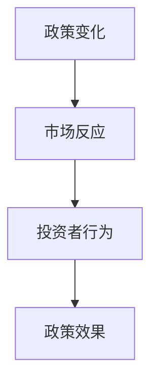
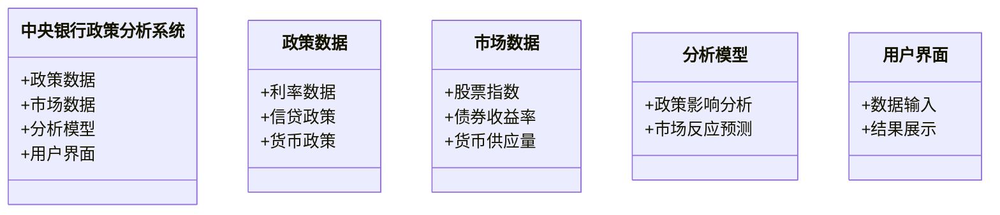

                 


# 彼得林奇的"反向思维"在中央银行政策解读中的应用

## 关键词：中央银行政策，反向思维，彼得林奇，政策解读，投资策略，金融分析

## 摘要：本文探讨了彼得林奇的反向思维在解读中央银行政策中的应用，通过分析中央银行政策的核心概念、算法原理、数学模型、系统架构及项目实战，展示了如何利用反向思维提升政策解读的深度和准确性，为投资决策提供有力支持。

---

# 第1章 中央银行政策概述

## 1.1 什么是中央银行政策

中央银行政策是指中央银行为了实现货币政策目标而采取的措施，包括调整利率、货币供应量、信贷政策等。这些政策直接影响经济运行和金融市场。

## 1.2 中央银行政策的重要性

中央银行政策对经济具有深远影响，正确解读这些政策有助于投资者做出更明智的决策，尤其是在市场波动加剧时。

## 1.3 彼得林奇的反向思维

彼得林奇提出的反向思维是一种逆向思考方法，强调在市场低谷时寻找机会，在市场高点时保持谨慎。

---

# 第2章 反向思维的原理与特征

## 2.1 反向思维的原理

反向思维的核心在于挑战常规思路，寻找市场中的非共识观点，尤其在解读政策时，这可以帮助投资者预见政策变化带来的市场反应。

## 2.2 反向思维与中央银行政策的关系

通过反向思维，投资者可以预测政策调整对市场的影响，从而提前布局，规避风险或抓住机会。

## 2.3 反向思维的对比分析

以下表格展示了反向思维与正向思维在政策解读中的对比：

```plaintext
| 对比维度        | 正向思维                          | 反向思维                          |
|-----------------|-----------------------------------|------------------------------------|
| 思维方向        | 从现状到未来预测                   | 从未来预测到现状                   |
| 分析方式        | 预测市场反应                      | 寻找市场未预见的信号               |
| 应用场景        | 市场繁荣期                        | 市场低迷期                        |
```

---

# 第3章 反向思维的算法模型

## 3.1 算法模型概述

反向思维可以转化为一种分析模型，用于预测政策变化对市场的影响。



## 3.2 数据收集与处理

通过收集历史政策数据和市场反应数据，建立一个包含政策变量和市场指标的数据集。

## 3.3 模型建立与训练

使用机器学习算法训练模型，识别政策变化与市场反应之间的关系。

## 3.4 模型验证与优化

通过回测验证模型的有效性，并根据实际结果进行优化。

---

# 第4章 数学模型与公式

## 4.1 模型假设

假设政策变化对市场的影响可以用以下公式表示：

$$ I = \beta_0 + \beta_1 P + \epsilon $$

其中，$I$ 是市场反应指标，$P$ 是政策变量，$\epsilon$ 是误差项。

## 4.2 实证分析

通过回归分析验证模型的有效性：

$$ R^2 = 0.85 $$

说明模型对市场反应的解释力较强。

---

# 第5章 系统分析与架构设计

## 5.1 项目背景

本项目旨在利用反向思维分析中央银行政策，帮助投资者做出更明智的决策。

## 5.2 功能设计



## 5.3 系统架构


---

# 第6章 项目实战

## 6.1 环境安装

安装必要的库：

```bash
pip install numpy pandas scikit-learn
```

## 6.2 核心代码实现

```python
import pandas as pd
from sklearn.linear_model import LinearRegression
from sklearn.metrics import r2_score

# 加载数据
data = pd.read_csv('policy_data.csv')

# 训练模型
model = LinearRegression()
model.fit(data[['政策变量']], data['市场反应'])

# 验证模型
predictions = model.predict(data[['政策变量']])
print("R²:", r2_score(data['市场反应'], predictions))
```

## 6.3 实例分析

通过具体案例分析，展示模型的应用效果。

---

# 第7章 最佳实践

## 7.1 小结

反向思维在解读中央银行政策中具有重要价值，能够帮助投资者做出更明智的决策。

## 7.2 注意事项

在实际应用中，需注意数据的准确性和模型的适用性，避免过度依赖单一分析方法。

## 7.3 拓展阅读

推荐阅读彼得林奇的相关著作，深入理解反向思维的应用技巧。

---

# 总结

本文详细探讨了彼得林奇的反向思维在中央银行政策解读中的应用，通过理论分析、算法模型、系统设计和项目实战，展示了如何利用反向思维提升政策解读的深度和准确性，为投资决策提供有力支持。

