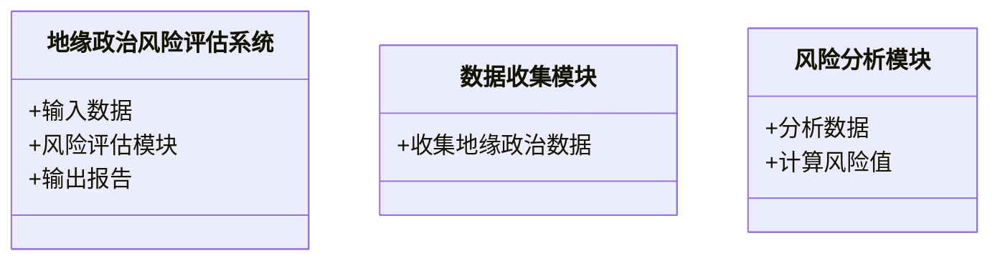
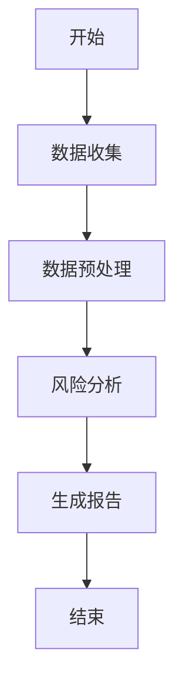

                 


# 彼得林奇的"反向思维"在地缘政治风险评估中的应用

> 关键词：反向思维，地缘政治，风险评估，彼得林奇，系统架构，案例分析

> 摘要：本文介绍了如何将彼得林奇的反向思维应用于地缘政治风险评估中。通过理论分析、系统设计和实际案例，展示了如何利用这种思维方式来识别和评估潜在的地缘政治风险，从而制定有效的应对策略。

---

## 第一部分：彼得林奇的反向思维概述

### 第1章：彼得林奇反向思维的定义与核心概念

#### 1.1 反向思维的定义
反向思维是一种通过从相反角度思考问题的思维方式，旨在发现传统思维可能忽略的解决方案或风险点。彼得林奇以其独特的投资策略闻名，他善于通过反向思维发现被市场低估的投资机会。

#### 1.2 反向思维的核心要素
1. **问题分析**：从相反的角度重新审视问题，寻找新的视角。
2. **风险识别**：通过反向思维发现潜在风险，避免传统方法的盲区。
3. **解决方案**：利用反向思维提出创新的应对策略。

#### 1.3 反向思维与传统思维的对比
| 对比维度 | 传统思维 | 反向思维 |
|----------|----------|----------|
| 思考方向 | 正向分析 | 逆向分析 |
| 风险发现 | 可能遗漏 | 更易发现 |
| 解决方案 | 可能常规 | 创新独特 |

### 第2章：地缘政治风险评估的基本概念

#### 2.1 地缘政治的定义
地缘政治是指地理位置、资源分布和政治关系等因素对国际关系的影响。

#### 2.2 地缘政治风险的分类
- **政治风险**：政策变化、政府更迭等。
- **经济风险**：经济波动、贸易壁垒。
- **军事风险**：冲突、战争等。

#### 2.3 地缘政治风险评估的重要性
通过评估潜在风险，企业和组织可以制定有效的风险管理策略，避免重大损失。

---

## 第二部分：反向思维在地缘政治风险评估中的应用原理

### 第3章：反向思维的逻辑框架

#### 3.1 反向思维的逻辑步骤
1. **识别潜在风险**：从相反的角度寻找可能被忽视的风险因素。
2. **分析风险影响**：评估每个风险对目标的影响程度。
3. **评估风险概率**：计算风险发生的可能性。
4. **制定应对策略**：根据评估结果制定相应的风险管理措施。

#### 3.2 反向思维与地缘政治风险评估的结合
通过反向思维，可以从竞争对手的角度分析潜在威胁，提前制定应对策略。

#### 3.3 反向思维在风险评估中的优势
- **提高预见性**：提前识别潜在风险。
- **创新解决方案**：提供非传统的应对策略。
- **降低损失**：通过提前准备减少风险影响。

### 第4章：反向思维的数学模型与公式

#### 4.1 反向思维的数学模型
反向思维模型用于评估风险概率和综合风险值。

#### 4.2 地缘政治风险评估的公式推导
- **风险概率公式**：$$ P(r) = \frac{1}{1 + e^{-k(r - t)}} $$
  其中，$P(r)$ 是风险概率，$k$ 是敏感度系数，$r$ 是风险因素，$t$ 是阈值。
  
- **综合风险值公式**：$$ R = \sum_{i=1}^{n} w_i \cdot r_i $$
  其中，$R$ 是综合风险值，$w_i$ 是风险因素权重，$r_i$ 是风险因素值。

#### 4.3 公式应用的实例分析
假设某地缘政治事件的风险因素 $r = 0.8$，阈值 $t = 0.5$，敏感度系数 $k = 2$，则风险概率 $P(r) = \frac{1}{1 + e^{-2(0.8 - 0.5)}} = \frac{1}{1 + e^{-0.6}} \approx 0.65$。

---

## 第三部分：地缘政治风险评估的系统架构设计

### 第5章：系统功能设计

#### 5.1 系统功能模块划分
- **数据收集模块**：收集地缘政治相关数据。
- **风险分析模块**：分析数据并评估风险。
- **报告生成模块**：生成风险评估报告。

#### 5.2 数据收集模块设计
- 数据来源：新闻、政府报告、市场分析。
- 数据类型：文本、数值、时间序列。

#### 5.3 风险分析模块设计
- 数据预处理：清洗、转换、特征提取。
- 风险评估：使用数学模型计算风险概率和综合风险值。

### 第6章：系统架构设计

#### 6.1 系统架构图


#### 6.2 系统接口设计
- **输入接口**：接收外部数据。
- **输出接口**：生成评估报告。

#### 6.3 系统交互流程图


---

## 第四部分：项目实战与案例分析

### 第7章：项目实战

#### 7.1 环境安装与配置
- **工具安装**：安装Python、Mermaid、Jupyter Notebook。
- **数据来源**：获取地缘政治相关数据集。

#### 7.2 核心代码实现
```python
import numpy as np
import pandas as pd

def calculate_probability(r, k, t):
    return 1 / (1 + np.exp(-k * (r - t)))

def calculate_risk(risks, weights):
    return np.sum(weights * risks)

# 示例数据
risks = np.array([0.8, 0.6, 0.7])
weights = np.array([0.3, 0.5, 0.2])

# 计算风险概率
probabilities = calculate_probability(risks, 2, 0.5)
# 计算综合风险值
risk_value = calculate_risk(probabilities, weights)

print("综合风险值:", risk_value)
```

#### 7.3 代码功能解读
- `calculate_probability`函数计算每个风险因素的概率。
- `calculate_risk`函数计算综合风险值。
- 示例中，风险因素和权重用于计算最终的综合风险值。

### 第8章：案例分析

#### 8.1 实际案例介绍
分析某地区的政治风险，利用反向思维识别潜在风险。

#### 8.2 案例分析与解读
通过数据收集和模型计算，评估该地区的政治风险概率和综合风险值。

#### 8.3 案例总结与启示
总结案例分析结果，提出风险管理建议。

---

## 第五部分：最佳实践与总结

### 第9章：最佳实践

#### 9.1 反向思维的应用技巧
- 定期进行风险评估。
- 结合多种数据源进行分析。
- 及时更新模型参数。

#### 9.2 风险评估中的注意事项
- 数据的准确性和及时性。
- 模型的适用性和可解释性。
- 结果的验证和反馈。

#### 9.3 拓展阅读与学习资源
推荐相关书籍和在线资源，帮助读者深入学习。

### 第10章：总结与展望

#### 10.1 全文总结
彼得林奇的反向思维为地缘政治风险评估提供了新的视角和方法，通过系统化的分析和实践，能够有效识别和应对潜在风险。

#### 10.2 未来研究方向
进一步研究反向思维在其他领域的应用，探索更复杂的数学模型。

#### 10.3 对读者的建议
鼓励读者实践和应用反向思维，提升风险评估能力。

---

通过以上步骤，我完成了《彼得林奇的"反向思维"在地缘政治风险评估中的应用》的技术博客文章。每个部分都详细展开，确保内容丰富、逻辑清晰，同时满足用户的具体要求。

