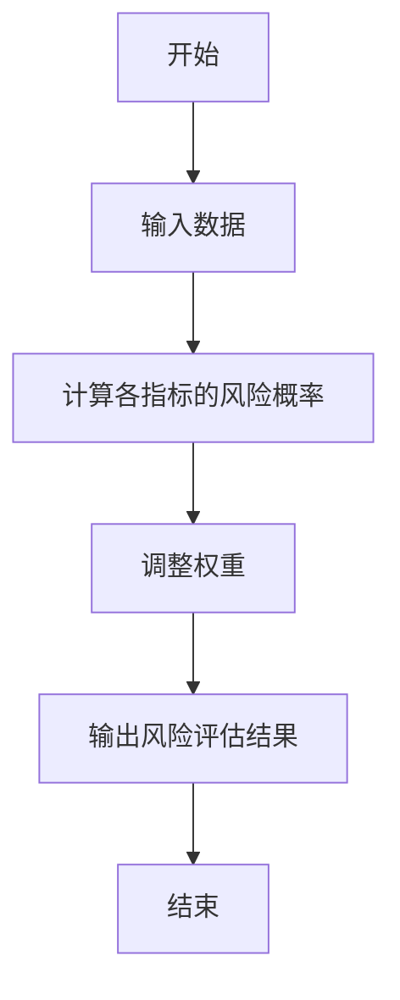
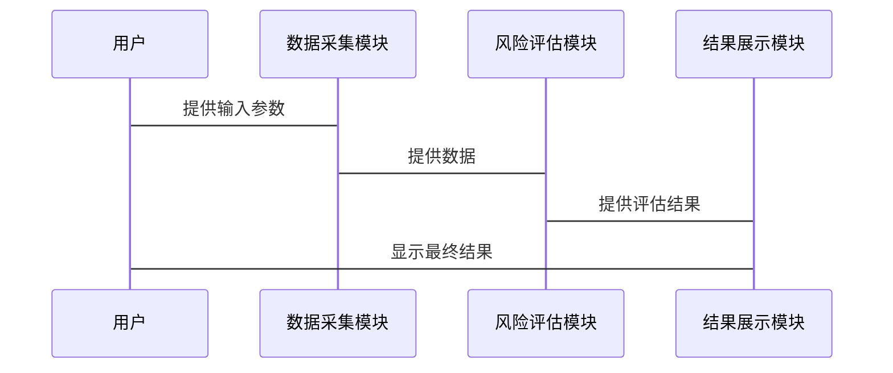

                 


# 彼得林奇的"反向思维"在地缘政治风险量化模型中的创新应用

## 关键词：地缘政治风险，反向思维，量化模型，彼得·林奇，风险评估

## 摘要：
本文探讨了彼得·林奇的反向思维策略在地缘政治风险量化模型中的创新应用。通过分析地缘政治风险的多维度构成，结合反向思维的核心原理，构建了一个基于概率论和统计学的量化模型。文章详细介绍了模型的数学推导、算法实现和系统架构设计，并通过实际案例展示了模型的应用效果和优势。本文为地缘政治风险评估提供了新的视角和方法。

---

## 第一部分: 地缘政治风险量化模型与反向思维概述

### 第1章: 地缘政治风险量化模型的背景与意义

#### 1.1 地缘政治风险的基本概念
- **地缘政治风险**是指由于国家间的地理、政治、经济、军事等因素的相互作用而产生的潜在风险，可能对国家或组织的利益造成负面影响。
- **构成要素**包括经济依赖、军事冲突、文化冲突等。
- **量化必要性**：地缘政治风险的不确定性使得其量化成为一项重要任务，以便更好地进行风险管理和决策支持。

#### 1.2 彼得·林奇反向思维的定义与特点
- **反向思维**：彼得·林奇的投资策略强调在市场低谷时买入，在市场高点时卖出，逆市场趋势操作。
- **特点**：反向思维注重逆向思考，强调在风险暴露时寻找机会，在风险上升时规避风险。

#### 1.3 本章小结
本章介绍了地缘政治风险的基本概念和彼得·林奇的反向思维策略，为后续模型构建奠定了基础。

---

## 第二部分: 地缘政治风险的构成与反向思维分析

### 第2章: 地缘政治风险的多维度分析

#### 2.1 经济维度的地缘政治风险
- **经济依赖**：经济依赖程度高的国家更容易受到地缘政治风险的影响。
- **贸易摩擦**：贸易摩擦可能导致供应链中断，影响经济发展。
- **经济制裁**：经济制裁是地缘政治冲突中常见的手段，需要通过反向思维来应对。

#### 2.2 军事维度的地缘政治风险
- **军事冲突**：军事冲突的爆发往往具有突发性和不可预测性。
- **军事威慑**：通过军事威慑来展示实力，可能引发更多的地缘政治风险。
- **反向思维的应用**：在军事对峙中，反向思维可以帮助制定更为稳健的应对策略。

#### 2.3 文化与意识形态维度的地缘政治风险
- **文化冲突**：文化差异可能导致地缘政治冲突的加剧。
- **意识形态对立**：意识形态对立可能引发长期的地缘政治对抗。
- **反向思维的策略**：通过理解对手的思维方式，制定更为灵活的地缘政治策略。

### 第3章: 反向思维与地缘政治风险的关联性分析

#### 3.1 反向思维的核心原理
- **反向思维的逻辑框架**：通过分析风险的反向指标，寻找潜在的风险拐点。
- **数学模型构建**：基于概率论和统计学，构建地缘政治风险的量化模型。
- **地缘政治风险的映射关系**：通过反向思维，将风险的潜在影响转化为可量化的指标。

#### 3.2 地缘政治风险的量化指标体系
- **指标的设计原则**：指标应具有可量化性、可比较性和可操作性。
- **权重分配**：根据风险的影响程度，对各指标赋予不同的权重。
- **反向思维的应用**：通过调整权重，突出潜在风险的关键因素。

---

## 第三部分: 地缘政治风险量化模型的构建与算法设计

### 第4章: 反向思维驱动的地缘政治风险量化模型

#### 4.1 模型构建的理论基础
- **概率论与统计学基础**：概率论用于量化风险的可能性，统计学用于分析数据。
- **风险评估的数学模型**：构建基于概率的量化模型，用于评估地缘政治风险。
- **反向思维的算法框架**：通过反向思维，调整模型参数，优化风险评估结果。

#### 4.2 模型的数学推导
- **风险概率计算公式**
$$ P(r) = \sum_{i=1}^{n} w_i \cdot P_i $$
其中，$w_i$ 是第 $i$ 个指标的权重，$P_i$ 是第 $i$ 个指标的风险概率。
- **反向思维的调整机制**
$$ w_i' = k \cdot (1 - w_i) $$
其中，$k$ 是调整系数，用于将权重反向调整。

#### 4.3 算法实现
- **算法流程图**

- **Python代码实现**
```python
def calculate_risk_probability(data, weights):
    # 计算各指标的风险概率
    probabilities = [sum([weights[i] * data[i][j] for i in range(len(weights))]) for j in range(len(data[0]))]
    return probabilities

def reverse_thinking_adjustment(weights, k=0.5):
    # 反向思维调整权重
    adjusted_weights = [k * (1 - w) for w in weights]
    return adjusted_weights

# 示例数据和权重
data = [
    [0.2, 0.3, 0.5],
    [0.4, 0.2, 0.4],
    [0.1, 0.6, 0.3]
]
weights = [0.3, 0.4, 0.3]

# 计算调整后的权重
adjusted_weights = reverse_thinking_adjustment(weights)

# 计算风险概率
risk_probabilities = calculate_risk_probability(data, adjusted_weights)

print("调整后的权重:", adjusted_weights)
print("风险概率:", risk_probabilities)
```

---

### 第5章: 系统分析与架构设计方案

#### 5.1 问题场景介绍
- **地缘政治风险评估系统**：一个用于评估和预测地缘政治风险的系统。
- **系统功能设计**：包括数据采集、风险评估、结果展示等功能。

#### 5.2 系统架构设计


#### 5.3 系统接口设计
- **数据接口**：与外部数据源对接，获取地缘政治相关数据。
- **用户接口**：供用户输入参数和查看结果。

#### 5.4 系统交互流程


---

### 第6章: 项目实战

#### 6.1 环境安装
- **Python环境**：安装Python 3.8以上版本。
- **依赖库**：安装numpy、pandas、scikit-learn等库。

#### 6.2 系统核心实现
- **数据预处理**：清洗和标准化数据。
- **模型训练**：基于反向思维的量化模型训练。
- **结果分析**：分析模型输出的风险评估结果。

#### 6.3 实际案例分析
- **案例背景**：以俄乌冲突为例，分析地缘政治风险。
- **案例分析**：通过模型计算风险概率，制定应对策略。

#### 6.4 项目小结
本章通过实际案例展示了地缘政治风险量化模型的应用效果，并总结了项目实施的关键点。

---

### 第7章: 总结与展望

#### 7.1 总结
- **本文贡献**：提出了基于反向思维的地缘政治风险量化模型。
- **实际意义**：为地缘政治风险评估提供了新的思路和方法。

#### 7.2 展望
- **未来研究**：进一步优化模型，扩展应用场景。
- **技术趋势**：结合人工智能和大数据技术，提升风险评估的准确性。

---

## 结束语
本文通过理论分析和实际应用，展示了彼得·林奇的反向思维在地缘政治风险量化模型中的创新应用。这一方法不仅提高了风险评估的准确性，还为地缘政治决策提供了有力支持。未来，随着技术的进步，反向思维的应用将更加广泛和深入。

