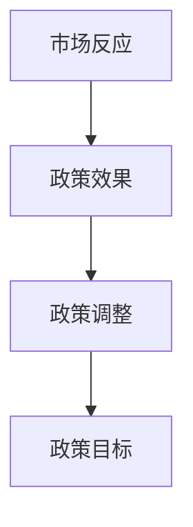
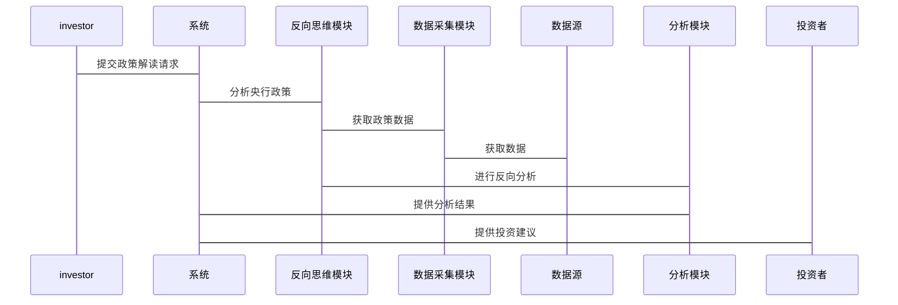

                 


# 彼得林奇的"反向思维"在央行政策解读中的应用

## 关键词：彼得林奇，反向思维，央行政策，货币政策，经济解读，投资策略

## 摘要：本文探讨了彼得林奇的反向思维在解读央行政策中的应用，通过理论分析、数学建模和实战案例，展示了如何运用反向思维来预测和解读货币政策，帮助投资者做出更明智的决策。

## 第1章: 彼得林奇的反向思维概述

### 1.1 反向思维的定义与核心理念

反向思维是一种逆向思考的方法，强调从问题的对立面入手，寻找解决方案。与传统思维不同，反向思维不依赖于常规逻辑，而是通过逆向分析，发现潜在的机会或风险。

#### 1.1.1 什么是反向思维

反向思维的核心在于“反其道而行之”。它不是简单地否定正向思维，而是通过寻找矛盾点或未被充分考虑的角度来解决问题。例如，在投资领域，反向思维意味着在市场低迷时寻找机会，而在市场繁荣时保持警惕。

#### 1.1.2 反向思维的核心理念

反向思维的核心理念包括：
1. **逆向分析**：从结果出发，推导原因。
2. **寻找不对称性**：关注市场中的信息不对称，寻找被低估的机会。
3. **风险管理**：通过反向思维识别潜在风险，提前做好准备。

#### 1.1.3 反向思维在投资中的应用

在投资领域，彼得林奇的反向思维帮助投资者在市场低谷时发现被低估的资产，避免在市场高点盲目跟风。这种方法强调对市场趋势的逆向分析，帮助投资者做出更理性的决策。

### 1.2 央行政策的基本框架

央行政策是国家宏观调控的重要工具，主要通过货币政策和财政政策影响经济运行。理解这些政策的制定和实施机制，是应用反向思维的前提。

#### 1.2.1 央行政策的定义与目标

央行政策是指中央银行为实现特定经济目标而采取的措施，主要目标包括控制通货膨胀、促进就业、保持经济增长和维护金融市场稳定。

#### 1.2.2 主要货币政策工具解析

中央银行常用的货币政策工具包括：
1. **利率政策**：调整基准利率，影响市场资金成本。
2. **货币供应量**：通过公开市场操作调节货币供应量。
3. **存款准备金率**：调整商业银行存款准备金比例，影响信贷扩张。

#### 1.2.3 央行政策的传导机制

央行政策的传导机制通常包括：
1. **利率渠道**：通过调整利率影响企业和个人的借贷行为。
2. **资产价格渠道**：通过影响资产价格引导投资行为。
3. **汇率渠道**：通过影响汇率间接影响出口和进口。

## 第2章: 反向思维在央行政策解读中的应用背景

### 2.1 当前经济环境的复杂性

当前经济环境充满不确定性，全球化、技术变革和地缘政治等多重因素交织，使得央行政策的解读更加复杂。

#### 2.1.1 全球化背景下的经济挑战

全球化导致经济相互依存度提高，使得央行政策的制定和解读需要考虑更多国际因素。

#### 2.1.2 经济周期波动对政策解读的影响

经济周期波动直接影响政策的效果和解读。例如，在经济衰退时，中央银行可能采取宽松政策，而在经济过热时则可能收紧政策。

#### 2.1.3 投资者面临的不确定性

投资者在面对复杂的经济环境时，需要准确解读央行政策，以做出正确的投资决策。

### 2.2 央行政策解读的难点

解读央行政策并非易事，存在诸多挑战。

#### 2.2.1 政策目标与实际效果的差异

中央银行的政策目标与实际效果之间可能存在差距，这需要投资者具备敏锐的洞察力。

#### 2.2.2 政策解读的信息不对称

由于信息不对称，投资者难以全面了解政策制定的细节，增加了解读的难度。

#### 2.2.3 政策工具的多样性与复杂性

中央银行使用的政策工具种类繁多，且不断演变，增加了解读的复杂性。

### 2.3 反向思维的应用价值

反向思维在央行政策解读中的应用价值主要体现在帮助投资者识别市场趋势和潜在风险。

#### 2.3.1 提高投资决策的准确性

通过反向思维，投资者可以更准确地预测政策变化，做出更明智的投资决策。

#### 2.3.2 降低投资风险

反向思维帮助投资者识别潜在风险，提前采取防范措施。

#### 2.3.3 捕捉市场机会

在市场波动中，反向思维帮助投资者发现被低估的投资机会。

## 第3章: 反向思维的核心概念与原理

### 3.1 反向思维的核心概念

反向思维的核心概念包括逻辑框架、与传统思维的对比以及在政策解读中的优势。

#### 3.1.1 反向思维的逻辑框架

反向思维的逻辑框架强调从结果推导原因，寻找问题的对立面。例如，在解读央行政策时，可以从市场反应反推政策效果。

#### 3.1.2 反向思维与传统思维的对比

传统思维注重正向分析，而反向思维强调逆向思考。传统思维可能在市场繁荣时过于乐观，而在市场低迷时过于悲观，而反向思维则帮助投资者在市场周期中保持冷静。

#### 3.1.3 反向思维在政策解读中的优势

反向思维帮助投资者从市场的对立面寻找信息，识别被市场忽视的机会或风险。例如，在市场普遍看空时，反向思维可能提示潜在的买入机会。

### 3.2 反向思维的数学模型

反向思维可以通过数学模型进行表达，帮助投资者量化分析。

#### 3.2.1 反向思维的逻辑框架图（Mermaid流程图）

以下是一个反向思维的逻辑框架图，展示了从结果出发，推导原因的过程。



#### 3.2.2 反向思维的公式化表达

反向思维可以通过数学公式进行表达，例如：

$$反向思维 = 1 - 正向思维$$

其中，正向思维代表传统思维方式，反向思维则代表通过逆向分析得出的结论。

## 第4章: 反向思维在央行政策解读中的具体应用

### 4.1 货币政策的反向解读

#### 4.1.1 利率政策的反向分析

通过反向思维，投资者可以分析利率政策的变化对市场的影响。例如，当市场预期央行将加息时，债券价格可能会下跌。反向思维提示投资者在市场情绪高涨时，需警惕潜在的调整风险。

#### 4.1.2 货币供应量的反向预测

货币供应量的增加通常意味着宽松的货币政策，可能推高资产价格。反向思维提示投资者在货币供应量增加时，需关注潜在的通胀压力。

#### 4.1.3 外汇政策的反向解读

外汇政策的变化可能影响汇率走势。反向思维提示投资者在汇率政策调整时，需关注出口企业的竞争力变化。

### 4.2 财政政策的反向解读

#### 4.2.1 政府支出的反向分析

政府支出的增加通常意味着财政政策的宽松，可能刺激经济增长。反向思维提示投资者在政府支出增加时，需关注财政赤字的可持续性。

#### 4.2.2 税收政策的反向预测

税收政策的变化影响企业的盈利能力和居民的可支配收入。反向思维提示投资者在税收政策调整时，需评估其对相关行业的影响。

#### 4.2.3 财政赤字的反向评估

财政赤字的增加可能引发市场的担忧，影响政府的信用评级。反向思维提示投资者在财政赤字增加时，需关注债券市场的风险。

### 4.3 金融监管的反向解读

#### 4.3.1 监管政策的反向分析

金融监管政策的变化影响金融机构的运营环境。反向思维提示投资者在监管政策收紧时，需关注金融机构的合规成本。

#### 4.3.2 金融机构行为的反向预测

通过反向思维，投资者可以预测金融机构在监管环境变化下的应对措施，例如调整业务结构或增加资本储备。

#### 4.3.3 金融市场的反向评估

金融市场对监管政策的变化通常会有即时反应。反向思维提示投资者在市场反应强烈时，需评估政策的长期影响。

## 第5章: 反向思维在央行政策解读中的系统架构

### 5.1 系统分析与架构设计方案

#### 5.1.1 问题场景介绍

投资者需要在复杂经济环境中准确解读央行政策，做出投资决策。

#### 5.1.2 项目介绍

构建一个基于反向思维的央行政策解读系统，帮助投资者分析政策变化。

#### 5.1.3 系统功能设计（领域模型Mermaid类图）

以下是一个基于反向思维的央行政策解读系统的领域模型类图：

```mermaid
classDiagram

class 投资者 {
    +政策解读
    +市场分析
    +投资决策
}

class 央行政策 {
    +货币政策
    +财政政策
    +金融监管
}

class 系统 {
    +反向思维模块
    +数据采集模块
    +分析模块
}

抽像 class 服务提供者 {
    +提供数据
    +提供分析工具
}

抽像 class 数据源 {
    +政策文件
    +市场数据
}

抽像 class 输出 {
    +投资建议
    +风险提示
}

抽像 class 用户界面 {
    +输入政策
    +查看分析结果
}

抽像 class 数据流 {
    +政策数据
    +市场数据
}

抽像 class 服务流 {
    +数据处理
    +分析请求
}

抽像 class 通知流 {
    +风险提示
    +投资建议
}
```

#### 5.1.4 系统架构设计（Mermaid架构图）

以下是一个基于反向思维的央行政策解读系统的架构图：

```mermaid
container 宏观经济环境 {
    service 经济指标
    service 政策变化
}

container 系统 {
    service 反向思维模块
    service 数据采集模块
    service 分析模块
}

container 用户端 {
    service 投资者
}

macroéconomique 接口到 系统 的接口：经济指标, 政策变化
系统 接口到 投资者的接口：投资建议, 风险提示
```

#### 5.1.5 系统接口设计

系统接口包括：
1. **数据接口**：从数据源获取政策和市场数据。
2. **用户接口**：供投资者输入政策解读请求。
3. **输出接口**：提供投资建议和风险提示。

#### 5.1.6 系统交互（Mermaid序列图）

以下是一个系统交互的Mermaid序列图，展示了投资者如何使用反向思维模块进行政策解读：



### 5.2 项目实战

#### 5.2.1 环境安装

需要安装以下工具：
- **Python**：用于数据分析和建模。
- **Mermaid**：用于绘制图表。
- **Jupyter Notebook**：用于代码实现和可视化。

#### 5.2.2 系统核心实现源代码

以下是一个基于反向思维的央行政策解读系统的Python代码实现示例：

```python
# 反向思维模块
def reverse_thinking(policy_change):
    # 通过反向思维分析政策变化
    analysis = 1 - policy_change
    return analysis

# 数据采集模块
def collect_data():
    # 从数据源获取政策数据
    import requests
    response = requests.get('https://example.com/policy_data')
    data = response.json()
    return data

# 分析模块
def analyze_policy(data):
    # 对政策数据进行分析
    import pandas as pd
    df = pd.DataFrame(data)
    result = df['policy_change'].apply(lambda x: reverse_thinking(x))
    return result

# 用户界面
def user_interface():
    # 获取用户输入
    policy = input("请输入政策变化：")
    data = collect_data()
    result = analyze_policy({'policy_change': float(policy)})
    print(f"反向思维分析结果：{result.values[0]}")

user_interface()
```

#### 5.2.3 代码应用解读与分析

上述代码实现了一个简单的反向思维分析系统，投资者可以通过输入政策变化，获得反向思维的分析结果。代码包括数据采集、反向思维分析和用户界面三个模块。

### 5.2.4 实际案例分析

例如，当市场预期央行将加息时，投资者可以通过输入加息幅度，获得反向思维的分析结果，评估加息对市场的影响。

### 5.2.5 项目小结

通过反向思维模块，投资者可以更准确地预测央行政策的变化，做出更明智的投资决策。

## 第6章: 反向思维在央行政策解读中的最佳实践

### 6.1 最佳实践 tips

- **保持警惕**：在市场情绪高涨时，保持冷静，避免盲目跟风。
- **关注数据**：密切关注经济数据和政策变化，及时调整投资策略。
- **风险管理**：通过反向思维识别潜在风险，制定有效的风险管理计划。

### 6.2 小结

反向思维是一种强大的工具，帮助投资者在复杂的经济环境中做出更明智的决策。通过系统化的分析和实践，投资者可以更好地解读央行政策，捕捉市场机会，降低投资风险。

### 6.3 注意事项

- **数据质量**：确保数据的准确性和及时性。
- **模型局限性**：认识到反向思维模型的局限性，结合其他分析方法进行综合判断。
- **持续学习**：保持对经济和政策变化的关注，不断提升自身的分析能力。

### 6.4 拓展阅读

推荐阅读彼得林奇的相关著作，深入理解反向思维的应用。同时，可以研究更多关于央行政策的文献，丰富自己的知识储备。

---

通过以上章节的详细讲解，我们可以看到，反向思维在央行政策解读中的应用具有重要的现实意义。投资者通过掌握反向思维的方法，可以更好地理解政策变化，做出更明智的投资决策。希望本文能为投资者提供有价值的参考和启示。

