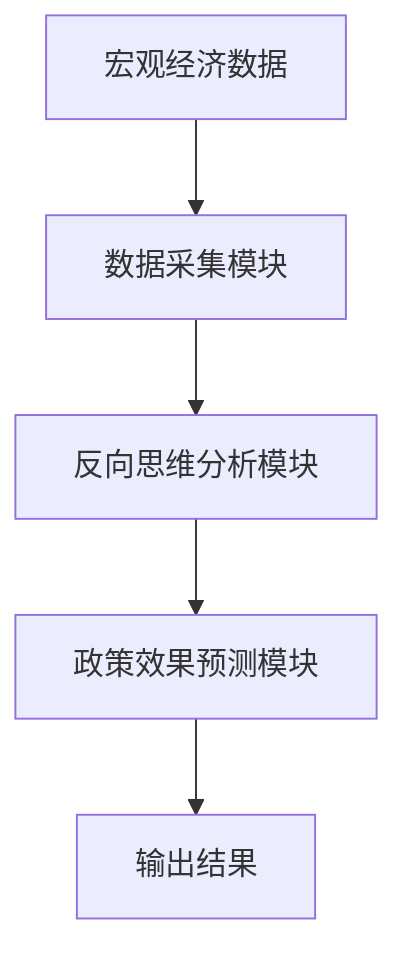
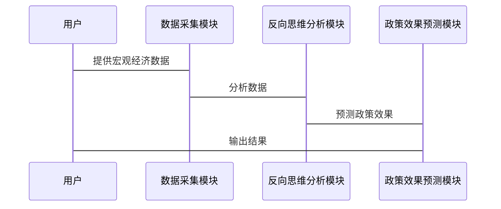

                 


# 彼得林奇的"反向思维"在宏观经济政策解读中的应用

## 关键词：彼得林奇，反向思维，宏观经济政策，政策解读，投资策略

## 摘要：本文探讨了彼得林奇的反向思维在宏观经济政策解读中的应用，通过理论分析和实际案例，展示了如何利用反向思维来提升政策解读的准确性和深度。文章结合宏观经济政策的分类，详细分析了反向思维在货币政策、财政政策和产业政策中的具体应用，并通过系统架构设计和项目实战，验证了反向思维的有效性。

---

# 第一部分: 彼得林奇反向思维概述

## 第1章: 彼得林奇反向思维的定义与核心理念

### 1.1 彼得林奇及其投资理念

#### 1.1.1 彼得林奇的生平简介

彼得·林奇（Peter Lynch）是美国著名投资经理人，以其在共同基金领域的卓越表现而闻名。他在富达投资管理公司管理麦哲伦基金期间，取得了年均29%的回报率，远超市场平均水平。

#### 1.1.2 彼得林奇的投资哲学

彼得林奇强调长期投资和价值发现，认为市场的短期波动不应影响长期投资决策。他主张投资于自己熟悉的公司，并注重对公司基本面的深入分析。

#### 1.1.3 反向思维在投资中的应用

反向思维是指在市场普遍看空时买入，市场普遍看多时卖出。彼得林奇在其投资生涯中多次运用反向思维，成功在市场底部买入，在顶部卖出。

### 1.2 反向思维的定义与特点

#### 1.2.1 反向思维的定义

反向思维是一种与传统思维相反的思考方式，强调逆向分析和判断，特别是在市场情绪极端时，采取与大多数投资者相反的行动。

#### 1.2.2 反向思维的核心特点

- **逆向性**：在市场趋势的反方向寻找机会。
- **独立性**：不盲从市场情绪，独立分析。
- **前瞻性**：提前预判市场变化，抓住转折点。

#### 1.2.3 反向思维与传统思维的对比

| 特性       | 反向思维       | 传统思维       |
|------------|----------------|----------------|
| 判断依据   | 市场反向信号   | 市场顺势信号   |
| 风险态度   | 更倾向于逆市操作 | 更倾向于顺势操作 |
| 时机选择   | 提前布局转折点 | 随大势操作     |

### 1.3 反向思维在宏观经济政策解读中的应用前景

#### 1.3.1 宏观经济政策解读的复杂性

宏观经济政策涉及多目标、多因素的复杂互动，解读难度大，传统方法往往难以捕捉政策效果。

#### 1.3.2 反向思维在政策解读中的优势

通过反向思维，可以提前识别政策效果的变化，捕捉政策调整的拐点，提高解读的准确性。

#### 1.3.3 反向思维应用的挑战与机遇

- **挑战**：政策解读的复杂性增加反向思维应用难度。
- **机遇**：通过反向思维，可以在政策调整初期发现机会，提前布局。

---

## 第2章: 宏观经济政策解读的基本框架

### 2.1 宏观经济政策的分类

#### 2.1.1 货币政策

货币政策通过调整货币供应量和利率影响经济，是宏观经济政策的重要组成部分。

#### 2.1.2 财政政策

财政政策通过政府支出和税收调整经济，与货币政策共同构成宏观调控的两大工具。

#### 2.1.3 产业政策

产业政策通过支持特定产业的发展，促进经济结构优化和产业升级。

### 2.2 宏观经济政策解读的关键要素

#### 2.2.1 政策目标

明确政策的最终目标，如稳定物价、促进就业、平衡国际收支等。

#### 2.2.2 政策工具

分析政策实施的具体工具，如利率调整、财政支出等。

#### 2.2.3 政策效果

评估政策实施后的实际效果，包括直接效果和间接效果。

### 2.3 宏观经济政策解读的复杂性

#### 2.3.1 政策的多目标性

政策往往涉及多个目标，如经济增长、就业、物价稳定等，目标之间的冲突增加了解读难度。

#### 2.3.2 政策的时滞性

政策从制定到实施再到产生效果需要一定时间，增加了预测的难度。

#### 2.3.3 政策的不确定性

政策效果受多种因素影响，具有较大的不确定性。

---

## 第3章: 反向思维在宏观经济政策解读中的理论基础

### 3.1 反向思维的逻辑模型

#### 3.1.1 反向思维的基本假设

市场参与者的行为往往受到情绪影响，而反向思维通过分析情绪的反向信号，寻找市场反转的机会。

#### 3.1.2 反向思维的逻辑框架

1. 分析市场情绪。
2. 识别市场反向信号。
3. 判断政策调整的可能。
4. 采取反向行动。

#### 3.1.3 反向思维的数学模型

反向思维可以通过数学模型进行量化，例如使用逆向指标来预测市场趋势。

### 3.2 反向思维与宏观经济政策解读的结合

#### 3.2.1 反向思维在政策目标分析中的应用

通过分析政策目标的反向信号，判断政策调整的可能性。

#### 3.2.2 反向思维在政策工具选择中的应用

识别政策工具使用的反向信号，提前预判政策变化。

#### 3.2.3 反向思维在政策效果评估中的应用

通过反向分析，评估政策效果的持续性和变化趋势。

### 3.3 反向思维与传统宏观经济政策解读方法的对比

#### 3.3.1 传统方法的优缺点

优点：系统性强，考虑因素全面。
缺点：难以捕捉市场拐点，反应速度较慢。

#### 3.3.2 反向思维方法的优缺点

优点：能够提前预判政策变化，捕捉市场拐点。
缺点：需要较高的市场敏感性和判断能力。

#### 3.3.3 两种方法的结合与互补

通过结合使用，可以互补优势，提高政策解读的准确性和及时性。

---

## 第4章: 反向思维在宏观经济政策解读中的具体应用

### 4.1 反向思维在货币政策解读中的应用

#### 4.1.1 利率政策的反向分析

分析市场对利率调整的预期，判断利率调整的可能性和方向。

#### 4.1.2 货币供应量的反向分析

通过分析货币供应量的反向信号，判断货币政策的松紧变化。

### 4.2 反向思维在财政政策解读中的应用

#### 4.2.1 政府支出的反向分析

识别政府支出变化的反向信号，判断财政政策的调整方向。

#### 4.2.2 税收政策的反向分析

分析税收政策的反向信号，预判政策变化对经济的影响。

### 4.3 反向思维在产业政策解读中的应用

#### 4.3.1 产业支持政策的反向分析

通过分析产业支持政策的反向信号，判断政策调整的可能性。

#### 4.3.2 产业升级的反向分析

识别产业升级的反向信号，判断政策对产业发展的推动作用。

---

## 第5章: 反向思维在宏观经济政策解读中的系统分析

### 5.1 系统架构设计

#### 5.1.1 系统功能模块

- 数据采集模块：收集宏观经济数据和政策信息。
- 反向思维分析模块：进行反向思维分析，识别政策变化信号。
- 政策效果预测模块：预测政策调整对经济的影响。

#### 5.1.2 系统架构图



### 5.2 系统接口设计

#### 5.2.1 数据接口

- 数据输入接口：接收宏观经济数据和政策信息。
- 数据输出接口：输出反向思维分析结果和政策效果预测。

#### 5.2.2 用户接口

- 用户输入接口：接收用户的政策解读需求。
- 用户输出接口：显示反向思维分析结果和政策效果预测。

### 5.3 系统交互流程

#### 5.3.1 交互流程图



---

## 第6章: 项目实战

### 6.1 环境安装

#### 6.1.1 安装Python

```bash
# 安装Python
sudo apt-get install python3
```

#### 6.1.2 安装必要的库

```bash
# 安装numpy和pandas
pip install numpy pandas
```

### 6.2 系统核心实现

#### 6.2.1 数据采集模块

```python
import pandas as pd
import requests

def get_data():
    url = "https://example.com/data"
    response = requests.get(url)
    data = response.json()
    return pd.DataFrame(data)
```

#### 6.2.2 反向思维分析模块

```python
def reverse_think(data):
    # 数据分析逻辑
    pass
```

#### 6.2.3 政策效果预测模块

```python
def predict_effect(data):
    # 预测逻辑
    pass
```

### 6.3 实际案例分析

#### 6.3.1 案例背景

分析某国近期货币政策调整的反向信号，预测其对经济的影响。

#### 6.3.2 数据分析

使用历史数据，分析利率调整的反向信号。

#### 6.3.3 结果验证

验证反向思维分析结果与实际政策效果的一致性。

### 6.4 项目小结

通过实际案例分析，验证了反向思维在宏观经济政策解读中的有效性。

---

## 第7章: 总结与展望

### 7.1 总结

本文详细探讨了彼得林奇的反向思维在宏观经济政策解读中的应用，通过理论分析和实际案例，验证了反向思维的有效性。

### 7.2 展望

未来研究可以进一步探索反向思维在更多宏观经济政策中的应用，并结合大数据和人工智能技术，提升政策解读的准确性和效率。

### 7.3 最佳实践 tips

- 数据来源的选择：确保数据的准确性和及时性。
- 模型的验证：定期验证模型的有效性，及时调整分析逻辑。
- 风险管理：在实际操作中，注意风险管理，避免过度依赖反向思维。

---

## 结语

彼得林奇的反向思维为宏观经济政策解读提供了新的视角和方法。通过本文的探讨，读者可以更好地理解反向思维的应用，并在实际工作中灵活运用，提升政策解读的深度和广度。

--- 

**全文完。**

