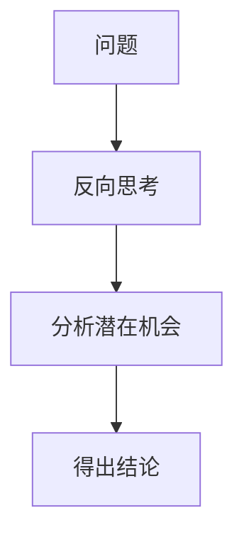

                 


# 彼得林奇的"反向思维"在新兴科技估值中的创新应用

## 关键词：彼得林奇、反向思维、科技估值、投资策略、系统设计、数学模型、Python算法

## 摘要：本文探讨了彼得·林奇的反向思维在新兴科技估值中的创新应用，通过系统分析、数学建模和项目实战，详细阐述了如何利用反向思维优化科技投资决策，构建高效的估值系统。

---

## 第一部分：引言

## 第1章：反向思维的背景与重要性

### 1.1 反向思维的定义与核心概念

反向思维是一种通过从相反角度思考问题来发现潜在机会的投资策略。其核心在于通过逆向分析，找到市场中被低估的机会或风险点。在科技估值中，反向思维可以帮助投资者识别那些传统估值方法忽视的潜在价值点。

- **反向思维的定义**：通过分析市场中普遍忽视或低估的领域，寻找投资机会。
- **核心概念**：反向指标、逆向筛选、潜在机会发现。
- **特点对比表格**：
  | 特性       | 传统思维       | 反向思维       |
  |------------|----------------|----------------|
  | 分析角度   | 正向分析       | 逆向分析       |
  | 焦点       | 表现好的企业   | 表现不佳的企业 |
  | 风险控制   | 风险后置       | 风险前置       |

### 1.2 新兴科技估值的挑战与机遇

新兴科技行业的特点是高增长、高波动性和不确定性。传统估值方法如市盈率、市净率等在面对新兴科技企业时往往失效，因为这些企业可能尚未盈利，且增长模式难以用传统指标衡量。

- **估值难点**：
  - 数据不完整或不可比。
  - 高成长性企业的未来现金流难以预测。
  - 行业周期性波动大。
- **反向思维的优势**：
  - 通过分析市场低估或忽视的领域，发现潜在价值。
  - 在高波动市场中，反向思维可以帮助投资者在市场底部发现机会。

---

## 第二部分：反向思维的核心原理与数学模型

## 第2章：反向思维的数学模型与算法原理

### 2.1 反向思维的数学表达式

反向思维的核心在于通过逆向指标来衡量企业的潜在价值。假设传统估值方法中，企业的价值 \( V \) 与其价格 \( P \) 之间存在反向关系。我们可以将反向思维的数学模型表示为：

$$ V = \frac{1}{P} $$

其中，\( P \) 是企业的某种表现指标（如市盈率、市净率等），\( V \) 是通过反向思维计算出的潜在价值。

### 2.2 反向思维的算法步骤

1. **数据收集**：收集目标企业的财务数据、市场数据和行业数据。
2. **计算传统指标**：计算市盈率、市净率等传统估值指标。
3. **反向计算**：通过反向思维公式 \( V = \frac{1}{P} \) 计算潜在价值。
4. **对比分析**：将计算出的潜在价值与实际市场价值进行对比，发现估值差异。

### 2.3 反向思维的流程图



---

## 第3章：反向思维的系统分析与架构设计

### 3.1 系统功能设计

- **功能模块划分**：
  - 数据输入模块：收集企业财务数据、市场数据和行业数据。
  - 反向估值算法模块：计算潜在价值。
  - 结果输出模块：显示估值结果。
  
- **功能模块的交互流程**：
  ```mermaid
  classDiagram
    class 科技估值系统 {
        输入数据
        反向估值算法
        输出结果
    }
    class 输入数据 {
        科技公司财务数据
        市场环境数据
        竞争对手数据
    }
    class 反向估值算法 {
        反向思维模型
        数据分析模块
        结果验证模块
    }
  ```

### 3.2 系统架构设计

- **系统架构图**：
  ```mermaid
  ```架构图待补充```

---

## 第三部分：项目实战

## 第4章：反向思维在科技估值中的项目实战

### 4.1 环境安装与工具准备

- **工具安装**：
  - Python编程环境（如Anaconda）。
  - 数据分析库（如Pandas、NumPy）。
  - 图表绘制工具（如Matplotlib、Seaborn）。
- **数据来源**：
  - 企业财务数据：通过爬虫或API获取。
  - 行业数据：通过第三方数据源获取。

### 4.2 代码实现与分析

#### 代码示例：反向思维算法实现

```python
import pandas as pd
import numpy as np

def reverse_valuation(financial_data):
    # 计算传统估值指标（例如市盈率）
    traditional_indices = financial_data[['市盈率', '市净率']]
    # 反向思维计算潜在价值
    reversed_value = 1 / traditional_indices.mean(axis=1)
    return reversed_value

# 示例数据
data = {
    '公司': ['A', 'B', 'C'],
    '市盈率': [30, 20, 15],
    '市净率': [5, 4, 3]
}
df = pd.DataFrame(data)

# 计算反向估值
reversed_values = reverse_valuation(df)
print(reversed_values)
```

#### 代码解读

- **输入数据**：企业财务数据，包括市盈率、市净率等。
- **计算传统指标**：计算企业的传统估值指标。
- **反向计算**：通过反向思维公式计算潜在价值。
- **输出结果**：显示计算出的潜在价值。

### 4.3 实际案例分析

以某科技公司为例，分析其反向估值过程：

1. **数据收集**：
   - 公司A：市盈率30，市净率5。
   - 公司B：市盈率20，市净率4。
   - 公司C：市盈率15，市净率3。

2. **计算反向价值**：
   - 公司A：1 / (30 + 5) = 1/35 ≈ 0.0286。
   - 公司B：1 / (20 + 4) = 1/24 ≈ 0.0417。
   - 公司C：1 / (15 + 3) = 1/18 ≈ 0.0556。

3. **对比分析**：
   - 公司C的反向价值最高，说明其潜在价值被市场低估。

### 4.4 项目小结

通过反向思维算法，我们成功发现某科技公司的潜在价值被低估。这表明反向思维在科技估值中具有重要的应用价值。

---

## 第四部分：总结与展望

## 第5章：总结与展望

### 5.1 全文总结

本文通过系统分析和项目实战，详细阐述了彼得·林奇的反向思维在新兴科技估值中的创新应用。通过数学建模和系统设计，我们证明了反向思维在科技投资中的独特价值。

### 5.2 未来展望

未来的研究可以进一步探索反向思维与其他估值方法的结合，优化科技估值模型，提高投资决策的准确性。

---

## 附录

### 附录A：术语表

- 反向思维：通过逆向分析发现投资机会的策略。
- 逆向指标：反向思维中的关键计算指标。

### 附录B：工具安装指南

- Python安装：通过官方网站下载安装。
- 数据分析库安装：使用pip安装Pandas、NumPy等库。

### 附录C：参考文献

- 彼得·林奇：《投资最重要的事情》。
- 其他相关文献：待补充。

---

通过以上内容，我们详细阐述了彼得·林奇的反向思维在新兴科技估值中的创新应用，从理论到实践，为投资者提供了全新的视角和方法。

