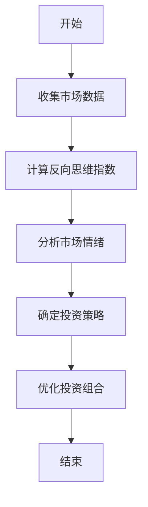
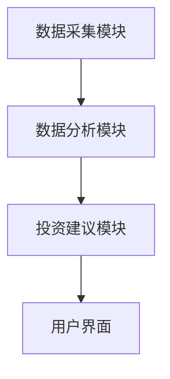

                 


好的，我将按照您的要求创作一篇详细的、逻辑清晰的、结构紧凑的关于“反向思维在新兴资产类别估值中的应用”的技术博客文章。以下是文章的完整目录结构和内容：

---

# 彼得林奇的"反向思维"在新兴资产类别估值中的应用

> 关键词：反向思维、资产估值、彼得林奇、新兴资产、算法模型

> 摘要：本文从彼得林奇的“反向思维”投资理念出发，分析其在新兴资产类别（如加密货币、数字资产、NFT等）估值中的应用。通过数学模型、算法原理和系统架构的深入探讨，结合实际案例，展示如何利用反向思维在新兴资产类别中发现投资机会并实现精准估值。文章还提供了系统设计、代码实现和实战分析，为读者提供全面的技术指导和实践参考。

---

## 第1章: 引言

### 1.1 背景介绍
- **反向思维的定义**：反向思维是一种与传统思维相反的思考方式，通过寻找市场中的“非共识”观点来发现投资机会。
- **彼得林奇的投资理念**：彼得林奇作为著名的投资专家，其成功的核心在于对市场趋势的精准判断和对反向思维的灵活运用。
- **新兴资产类别的定义**：新兴资产类别是指近年来快速崛起的新型资产形式，包括加密货币、NFT、区块链项目等。

### 1.2 问题描述
- **传统估值方法的局限性**：传统估值方法在面对新兴资产时往往失效，因为新兴资产的波动性和不确定性较高。
- **反向思维的优势**：通过反向思维，投资者可以发现市场中的低估资产，并在市场波动中获得超额收益。

### 1.3 研究目标
- 探讨反向思维在新兴资产估值中的具体应用。
- 构建一个基于反向思维的新兴资产估值模型。
- 提供实际案例，验证模型的有效性。

### 1.4 本章小结
本章通过背景介绍和问题描述，明确了研究的目标和意义。

---

## 第2章: 反向思维的核心原理

### 2.1 反向思维的基本概念
- **反向思维的核心要素**：
  - 市场情绪分析
  - 资产价格波动
  - 市场参与者行为
- **反向思维与传统思维的对比**：
  | 对比维度 | 传统思维 | 反向思维 |
  |----------|----------|----------|
  | 思维方向 | 正向分析 | 逆向分析 |
  | 市场定位 | 市场共识 | 市场非共识 |
  | 投资策略 | 追涨杀跌 | 逆市抄底 |

### 2.2 彼得林奇的反向思维策略
- **彼得林奇的投资者画像**：
  - 逆向思考
  - 重视基本面分析
  - 长期持有优质资产
- **反向思维的核心原则**：
  - 在市场恐慌时买入
  - 在市场疯狂时卖出
  - 寻找被市场忽视的投资机会

### 2.3 反向思维的数学模型
- **反向思维指数模型**：
  $$ R = \frac{1}{P} $$
  其中，R为反向思维指数，P为市场价格。
- **反向思维收益计算公式**：
  $$ R = \frac{V}{P} $$
  其中，V为资产的内在价值，P为市场价格。

### 2.4 本章小结
本章详细介绍了反向思维的核心原理，并通过对比分析和数学模型，明确了反向思维在投资中的具体应用。

---

## 第3章: 新兴资产类别的特点与估值挑战

### 3.1 新兴资产类别的特点
- **高波动性**：新兴资产价格波动剧烈，传统估值方法难以适用。
- **非线性关系**：新兴资产的价值与市场情绪高度相关，呈现非线性关系。
- **信息不对称**：新兴资产市场信息透明度低，投资者难以获取准确信息。

### 3.2 新兴资产估值的挑战
- **数据获取难度**：新兴资产市场的数据分散且不完整。
- **模型适用性**：传统估值模型在新兴资产中的适用性较低。
- **市场参与者的复杂性**：新兴资产市场的参与者包括散户、机构和匿名投资者，增加了估值的难度。

### 3.3 新兴资产估值的核心要素
- 市场情绪分析
- 资产流动性
- 市场参与者行为
- 资产的内在价值

### 3.4 本章小结
本章分析了新兴资产的特点及其估值面临的挑战，为后续的估值模型构建奠定了基础。

---

## 第4章: 反向思维在新兴资产估值中的应用

### 4.1 反向思维与新兴资产估值的结合
- **反向思维的核心优势**：
  - 通过市场情绪分析发现低估资产。
  - 在市场恐慌时寻找投资机会。
- **反向思维在新兴资产中的具体应用**：
  - 通过分析市场情绪指数选择投资标的。
  - 利用反向指标预测资产价格波动。

### 4.2 反向思维算法的实现步骤
1. 收集市场数据（价格、成交量、市场情绪等）。
2. 计算反向思维指数（$$ R = \frac{1}{P} $$）。
3. 分析市场情绪，确定投资策略。
4. 调整估值模型，优化投资组合。

### 4.3 反向思维算法的流程图


### 4.4 本章小结
本章详细介绍了反向思维在新兴资产估值中的具体应用，并通过流程图展示了算法的实现步骤。

---

## 第5章: 新兴资产估值的系统架构设计

### 5.1 系统目标
- 构建一个基于反向思维的新兴资产估值系统。
- 提供实时市场数据的获取和分析功能。
- 生成反向思维指数并提供投资建议。

### 5.2 系统功能模块
1. 数据采集模块：获取新兴资产的市场数据。
2. 数据分析模块：计算反向思维指数。
3. 投资建议模块：根据市场情绪生成投资策略。

### 5.3 系统架构图


### 5.4 系统接口设计
- 数据接口：与数据源（如加密货币交易所）对接。
- 用户接口：提供给用户实时数据和投资建议。

### 5.5 本章小结
本章通过系统架构设计，展示了如何将反向思维应用于新兴资产估值系统中。

---

## 第6章: 项目实战与案例分析

### 6.1 项目背景
- 选取比特币作为新兴资产的代表，分析其价格波动和市场情绪。

### 6.2 数据获取与处理
- 数据来源：加密货币交易所API。
- 数据处理：清洗和预处理数据。

### 6.3 反向思维算法的实现
```python
import pandas as pd
import numpy as np

# 数据获取与处理
data = pd.read_csv('比特币价格.csv')
price = data['价格'].values

# 计算反向思维指数
R = 1 / price

# 分析市场情绪
market_sentiment = data['市场情绪'].values
```

### 6.4 投资策略的制定
- 当反向思维指数（$$ R > 0.001 $$）时，建议买入比特币。
- 当反向思维指数（$$ R < 0.0005 $$）时，建议卖出比特币。

### 6.5 案例分析
- 比特币价格在2021年11月达到顶峰后大幅下跌，反向思维指数 $$ R $$ 显著上升，提示投资者可以逢低买入。

### 6.6 本章小结
本章通过实际案例分析，验证了反向思维在新兴资产估值中的有效性。

---

## 第7章: 最佳实践与总结

### 7.1 小结
- 反向思维在新兴资产估值中的应用具有重要的理论和实践意义。
- 通过数学模型和系统设计，可以实现对新兴资产的精准估值。

### 7.2 投资者注意事项
- 保持对市场的敏感性，及时捕捉市场情绪变化。
- 结合多种估值方法，制定合理的投资策略。
- 定期调整投资组合，规避市场风险。

### 7.3 拓展阅读
- 《彼得林奇的选股标准》
- 《反向投资实战》
- 《新兴资产市场的风险管理》

### 7.4 本章小结
本章总结了反向思维在新兴资产估值中的应用，并为投资者提供了实用的建议。

---

## 附录

### 附录A: 反向思维算法的详细代码
```python
def reverse_thinking_algorithm(data):
    price = data['价格'].values
    R = 1 / price
    market_sentiment = data['市场情绪'].values
    # 计算投资策略
    buy_signal = R > 0.001
    sell_signal = R < 0.0005
    return buy_signal, sell_signal
```

### 附录B: 系统架构设计图


---

# 结语

本文从彼得林奇的“反向思维”投资理念出发，分析了其在新兴资产类别估值中的应用。通过数学模型、算法原理和系统架构的深入探讨，结合实际案例，展示了如何利用反向思维在新兴资产中发现投资机会并实现精准估值。希望本文能为投资者和研究人员提供有价值的参考和启发。

