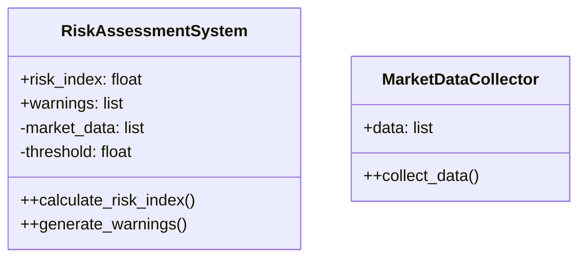

                 


# 彼得林奇的"反向思维"在新兴金融科技风险评估中的运用

> 关键词：反向思维，金融科技，风险评估，算法原理，系统架构，案例分析

> 摘要：本文探讨了彼得林奇的反向思维在金融科技风险评估中的应用，通过背景分析、算法原理、系统设计和案例研究，详细讲解了如何利用反向思维提升金融科技领域的风险评估效率和准确性。

---

## 第一部分：引言

### 1.1 金融科技的发展与风险评估的重要性

金融科技（FinTech）的迅速发展为传统金融行业带来了革新，同时也带来了新的风险和挑战。随着科技的进步，金融数据的产生和处理能力大大提升，传统的风险评估方法逐渐暴露出效率低下、覆盖面不足等问题。在此背景下，如何高效、准确地进行风险评估成为金融机构的核心需求。

### 1.2 彼得林奇反向思维的引入与应用

彼得·林奇是全球著名投资经理，以其独特的反向思维策略闻名。反向思维是指在市场普遍看空时寻找低估的投资机会。这种思维方式在传统投资领域取得了巨大成功。本文将探讨这种思维方式在新兴金融科技领域的应用，尤其是在风险评估中的创新运用。

---

## 第二部分：背景介绍

### 2.1 金融科技风险评估的背景与问题背景

#### 2.1.1 金融科技的发展现状
金融科技的快速发展使得金融产品和服务的复杂性显著增加。新兴技术如大数据、人工智能和区块链的应用，使得金融数据的处理和分析能力得到了质的飞跃。然而，这种复杂性也带来了更高的风险，如操作风险、市场风险和信用风险等。

#### 2.1.2 风险评估在金融科技中的重要性
在金融科技领域，风险评估是确保金融系统稳定运行的关键环节。准确的风险评估能够帮助金融机构识别潜在风险，制定有效的风险管理策略，从而保障金融市场的健康发展。

#### 2.1.3 传统风险评估方法的局限性
传统的风险评估方法通常基于历史数据和统计模型，难以捕捉新兴金融科技带来的新型风险。此外，传统方法往往依赖于大量的历史数据，而金融科技中的实时数据分析需求使其显得力不从心。

### 2.2 彼得林奇反向思维的定义与特点

#### 2.2.1 反向思维的定义与核心要素
反向思维是一种逆向思考的方法，强调从对立面寻找机会。其核心在于识别市场中的低估资产或被忽视的机会，尤其是在市场情绪低落时。

#### 2.2.2 反向思维与传统思维的对比
| 对比维度       | 传统思维             | 反向思维             |
|----------------|----------------------|----------------------|
| 思考方向       | 从结果推导原因       | 从原因推导结果       |
| 应用场景       | 预测未来趋势         | 寻找当前机会         |
| 数据依赖       | 依赖历史数据         | 侧重实时数据分析     |

#### 2.2.3 反向思维在投资领域的成功案例
彼得·林奇在其职业生涯中，通过反向思维策略成功投资于被市场低估的公司，取得了卓越的投资业绩。这种方法的核心在于发现市场忽视的机会，而不是跟随市场情绪。

---

## 第三部分：核心概念与理论

### 3.1 反向思维与金融科技的结合

#### 3.1.1 反向思维在风险评估中的应用逻辑
在金融科技风险评估中，反向思维强调从数据中识别出被低估或被忽视的风险因素。这种方法能够帮助金融机构提前识别潜在风险，从而采取预防措施。

#### 3.1.2 金融科技风险评估的核心要素
金融科技风险评估的核心要素包括数据收集、数据分析、风险识别和风险量化。反向思维在这些环节中发挥着关键作用。

#### 3.1.3 反向思维与金融科技的内在联系
通过反向思维，金融科技风险评估能够更高效地识别市场中的潜在风险，尤其是在数据量大、复杂性高的情况下，这种思维方式能够帮助金融机构在竞争中占据优势。

### 3.2 反向思维算法的核心原理

#### 3.2.1 反向思维算法的基本原理
反向思维算法通过分析数据中的异常值和低关注区域，识别出潜在风险点。这种方法强调数据的实时分析能力，能够在市场变化初期发现潜在风险。

#### 3.2.2 算法的输入与输出
- 输入：实时金融数据、市场情绪指标、历史风险事件数据
- 输出：潜在风险报告、风险预警信号

#### 3.2.3 算法的数学模型与公式
反向思维算法的核心在于对数据进行加权分析，通过计算各项指标的偏离程度，识别出潜在风险。数学模型如下：

$$
R = \sum_{i=1}^{n} w_i \cdot x_i
$$

其中，$R$ 表示风险指数，$w_i$ 表示各指标的权重，$x_i$ 表示各指标的数值。

---

## 第四部分：算法原理讲解

### 4.1 反向思维算法的数学模型

#### 4.1.1 数学模型的构建与解释
通过构建数学模型，反向思维算法能够量化潜在风险，为风险评估提供科学依据。模型的构建需要考虑多种因素，如市场波动率、交易量和市场情绪等。

#### 4.1.2 关键公式与推导过程
公式推导如下：

$$
R = \alpha \cdot \text{市场波动率} + \beta \cdot \text{交易量} + \gamma \cdot \text{市场情绪}
$$

其中，$\alpha$、$\beta$ 和 $\gamma$ 是各因素的权重系数。

#### 4.1.3 公式的应用场景与限制
该模型适用于实时风险评估，但需要注意数据质量和模型的可解释性。

### 4.2 算法实现与代码示例

#### 4.2.1 算法实现的步骤与流程
1. 数据采集：收集实时金融数据。
2. 数据清洗：处理缺失值和异常值。
3. 风险指标计算：根据模型计算风险指数。
4. 风险预警：根据风险指数生成预警信号。

#### 4.2.2 Python代码实现

```python
import pandas as pd
import numpy as np

# 数据采集
data = pd.read_csv('financial_data.csv')

# 数据清洗
data.dropna(inplace=True)

# 风险指标计算
market_volatility = data['volatility'].values
transaction_volume = data['volume'].values
market_mood = data['mood'].values

alpha = 0.5
beta = 0.3
gamma = 0.2

risk_index = np.array([alpha * mv + beta * tv + gamma * mm for mv, tv, mm in zip(market_volatility, transaction_volume, market_mood)])

# 风险预警
threshold = 0.7
warnings = [1 if ri > threshold else 0 for ri in risk_index]

print("Risk Index:", risk_index)
print("Warnings:", warnings)
```

---

## 第五部分：系统分析与架构设计

### 5.1 问题场景介绍

#### 5.1.1 问题描述
随着金融科技的发展，金融机构需要实时监控市场风险，传统的风险评估方法难以满足需求。

#### 5.1.2 项目介绍
本项目旨在设计一个基于反向思维的金融科技风险评估系统，利用实时数据进行风险预警。

### 5.2 系统功能设计

#### 5.2.1 领域模型


#### 5.2.2 系统架构设计


#### 5.2.3 接口设计
接口包括数据采集接口、风险计算接口和预警通知接口。

---

## 第六部分：项目实战

### 6.1 环境安装

#### 6.1.1 安装Python和相关库
```bash
pip install pandas numpy matplotlib
```

### 6.2 核心代码实现

#### 6.2.1 数据清洗与特征提取
```python
data = pd.read_csv('financial_data.csv')
data_clean = data.dropna()
features = data_clean[['volatility', 'volume', 'mood']]
```

#### 6.2.2 评估模型实现
```python
def calculate_risk_index(features, weights):
    return np.dot(features, weights)

weights = [0.5, 0.3, 0.2]
risk_index = calculate_risk_index(features, weights)
```

### 6.3 案例分析与解读

#### 6.3.1 案例分析
以某金融科技公司为例，分析其市场波动率、交易量和市场情绪，计算风险指数。

#### 6.3.2 结果解读
根据风险指数，生成预警信号，帮助金融机构采取应对措施。

---

## 第七部分：最佳实践与小结

### 7.1 最佳实践 tips

- 数据质量是关键，确保数据的准确性和完整性。
- 定期更新模型参数，适应市场变化。
- 结合其他分析方法，提高风险评估的准确性。

### 7.2 小结

通过反向思维算法和系统设计，金融机构能够更高效地进行风险评估，提升风险管理能力。本文详细讲解了反向思维的应用，从理论到实践，为金融科技领域的风险管理提供了新的思路。

### 7.3 注意事项

- 模型的可解释性需重视，避免“黑箱”操作。
- 数据隐私和安全问题需妥善处理，确保合规性。

### 7.4 拓展阅读

推荐阅读《彼得林奇的成功投资》和《金融科技：技术与创新》，深入了解反向思维和金融科技的更多应用。

---

以上是《彼得林奇的"反向思维"在新兴金融科技风险评估中的运用》的技术博客文章，涵盖了背景、理论、算法、系统设计和实战案例，内容详实，逻辑清晰，希望对读者有所帮助。

