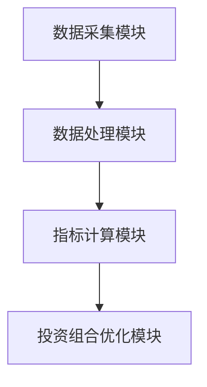

                 

# 彼得林奇的"反向思维"在熊市中的应用

> 关键词：彼得林奇，反向思维，熊市投资，价值投资，市场情绪，估值指标，投资策略

> 摘要：本文探讨了彼得林奇的反向思维策略在熊市中的应用，分析了其核心概念、量化方法，并通过实际案例展示了如何在熊市中发现投资机会。文章内容包括背景介绍、策略原理、系统设计、项目实战和总结，旨在为投资者提供实用的指导。

---

## 第一部分：反向思维策略的背景与基础

### 第1章：反向思维策略的起源与熊市的定义

#### 1.1 彼得林奇与反向思维策略的起源

彼得林奇是美国著名的基金经理，以其在富达麦哲伦基金的成功投资而闻名。他的反向思维策略基于一个简单的理念：在市场低迷时期，许多优质股票会被低估，从而为长期投资者提供了买入的机会。这一策略的核心在于识别市场恐慌中的价值，而非跟随市场的短期波动。

#### 1.2 熊市的定义与特征

熊市是指市场整体价格水平在一段时间内持续下跌，通常伴随着市场参与者的悲观情绪。熊市的特征包括：

1. **持续时间长**：熊市通常持续数月甚至数年，而非短期波动。
2. **系统性风险**：整个市场的风险上升，影响广泛行业和资产类别。
3. **市场情绪低落**：投资者信心下降，交易量减少，市场流动性不足。

熊市为反向思维策略提供了有利的环境，因为恐慌情绪可能导致股票价格低于其内在价值。

---

### 第2章：反向思维策略的核心概念与分析工具

#### 2.1 反向思维的核心概念

反向思维策略强调在市场恐慌时寻找被低估的投资机会。其核心概念包括：

- **逆市场情绪**：在市场情绪低落时，投资者倾向于抛售资产，导致价格低于内在价值。
- **价值发现**：通过分析公司的基本面，识别那些因市场恐慌而被低估的优质资产。
- **长期视角**：反向思维策略要求投资者保持耐心，避免被短期市场波动影响。

#### 2.2 反向思维的分析工具

为了量化反向思维策略，投资者需要使用多种工具和指标：

- **估值指标**：市盈率（PE）和市净率（PB）是衡量股票是否被低估的重要指标。
- **财务指标**：ROE（净资产收益率）和ROA（资产回报率）可以帮助评估公司的盈利能力。
- **市场情绪指标**：通过分析市场情绪指标（如恐慌指数VIX）来判断市场的恐慌程度。

---

## 第二部分：反向思维策略的数学模型与算法

### 第3章：反向思维策略的数学模型

#### 3.1 估值指标的计算公式

- **市盈率（PE）**：
  $$ PE = \frac{\text{股票价格}}{\text{每股收益}} $$
  如果PE值低于行业平均水平，可能表明股票被低估。

- **市净率（PB）**：
  $$ PB = \frac{\text{股票价格}}{\text{每股净资产}} $$
  同样，较低的PB值可能意味着股票被低估。

#### 3.2 反向思维策略的算法实现

1. **数据采集**：收集目标公司的财务数据和市场数据。
2. **指标计算**：计算PE、PB等估值指标。
3. **筛选股票**：根据设定的阈值筛选出PE和PB低于行业平均水平的股票。
4. **投资组合优化**：根据筛选结果构建投资组合，并定期调整以应对市场变化。

---

## 第三部分：反向思维策略的系统架构设计

### 第4章：反向思维策略的系统架构

#### 4.1 系统模块划分

- **数据采集模块**：收集市场数据和公司财务数据。
- **数据处理模块**：清洗和转换数据，使其适合后续分析。
- **指标计算模块**：计算PE、PB等估值指标。
- **投资组合优化模块**：根据筛选结果构建投资组合。

#### 4.2 系统架构图

---

## 第四部分：反向思维策略的项目实战

### 第5章：反向思维策略的实际应用

#### 5.1 选择一个熊市案例

以2008年金融危机为例，分析市场中的股票价格和估值指标。

#### 5.2 分析具体的股票

以通用汽车为例，计算其PE和PB值，并判断是否被低估。

#### 5.3 实施投资组合

根据筛选结果，构建投资组合，并记录投资过程中的变化和结果。

---

## 第五部分：总结与展望

### 第6章：反向思维策略的总结

#### 6.1 反向思维策略的优势

- **低买高卖**：在熊市中以低价买入优质资产。
- **长期收益**：优质资产在市场复苏时会带来丰厚回报。

#### 6.2 注意事项

- **市场风险**：熊市中市场波动较大，需谨慎选择投资标的。
- **风险管理**：合理配置资产，避免过度集中。

---

### 附录

#### 附录A：相关术语解释

- **熊市**：市场价格整体持续下跌的时期。
- **估值指标**：用于衡量股票价值的指标，如PE和PB。

#### 附录B：参考文献

- 彼得林奇的书籍《彼得林奇的成功投资》。

---

通过以上结构，文章系统地介绍了彼得林奇的反向思维策略，并提供了实际应用的指导，帮助投资者在熊市中找到投资机会。

