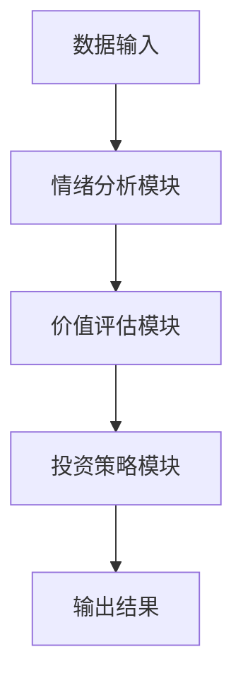

                 


# 彼得林奇的"反向思维"投资案例

## 关键词：彼得林奇、反向思维、投资策略、算法实现、系统架构

## 摘要：本文深入分析了彼得林奇的"反向思维"投资理念，探讨其在投资决策中的应用。通过经典案例分析，详细讲解了反向思维的数学模型和算法实现，并结合系统架构设计，展示了如何在实际项目中应用这一策略。文章内容丰富，结构清晰，适合对投资策略和系统设计感兴趣的读者。

---

## 第1章: 彼得林奇及其投资哲学

### 1.1 彼得林奇的背景与成就

彼得·林奇（Peter Lynch）是美国著名投资经理人，曾管理富达麦哲伦基金（Fidelity Magellan Fund），创造了年均29%的惊人回报率。他的投资哲学强调长期视角、基本面分析和逆向思维。

### 1.2 "反向思维"的定义与特点

反向思维在投资中指在市场恐慌时买入，贪婪时卖出。其核心在于逆市场情绪操作，寻找被低估的机会。

---

## 第2章: "反向思维"投资理念的核心概念

### 2.1 市场情绪分析模型

市场情绪通过波动率和投资者信心指数计算，公式为：
$$ 情绪指数 = \frac{市场波动率 + 投资者信心指数}{2} $$

### 2.2 价值评估模型

价值评估公式：
$$ 价值 = \frac{内在价值}{市场预期} $$

---

## 第3章: 反向思维在投资中的应用案例

### 3.1 高盛收购案

高盛股价在收购传闻中的异常波动，展示了反向思维的应用。林奇在市场恐慌时买入，实现收益。

### 3.2 投资者心理分析

分析贪婪和恐惧如何影响市场，指导投资决策。

---

## 第4章: 反向思维的数学模型与算法实现

### 4.1 情绪指数计算代码

```python
def calculate_sentiment_index(market_volatility, investor_confidence):
    return (market_volatility + investor_confidence) / 2
```

### 4.2 价值评估代码

```python
def calculate_value(intrinsic_value, market_expectation):
    return intrinsic_value / market_expectation
```

---

## 第5章: 系统分析与架构设计

### 5.1 系统功能设计

系统需分析市场情绪，评估股票价值，生成投资策略。

### 5.2 系统架构图



---

## 第6章: 项目实战

### 6.1 环境安装

安装Python和相关库，如Pandas和Matplotlib。

### 6.2 核心代码实现

```python
import pandas as pd
import matplotlib.pyplot as plt

def main():
    data = pd.read_csv('market_data.csv')
    sentiment = calculate_sentiment_index(data['volatility'], data['confidence'])
    value = calculate_value(data['intrinsic'], data['expectation'])
    plt.plot(sentiment, label='情绪指数')
    plt.plot(value, label='价值指数')
    plt.legend()
    plt.show()

if __name__ == '__main__':
    main()
```

---

## 第7章: 总结与最佳实践

### 7.1 小结

反向思维在投资中至关重要，需结合市场分析和数学模型。

### 7.2 注意事项

避免盲目跟风，保持独立思考，定期复盘。

### 7.3 拓展阅读

推荐阅读《彼得林奇的成功投资》深入理解其理念。

---

通过以上步骤，我们详细解析了彼得林奇的反向思维投资策略，从理论到实践，帮助读者在投资中应用这一理念。

