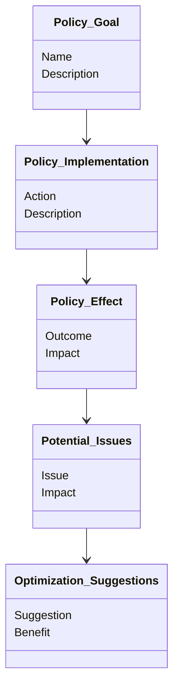
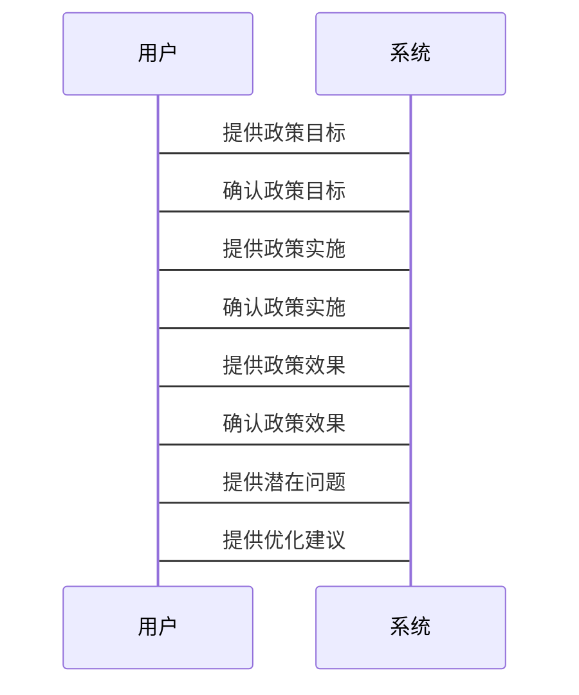

                 


# 彼得林奇的"反向思考"在央行政策影响评估中的应用

## 关键词：彼得林奇，反向思考，央行政策，政策评估，货币政策，反向思维

## 摘要：本文探讨了彼得林奇的反向思考方法在央行政策影响评估中的应用。通过分析反向思考的核心概念、算法原理、数学模型以及实际案例，展示了如何利用反向思维的独特视角，深入评估央行政策的实际效果，揭示传统评估方法的局限性，为政策制定者和研究者提供新的思考方式。

---

## 第1章: 反向思考的定义与核心理念

### 1.1 反向思考的定义与核心理念

#### 1.1.1 什么是反向思考
反向思考是一种逆向思维方法，通过从相反的方向出发，寻找问题的解决办法或机会。彼得林奇在投资领域中，通过反向思考发现被市场低估的股票，这种方法的核心在于“逆向思维”。

#### 1.1.2 反向思考的核心理念
反向思考的核心理念在于挑战传统的思维方式，通过寻找市场中的非共识观点，发现潜在的投资机会或问题。这种方法强调独立思考，避免随大流，从而在复杂环境中找到突破口。

---

## 第2章: 央行政策的基本概念

### 2.1 央行政策的定义与类型

#### 2.1.1 央行政策的定义
央行政策是指中央银行为了实现货币政策目标（如控制通胀、促进就业、维持金融稳定）而采取的一系列政策措施。

#### 2.1.2 央行政策的主要类型
- **货币政策工具**：如调整利率、货币供应量、存款准备金率等。
- **财政政策**：通过政府支出和税收调节经济。
- **宏观审慎政策**：防范金融系统性风险。

### 2.2 央行政策的目标与实施机制

#### 2.2.1 央行政策的目标
- **价格稳定**：控制通货膨胀。
- **就业最大化**：实现充分就业。
- **经济增长**：促进经济可持续发展。
- **金融稳定**：维护金融体系的稳定性。

#### 2.2.2 央行政策的实施机制
- **政策制定**：通过政策会议确定政策方向。
- **政策执行**：通过公开市场操作、调整利率等手段实施。
- **政策评估**：通过经济指标和市场反馈评估政策效果。

---

## 第3章: 反向思考在央行政策评估中的应用价值

### 3.1 反向思考在政策评估中的应用价值

#### 3.1.1 反向思考的优势与特点
- **独立性**：通过反向思考，能够跳出传统思维的框架，发现新的视角。
- **独特性**：在复杂环境中，反向思考能够揭示传统方法难以察觉的问题。
- **前瞻性**：通过逆向分析，提前预测政策可能带来的负面影响，制定应对措施。

#### 3.1.2 反向思考在政策评估中的独特视角
反向思考可以帮助政策评估者从经济结果出发，逆向推导政策实施过程中的潜在问题，从而更全面地评估政策效果。

---

## 第4章: 反向思考与传统政策评估方法的对比

### 4.1 反向思考与传统政策评估方法的对比

#### 4.1.1 传统政策评估方法概述
传统政策评估方法通常采用正向分析，即从政策实施到经济结果的正向推导。这种方法注重政策的直接影响，但容易忽视潜在的负面效果。

#### 4.1.2 反向思考与传统方法的对比分析
- **分析角度**：传统方法从政策到结果；反向思考从结果到政策。
- **问题发现**：传统方法注重正面影响，反向思考注重潜在风险。
- **分析深度**：反向思考能够更全面地评估政策的多维度影响。

#### 4.1.3 反向思考的优势与局限性
优势：能够揭示传统方法难以发现的潜在问题；局限性：需要较高的分析能力和数据支持。

---

## 第5章: 反向思考在央行政策影响评估中的核心概念

### 5.1 反向思考的核心原理

#### 5.1.1 反向思考的基本原理
通过从相反的角度分析问题，寻找问题的根源和潜在风险。

#### 5.1.2 反向思考在政策评估中的逻辑框架
- **确定政策目标**：明确政策希望实现的目标。
- **分析政策实施过程**：识别政策执行中的潜在问题。
- **评估政策效果**：通过反向思考，评估政策的实际效果是否符合预期。
- **提出改进建议**：根据反向分析的结果，提出优化政策的具体建议。

### 5.2 反向思考与政策效果的数学模型

#### 5.2.1 反向思考的数学模型
反向思考的数学模型可以通过以下步骤构建：
1. 确定政策目标（P）。
2. 分析政策实施过程（I）。
3. 评估政策效果（E）。
4. 反向推导潜在问题（Q）。

数学表达式如下：
$$
E = f(I, P)
$$
$$
Q = g(E, P)
$$

其中，$f$ 表示政策实施过程与政策目标的关系，$g$ 表示政策效果与政策目标之间的关系。

#### 5.2.2 政策效果的数学模型
政策效果的数学模型可以通过以下步骤构建：
1. 确定政策目标（P）。
2. 分析政策实施过程（I）。
3. 评估政策效果（E）。
4. 反向推导潜在问题（Q）。

数学表达式如下：
$$
E = f(I, P)
$$
$$
Q = g(E, P)
$$

---

## 第6章: 反向思考在央行政策评估中的算法原理

### 6.1 反向思考的算法原理

#### 6.1.1 算法的输入与输出
- **输入**：政策目标（P）、政策实施过程（I）、政策效果（E）。
- **输出**：潜在问题（Q）、优化建议（S）。

#### 6.1.2 算法的核心步骤
1. 确定政策目标（P）。
2. 分析政策实施过程（I）。
3. 评估政策效果（E）。
4. 反向推导潜在问题（Q）。
5. 提出优化建议（S）。

### 6.2 反向思考算法的实现

#### 6.2.1 算法的实现步骤
1. 确定政策目标（P）。
2. 分析政策实施过程（I）。
3. 评估政策效果（E）。
4. 反向推导潜在问题（Q）。
5. 提出优化建议（S）。

#### 6.2.2 算法的代码实现
以下是一个简单的反向思考算法的Python代码实现：

```python
def reverse_thinking(Policy_Goal, Policy_Implementation, Policy_Effect):
    Potential_Issues = []
    for effect in Policy_Effect:
        if effect not in Policy_Goal:
            Potential_Issues.append(effect)
    return Potential_Issues

# 示例
Policy_Goal = ['控制通胀', '促进就业', '维持金融稳定']
Policy_Implementation = ['调整利率', '货币供应量', '存款准备金率']
Policy_Effect = ['通胀下降', '就业增加', '金融稳定']

Potential_Issues = reverse_thinking(Policy_Goal, Policy_Implementation, Policy_Effect)
print("潜在问题：", Potential_Issues)
```

---

## 第7章: 反向思考与政策效果的数学模型

### 7.1 反向思考的数学模型

#### 7.1.1 反向思考的数学表达式
$$
E = f(I, P)
$$
$$
Q = g(E, P)
$$

### 7.2 政策效果的数学模型

#### 7.2.1 政策效果的数学表达式
$$
E = f(I, P)
$$
$$
Q = g(E, P)
$$

---

## 第8章: 反向思考在央行政策评估中的系统分析与架构设计

### 8.1 系统功能设计

#### 8.1.1 领域模型


### 8.2 系统架构设计

#### 8.2.1 系统架构图


### 8.3 系统接口设计

#### 8.3.1 系统接口
- 输入接口：政策目标、政策实施、政策效果。
- 输出接口：潜在问题、优化建议。

### 8.4 系统交互设计

#### 8.4.1 系统交互流程图


---

## 第9章: 反向思考在央行政策评估中的项目实战

### 9.1 环境安装

#### 9.1.1 环境要求
- Python 3.8及以上版本
- Mermaid工具或支持Mermaid图表的编辑器
- 基础数据处理工具（如Excel、Python的pandas库）

### 9.2 核心实现源代码

#### 9.2.1 Python代码实现
```python
def reverse_thinking(Policy_Goal, Policy_Implementation, Policy_Effect):
    Potential_Issues = []
    for effect in Policy_Effect:
        if effect not in Policy_Goal:
            Potential_Issues.append(effect)
    return Potential_Issues

# 示例
Policy_Goal = ['控制通胀', '促进就业', '维持金融稳定']
Policy_Implementation = ['调整利率', '货币供应量', '存款准备金率']
Policy_Effect = ['通胀下降', '就业增加', '金融稳定']

Potential_Issues = reverse_thinking(Policy_Goal, Policy_Implementation, Policy_Effect)
print("潜在问题：", Potential_Issues)
```

#### 9.2.2 代码应用解读与分析
- **输入**：政策目标、政策实施、政策效果。
- **输出**：潜在问题。
- **分析**：通过反向思考，识别政策实施过程中可能存在的潜在问题，从而为政策优化提供依据。

### 9.3 实际案例分析

#### 9.3.1 案例背景
假设某国央行实施加息政策，旨在控制通胀。然而，加息可能导致企业贷款成本上升，影响经济增长。

#### 9.3.2 数据收集与分析
- **政策目标**：控制通胀。
- **政策实施**：加息。
- **政策效果**：通胀下降，但经济增长放缓。

#### 9.3.3 反向思考的应用
通过反向思考，识别潜在问题：加息可能导致企业贷款成本上升，进而影响经济增长。

#### 9.3.4 政策优化建议
- 调整加息幅度，避免过度紧缩。
- 提供针对中小企业的贷款支持。

### 9.4 项目小结
通过反向思考，识别传统政策评估方法难以发现的潜在问题，为政策优化提供新的视角和思路。

---

## 第10章: 反向思考在央行政策评估中的总结与展望

### 10.1 总结

#### 10.1.1 反向思考的核心价值
反向思考通过逆向分析，揭示政策实施过程中可能存在的潜在问题，帮助政策评估者更全面地理解政策效果。

#### 10.1.2 反向思考的独特视角
反向思考提供了从结果出发的分析方法，帮助政策评估者发现传统方法难以察觉的问题。

### 10.2 展望

#### 10.2.1 反向思考的未来研究方向
- 探索反向思考与其他政策评估方法的结合。
- 研究反向思考在不同经济环境中的应用效果。

#### 10.2.2 反向思考的实践意义
反向思考为政策评估提供了新的工具和方法，有助于政策制定者在复杂经济环境中做出更明智的决策。

---

## 第11章: 反向思考在央行政策评估中的最佳实践 tips

### 11.1 小结

#### 11.1.1 反向思考的应用总结
反向思考通过逆向分析，帮助政策评估者发现潜在问题，优化政策实施效果。

### 11.2 注意事项

#### 11.2.1 数据质量的重要性
确保输入数据的准确性和完整性，是反向思考算法有效运行的基础。

#### 11.2.2 模型的局限性
反向思考模型依赖于输入数据的质量和完整性，可能无法捕捉所有潜在问题。

### 11.3 拓展阅读

#### 11.3.1 推荐书籍
- 《彼得林奇的成功投资》
- 《中央银行货币政策分析》

#### 11.3.2 推荐文章
- 《反向思考在经济分析中的应用》
- 《中央银行政策评估方法的创新与实践》

---

## 第12章: 反向思考在央行政策评估中的总结

通过本文的探讨，我们深入了解了彼得林奇的反向思考方法在央行政策评估中的应用价值。反向思考通过逆向分析，帮助政策评估者发现潜在问题，优化政策实施效果。未来，随着经济环境的复杂化，反向思考的应用将更加广泛，为政策制定者和研究者提供新的思考方式和工具。

