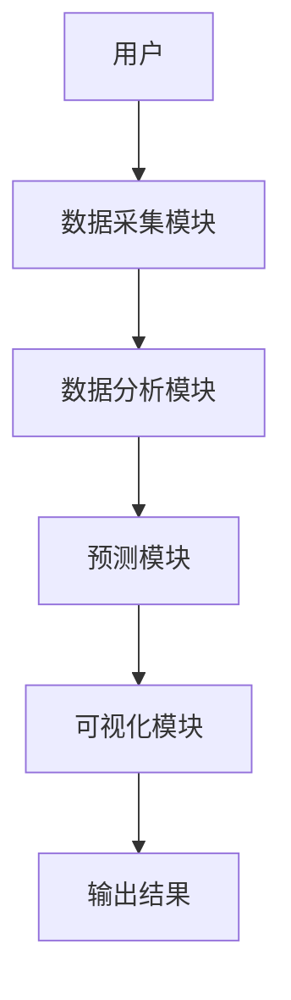
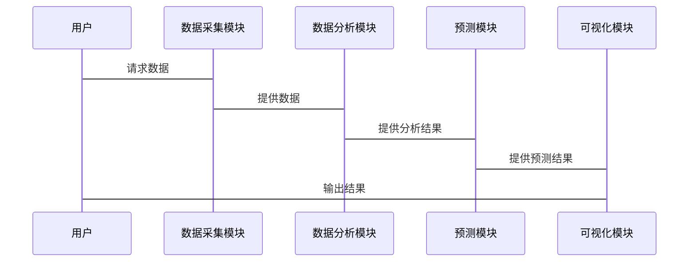

                 


# 彼得林奇的"反向思考"在宏观经济分析中的应用

## 关键词：宏观经济分析，反向思考，彼得林奇，投资策略，经济预测，系统设计

## 摘要：本文深入探讨了彼得林奇的“反向思考”策略在宏观经济分析中的应用。通过详细阐述反向思考的核心理念、算法原理、数学模型和系统架构，结合实际案例分析，展示了如何利用反向思考在宏观经济预测和投资决策中获得优势。本文还提供了具体的Python代码实现和系统设计，为读者提供了从理论到实践的完整指南。

---

# 第一部分：彼得林奇的“反向思考”概述

## 第1章：彼得林奇的反向思考理论

### 1.1 反向思考的定义与核心理念

反向思考是一种投资策略，其核心理念是“逆市而行”。彼得林奇认为，当市场情绪过于乐观时，投资者应该保持谨慎；而当市场情绪低落时，正是寻找优质投资机会的好时机。这种逆向思维的核心在于发现市场的非理性，从而在其他人恐慌时寻找机会。

### 1.2 反向思考在投资中的应用

在传统投资中，投资者通常跟随市场趋势进行操作，即“顺势而为”。然而，这种方法往往会导致追涨杀跌的错误。彼得林奇的反向思考策略则强调在市场低谷时买入，在市场高点时卖出。这种方法需要投资者具备强大的心理素质和对市场的深刻理解。

### 1.3 反向思考与宏观经济分析的结合

宏观经济分析通常关注GDP、失业率、通胀率等关键指标。通过反向思考，宏观经济分析师可以发现市场预期与实际数据之间的偏差，从而提前预测经济趋势。例如，当市场普遍预期GDP增长时，反向思考者可能会关注GDP下降的信号，从而调整投资策略。

---

## 第2章：宏观经济分析的基础知识

### 2.1 宏观经济的基本概念

宏观经济分析研究的是整个经济体系的运行状况，包括GDP、失业率、通胀率、消费指数等关键指标。这些指标共同构成了宏观经济的基本框架。

### 2.2 宏观经济分析的主要指标

- **GDP（国内生产总值）**：衡量一个国家或地区的经济总量。
- **失业率**：衡量劳动力市场的健康状况。
- **通胀率**：衡量物价水平的变化。
- **消费者价格指数（CPI）**：衡量通货膨胀的主要指标。

### 2.3 宏观经济分析的方法与工具

宏观经济分析通常采用定量分析和定性分析相结合的方法。常用的工具包括回归分析、时间序列分析、计量经济学模型等。

---

# 第二部分：反向思考在宏观经济分析中的核心概念

## 第3章：反向思考的核心原理

### 3.1 反向思考的逻辑框架

反向思考的核心在于发现市场预期与实际数据之间的差异。通过分析这些差异，投资者可以提前预测经济趋势，从而做出更明智的投资决策。

### 3.2 反向思考与宏观经济数据的关系

反向思考与宏观经济数据的关系可以通过以下公式表示：

$$ \text{反向思考信号} = \text{市场预期} - \text{实际数据} $$

当市场预期与实际数据存在显著差异时，反向思考信号将出现。

### 3.3 反向思考在经济周期中的应用

经济周期通常分为四个阶段：衰退、复苏、增长和繁荣。反向思考者通常在衰退阶段寻找机会，在繁荣阶段警惕风险。

---

## 第4章：反向思考与宏观经济指标的关联

### 4.1 GDP与反向思考

GDP是衡量经济健康状况的核心指标。当市场预期GDP增长时，反向思考者可能会关注GDP下降的信号，从而调整投资策略。

### 4.2 失业率与反向思考

失业率是衡量劳动力市场健康状况的重要指标。当市场预期失业率下降时，反向思考者可能会关注失业率上升的信号。

### 4.3 消费者价格指数（CPI）与反向思考

CPI是衡量通货膨胀的主要指标。当市场预期CPI上升时，反向思考者可能会关注CPI下降的信号。

---

# 第三部分：反向思考的算法与数学模型

## 第5章：反向思考的算法原理

### 5.1 数据采集与处理

反向思考的算法需要采集宏观经济数据，包括GDP、失业率、CPI等指标。

### 5.2 经济指标的反向分析模型

反向分析模型可以通过以下步骤实现：

1. 数据清洗与预处理。
2. 市场预期与实际数据的对比。
3. 反向思考信号的计算。

### 5.3 反向思考的数学公式

反向思考信号的计算公式如下：

$$ \text{反向思考信号} = \text{市场预期} - \text{实际数据} $$

---

## 第6章：数学模型与公式详解

### 6.1 经济指标的反向预测公式

通过反向思考，可以建立经济指标的反向预测模型：

$$ \text{预测值} = \text{当前值} + \text{反向思考信号} $$

### 6.2 反向思考的回归分析模型

回归分析是一种常用的统计方法，可以通过以下公式表示：

$$ y = \beta_0 + \beta_1 x + \epsilon $$

其中，$y$ 是因变量，$x$ 是自变量，$\beta_0$ 和 $\beta_1$ 是回归系数，$\epsilon$ 是误差项。

### 6.3 经济趋势的反向预测算法

经济趋势的反向预测算法可以通过以下步骤实现：

1. 数据预处理。
2. 建立回归模型。
3. 计算反向思考信号。
4. 进行预测。

---

# 第四部分：系统分析与架构设计

## 第7章：宏观经济分析系统的构建

### 7.1 系统需求分析

系统需求包括数据采集、分析、预测和可视化功能。

### 7.2 系统功能设计

系统功能模块包括：

- 数据采集模块。
- 数据分析模块。
- 预测模块。
- 可视化模块。

### 7.3 系统架构设计

系统架构设计如下：



---

## 第8章：系统接口与交互设计

### 8.1 数据接口设计

数据接口设计如下：



---

# 第五部分：项目实战与案例分析

## 第9章：项目实战：基于反向思考的宏观经济分析系统

### 9.1 环境安装

需要安装Python、Pandas、NumPy、Matplotlib等库。

### 9.2 系统核心实现源代码

以下是Python代码实现：

```python
import pandas as pd
import numpy as np
import matplotlib.pyplot as plt

# 数据采集
data = pd.read_csv('macro_data.csv')

# 数据预处理
data_clean = data.dropna()

# 市场预期与实际数据的对比
expected = data_clean['expected_gdp']
actual = data_clean['actual_gdp']

# 反向思考信号计算
reverse_signal = expected - actual

# 预测模型
from sklearn.linear_model import LinearRegression
model = LinearRegression()
model.fit(reverse_signal.reshape(-1, 1), actual)

# 预测结果
predicted = model.predict(reverse_signal.reshape(-1, 1))

# 可视化
plt.plot(actual, label='实际数据')
plt.plot(predicted, label='预测数据')
plt.xlabel('时间')
plt.ylabel('GDP')
plt.legend()
plt.show()
```

### 9.3 实际案例分析与结果解读

以美国经济为例，分析GDP数据的反向思考信号，并预测未来经济走势。

---

## 第10章：总结与展望

### 10.1 最佳实践

反向思考的应用需要结合市场实际情况，避免盲目跟风。

### 10.2 小结

本文详细探讨了彼得林奇的反向思考在宏观经济分析中的应用，通过理论分析和实际案例展示了其在经济预测和投资决策中的优势。

### 10.3 注意事项

在实际应用中，需要注意数据的准确性和模型的稳定性。

### 10.4 拓展阅读

推荐阅读彼得林奇的《投资的智慧》和《战胜市场的人》。

--- 

通过本文的分析和实践，读者可以掌握反向思考在宏观经济分析中的应用方法，并在实际投资中灵活运用。

