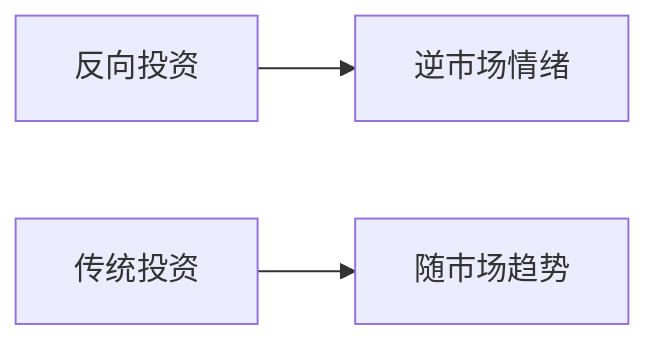

                 

# 彼得林奇的"反向投资"在传统行业数字化转型中的机会识别

## 关键词：反向投资，彼得·林奇，数字化转型，机会识别，传统行业，投资策略

## 摘要：  
本文探讨了彼得·林奇的反向投资策略在传统行业数字化转型中的应用，分析了如何通过反向投资识别数字化转型中的机会，结合实际案例，提供了系统化的投资策略和方法，帮助投资者在数字化转型中获取超额收益。

---

## 第一部分：反向投资与数字化转型概述

### 第1章：反向投资的核心概念与策略

#### 1.1 反向投资的定义与特点

**1.1.1 反向投资的定义**  
反向投资（Contrarian Investment）是一种投资策略，主张在市场情绪低落、资产价格被低估时买入，而在市场情绪高涨、资产价格被高估时卖出。其核心在于逆市场情绪操作，寻找市场忽视的投资机会。

**1.1.2 反向投资的核心特点**  
- **逆周期性**：在市场低迷时寻找机会，在市场繁荣时保持谨慎。  
- **逆市场情绪**：与大多数投资者的决策相反，强调独立思考。  
- **长期视角**：注重基本面分析，寻找具有长期增长潜力的资产。  

**1.1.3 反向投资与传统投资的区别**  
| **方面**       | **反向投资**                     | **传统投资**                     |
|----------------|----------------------------------|----------------------------------|
| 投资时机       | 市场低迷时买入，市场高涨时卖出   | 市场上涨时买入，市场下跌时卖出   |
| 投资策略       | 逆市场情绪，寻找低估资产         | 随市场趋势，顺势而为             |
| 风险偏好       | 更倾向于承担短期波动风险         | 更倾向于规避短期波动风险         |

**图1-1：反向投资与传统投资对比**

---

#### 1.2 反向投资的策略与优势

**1.2.1 反向投资的主要策略**  
- **价值投资**：寻找基本面良好但市场估值过低的资产。  
- **逆向择时**：在市场恐慌时买入，在市场狂热时卖出。  
- **分散投资**：避免过度集中，降低风险。  

**1.2.2 反向投资的优势与风险**  
- **优势**：  
  - 能够在市场低谷时获得低价资产，长期收益潜力大。  
  - 通过逆市场情绪操作，避免短期波动的冲击。  
- **风险**：  
  - 需要准确判断市场走势，错误判断可能导致重大损失。  
  - 需要承受短期市场波动的压力。  

**1.2.3 反向投资的适用场景**  
- 经济衰退或市场低迷时期。  
- 行业周期性低谷阶段。  
- 市场恐慌或非理性下跌阶段。  

---

### 第2章：反向投资在数字化转型中的机会识别

#### 2.1 数字化转型的背景与意义

**2.1.1 数字化转型的定义与内涵**  
数字化转型是指利用数字技术（如大数据、人工智能、云计算等）对业务流程、商业模式和组织结构进行重构，以提高效率、创造新价值的过程。

**2.1.2 数字化转型的驱动因素**  
- 技术进步：云计算、AI、物联网等技术的成熟。  
- 市场需求：消费者对个性化、智能化服务的需求增加。  
- 竞争压力：传统企业面临新兴科技企业的冲击。  

**2.1.3 数字化转型对传统行业的影响**  
- 提高运营效率。  
- 创新商业模式。  
- 增强竞争力。  

---

#### 2.2 反向投资在数字化转型中的应用

**2.2.1 反向投资与数字化转型的结合**  
反向投资者可以在数字化转型初期，投资那些尚未被市场充分认识到其价值的传统行业企业。

**2.2.2 数字化转型中的投资机会**  
- 传统制造业的智能化改造。  
- 零售业的数字化转型。  
- 金融行业的科技赋能。  

---

## 第二部分：传统行业数字化转型中的机会识别

### 第3章：传统行业数字化转型的机会分析

#### 3.1 传统行业数字化转型的现状与趋势

**3.1.1 传统行业数字化转型的现状**  
许多传统行业（如制造业、零售业、医疗等）正在逐步引入数字化技术，但整体进展缓慢，存在较大的提升空间。

**3.1.2 数字化转型对传统行业的影响**  
- 提高生产效率。  
- 优化成本结构。  
- 创新业务模式。  

**3.1.3 传统行业数字化转型的未来趋势**  
- 更多行业将加速数字化转型。  
- 数字技术将深度融合传统业务。  
- 新兴技术和传统行业的结合将更加紧密。  

---

### 第4章：传统行业数字化转型中的投资策略

#### 4.1 反向投资在传统行业数字化转型中的应用

**4.1.1 反向投资的具体策略**  
- 投资那些数字化转型初期估值被低估的传统企业。  
- 关注行业周期性低谷时的转型机会。  

**4.1.2 数字化转型中的投资案例分析**  
- 某制造企业引入智能制造技术，成本降低30%，股价上涨20%。  

---

## 第三部分：项目实战与未来展望

### 第5章：反向投资在数字化转型中的实际应用

#### 5.1 项目环境与目标

**5.1.1 项目背景**  
某传统制造企业面临成本高、效率低的问题，计划引入智能制造技术进行数字化转型。

**5.1.2 项目目标**  
通过数字化转型降低生产成本，提高效率，增强竞争力。

---

### 第6章：未来展望与最佳实践

**6.1 未来展望**  
随着数字技术的不断进步，反向投资在数字化转型中的应用将更加广泛，投资者需要持续关注市场变化，灵活调整策略。

**6.2 最佳实践**  
- 保持对市场趋势的敏感性。  
- 注重基本面分析。  
- 长期持有，耐心等待价值回归。  

---

## 总结

本文系统地探讨了彼得·林奇的反向投资策略在传统行业数字化转型中的应用，通过理论分析和实际案例，为投资者提供了识别机会、制定策略的方法。未来，随着数字化转型的深入，反向投资将在更多领域展现出其独特价值。

