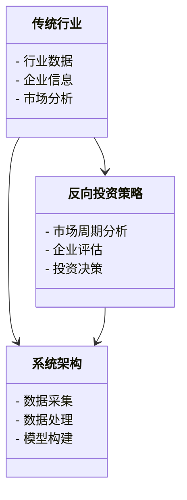
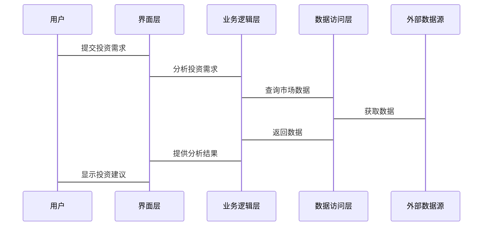

                 


# 彼得林奇的"反向投资"在传统行业转型中的应用

> 关键词：反向投资，传统行业转型，彼得林奇，市场周期，投资策略

> 摘要：本文探讨了彼得·林奇的反向投资策略在传统行业转型中的应用。通过分析传统行业面临的挑战、市场周期波动以及反向投资的核心理念，本文提出了在传统行业转型中如何利用反向投资策略来捕捉市场机会、优化投资组合，并通过数学模型和系统架构设计，详细阐述了反向投资的实施步骤和实际案例。文章还讨论了反向投资在传统行业转型中的潜在挑战与未来展望。

---

## 第1章: 传统行业面临的转型挑战

### 1.1 传统行业的发展现状

#### 1.1.1 传统行业的主要领域与特点

传统行业主要包括制造业、零售业、农业、能源、交通等。这些行业在过去几十年中一直是经济的支柱，依赖于稳定的生产模式和相对固定的市场需求。传统行业通常具有较高的资本密集度，依赖于物理资产和劳动力，且技术更新相对缓慢。

#### 1.1.2 数字化转型的必要性

随着科技的发展，尤其是信息技术和互联网的普及，传统行业面临着前所未有的挑战。消费者需求的变化、市场竞争的加剧以及技术的快速迭代，使得传统行业不得不进行数字化转型。数字化转型不仅是适应市场变化的需要，更是提升效率、降低成本、创造新价值的必经之路。

#### 1.1.3 传统行业转型中的痛点与难点

转型过程中，传统行业通常会面临以下痛点：
- **技术壁垒**：缺乏专业的技术人才和数字化工具。
- **管理复杂性**：传统管理模式与数字化管理之间的冲突。
- **文化障碍**：员工对新技术的抵触和适应问题。
- **资金投入**：数字化转型需要大量的资金投入，回报周期较长。

---

### 1.2 反向投资的基本概念

#### 1.2.1 反向投资的定义与核心理念

反向投资是一种投资策略，其核心理念是在市场低迷或被忽视时买入资产，而在市场高涨时卖出资产。这种策略与传统的顺势投资相反，强调在市场恐慌时寻找机会。

#### 1.2.2 反向投资与传统投资的区别

传统的顺势投资依赖于市场趋势，追求短期收益；而反向投资则关注市场的非理性波动，寻找被低估的投资机会。反向投资更注重长期价值，而非短期价格波动。

#### 1.2.3 反向投资在传统行业中的应用潜力

在传统行业转型中，反向投资的潜力体现在以下几个方面：
- **低估值机会**：在数字化转型初期，许多传统行业的资产可能被市场低估。
- **行业拐点识别**：通过分析行业周期，识别转型的关键节点。
- **投资组合优化**：通过反向投资策略，优化企业的投资组合，降低风险。

---

## 第2章: 传统行业转型中的市场分析

### 2.1 行业生命周期与市场周期

#### 2.1.1 行业生命周期的四个阶段

行业生命周期通常分为四个阶段：
1. **引入期**：行业刚刚起步，市场需求较低，竞争较少。
2. **成长期**：市场需求快速增长，行业内企业数量增加。
3. **成熟期**：市场需求稳定，行业内竞争加剧。
4. **衰退期**：市场需求下降，行业内企业逐渐减少。

#### 2.1.2 市场周期波动对传统行业的影响

市场周期的波动对传统行业的影响主要体现在以下几个方面：
- **市场需求变化**：周期性波动可能导致市场需求的波动。
- **价格波动**：市场价格的波动会影响企业的利润。
- **竞争格局变化**：市场周期波动可能导致行业内竞争格局的变化。

#### 2.1.3 反向投资与市场周期的关系

反向投资的核心是利用市场周期的波动，在市场低谷时买入，市场高点时卖出。在传统行业转型中，识别市场周期的波动可以帮助投资者在行业低谷时寻找投资机会。

---

## 第3章: 反向投资策略的核心要素

### 3.1 反向投资的核心理念

#### 3.1.1 "买入被忽视的资产"的含义

反向投资的核心理念是“买入被忽视的资产”。在传统行业转型中，这意味着寻找那些在数字化转型中被市场低估的资产，尤其是在行业低谷时期。

#### 3.1.2 市场恐慌与投资机会的关系

市场恐慌通常会导致资产价格的低估，这为反向投资者提供了投资机会。在传统行业转型中，市场恐慌可能导致行业内某些企业或项目的估值低于其实际价值。

#### 3.1.3 反向投资的长期视角

反向投资强调长期视角，关注企业的长期价值而非短期价格波动。在传统行业转型中，这种长期视角可以帮助投资者识别那些具有持续发展潜力的企业。

### 3.2 反向投资的决策框架

#### 3.2.1 信息不对称与投资机会

信息不对称是传统行业转型中的一个重要问题。反向投资者需要通过深入分析行业和企业，识别那些被市场忽视的投资机会。

#### 3.2.2 风险评估与投资决策

在反向投资中，风险评估是投资决策的重要组成部分。传统行业转型中的风险包括市场需求变化、竞争加剧、技术风险等。

#### 3.2.3 投资组合的构建与优化

反向投资强调投资组合的构建与优化。在传统行业转型中，投资者需要根据市场变化和企业情况，动态调整投资组合。

### 3.3 反向投资在传统行业中的应用

#### 3.3.1 传统行业中的低估值机会

在数字化转型初期，许多传统行业的资产可能被市场低估，这为反向投资者提供了投资机会。

#### 3.3.2 行业拐点的识别与把握

反向投资需要识别行业拐点。在传统行业转型中，拐点可能出现在市场需求变化、技术突破或政策变化时。

#### 3.3.3 反向投资策略的实施步骤

实施反向投资策略的步骤包括：
1. **行业分析**：了解传统行业的现状和趋势。
2. **企业评估**：评估企业的价值和潜力。
3. **市场周期判断**：判断市场所处的周期阶段。
4. **投资决策**：在市场低谷时买入，在市场高点时卖出。

---

## 第4章: 反向投资的数学模型与算法

### 4.1 反向投资的数学模型

#### 4.1.1 市场周期的数学建模

市场周期的数学建模可以采用时间序列分析的方法，如ARIMA模型。通过对历史数据的分析，预测未来的市场趋势。

#### 4.1.2 企业价值评估的公式

企业价值评估可以采用多种方法，如市盈率法、市净率法等。反向投资中，企业价值评估公式可以表示为：

$$ EV = \frac{Market\ Value}{P/E} $$

其中，EV表示企业价值，Market Value表示市场价值，P/E表示市盈率。

#### 4.1.3 投资决策的优化模型

投资决策的优化模型可以采用动态规划的方法，考虑市场周期和企业情况，优化投资组合。

### 4.2 反向投资的算法实现

#### 4.2.1 数据采集与处理

数据采集与处理是反向投资算法实现的基础。需要采集市场数据、企业财务数据等，进行清洗和预处理。

#### 4.2.2 市场周期识别的算法

市场周期识别的算法可以采用聚类分析或时间序列分析。例如，使用K-means算法将市场数据分为不同的周期阶段。

#### 4.2.3 投资组合优化的算法

投资组合优化的算法可以采用遗传算法或粒子群优化算法，寻找最优的投资组合。

---

## 第5章: 传统行业转型中的系统架构设计

### 5.1 问题场景介绍

#### 5.1.1 传统行业转型的典型问题

传统行业转型中常见的问题包括技术落后、管理混乱、市场需求变化等。

#### 5.1.2 反向投资在系统中的应用场景

反向投资可以应用于企业的战略决策、投资组合优化等领域。

#### 5.1.3 系统目标与功能需求

系统目标是帮助传统企业进行数字化转型，优化投资决策。功能需求包括市场分析、企业评估、投资决策优化等。

### 5.2 系统功能设计

#### 5.2.1 领域模型设计（Mermaid 类图）

领域模型设计如下：



#### 5.2.2 系统架构设计（Mermaid 架构图）

系统架构设计如下：

```mermaid
archiecture

    系统架构
    界面层
    业务逻辑层
    数据访问层
```

#### 5.2.3 系统接口设计

系统接口设计包括数据接口和用户接口。数据接口用于与外部数据源连接，用户接口用于与用户交互。

### 5.3 系统交互设计（Mermaid 序列图）

系统交互设计如下：



---

## 总结

通过以上分析，我们可以看到，彼得·林奇的反向投资策略在传统行业转型中具有重要的应用价值。在数字化转型的背景下，传统行业面临着巨大的挑战，但也存在着被市场忽视的投资机会。通过系统化的分析和数学模型的构建，反向投资策略可以帮助企业在市场低谷时抓住投资机会，优化投资组合，实现长期的可持续发展。

---

**Tips:**
- **最佳实践**：在实施反向投资策略时，建议结合企业的实际情况，制定个性化的投资策略，并持续关注市场变化和行业趋势。
- **小结**：反向投资的核心在于“逆向思维”，在传统行业转型中，这种策略可以帮助企业识别低估值机会，优化投资组合，降低风险。
- **注意事项**：反向投资需要长期的视角和耐心，同时也需要对市场周期有深刻的理解。在实际操作中，建议结合专业的投资顾问和技术团队，确保投资决策的科学性和可行性。
- **拓展阅读**：推荐阅读彼得·林奇的《选股标准》和《投资之道》，深入了解反向投资的理论和实践。

