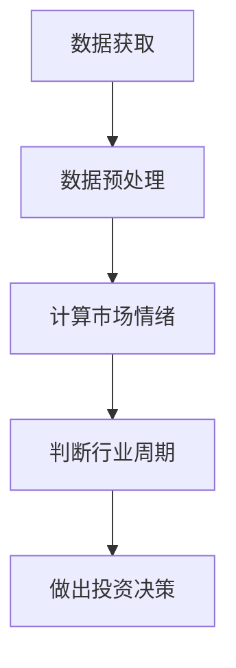
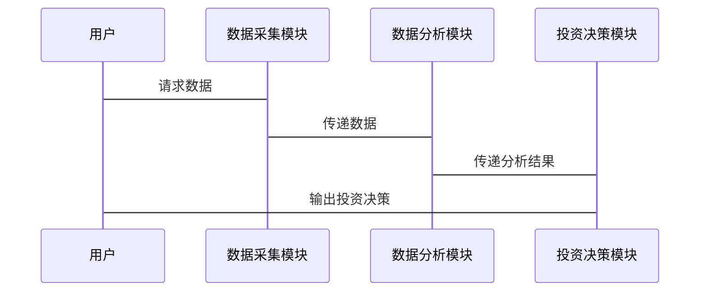

                 


# 彼得林奇的"反向投资"在新兴行业的应用

## 关键词
- 彼得林奇
- 反向投资
- 新兴行业
- 投资策略
- 数学模型

## 摘要
本文深入探讨了彼得林奇的反向投资策略在新兴行业中的应用。通过分析市场情绪、行业周期和数学模型，结合具体案例和系统架构设计，展示了如何在新兴行业中利用反向投资获得超额收益。文章从理论到实践，详细讲解了反向投资的核心概念、算法实现、系统架构和项目实战，为读者提供了全面的指导。

---

# 第1章: 反向投资的基本概念

## 1.1 反向投资的定义与核心理念

### 1.1.1 什么是反向投资
反向投资是一种与传统投资策略相反的投资方法，强调在市场低迷时买入，在市场繁荣时卖出。其核心理念是“逆市场情绪而行”，即在市场恐慌时寻找机会，在市场狂热时保持冷静。

### 1.1.2 反向投资的核心理念
- **市场非理性**：市场情绪往往会导致价格偏离内在价值。
- **逆向思维**：在市场底部买入，在市场顶部卖出。
- **长期视角**：关注企业的基本面，而非短期市场波动。

### 1.1.3 反向投资与传统投资的区别
| 特性 | 反向投资 | 传统投资 |
|------|----------|----------|
| 投资时机 | 在市场低迷时买入 | 在市场繁荣时买入 |
| 风险管理 | 重视下行风险 | 重视上行收益 |
| 投资策略 | 基于价值，逆市场情绪 | 基于趋势，顺势而为 |

---

## 1.2 彼得林奇的投资风格

### 1.2.1 彼得林奇的投资者画像
- **长期投资者**：彼得林奇以长期投资著称，注重企业基本面。
- **逆向投资者**：在市场恐慌时寻找被低估的投资标的。
- **分散投资**：通过分散投资降低风险。

### 1.2.2 彼得林奇的投资策略
- **价值投资**：寻找具有持续增长潜力的企业。
- **逆向操作**：在市场底部买入，在市场顶部卖出。
- **行业分散**：避免过度集中于单一行业。

### 1.2.3 彼得林奇的成功案例
- **可口可乐案例**：彼得林奇长期持有可口可乐，获得了巨大收益。
- **电信行业案例**：在互联网泡沫破裂后，投资于低估的电信企业。

---

## 1.3 反向投资在新兴行业的应用背景

### 1.3.1 新兴行业的特点
- **高增长潜力**：新兴行业往往处于快速发展阶段。
- **高波动性**：新兴行业的市场波动较大。
- **不确定性高**：新兴行业受政策、技术等因素影响较大。

### 1.3.2 反向投资在新兴行业的适用性
- **周期性波动**：新兴行业容易出现周期性波动，适合反向投资。
- **市场情绪影响**：新兴行业容易受到市场情绪的影响，适合逆向操作。
- **价值发现机会**：新兴行业中有许多被低估的企业，适合反向投资。

### 1.3.3 新兴行业中的投资机会
- **技术创新**：新兴技术行业（如人工智能、区块链）具有巨大潜力。
- **政策支持**：新兴行业 often receives政策支持，具有增长潜力。

---

# 第2章: 市场情绪与周期分析

## 2.1 市场情绪分析

### 2.1.1 市场情绪的定义
市场情绪是指投资者在市场中的心理状态，通常表现为乐观或悲观。

### 2.1.2 市场情绪的指标与测量
- **成交量**：成交量是市场情绪的重要指标。
- **波动率**：波动率反映了市场的不确定性。
- **投资者情绪指数**：通过问卷调查等方式测量市场情绪。

### 2.1.3 市场情绪与投资决策的关系
市场情绪与投资决策密切相关。当市场情绪过热时，投资者倾向于高估资产价值；当市场情绪恐慌时，投资者倾向于低估资产价值。

---

## 2.2 行业周期分析

### 2.2.1 行业周期的四个阶段
- **导入期**：新兴行业，市场需求小，竞争少。
- **成长期**：市场需求快速增长，企业利润上升。
- **成熟期**：市场需求稳定，竞争激烈。
- **衰退期**：市场需求下降，企业利润下降。

### 2.2.2 行业周期与投资机会
- **导入期**：适合长期投资者。
- **成长期**：适合价值投资者。
- **成熟期**：适合价值投资者。
- **衰退期**：适合逆向投资者。

### 2.2.3 如何判断行业周期的位置
- **行业增长率**：通过行业增长率判断行业所处阶段。
- **市场容量**：通过市场容量判断行业所处阶段。
- **竞争格局**：通过竞争格局判断行业所处阶段。

---

# 第3章: 反向投资的数学模型与算法

## 3.1 反向投资的数学模型

### 3.1.1 市场情绪指数模型
$$市场情绪指数 = \sum (情绪指标_i)$$

### 3.1.2 行业周期模型
$$行业周期阶段 = \text{根据行业增长率和市场容量判断}$$

### 3.1.3 投资决策模型
$$投资决策 = \text{根据市场情绪指数和行业周期阶段判断}$$

---

## 3.2 算法实现

### 3.2.1 数据获取与预处理
```python
import pandas as pd
data = pd.read_csv('market_data.csv')
```

### 3.2.2 情绪指标计算
```python
def calculate_market_sentiment(data):
    # 假设data包含成交量、波动率等指标
    sentiment = data['成交量'] * 0.5 + data['波动率'] * 0.5
    return sentiment
```

### 3.2.3 投资决策算法
```python
def investment_decision(sentiment, industry_phase):
    if sentiment < 0.3 and industry_phase == '导入期':
        return '买入'
    elif sentiment > 0.7 and industry_phase == '成熟期':
        return '卖出'
    else:
        return '观望'
```

---

## 3.3 算法流程图


---

# 第4章: 系统架构与接口设计

## 4.1 系统功能设计

### 4.1.1 数据采集模块
- 从数据库或API获取市场数据。
- 数据清洗和预处理。

### 4.1.2 数据分析模块
- 计算市场情绪指数。
- 判断行业周期阶段。

### 4.1.3 投资决策模块
- 根据市场情绪和行业周期做出投资决策。

---

## 4.2 系统架构设计

### 4.2.1 模块划分
- 数据采集模块
- 数据分析模块
- 投资决策模块

### 4.2.2 数据流设计
- 数据采集模块获取数据，传给数据分析模块。
- 数据分析模块计算市场情绪和行业周期，传给投资决策模块。
- 投资决策模块做出投资决策，输出结果。

### 4.2.3 系统交互设计


---

## 4.3 接口设计

### 4.3.1 数据接口
- REST API接口，用于获取市场数据。

### 4.3.2 算法接口
- 接口函数：`investment_decision(sentiment, industry_phase)`。

### 4.3.3 用户接口
- 前端界面，显示市场情绪、行业周期和投资决策。

---

# 第5章: 项目实战

## 5.1 项目背景
以人工智能行业为例，分析如何应用反向投资策略。

## 5.2 项目实现

### 5.2.1 数据获取
```python
import pandas as pd
data = pd.read_csv('AI_market_data.csv')
```

### 5.2.2 数据分析
```python
def calculate_market_sentiment(data):
    sentiment = data['成交量'] * 0.5 + data['波动率'] * 0.5
    return sentiment
```

### 5.2.3 投资决策
```python
def investment_decision(sentiment, industry_phase):
    if sentiment < 0.3 and industry_phase == '导入期':
        return '买入'
    elif sentiment > 0.7 and industry_phase == '成熟期':
        return '卖出'
    else:
        return '观望'
```

## 5.3 实际案例分析
分析人工智能行业的市场情绪和行业周期，做出投资决策。

---

## 5.4 项目小结
通过实际案例分析，验证了反向投资策略在新兴行业中的有效性。

---

# 第6章: 风险管理与策略优化

## 6.1 风险管理

### 6.1.1 风险来源
- 市场波动风险
- 行业周期风险
- 政策风险

### 6.1.2 风险控制措施
- 设置止损点
- 分散投资
- 定期评估投资组合

---

## 6.2 策略优化

### 6.2.1 策略优化方向
- 提高市场情绪分析的准确性
- 提高行业周期判断的精度
- 结合多种投资策略

---

## 6.3 策略优化案例
通过优化市场情绪分析模型，提高投资决策的准确性。

---

# 第7章: 总结与展望

## 7.1 总结
本文详细探讨了彼得林奇的反向投资策略在新兴行业中的应用，通过数学模型、系统架构和项目实战，展示了如何在新兴行业中利用反向投资获得超额收益。

## 7.2 展望
未来，随着技术的进步和市场的变化，反向投资策略将不断完善，为投资者提供更多机会。

---

## 最佳实践 Tips

- 在新兴行业投资时，要关注市场情绪和行业周期。
- 结合多种投资策略，分散风险。
- 定期评估投资组合，及时调整。

---

## 小结
本文通过理论分析、算法实现和项目实战，全面展示了彼得林奇的反向投资策略在新兴行业中的应用。希望读者能够通过本文，掌握反向投资的核心理念和实际操作方法。

