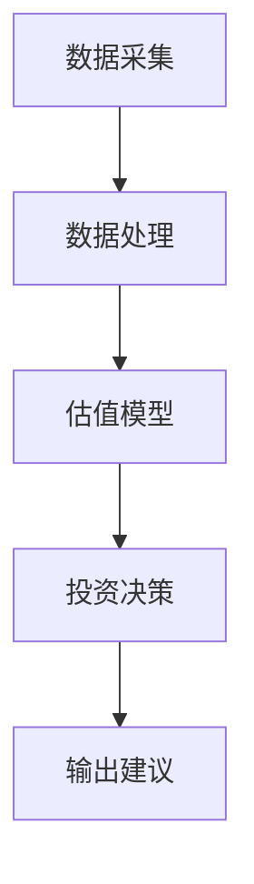
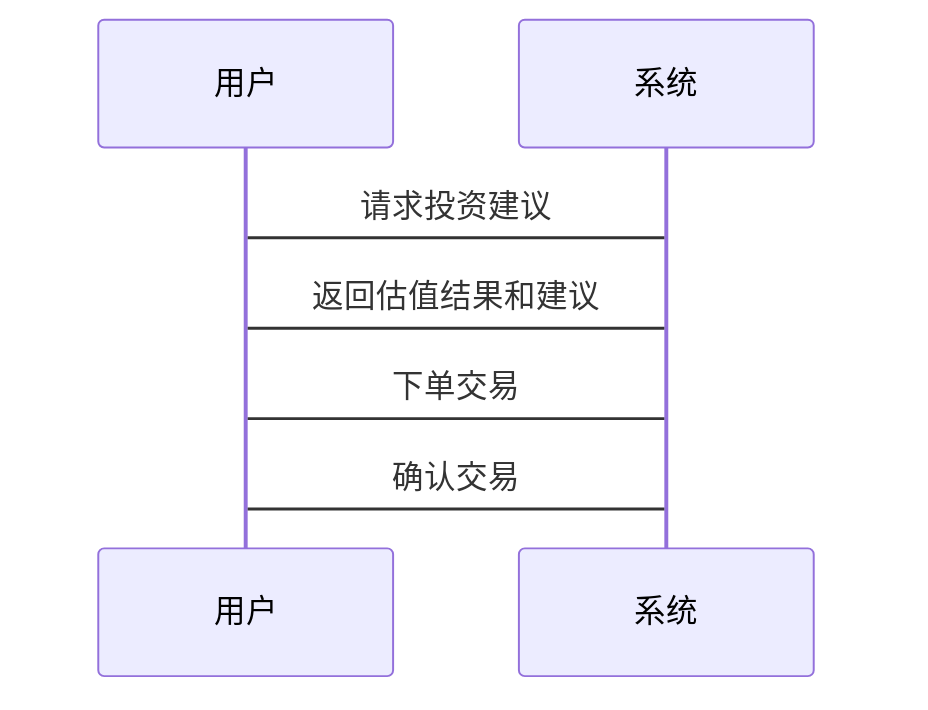

                 


# 彼得林奇的"反向投资"时机选择

> 关键词：反向投资、彼得·林奇、时机选择、投资策略、股票分析、市场周期

> 摘要：本文深入探讨了彼得·林奇的反向投资策略，重点分析了时机选择的重要性及其在投资决策中的应用。通过理论分析、数学建模和实际案例，文章详细阐述了如何识别市场周期、评估价值、制定投资计划，并通过系统架构和项目实战提供可操作的指导。文章最后总结了最佳实践和未来研究方向。

---

## 第1章: 反向投资概述

### 1.1 反向投资的核心概念
#### 1.1.1 投资的基本概念
- 什么是投资？
- 投资的类型：股票、债券、基金等。
- 投资的基本原则：风险与收益的平衡。

#### 1.1.2 反向投资的定义与特点
- 反向投资的定义。
- 与顺势投资的区别。
- 反向投资的核心理念：逆市场情绪而行。

#### 1.1.3 彼得·林奇的投资风格
- 彼得·林奇的生平简介。
- 林奇的投资理念：寻找被市场低估的机会。
- 林奇的成功案例。

### 1.2 彼得·林奇的背景与成就
#### 1.2.1 林奇的生平
- 出生背景：1940年出生于美国波士顿。
- 职业历程：曾管理富达麦哲伦基金，创造了辉煌的投资业绩。
- 著作与影响力：《彼得·林奇的股票投资策略》等书籍。

#### 1.2.2 林奇的投资理念
- 价值投资：寻找基本面良好但被市场低估的股票。
- 长期投资：避免频繁交易，长期持有优质资产。
- 分散投资：降低风险，不将所有资金投入单一股票。

#### 1.2.3 时机选择的重要性
- 投资的三要素：价值、价格、时机。
- 时机选择的核心：在市场低点买入，在市场高点卖出。

---

## 第2章: 反向投资的原理与模型

### 2.1 反向投资的原理
#### 2.1.1 市场周期理论
- 经济周期的四个阶段：复苏、繁荣、衰退、萧条。
- 股市周期与经济周期的关系。

#### 2.1.2 价值与价格的偏离
- 价值的定义：企业内在价值的计算方法。
- 价格的波动：市场情绪对股价的影响。
- 价值与价格的偏离：寻找被低估的股票。

#### 2.1.3 投资者的心理与行为
- 投资者心理偏差：贪婪与恐惧。
- 从众心理与市场趋势。

### 2.2 反向投资的数学模型
#### 2.2.1 市场估值模型
- 市盈率（P/E）：计算公式与应用。
- 市净率（P/B）：计算公式与应用。
- 股息率：计算公式与应用。

#### 2.2.2 投资组合优化模型
- 马科维茨的现代投资组合理论。
- 如何构建最优投资组合。

#### 2.2.3 风险与收益的平衡模型
- 风险调整后的收益（RAR）。
- 如何衡量投资的风险收益比。

### 2.3 反向投资的案例分析
#### 2.3.1 林奇的经典投资案例
- 某个具体股票的分析与操作。
- 时机选择的关键作用。

#### 2.3.2 案例中的时机选择分析
- 市场环境分析。
- 价值评估与价格比较。
- 具体买卖时机的确定。

#### 2.3.3 案例的启示与总结
- 成功的要素：价值、价格、时机。
- 失败的教训：如何避免。

---

## 第3章: 时机选择的策略与技巧

### 3.1 市场分析与时机选择
#### 3.1.1 市场趋势的判断
- 技术分析：K线图、均线、成交量。
- 基本面分析：GDP、利率、行业趋势。

#### 3.1.2 市场波动的周期性
- 如何识别市场的顶部与底部。
- 周期性行业的投资机会。

#### 3.1.3 市场情绪的分析
- 恐慌指数：VIX指数的应用。
- 投资者情绪调查：如何利用市场情绪做出决策。

### 3.2 价值评估与时机选择
#### 3.2.1 企业基本面分析
- 财务报表分析：利润表、资产负债表、现金流量表。
- 估值指标：EV/EBITDA、ROE、ROA。

#### 3.2.2 股票估值方法
- 市盈率法：如何计算合理的市盈率。
- 市净率法：如何计算合理的市净率。
- 现金流折现法：DCF模型的应用。

#### 3.2.3 价值陷阱的识别
- 识别虚假低估值股票的方法。
- 如何避免陷入价值陷阱。

### 3.3 反向投资的实战技巧
#### 3.3.1 技术分析与时机选择
- 技术指标的应用：MACD、RSI、布林带。
- 图形形态的识别：头肩形、双底、三角形。

#### 3.3.2 市场恐慌与投资机会
- 如何利用市场恐慌寻找投资机会。
- 林奇在市场恐慌时的投资策略。

#### 3.3.3 长期与短期的平衡
- 长期投资者的时机选择策略。
- 短期投资者的时机选择策略。

---

## 第4章: 数学模型与算法实现

### 4.1 数学模型的构建
#### 4.1.1 估值模型的数学表达
- 市盈率模型：$$P = E \times PE$$
- 市净率模型：$$P = B \times PB$$
- DCF模型：$$DCF = \frac{CF}{(1 + r)^n}$$

#### 4.1.2 投资组合优化的数学表达
- 均值-方差优化：$$\min \sigma^2 \text{ s.t. } E[r] \geq \text{目标收益}$$
- 如何选择最优权重。

### 4.2 算法实现
#### 4.2.1 估值模型的实现
- 使用Python编写估值模型。
- 示例代码：
  ```python
  def calculate_pe(stock_price, earnings_per_share):
      return stock_price / earnings_per_share
  ```

#### 4.2.2 投资组合优化的实现
- 使用Python的优化库（如scipy.optimize）实现投资组合优化。
- 示例代码：
  ```python
  import numpy as np
  from scipy.optimize import minimize

  def portfolio_optimization(returns, covariance):
      n = len(returns)
      # 定义目标函数
      def objective(weights):
          return np.dot(weights.T, np.dot(covariance, weights)) / 2
      # 约束条件
      constraints = [{'type': 'eq', 'fun': lambda w: np.sum(w) - 1}]
      # 求解
      result = minimize(objective, np.zeros(n), constraints=constraints)
      return result.x
  ```

---

## 第5章: 系统分析与架构设计

### 5.1 系统架构设计
#### 5.1.1 系统功能设计
- 数据采集模块：收集股票数据。
- 数据处理模块：计算估值指标。
- 投资决策模块：基于模型生成投资建议。

#### 5.1.2 系统架构图


#### 5.1.3 系统接口设计
- 数据接口：API调用。
- 用户界面：Web界面或终端界面。

### 5.2 系统交互设计
#### 5.2.1 用户需求分析
- 用户角色：投资者、机构投资者。
- 用户需求：实时数据、估值建议、交易信号。

#### 5.2.2 系统交互流程


---

## 第6章: 项目实战与案例分析

### 6.1 环境安装
#### 6.1.1 安装必要的工具
- Python：安装Anaconda。
- 数据库：MySQL或MongoDB。
- 图形库：Matplotlib、Seaborn。

#### 6.1.2 数据来源
- 股票数据：Yahoo Finance API。
- 经济数据：美联储、商务部网站。

### 6.2 核心实现
#### 6.2.1 数据采集与处理
- 示例代码：
  ```python
  import pandas_datareader as pdr

  def get_stock_data(ticker, start, end):
      data = pdr.get_data_yahoo(ticker, start=start, end=end)
      return data['Adj Close']
  ```

#### 6.2.2 估值模型实现
- 示例代码：
  ```python
  def calculate_pe(ticker):
      data = get_stock_data(ticker, start='2020-01-01', end='2023-12-31')
      earnings = data['Earnings']  # 假设已获取 earnings 数据
      pe_ratio = data['Adj Close'] / earnings
      return pe_ratio.mean()
  ```

### 6.3 案例分析
#### 6.3.1 选择一个具体的股票
- 股票名称：苹果（AAPL）。
- 数据分析：市盈率、市净率、ROE。

#### 6.3.2 时机选择分析
- 市场环境：2020年新冠疫情后的市场。
- 价值评估：苹果的内在价值与市场价比较。
- 买卖时机：底部买入，顶部卖出。

#### 6.3.3 投资决策
- 基于模型的买卖信号。
- 实际操作中的调整。

### 6.4 项目小结
- 项目实现的关键点。
- 可能遇到的问题及解决方案。

---

## 第7章: 最佳实践与小结

### 7.1 最佳实践
#### 7.1.1 投资心态
- 理性投资，避免情绪化决策。
- 长期持有，避免频繁交易。

#### 7.1.2 价值评估
- 选择优质企业，关注基本面。
- 定期复盘，调整投资组合。

#### 7.1.3 时机选择
- 灵活应对市场变化，及时调整策略。
- 结合市场周期，制定长期计划。

### 7.2 小结
- 本文的核心观点。
- 反向投资的优势与挑战。
- 时机选择的重要性。

### 7.3 注意事项
- 投资有风险，入市需谨慎。
- 不要孤注一掷，分散投资。
- 定期学习，更新知识。

### 7.4 拓展阅读
- 推荐书籍：《彼得·林奇的投资智慧》。
- 推荐网站：Yahoo Finance、Morningstar。
- 推荐工具：TradingView、Python金融库。

---

## 附录: 参考文献与工具列表

### 附录A: 参考文献
- 彼得·林奇的书籍。
- 相关投资理论书籍。
- 金融学教材。

### 附录B: 工具列表
- 数据采集工具：pandas_datareader、Yahoo Finance API。
- 数据分析工具：Pandas、NumPy。
- 可视化工具：Matplotlib、Plotly。
- 优化工具：scipy.optimize。

---

## 结语

通过本文的详细分析，我们深入了解了彼得·林奇的反向投资策略，特别是时机选择的重要性。结合理论、模型和实战案例，读者可以更好地理解如何在投资中应用这些策略。未来的研究可以进一步探索更多投资策略和技术，结合人工智能和大数据分析，提升投资决策的科学性和准确性。

