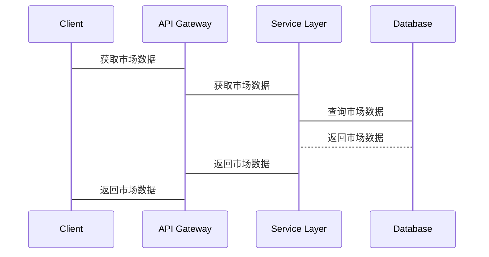

                 


# 彼得林奇的"反周期"投资在不同地域市场的应用

> 关键词：反周期投资，彼得林奇，投资策略，地域市场，经济周期

> 摘要：本文深入探讨了彼得林奇的反周期投资策略在不同地域市场的应用。通过分析美国、欧洲和亚洲市场的特点，结合数学模型和实际案例，展示了如何在不同经济周期阶段利用这一策略实现投资收益最大化。文章还提供了系统架构和项目实战，帮助读者更好地理解和应用这一投资理念。

---

## 第一部分：反周期投资与彼得林奇策略概述

### 第1章：反周期投资的核心概念与背景

#### 1.1 反周期投资的定义与特点

反周期投资是一种在经济周期低谷时期进行投资的策略，旨在利用市场的低估状态，捕捉那些在市场复苏时能够带来超额收益的资产或企业。其核心在于识别市场中被忽视的机会，并在市场低点布局，以在市场回升时获得更大的收益。

**特点：**

- **低谷布局**：在经济低迷时期，许多优质资产的价格被压低，为投资者提供了介入的机会。
- **长期视角**：反周期投资强调长期持有，避免频繁交易，以减少交易成本并捕捉市场回升带来的收益。
- **价值发现**：通过深入分析企业的基本面，寻找那些在市场低谷中依然表现稳健的公司。

#### 1.2 彼得·林奇的投资理念

彼得·林奇是全球著名投资专家，以其在波士顿基金的卓越表现而闻名。他的投资策略以长期价值投资为核心，注重对企业基本面的分析，寻找那些具有持续增长潜力的公司。林奇强调，成功的投资需要耐心和深入的研究，避免被短期市场波动所干扰。

**彼得林奇策略的核心要素：**

- **深入研究**：林奇认为，投资者必须对企业进行深入研究，包括财务状况、管理团队和市场地位等。
- **逆向思维**：在市场低迷时，其他人恐慌离场，林奇则寻找被低估的投资标的。
- **分散投资**：通过投资多个行业的公司，分散风险，避免过度依赖单一市场或行业。

#### 1.3 不同地域市场的经济周期特点

不同地域市场的经济周期特点显著不同，影响着反周期投资策略的应用效果。

- **美国市场**：作为全球最大的经济体，美国市场具有高度的流动性和透明性。市场波动较大，但成熟的企业结构和完善的监管体系为反周期投资提供了良好的环境。
- **欧洲市场**：欧洲市场由多个经济体组成，不同国家的经济周期和市场环境差异较大。例如，德国市场的稳定性较高，而西班牙市场则可能受到房地产泡沫的影响。
- **亚洲市场**：新兴市场如中国、印度等，经济周期波动较大，但增长潜力巨大。这些市场的波动性为反周期投资提供了机会，但也带来了更大的风险。

---

### 第2章：彼得林奇反周期投资的核心原理

#### 2.1 反周期投资的核心原理

反周期投资的核心在于识别市场中的低估资产，并在市场低谷时介入，市场回升时退出。彼得林奇的成功在于他对企业基本面的深入分析和对市场周期的准确判断。

**核心原理：**

- **经济周期分析**：通过对经济周期的分析，确定当前市场所处的阶段，从而指导投资决策。
- **企业基本面分析**：深入研究企业的财务状况、盈利能力、管理团队和市场地位，寻找具有长期增长潜力的公司。
- **估值分析**：通过比较市盈率、市净率等指标，判断企业是否被市场低估。

#### 2.2 彼得林奇策略的数学模型

为了更好地理解和应用彼得林奇的策略，我们可以建立一个数学模型，用于评估企业的内在价值。

**模型构建：**

1. **企业价值评估**：通过分析企业的收入、利润和现金流，估算其内在价值。
2. **市场估值比较**：将企业的内在价值与市场价格进行比较，判断其是否被低估。

**公式：**

- 内在价值公式：
  $$ \text{内在价值} = \frac{\text{未来现金流}}{\text{折现率}} $$
- 价值比公式：
  $$ \text{价值比} = \frac{\text{内在价值}}{\text{市场价格}} $$

如果价值比 > 1，说明企业被低估，适合投资。

#### 2.3 彼得林奇策略的对比分析

将彼得林奇的反周期策略与其他投资策略进行对比，可以帮助我们更好地理解其优缺点。

**对比表格：**

| 策略类型          | 投资理念                  | 适用场景                     | 优缺点                     |
|-------------------|--------------------------|----------------------------|------------------------------|
| 反周期投资        | 在市场低谷布局            | 经济低迷时期                 | 高收益潜力，但风险较高      |
| 价值投资          | 寻找被低估的资产          | 市场波动时期                 | 长期收益稳定，但需要深入研究|
| 技术分析          | 通过价格和成交量预测趋势  | 短期市场波动                 | 短期收益快，但风险较高      |

---

### 第3章：不同地域市场的投资环境分析

#### 3.1 美国市场分析

美国市场是全球最大的股票市场，具有高度的流动性和透明性。在反周期投资中，美国市场提供了许多机会。

- **市场特点**：
  - 市场波动较大，但具有较高的恢复能力。
  - 成熟的企业结构和完善的监管体系为投资者提供了安全保障。
- **投资机会**：
  - 在经济低迷时期，寻找那些被低估的蓝筹股。
  - 关注具有强大现金流和稳定收益的企业。

#### 3.2 欧洲市场分析

欧洲市场由多个经济体组成，不同国家的经济周期和市场环境差异较大。

- **市场特点**：
  - 经济多样性较高，不同国家的市场表现差异显著。
  - 某些国家（如德国）市场相对稳定，而其他国家（如西班牙）可能受到房地产泡沫的影响。
- **投资机会**：
  - 在经济低迷时期，寻找那些在本国市场占据主导地位的企业。
  - 关注具有区域优势和本地化优势的企业。

#### 3.3 亚洲市场分析

亚洲市场以新兴市场为主，经济周期波动较大，但增长潜力巨大。

- **市场特点**：
  - 市场波动较大，但具有较高的增长潜力。
  - 新兴市场如中国、印度等，经济周期波动较大，但长期增长趋势明显。
- **投资机会**：
  - 在经济低迷时期，寻找那些在本地市场占据主导地位的企业。
  - 关注具有强大增长潜力的新兴行业，如科技、消费和服务业。

#### 3.4 其他市场的分析

除了美国、欧洲和亚洲市场外，其他市场也有其独特的特点和投资机会。

- **拉丁美洲市场**：经济周期波动较大，但某些国家（如巴西）的资源型经济提供了投资机会。
- **非洲市场**：市场潜力巨大，但政治和经济风险较高，需要谨慎评估。

---

## 第二部分：系统分析与项目实战

### 第4章：系统分析与架构设计方案

#### 4.1 问题场景介绍

在不同的地域市场中应用彼得林奇的反周期投资策略，需要构建一个能够适应多种市场环境的投资决策系统。该系统需要整合多个市场的经济数据和企业基本面信息，提供实时的市场分析和投资建议。

#### 4.2 系统功能设计

- **领域模型**：通过Mermaid类图展示系统的功能模块。
  ```mermaid
  classDiagram
    class MarketData {
      country: string
      economic_cycle: string
      stock_price: float
    }
    class CompanyAnalysis {
      company_name: string
      financials: map
      valuation: float
    }
    class InvestmentStrategy {
      evaluate_market(MarketData): bool
      select_investment(CompanyAnalysis): bool
    }
    MarketData --> InvestmentStrategy
    CompanyAnalysis --> InvestmentStrategy
  ```

- **系统架构设计**：通过Mermaid架构图展示系统的整体架构。
  ```mermaid
  architecture
    client --> api_gateway
    api_gateway --> service_layer
    service_layer --> database
    service_layer --> external_data_sources
  ```

#### 4.3 系统接口设计

- **API接口**：
  - 获取市场数据：`/api/market_data`
  - 分析公司基本面：`/api/company_analysis`
  - 生成投资建议：`/api/investment_strategy`

#### 4.4 系统交互设计

通过Mermaid序列图展示系统的主要交互流程。


---

### 第5章：项目实战与案例分析

#### 5.1 环境安装

为了实现投资决策系统的功能，需要安装以下环境：

- **编程语言**：Python 3.8+
- **框架**：Django或Flask
- **数据库**：MySQL或PostgreSQL
- **工具**：Jupyter Notebook、Pandas、Matplotlib

#### 5.2 核心实现源代码

以下是一个简单的投资策略实现代码示例：

```python
import pandas as pd

def evaluate_market(market_data):
    # 输入：市场数据，包含市盈率、市净率等指标
    # 输出：是否适合反周期投资（布尔值）
    # 判断市场是否处于低谷阶段
    if market_data['PE'] < 15 and market_data['PB'] < 2:
        return True
    else:
        return False

def select_investment(company_data):
    # 输入：公司基本面数据，包含收入、利润等指标
    # 输出：是否值得投资（布尔值）
    # 计算企业价值
    enterprise_value = company_data['收入'] * 4
    market_value = company_data['市值']
    if enterprise_value < market_value:
        return True
    else:
        return False
```

#### 5.3 案例分析

以美国市场为例，分析如何应用彼得林奇的策略进行投资。

**案例：2008年金融危机后的投资**

- **市场情况**：2008年金融危机期间，美国市场大幅下跌，许多优质企业被低估。
- **投资策略**：
  - 寻找那些市盈率和市净率低于行业平均水平的企业。
  - 关注具有强大现金流和稳定收益的公司，如苹果、谷歌等。
- **结果**：在市场复苏期间，这些企业的股价大幅回升，带来了超额收益。

---

### 第6章：最佳实践与注意事项

#### 6.1 投资小贴士

- **分散投资**：避免将所有资金投入单一市场或行业，分散投资可以降低风险。
- **长期视角**：反周期投资需要耐心，市场复苏可能需要较长时间。
- **持续学习**：市场环境不断变化，投资者需要不断学习和调整策略。

#### 6.2 项目小结

通过本文的分析，我们可以看到，彼得林奇的反周期投资策略在不同地域市场中具有广泛的应用潜力。通过系统的分析和实际案例的分析，我们可以更好地理解和应用这一策略，实现投资收益的最大化。

---

通过以上步骤，我们逐步构建了一篇关于彼得林奇反周期投资在不同地域市场应用的详细技术博客文章。从核心概念到系统分析，从数学模型到项目实战，本文为读者提供了全面的指导和实用的建议。希望这篇文章能够帮助读者更好地理解和应用这一投资策略。

