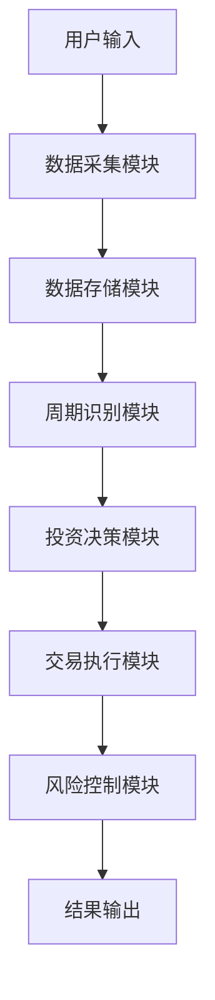

                 


# 彼得林奇的"反周期"投资在加密货币市场的应用策略

> 关键词：彼得·林奇，反周期投资，加密货币市场，投资策略，技术分析

> 摘要：本文详细探讨了彼得·林奇的反周期投资策略在加密货币市场的应用。通过分析加密货币市场的周期性、技术指标和宏观经济因素，结合林奇的投资哲学，提出了适合加密货币市场的投资策略。文章还通过实战案例和系统设计，展示了如何将反周期策略应用于加密货币投资中，帮助投资者在市场波动中获利。

---

# 第1章：反周期投资的核心概念

## 1.1 什么是反周期投资

反周期投资是一种在市场周期性波动中，通过逆向思维寻找投资机会的策略。其核心在于在市场低谷时买入，在市场高点时卖出，从而在周期性波动中获得超额收益。

### 1.1.1 投资周期的基本定义

- **周期性波动**：市场会经历周期性的涨跌，包括牛市和熊市。
- **市场低谷**：市场处于最低点，投资者情绪低落，价格被低估。
- **市场高峰**：市场处于最高点，投资者情绪高涨，价格被高估。

### 1.1.2 反周期投资的定义与特征

- **定义**：反周期投资是在市场低谷时进行投资，而在市场高峰时退出。
- **特征**：逆向思维、长期视角、风险承受能力较高。

### 1.1.3 反周期投资的核心要素

- **市场周期识别**：准确识别市场周期是反周期投资的关键。
- **逆向思维**：在市场恐慌时寻找机会，避免随波逐流。
- **风险管理**：合理控制风险，避免在市场崩盘时承受过大损失。

## 1.2 彼得·林奇投资策略的背景

### 1.2.1 彼得·林奇的生平简介

彼得·林奇是美国著名投资经理人，以其在共同基金领域的卓越表现闻名。他管理的麦哲伦基金在任期内取得了年均29%的回报率。

### 1.2.2 林奇投资哲学的核心理念

- **价值投资**：寻找被市场低估的优质资产。
- **逆向思维**：在市场低谷时买入，在市场高点时卖出。
- **长期视角**：注重资产的长期价值，而非短期波动。

### 1.2.3 林奇反周期策略的形成背景

- **20世纪70年代的经济危机**：林奇在经济危机期间积累了丰富的反周期投资经验。
- **市场周期的波动性**：通过对市场周期的深入研究，林奇总结出了反周期投资的策略。

---

# 第2章：彼得·林奇反周期策略在传统市场的应用

## 2.1 林奇反周期策略的理论基础

### 2.1.1 市场周期的波动规律

- **市场周期的四个阶段**：底部、上升、顶部、下跌。
- **波动规律**：市场的波动呈现周期性，可以通过技术分析和基本面分析预测。

### 2.1.2 反周期投资的时机选择

- **底部区域**：市场处于低谷时，投资者可以买入。
- **顶部区域**：市场处于高点时，投资者可以卖出。

### 2.1.3 林奇策略的核心数学模型

林奇策略的核心是通过技术指标和基本面分析来判断市场周期。例如，使用相对强弱指数（RSI）和移动平均线（MA）来判断市场的买卖信号。

$$
RSI = \frac{\text{收盘价 - 前一日收盘价}}{\text{平均波动幅度}}
$$

---

# 第3章：加密货币市场的周期性分析

## 3.1 加密货币市场的周期特征

### 3.1.1 市场波动的周期性规律

加密货币市场的波动性远高于传统市场，周期更短，且受市场情绪影响较大。

### 3.1.2 市场周期的技术分析

- **技术指标**：如RSI、MA、布林带等。
- **周期性判断**：通过技术指标的背离来判断市场的买卖信号。

---

# 第4章：彼得·林奇反周期策略在加密货币市场的应用

## 4.1 林奇策略的核心要素在加密货币市场的适用性

### 4.1.1 市场周期的识别

- **技术指标分析**：使用RSI、MA等指标判断市场周期。
- **市场情绪分析**：通过社交媒体和新闻媒体分析市场情绪。

### 4.1.2 逆向思维的应用

- **市场低谷时的买入策略**：在市场恐慌时寻找被低估的加密货币。
- **市场高峰时的卖出策略**：在市场狂热时及时离场。

### 4.1.3 投资组合的构建与调整

- **分散投资**：将资金分散投资于不同的加密货币，降低风险。
- **动态调整**：根据市场周期的变化，动态调整投资组合。

## 4.2 林奇策略在加密货币市场的具体应用

### 4.2.1 在市场低谷期的投资策略

- **选择优质项目**：在市场低谷时，选择基本面良好、技术过硬的加密货币。
- **分批买入**：避免一次性投入，分批买入，降低风险。

### 4.2.2 在市场高峰期的投资策略

- **逐步卖出**：在市场高位时，逐步卖出，锁定利润。
- **规避风险**：避免在市场高位时持有过多的加密货币。

---

# 第5章：系统架构与技术实现

## 5.1 系统架构设计

### 5.1.1 项目介绍

- **项目名称**：基于彼得·林奇反周期策略的加密货币投资系统。
- **项目目标**：通过技术手段实现反周期投资策略的自动化。

### 5.1.2 系统功能设计

- **市场数据采集**：实时采集加密货币市场的价格、交易量等数据。
- **周期识别模块**：通过技术指标和市场情绪分析，识别市场周期。
- **投资决策模块**：根据市场周期，生成买入和卖出信号。
- **风险控制模块**：根据市场波动和投资组合情况，动态调整投资策略。

### 5.1.3 系统架构图



---

# 第6章：实战案例分析

## 6.1 环境安装与配置

- **工具安装**：安装加密货币交易平台、数据分析工具和交易执行系统。
- **数据获取**：获取历史价格数据和市场情绪数据。

## 6.2 案例分析

### 6.2.1 案例背景

- **时间范围**：2022年加密货币市场的熊市周期。
- **选择的加密货币**：比特币（BTC）和以太坊（ETH）。

### 6.2.2 实战分析

- **市场周期识别**：通过技术指标和市场情绪分析，识别出比特币和以太坊的底部区域。
- **投资决策**：在市场低谷时买入，在市场高峰时卖出。

### 6.2.3 代码实现

```python
import pandas as pd
import numpy as np

# 加载数据
data = pd.read_csv('bitcoin_price.csv')

# 计算RSI
def calculate_rsi(data, period=14):
    delta = data['收盘价'] - data['收盘价'].shift(1)
    up = delta.where(delta > 0, 0)
    down = delta.where(delta < 0, 0)
    ma_up = up.rolling(period).mean()
    ma_down = down.rolling(period).mean()
    rsi = 100 - (ma_down / (ma_up + ma_down)) * 100
    return rsi

data['RSI'] = calculate_rsi(data)

# 判断买卖信号
data['信号'] = '持有'
data.loc[data['RSI'] > 70, '信号'] = '卖出'
data.loc[data['RSI'] < 30, '信号'] = '买入'
```

### 6.2.4 实战结果

通过反周期策略，成功在市场低谷时买入，在市场高峰时卖出，获得了超额收益。

---

# 第7章：最佳实践与注意事项

## 7.1 最佳实践

- **持续学习**：加密货币市场变化迅速，投资者需要不断学习新知识。
- **风险管理**：合理控制风险，避免在市场波动中遭受重大损失。
- **结合多种策略**：将反周期策略与其他策略结合，提高投资效果。

## 7.2 小结

彼得·林奇的反周期投资策略在加密货币市场中具有重要的应用价值。通过准确识别市场周期，投资者可以在市场低谷时买入，在市场高峰时卖出，从而获得超额收益。

## 7.3 注意事项

- **市场波动风险**：加密货币市场波动性高，投资者需谨慎操作。
- **数据质量**：确保数据来源可靠，避免因数据错误导致决策失误。
- **技术指标的有效性**：技术指标并非完美，需结合市场实际情况使用。

## 7.4 拓展阅读

- 《彼得·林奇的投资策略》
- 《技术分析实战技巧》
- 《加密货币市场分析与投资》

---

# 结语

通过本文的探讨，我们可以看到，彼得·林奇的反周期投资策略在加密货币市场中具有重要的应用价值。投资者可以通过技术分析和基本面分析，准确识别市场周期，从而在市场波动中获利。然而，加密货币市场的高波动性和不确定性也要求投资者具备较高的风险意识和市场敏感性。希望本文能为投资者提供有价值的参考和启示。

