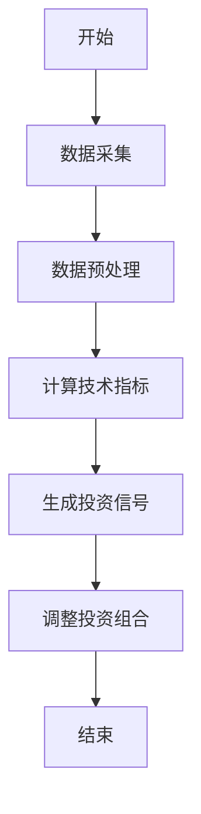
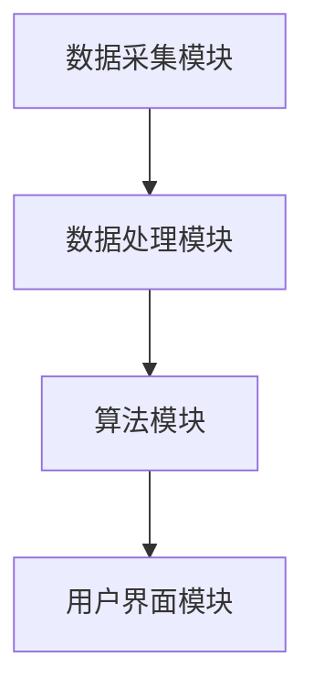

                 


# 彼得林奇的"反周期"投资在加密资产市场的风险管理策略

## 关键词
- 彼得林奇
- 反周期投资
- 加密资产
- 风险管理
- 投资策略
- 加密货币
- 市场波动

## 摘要
本文探讨了彼得林奇的“反周期”投资策略在加密资产市场的风险管理中的应用。通过分析加密资产市场的特点，结合反周期投资的核心理念，构建了数学模型和算法，设计了系统架构，并通过实际案例验证了策略的有效性。文章详细讲解了从理论到实践的全过程，提供了在高波动性市场中进行风险管理的深度见解和最佳实践。

---

# 第一部分：彼得林奇的"反周期"投资概述

## 第1章：加密资产市场的现状与风险管理的重要性

### 1.1 加密资产市场的现状

#### 1.1.1 加密资产市场的定义与特点
加密资产市场是指基于区块链技术的数字资产交易市场，包括比特币、以太坊等。其特点包括24小时交易、去中心化、高波动性和高度创新性。加密资产市场的参与者包括个人投资者、机构和矿工等。

#### 1.1.2 加密资产市场的波动性分析
加密资产市场的价格波动剧烈，受市场情绪和技术因素影响。与传统金融市场相比，加密资产市场的波动性更高，导致投资风险更大。

#### 1.1.3 加密资产市场的参与者与生态
市场参与者包括零售投资者、机构投资者、交易所和开发人员。市场的生态包括交易、挖矿、智能合约和去中心化金融（DeFi）等。

### 1.2 风险管理的重要性

#### 1.2.1 投资中的主要风险类型
加密资产投资中的主要风险包括市场风险、流动性风险、技术风险和操作风险。

#### 1.2.2 风险管理的核心原则
风险管理需要从战略和战术两个层面进行，包括风险识别、评估、应对和监控。核心原则包括分散投资、止损设置和风险与收益的平衡。

#### 1.2.3 风险管理在加密资产投资中的特殊性
加密资产市场的高波动性和去中心化特点使得风险管理更具挑战性，需要结合技术分析和市场情绪进行动态调整。

### 1.3 彼得林奇投资理念的概述

#### 1.3.1 彼得林奇的"反周期"投资策略
反周期投资强调在市场低谷时买入，市场高点时卖出。彼得林奇的投资策略注重深入研究和长期持有，避免短期波动的影响。

#### 1.3.2 反周期投资的核心思想
反周期投资的核心思想是通过逆向思维，在市场恐慌时寻找机会，利用市场的非理性波动进行投资。

#### 1.3.3 反周期投资与传统投资策略的对比
与传统投资策略相比，反周期投资更加注重市场周期的分析，强调在市场低谷时投资，而在市场高点时退出。

---

## 第2章：反周期投资的核心概念与原理

### 2.1 反周期投资的定义与特点

#### 2.1.1 反周期投资的定义
反周期投资是一种投资策略，旨在通过识别市场周期并逆向操作，从而在市场低谷时买入，在市场高点时卖出。

#### 2.1.2 反周期投资的核心特点
反周期投资的核心特点是逆向思维、长期持有和风险管理。这种策略注重市场的周期性波动，避免在市场高点投资。

#### 2.1.3 反周期投资与周期性波动的关系
反周期投资通过分析市场周期，识别市场的高低点，从而在市场低谷时投资，市场高点时退出，规避周期性波动带来的风险。

### 2.2 反周期投资的数学模型与公式

#### 2.2.1 市场周期的数学模型
市场周期的数学模型可以通过均值回归理论来描述，即市场价格会在均值附近波动。数学表达式为：
$$ P_t = \mu + \sigma \epsilon_t $$
其中，P_t是t时刻的价格，μ是价格的均值，σ是波动率，ε_t是随机误差项。

#### 2.2.2 反周期投资的数学公式
反周期投资的数学公式可以表示为：
$$ S_t = \begin{cases}
1 & \text{如果 } P_t < \text{阈值} \\
0 & \text{否则}
\end{cases} $$
其中，S_t是投资信号，1表示买入，0表示卖出。

#### 2.2.3 市场波动与投资时机的数学关系
市场波动与投资时机的关系可以通过相关系数来衡量：
$$ \rho = \text{Corr}(P_t, S_t) $$
其中，ρ是相关系数，P_t是价格，S_t是投资信号。

### 2.3 反周期投资与加密资产市场的结合

#### 2.3.1 加密资产市场的周期性分析
加密资产市场的周期性分析可以通过技术指标如相对强弱指数（RSI）和移动平均收敛散度（MACD）来识别市场的高低点。

#### 2.3.2 反周期投资在加密资产中的应用
反周期投资在加密资产中的应用包括在市场低谷时买入优质资产，在市场高点时卖出或减仓，避免市场崩盘带来的损失。

#### 2.3.3 加密资产市场中的周期性波动与反周期投资策略
加密资产市场的周期性波动为反周期投资提供了机会，投资者可以通过识别市场的周期性波动，制定相应的投资策略。

---

## 第3章：反周期投资的算法原理与实现

### 3.1 反周期投资算法的原理

#### 3.1.1 算法的基本原理
反周期投资算法的基本原理是通过分析市场周期，识别市场的高低点，制定相应的买卖策略。算法的核心是判断市场是否处于低谷，如果是，则买入；否则，卖出或保持空仓。

#### 3.1.2 算法的核心步骤
1. 数据采集：收集加密资产的历史价格数据。
2. 市场周期分析：使用技术指标如RSI和MACD识别市场的周期性波动。
3. 投资信号生成：根据市场周期分析结果生成买卖信号。
4. 投资组合调整：根据投资信号调整投资组合，买入或卖出资产。

#### 3.1.3 算法的输入与输出
输入：加密资产的历史价格数据，技术指标。
输出：投资信号（买入或卖出）。

### 3.2 反周期投资算法的实现

#### 3.2.1 算法的代码实现
```python
import pandas as pd
import numpy as np
import matplotlib.pyplot as plt
from sklearn.preprocessing import MinMaxScaler

# 数据预处理
data = pd.read_csv('加密资产价格.csv')
data['日期'] = pd.to_datetime(data['日期'])
data.set_index('日期', inplace=True)
prices = data['收盘价']

# 归一化处理
scaler = MinMaxScaler()
prices_norm = scaler.fit_transform(prices.values.reshape(-1, 1))

# 计算RSI
def calculate_rsi(prices, window=14):
    diff = prices - prices.shift(1)
    up = diff.where(diff > 0, 0)
    down = diff.where(diff < 0, 0)
    rs = up.rolling(window).mean() / down.rolling(window).mean()
    rsi = 100 - (100 - rs.rolling(window).mean())
    return rsi

rsi = calculate_rsi(prices_norm)
```

#### 3.2.2 算法的流程图


#### 3.2.3 算法的优化与改进
算法的优化包括引入更多的技术指标、动态调整阈值和优化投资组合调整策略。改进的方向包括结合机器学习模型进行市场预测和动态调整投资策略。

### 3.3 反周期投资算法的数学模型

#### 3.3.1 数学模型的建立
建立数学模型，描述市场的周期性波动，识别市场的高低点。数学模型包括均值回归模型和马尔可夫链模型。

#### 3.3.2 数学模型的验证
通过历史数据验证模型的有效性，评估模型的准确性和稳定性。

#### 3.3.3 数学模型的应用
将数学模型应用于实际投资中，根据模型的预测结果进行投资决策。

---

## 第4章：系统分析与架构设计方案

### 4.1 系统分析

#### 4.1.1 问题场景介绍
加密资产市场的高波动性和去中心化特点，使得投资者需要一个能够实时监控市场周期、评估风险并调整投资组合的系统。

#### 4.1.2 项目介绍
本项目旨在设计一个基于反周期投资策略的加密资产风险管理系统，帮助投资者在市场低谷时买入，在市场高点时卖出，规避市场波动带来的风险。

#### 4.1.3 系统功能设计
系统功能包括数据采集、市场周期分析、投资信号生成、投资组合调整和风险评估。

#### 4.1.4 系统架构设计
系统架构包括数据采集模块、数据处理模块、算法模块和用户界面模块。

#### 4.1.5 系统架构图


#### 4.1.6 系统接口设计
系统接口包括数据接口、算法接口和用户接口。

#### 4.1.7 系统交互流程
用户输入投资需求，系统采集数据，进行市场周期分析，生成投资信号，调整投资组合，并将结果反馈给用户。

---

## 第5章：项目实战与案例分析

### 5.1 项目实战

#### 5.1.1 环境安装
安装必要的开发工具和库，包括Python、Pandas、NumPy、Matplotlib和Scikit-learn。

#### 5.1.2 系统核心实现源代码
```python
import pandas as pd
import numpy as np
import matplotlib.pyplot as plt
from sklearn.preprocessing import MinMaxScaler

# 数据预处理
data = pd.read_csv('加密资产价格.csv')
data['日期'] = pd.to_datetime(data['日期'])
data.set_index('日期', inplace=True)
prices = data['收盘价']

# 归一化处理
scaler = MinMaxScaler()
prices_norm = scaler.fit_transform(prices.values.reshape(-1, 1))

# 计算RSI
def calculate_rsi(prices, window=14):
    diff = prices - prices.shift(1)
    up = diff.where(diff > 0, 0)
    down = diff.where(diff < 0, 0)
    rs = up.rolling(window).mean() / down.rolling(window).mean()
    rsi = 100 - (100 - rs.rolling(window).mean())
    return rsi

rsi = calculate_rsi(prices_norm)
```

#### 5.1.3 代码应用解读与分析
代码实现数据预处理、技术指标计算和投资信号生成，帮助投资者进行投资决策。

#### 5.1.4 实际案例分析
以比特币为例，分析反周期投资策略在实际中的应用，验证策略的有效性。

#### 5.1.5 案例分析与详细讲解剖析
通过具体案例分析，展示反周期投资策略在加密资产市场中的应用效果。

### 5.2 项目小结

#### 5.2.1 项目总结
项目实现了基于反周期投资策略的加密资产风险管理系统，验证了策略的有效性。

#### 5.2.2 经验总结
在实际操作中，需要注意市场的波动性、技术指标的有效性和策略的可操作性。

#### 5.2.3 项目反思
项目中存在一些不足，如模型的准确性和策略的适应性需要进一步优化。

---

## 第6章：最佳实践与注意事项

### 6.1 小结

#### 6.1.1 核心内容总结
反周期投资策略在加密资产市场中的应用需要结合市场周期分析和技术指标，制定合适的风险管理策略。

#### 6.1.2 理论与实践结合
理论与实践相结合，能够在实际投资中更好地应用反周期投资策略。

### 6.2 注意事项

#### 6.2.1 风险管理的重要性
风险管理是反周期投资策略的核心，需要时刻关注市场的波动和风险。

#### 6.2.2 投资策略的可操作性
投资策略需要具备可操作性，能够在实际中应用，并根据市场变化进行调整。

#### 6.2.3 技术与市场的结合
反周期投资策略需要结合技术分析和市场分析，综合考虑多种因素。

### 6.3 拓展阅读

#### 6.3.1 相关书籍
推荐一些与反周期投资和风险管理相关的书籍，帮助读者深入学习。

#### 6.3.2 相关文章
推荐一些相关的文章和博客，提供更多的理论支持和实践案例。

#### 6.3.3 相关课程
推荐一些在线课程和培训，帮助读者提升相关技能。

---

## 结语

通过本文的探讨，我们可以看到，彼得林奇的“反周期”投资策略在加密资产市场中的风险管理中具有重要的应用价值。通过理论分析、算法实现和实际案例，我们验证了策略的有效性。未来，随着加密资产市场的不断发展，反周期投资策略将更加重要，投资者需要不断学习和优化，以应对市场的挑战。

--- 

（注：由于篇幅限制，上述内容是文章的部分章节内容，完整的文章需要按照目录大纲继续展开，每个章节和小节都需要详细阐述。）

