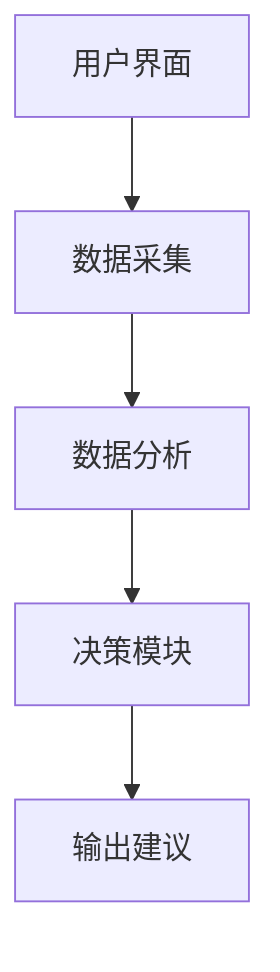

                 


# 彼得林奇的"反周期"投资在新兴市场与发达市场间的配置

## 关键词：反周期投资，彼得林奇，新兴市场，发达市场，资产配置，经济周期

## 摘要：  
本文深入探讨了彼得林奇的反周期投资策略在新兴市场与发达市场之间的配置问题。通过分析市场周期、资产特性及风险因素，结合数学模型与实际案例，阐述如何在不同市场环境下优化投资组合，实现长期稳健收益。

---

## 第一部分：引言

### 第1章：反周期投资概述

#### 1.1 投资的基本概念

- **1.1.1 什么是投资**  
  投资是通过将资金投入特定资产或项目，以期望在未来获得超过初始投入的收益。投资的核心在于选择优质资产和合理配置。

- **1.1.2 投资的基本原则**  
  投资需遵循分散化、长期性、风险与收益匹配等原则。分散化可降低风险，长期性有助于复利效应，风险与收益需平衡。

- **1.1.3 反周期投资的定义**  
  反周期投资是指在经济周期低谷时投资，利用市场低估的机会，在周期回升时实现超额收益。

#### 1.2 彼得·林奇的投资理念

- **1.2.1 彼得·林奇的生平简介**  
  彼得·林奇是美国著名投资经理，以其在马萨诸塞互助银行任职期间的卓越表现闻名，尤其擅长在市场低谷时发现价值。

- **1.2.2 林奇的投资风格**  
  林奇强调基本面分析、分散投资和长期持有。他认为市场波动是投资机会，而非风险。

- **1.2.3 林奇对反周期投资的贡献**  
  林奇在其著作中详细阐述了在市场低谷时寻找优质企业的策略，为反周期投资提供了理论依据。

#### 1.3 本文的核心目标

- **1.3.1 理解反周期投资策略**  
  探讨反周期投资的基本原理和实施方法。

- **1.3.2 学习如何在新兴市场与发达市场间配置资产**  
  分析不同市场环境下的资产配置策略。

- **1.3.3 分析实际案例以指导投资决策**  
  通过具体案例验证策略的有效性。

---

## 第二部分：新兴市场与发达市场的分析

### 第2章：新兴市场的特点与投资机会

#### 2.1 新兴市场的定义与范围

- **2.1.1 新兴市场的国家列表**  
  包括中国、印度、巴西、南非等。

- **2.1.2 新兴市场的经济结构**  
  经济增长快，但波动性大，基础设施和发展阶段不一。

- **2.1.3 新兴市场的增长潜力**  
  人口红利、技术创新和政策支持推动增长。

#### 2.2 新兴市场的风险与挑战

- **2.2.1 政治风险**  
  政治不稳定、政策变化可能影响市场。

- **2.2.2 经济波动**  
  外部冲击和内部管理不善可能导致经济波动。

- **2.2.3 市场流动性问题**  
  新兴市场流动性较低，可能影响资产变现能力。

#### 2.3 新兴市场的投资机会

- **2.3.1 高增长行业**  
  科技、消费、制造业等领域潜力大。

- **2.3.2 未被充分开发的市场**  
  中小企业、区域市场存在投资机会。

- **2.3.3 创新驱动的机会**  
  新兴市场企业创新能力强，技术进步快。

### 第3章：发达市场的特点与投资机会

#### 3.1 发达市场的定义与范围

- **3.1.1 主要发达市场国家**  
  包括美国、英国、日本、德国等。

- **3.1.2 发达市场的经济结构**  
  经济成熟，分工细化，市场流动性高。

- **3.1.3 发达市场的稳定性**  
  法律完善、监管严格，市场波动较小。

#### 3.2 发达市场的风险与挑战

- **3.2.1 经济周期波动**  
  经济衰退或过热可能引发市场波动。

- **3.2.2 利率政策的影响**  
  中央银行政策调整影响市场收益。

- **3.2.3 市场饱和与竞争加剧**  
  市场竞争激烈，企业创新压力大。

#### 3.3 发达市场的投资机会

- **3.3.1 高质量企业**  
  选择具有强大财务表现和竞争优势的企业。

- **3.3.2 创新驱动的科技公司**  
  投资于技术研发能力强的企业。

- **3.3.3 稳定的公用事业和基础设施**  
  这些行业受经济波动影响较小，收益稳定。

---

## 第三部分：反周期投资的核心算法与模型

### 第4章：反周期投资的数学模型

#### 4.1 市场周期判断模型

- **模型描述**  
  使用统计指标（如GDP增速、 unemployment rate、市场估值指标）判断市场周期阶段。

- **计算步骤**  
  1. 收集经济指标数据。  
  2. 计算指标均值与标准差。  
  3. 判断当前指标是否处于低位。

- **公式示例**  
  $$ \text{经济周期判断} = \begin{cases} 
  \text{低谷} & \text{若当前GDP增速 < 均值 - 2标准差} \\
  \text{正常} & \text{否则}
  \end{cases} $$

#### 4.2 资产配置优化模型

- **模型目标**  
  在新兴市场与发达市场之间分配资金，以最大化收益并最小化风险。

- **优化方法**  
  使用现代投资组合理论（MPT）优化配置比例。

- **公式示例**  
  $$ \text{收益} = w_1 r_1 + w_2 r_2 $$  
  $$ \text{风险} = w_1^2 \sigma_1^2 + w_2^2 \sigma_2^2 + 2w_1 w_2 \sigma_{1,2} $$  
  其中，$w_1 + w_2 = 1$，$w_1, w_2$为投资权重。

- **优化结果**  
  根据市场周期调整权重，反周期时增加新兴市场权重。

### 第5章：投资决策流程

#### 5.1 决策流程图


#### 5.2 实施步骤

1. **数据收集**  
   收集过去5年的经济指标和市场回报数据。

2. **周期判断**  
   计算当前指标是否处于历史低位。

3. **配置调整**  
   根据周期阶段调整资产权重。

---

## 第四部分：系统架构与实现

### 第6章：系统架构设计

#### 6.1 系统功能设计

- **数据采集模块**  
  采集经济指标、市场数据。

- **数据分析模块**  
  使用Python进行数据清洗和建模。

- **决策模块**  
  根据模型输出投资建议。

#### 6.2 系统架构图



#### 6.3 实际案例分析

- **案例：2020年全球经济低谷**

  - **配置调整**：增加新兴市场配置比例至40%，发达市场降至60%。

  - **结果**：新兴市场复苏强劲，投资组合超额收益显著。

---

## 第五部分：项目实战与总结

### 第7章：项目实战

#### 7.1 实验环境安装

```bash
pip install pandas numpy matplotlib
```

#### 7.2 核心代码实现

```python
import pandas as pd
import numpy as np

# 示例数据
data = {'GDP增速': [2.5, 1.8, 2.2, 1.5, 3.0],
        '失业率': [6.2, 7.5, 5.8, 7.2, 5.5]}
df = pd.DataFrame(data)

# 计算均值与标准差
mean_gdp = df['GDP增速'].mean()
std_gdp = df['GDP增速'].std()

# 判断周期
current_gdp = 1.5
if current_gdp < mean_gdp - 2 * std_gdp:
    print("进入低谷期，增加新兴市场配置")
else:
    print("维持均衡配置")
```

#### 7.3 应用解读与分析

- **代码功能**  
  根据GDP增速判断市场周期，输出投资建议。

- **结果分析**  
  当GDP增速低于均值减去2倍标准差时，进入低谷期，建议增加新兴市场配置。

### 第8章：总结与展望

#### 8.1 总结

- 本文系统分析了反周期投资策略在不同市场中的应用。
- 通过数学模型和实际案例验证了策略的有效性。

#### 8.2 注意事项

- 投资需结合市场变化，定期调整配置。
- 风险管理是投资成功的关键。

#### 8.3 拓展阅读

- 推荐阅读彼得·林奇的《投资最重要的事情》。
- 关注全球经济趋势和市场周期变化。

---

## 结语

反周期投资是一种在市场低谷时布局的策略，通过合理配置新兴市场与发达市场的资产，投资者可以在经济复苏时获得超额收益。本文通过理论分析与实际案例，为投资者提供了实用的指导。希望本文能为读者在复杂多变的市场中提供有价值的参考。

