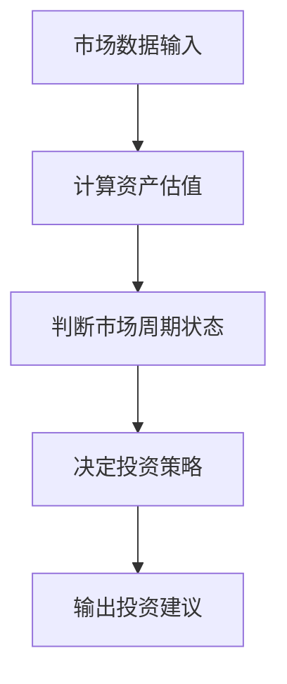
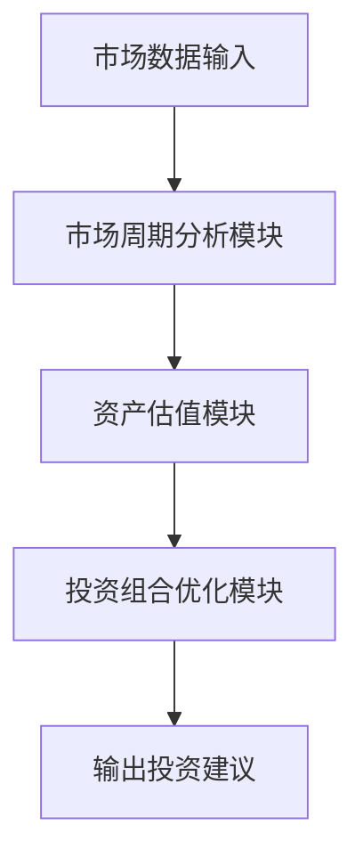

                 


# 彼得林奇的"反周期"投资在新兴资产类别中的应用

> 关键词：反周期投资，彼得林奇，新兴资产类别，投资策略，数学模型

> 摘要：本文深入探讨了彼得林奇的反周期投资理论在新兴资产类别中的应用，从理论基础到实际操作，详细分析了反周期投资的数学模型、系统架构和项目实战。通过案例分析和系统设计，本文展示了如何利用反周期投资策略在新兴资产类别中实现收益最大化，同时控制投资风险。

---

## 第一章：反周期投资的背景与核心概念

### 1.1 反周期投资的定义与特点

反周期投资是一种在市场周期性波动中，通过逆向投资策略来实现超额收益的投资方式。其核心在于在市场低谷时买入，在市场高点时卖出。与传统投资策略不同，反周期投资更注重市场周期的波动性，而非单纯的资产增值。

**特点：**
- **逆向思维：** 在市场恐慌时寻找机会，避免羊群效应。
- **价值发现：** 寻找被市场低估的资产，长期持有。
- **风险管理：** 通过分散投资和严格的风险控制，降低投资组合的波动性。

### 1.2 彼得林奇投资理论的概述

彼得林奇是全球著名投资家，其投资理念以“长期持有优质资产”为核心。他强调深入研究企业基本面，寻找具有持续竞争优势的企业进行投资。反周期投资与彼得林奇的投资理念结合，形成了在市场低谷期投资优质资产的独特策略。

**核心观点：**
- **低估资产：** 逆向寻找被市场低估的资产，尤其是那些在市场低迷时表现不佳但具有长期价值的企业。
- **分散投资：** 通过投资多种资产类别，降低投资组合的波动性。
- **长期持有：** 避免频繁交易，降低交易成本，专注于优质资产的长期增值。

---

## 第二章：反周期投资的核心概念与原理

### 2.1 反周期投资的基本原理

反周期投资的核心在于对市场周期的准确判断。通过分析市场的波动性，投资者可以在市场低谷时买入低估资产，在市场高点时卖出，从而实现超额收益。

**市场周期分析：**
1. **衰退期：** 市场低迷，资产价格被低估，适合买入。
2. **复苏期：** 市场逐渐恢复，资产价格回升。
3. **繁荣期：** 市场过热，资产价格被高估，适合卖出。
4. **萧条期：** 市场恐慌，资产价格继续下跌，寻找下一个低估资产。

### 2.2 彼得林奇投资策略中的反周期特征

彼得林奇的投资策略中，反周期特征主要体现在以下几个方面：

**1. 低估资产的识别：**
- **企业基本面分析：** 通过财务报表分析企业的盈利能力、成长性和抗风险能力。
- **行业地位分析：** 选择具有竞争优势的企业，尤其是那些在行业低谷期表现稳定的公司。

**2. 分散投资策略：**
- **资产类别分散：** 通过投资不同类型的资产（如股票、债券、房地产等），降低投资组合的波动性。
- **行业分散：** 避免过度集中于单一行业，降低行业风险。

**3. 长期持有理念：**
- **避免短期波动：** 长期持有优质资产，避免频繁交易带来的交易成本和税务负担。
- **关注长期价值：** 通过长期持有，分享优质资产的长期增值收益。

---

## 第三章：新兴资产类别与反周期投资的结合

### 3.1 新兴资产类别的特点

新兴资产类别主要包括加密货币、绿色能源、生物科技、人工智能等。这些资产具有以下特点：

**1. 高增长性：** 新兴行业具有较高的增长率，适合长期投资。
**2. 高风险性：** 新兴行业波动性较大，市场风险较高。
**3. 创新驱动：** 新兴行业的发展往往依赖于技术创新，具有较高的不确定性。

### 3.2 反周期投资在新兴资产类别中的应用

**1. 寻找低估资产：**
- 在新兴资产类别中，寻找那些在市场低迷时被低估的企业或项目。例如，在加密货币市场低谷时，选择那些具有强大技术支撑和良好社区支持的项目。

**2. 分散投资策略：**
- 通过投资多种新兴资产类别，降低投资组合的波动性。例如，同时投资绿色能源、生物科技和人工智能领域的资产。

**3. 长期持有理念：**
- 长期持有优质新兴资产，避免短期波动带来的损失。例如，投资于具有长期增长潜力的人工智能公司。

---

## 第四章：反周期投资的数学模型与算法

### 4.1 反周期投资的数学模型

反周期投资的数学模型主要用于市场周期的检测和资产估值的计算。以下是一个简化的数学模型：

**市场周期检测模型：**
$$
\text{市场周期状态} = \begin{cases}
\text{衰退期} & \text{if } \text{资产价格} < \text{历史平均价格} \times 0.8 \\
\text{复苏期} & \text{if } \text{历史平均价格} \times 0.8 \leq \text{资产价格} < \text{历史平均价格} \times 1.2 \\
\text{繁荣期} & \text{if } \text{资产价格} \geq \text{历史平均价格} \times 1.2
\end{cases}
$$

**资产估值模型：**
$$
\text{资产价值} = \text{资产的内在价值} + \text{市场情绪调整值}
$$

### 4.2 反周期投资的算法实现

以下是一个简单的反周期投资算法：



**算法步骤：**
1. **市场数据输入：** 收集相关市场的历史数据，包括资产价格、成交量等。
2. **计算资产估值：** 使用数学模型计算资产的内在价值。
3. **判断市场周期状态：** 根据资产价格与历史平均价格的关系，判断市场所处的周期阶段。
4. **决定投资策略：** 根据市场周期状态，制定相应的投资策略（如买入、卖出或持有）。
5. **输出投资建议：** 提供具体的投资建议，如买入某类资产或卖出某类资产。

---

## 第五章：反周期投资的系统架构设计

### 5.1 系统功能设计

**功能模块：**
1. **市场周期分析模块：** 实现市场周期的检测和判断。
2. **资产估值模块：** 计算资产的内在价值。
3. **投资组合优化模块：** 根据市场周期和资产估值，优化投资组合。

### 5.2 系统架构图



### 5.3 系统接口设计

**接口说明：**
1. **输入接口：** 接收市场数据，如资产价格、成交量等。
2. **输出接口：** 提供投资建议，如买入某类资产或卖出某类资产。

---

## 第六章：反周期投资的项目实战

### 6.1 项目环境安装

**安装步骤：**
1. **安装Python：** 需要安装Python 3.8及以上版本。
2. **安装依赖库：** 使用pip安装numpy、pandas、matplotlib等库。

### 6.2 核心代码实现

```python
import numpy as np
import pandas as pd
import matplotlib.pyplot as plt

def calculate_market_cycle(prices, window=30):
    # 计算历史平均价格
    rolling_mean = prices.rolling(window=window).mean()
    # 判断市场周期状态
    if prices[-1] < rolling_mean[-1] * 0.8:
        return "衰退期"
    elif rolling_mean[-1] * 0.8 <= prices[-1] < rolling_mean[-1] * 1.2:
        return "复苏期"
    else:
        return "繁荣期"

def calculate_asset_value(asset_data):
    # 计算资产的内在价值
    # 简单示例：资产价值 = 资产的账面价值 + 市场情绪调整值
    asset_value = asset_data['book_value'] + (1 if asset_data['market_sentiment'] > 0 else -1)
    return asset_value

# 示例数据
prices = pd.Series([100, 90, 80, 70, 60, 50, 40, 30, 20, 10], index=range(10))
window = 10
print("市场周期状态：", calculate_market_cycle(prices, window))
```

### 6.3 案例分析

**案例：** 在加密货币市场中应用反周期投资策略。

**步骤：**
1. **数据收集：** 收集比特币的价格数据。
2. **市场周期判断：** 判断市场所处的周期阶段。
3. **资产估值：** 计算比特币的内在价值。
4. **制定投资策略：** 根据市场周期和资产估值，制定相应的投资策略。

**结果：**
- 如果市场处于衰退期，且比特币价格被低估，则建议买入比特币。
- 如果市场处于繁荣期，且比特币价格被高估，则建议卖出比特币。

---

## 第七章：总结与展望

### 7.1 最佳实践 tips

- **长期持有：** 保持对优质资产的长期持有，避免短期波动带来的损失。
- **分散投资：** 通过投资多种资产类别，降低投资组合的波动性。
- **风险管理：** 严格控制风险，避免过度集中于某一种资产。

### 7.2 小结

本文详细探讨了彼得林奇的反周期投资理论在新兴资产类别中的应用，从理论到实践，全面分析了反周期投资的数学模型、系统架构和项目实战。通过案例分析和系统设计，展示了如何利用反周期投资策略在新兴资产类别中实现超额收益。

### 7.3 注意事项

- **市场风险：** 新兴资产类别具有较高的市场风险，投资者需谨慎操作。
- **数据质量：** 数据的准确性和完整性对市场周期判断和资产估值至关重要。
- **模型局限性：** 数学模型和算法具有一定的局限性，需结合实际情况进行调整。

### 7.4 拓展阅读

- **《彼得林奇的成功投资》**：深入理解彼得林奇的投资理念。
- **《反周期投资策略》**：学习更多反周期投资的理论和实践。

---

通过本文的分析和实践，读者可以更好地理解反周期投资在新兴资产类别中的应用，并在实际投资中灵活运用这些策略，实现长期稳定的收益。

