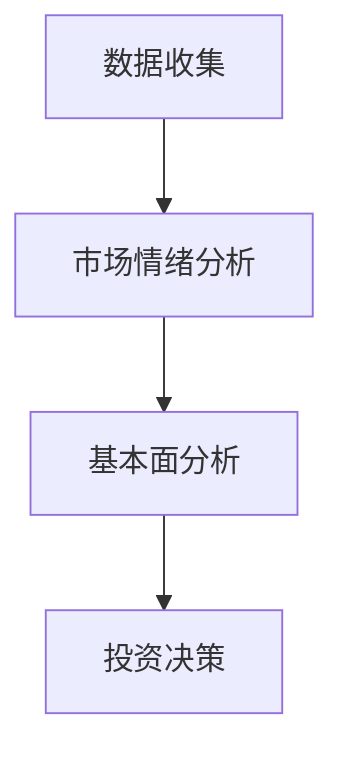
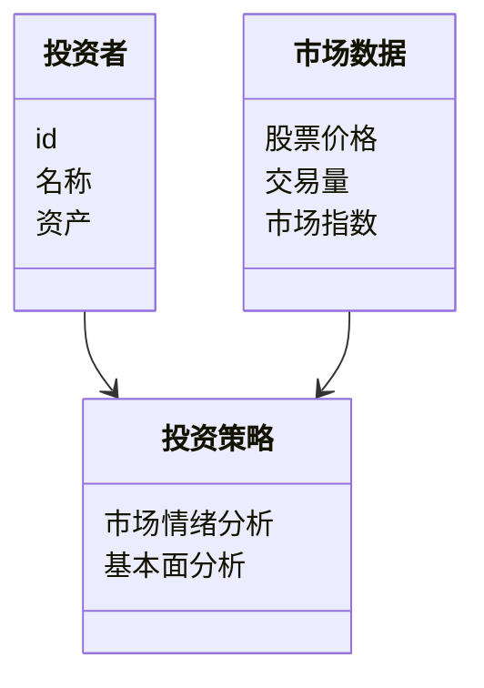
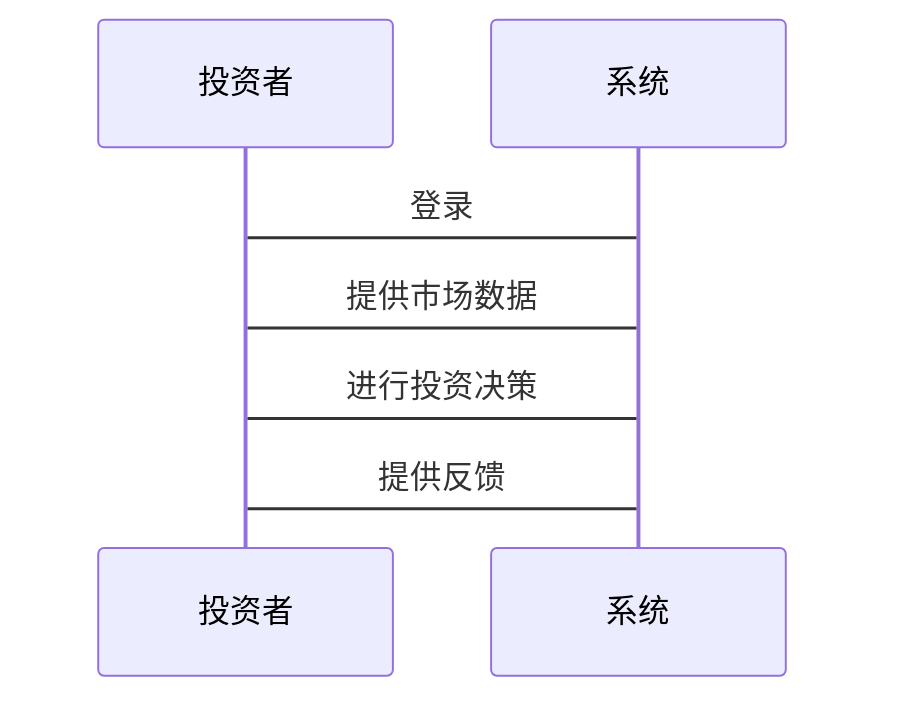

                 


# 彼得林奇的"反周期"投资心理建设

> 关键词：反周期投资，彼得林奇，投资心理，市场波动，长期投资策略

> 摘要：本文深入探讨了彼得林奇在投资过程中如何进行“反周期”心理建设，分析了他的投资理念、策略以及如何在市场低迷期保持心理稳定，为投资者提供实用的心理建设方法。

---

# 第一部分：反周期投资心理建设的背景与核心概念

## 第1章：反周期投资心理建设的背景与意义

### 1.1 投资心理建设的基本概念

#### 1.1.1 投资心理建设的定义
投资心理建设是指投资者在面对市场波动时，通过自我调节和心理训练，保持理性决策能力的过程。它强调心理素质的提升，以应对市场中的不确定性。

#### 1.1.2 投资心理建设的重要性
在金融市场中，情绪往往会影响投资者的决策。良好的心理建设能够帮助投资者在面对市场波动时，避免冲动性决策，从而提高投资回报率。

#### 1.1.3 反周期投资的定义与特点
反周期投资是一种在市场低迷期进行投资的策略。其特点是逆市场趋势而动，利用市场的低估来寻找投资机会。反周期投资的核心在于识别市场底部，并在市场复苏时获得超额收益。

### 1.2 彼得林奇投资风格概述

#### 1.2.1 彼得林奇的投资者画像
彼得林奇以长期投资和价值投资著称，他注重分析公司的基本面，寻找那些具有长期增长潜力的公司。他的投资风格稳健，注重风险控制。

#### 1.2.2 彼得林奇的成功投资哲学
彼得林奇认为，成功的投资需要耐心和长期视角。他强调选择优质公司，而非短期市场波动。他的投资哲学以基本面分析为核心，结合市场情绪进行判断。

#### 1.2.3 彼得林奇与反周期投资的关联
彼得林奇在市场低迷期表现出色，他能够在市场恐慌时找到低估的股票，进行长期投资。这种在市场低谷期进行投资的策略，正是反周期投资的典型应用。

### 1.3 反周期投资的核心理念

#### 1.3.1 反周期投资的定义
反周期投资是指在市场低迷期进行投资，利用市场的低估来获取未来市场复苏的超额收益。其核心在于逆市场趋势而动，寻找被市场忽视的投资机会。

#### 1.3.2 反周期投资与传统投资的区别
传统投资策略通常跟随市场趋势，而在市场高涨时买入，而在市场低迷时卖出。反周期投资则相反，它在市场低迷时买入，市场高涨时卖出。

#### 1.3.3 反周期投资的心理特征
反周期投资需要投资者具备坚强的心理素质，能够在市场恐慌时保持冷静，坚持长期投资理念。同时，还需要具备独立思考能力，不受市场情绪影响。

---

## 第2章：反周期投资的心理机制

### 2.1 投资者情绪分析

#### 2.1.1 投资者情绪的分类
投资者情绪可以分为乐观、悲观、贪婪和恐惧四种类型。在市场低迷期，投资者情绪通常会转向悲观和恐惧。

#### 2.1.2 投资者情绪的波动周期
投资者情绪会随着市场波动而变化，呈现出周期性特征。在市场高峰期，情绪倾向于乐观；在市场低谷期，情绪倾向于悲观。

#### 2.1.3 情绪对投资决策的影响
投资者情绪会影响他们的决策。在市场低迷期，悲观情绪可能导致投资者卖出股票，从而错过市场回升的机会。相反，乐观情绪可能导致投资者在市场高点买入，增加投资风险。

### 2.2 市场认知偏差与心理陷阱

#### 2.2.1 认知偏差的定义与类型
认知偏差是指人们在处理信息时，由于主观因素的影响，导致判断出现偏差。常见的认知偏差包括确认偏差、损失厌恶和从众心理等。

#### 2.2.2 常见投资心理陷阱
投资者在投资过程中容易陷入一些心理陷阱，如过度自信、羊群效应和损失厌恶等。这些偏差会影响投资者的决策，导致投资损失。

#### 2.2.3 彼得林奇如何克服心理偏差
彼得林奇通过长期的市场观察和实践，总结出一套克服心理偏差的方法。他强调基本面分析的重要性，避免被市场情绪左右。

### 2.3 反周期投资的心理策略

#### 2.3.1 逆向思维在投资中的应用
逆向思维是反周期投资的核心策略。投资者在市场低迷时买入，市场高涨时卖出。这种方法需要投资者具备独立思考能力，能够在市场恐慌时保持冷静。

#### 2.3.2 如何培养反周期思维
培养反周期思维需要投资者具备长期视角，关注公司基本面，而非短期市场波动。同时，投资者需要学会在市场低迷时寻找低估的投资机会。

#### 2.3.3 心理韧性与投资决策
心理韧性是反周期投资成功的关键。投资者需要在市场低迷时保持耐心，避免冲动性决策。同时，投资者需要具备坚强的心理素质，能够在市场波动中保持冷静。

---

## 第3章：反周期投资的核心概念与联系

### 3.1 反周期投资的心理模型

#### 3.1.1 心理模型的定义
心理模型是指投资者在面对市场波动时，形成的思维方式和决策模式。心理模型帮助投资者在市场低迷时保持理性，避免情绪化决策。

#### 3.1.2 反周期投资的心理模型构建
反周期投资的心理模型包括以下几个方面：长期视角、基本面分析、风险控制和心理韧性。投资者需要在市场低迷时，运用这些模型进行投资决策。

#### 3.1.3 心理模型与投资决策的关系
心理模型直接影响投资者的决策。在市场低迷时，投资者的心理模型帮助他们识别低估的投资机会，避免被市场情绪左右。

### 3.2 核心概念原理

#### 3.2.1 反周期投资的核心要素
反周期投资的核心要素包括：市场情绪分析、基本面分析、风险控制和心理韧性。这些要素共同作用，帮助投资者在市场低迷时找到投资机会。

#### 3.2.2 反周期投资的数学模型
反周期投资的数学模型主要用于评估市场的情绪和公司基本面。例如，情绪指数可以通过分析市场参与度、交易量和价格波动来计算。基本面模型则通过分析公司的财务数据，评估其内在价值。

#### 3.2.3 反周期投资的逻辑框架
反周期投资的逻辑框架包括以下几个步骤：识别市场情绪、分析公司基本面、评估市场估值、制定投资策略。投资者需要在市场低迷时，系统地应用这些步骤进行投资决策。

### 3.3 核心概念属性特征对比表

| 属性        | 反周期投资          | 传统投资          |
|-------------|---------------------|-------------------|
| 投资时机    | 市场低迷期          | 市场高涨期        |
| 投资策略    | 买入低估资产        | 卖出高估资产      |
| 投资目标    | 获取长期收益        | 获取短期收益      |
| 风险控制    | 强调风险控制        | 强调收益最大化    |

### 3.4 ER实体关系图

```mermaid
erd
    Investment心理模型
    -------
    id: integer primary key
    心理模型: varchar
    投资策略: varchar
    心理韧性: varchar
    风险控制: varchar
```

---

## 第4章：反周期投资的算法原理

### 4.1 算法原理概述

#### 4.1.1 算法的基本原理
反周期投资的算法基于市场情绪分析和基本面分析。算法通过分析市场数据，识别市场低迷期，并筛选出具有长期增长潜力的公司。

#### 4.1.2 算法的核心思想
算法的核心思想是利用市场情绪波动，寻找被市场低估的投资机会。通过分析公司基本面，筛选出具有长期增长潜力的公司。

#### 4.1.3 算法的实现步骤
1. 数据收集：收集市场数据，包括股票价格、交易量、市场指数等。
2. 市场情绪分析：通过分析市场数据，识别市场情绪的变化。
3. 基本面分析：分析公司的财务数据，评估其内在价值。
4. 投资决策：根据市场情绪和基本面分析结果，制定投资策略。

### 4.2 算法流程图



### 4.3 算法的数学模型与公式

#### 4.3.1 市场情绪指数公式
$$
市场情绪指数 = \frac{2 \times 交易量 + 市场指数}{股票价格}
$$

#### 4.3.2 基本面评估公式
$$
内在价值 = \frac{净利润 + 现金储备}{债务总额}
$$

---

## 第5章：反周期投资的系统分析与架构设计

### 5.1 系统功能设计

#### 5.1.1 领域模型


#### 5.1.2 系统架构
```mermaid
architectural
    股票交易系统
    -------
    数据层: 数据库
    业务层: 业务逻辑
    表现层: 用户界面
```

#### 5.1.3 系统接口
- API接口：提供市场数据和投资策略的调用接口。
- 用户界面：提供投资者进行投资决策的界面。

### 5.2 系统交互设计

#### 5.2.1 交互流程
1. 投资者登录系统。
2. 系统提供市场数据和投资策略。
3. 投资者根据系统提供的信息，进行投资决策。
4. 系统记录投资者的决策，并提供反馈。

#### 5.2.2 交互流程图


---

## 第6章：反周期投资的项目实战

### 6.1 环境安装

#### 6.1.1 技术环境
- 操作系统：Windows 10
- 开发工具：PyCharm
- 依赖库：pandas, numpy, matplotlib

#### 6.1.2 安装步骤
1. 安装Python：从官方网站下载并安装Python。
2. 安装依赖库：使用pip安装pandas, numpy, matplotlib。

### 6.2 系统核心实现源代码

#### 6.2.1 市场情绪分析
```python
import pandas as pd
import numpy as np

def calculate_market_sentiment(prices, volume, market_index):
    sentiment = (2 * volume + market_index) / prices
    return sentiment
```

#### 6.2.2 基本面分析
```python
def evaluate_fundamental(fundamental_data):
    net_profit = fundamental_data['净利润']
    cash_reserve = fundamental_data['现金储备']
    debt_total = fundamental_data['债务总额']
    intrinsic_value = (net_profit + cash_reserve) / debt_total
    return intrinsic_value
```

### 6.3 代码应用解读与分析

#### 6.3.1 市场情绪分析代码解读
该函数计算市场情绪指数，输入参数包括股票价格、交易量和市场指数。通过公式计算市场情绪指数，帮助投资者判断市场情绪。

#### 6.3.2 基本面分析代码解读
该函数评估公司的内在价值，输入参数包括净利润、现金储备和债务总额。通过公式计算内在价值，帮助投资者判断公司的投资价值。

### 6.4 实际案例分析和详细讲解剖析

#### 6.4.1 案例分析
假设当前市场低迷，股票价格为10元，交易量为1000，市场指数为800。使用市场情绪分析公式计算市场情绪指数：

$$
市场情绪指数 = \frac{2 \times 1000 + 800}{10} = 280
$$

市场情绪指数较低，说明市场情绪较为悲观，可能是买入的好时机。

#### 6.4.2 详细讲解
通过分析市场情绪指数和公司基本面，投资者可以在市场低迷期找到低估的股票，进行长期投资。这种方法需要投资者具备耐心和心理韧性，能够在市场低谷时坚持投资。

---

## 第7章：反周期投资的心理建设与实战技巧

### 7.1 心理建设的核心要点

#### 7.1.1 培养长期视角
投资者需要将投资视为长期过程，关注公司的长期价值，而非短期市场波动。

#### 7.1.2 强化心理韧性
在市场低迷时，投资者需要保持冷静，避免恐慌性卖出。心理韧性是反周期投资成功的关键。

#### 7.1.3 坚持基本面分析
通过基本面分析，投资者可以识别出具有长期增长潜力的公司，避免被市场情绪左右。

### 7.2 实战技巧总结

#### 7.2.1 逆向思维的应用
在市场低迷时，投资者可以通过逆向思维，寻找低估的投资机会。这种方法需要投资者具备独立思考能力。

#### 7.2.2 风险控制策略
投资者需要制定合理的风险控制策略，避免过度集中投资。通过分散投资，降低投资风险。

#### 7.2.3 持续学习与提升
投资是一项长期学习的过程，投资者需要不断更新知识，适应市场变化。通过学习，投资者可以提高自己的投资能力。

### 7.3 投资者需要注意的事项

#### 7.3.1 避免情绪化决策
投资者在市场低迷时，容易受到悲观情绪影响，做出冲动性决策。这种决策往往会导致投资损失。

#### 7.3.2 风险控制的重要性
投资者需要制定合理的风险控制策略，避免过度集中投资。通过分散投资，降低投资风险。

#### 7.3.3 长期投资的坚持
市场低迷时，投资者需要坚持长期投资理念，避免被短期市场波动影响。长期投资能够帮助投资者获得更高的回报。

### 7.4 拓展阅读与进一步学习

#### 7.4.1 推荐书籍
- 《彼得·林奇的成功投资》
- 《反周期投资策略》

#### 7.4.2 在线资源
- 彼得·林奇的演讲和采访
- 投资心理建设的学术研究

---

## 第8章：总结与展望

### 8.1 本章小结

#### 8.1.1 反周期投资的核心思想
反周期投资是一种在市场低迷期进行投资的策略。通过识别市场情绪和公司基本面，投资者可以在市场低谷时找到投资机会，获得长期收益。

#### 8.1.2 心理建设的重要性
心理建设是反周期投资成功的关键。投资者需要具备长期视角、心理韧性和独立思考能力，能够在市场波动中保持冷静。

#### 8.1.3 投资策略的系统性
反周期投资需要系统性的策略，包括市场情绪分析、基本面分析和风险控制。通过系统的投资策略，投资者可以在市场低迷时做出明智的投资决策。

### 8.2 未来展望

#### 8.2.1 投资心理建设的未来发展
随着市场的不断发展，投资心理建设将变得更加重要。投资者需要不断更新知识，适应市场变化。

#### 8.2.2 反周期投资的前景
反周期投资在市场低迷期具有显著优势。随着市场波动的加剧，反周期投资将越来越受到投资者的重视。

#### 8.2.3 投资者教育的重要性
投资者教育是提升投资能力的关键。通过系统的投资者教育，可以帮助投资者更好地应对市场波动，提高投资收益。

---

# 结语

彼得林奇的反周期投资心理建设为我们提供了一种在市场低迷期进行投资的策略。通过心理建设、基本面分析和系统性的投资策略，投资者可以在市场低谷时找到投资机会，获得长期收益。希望本文能够为投资者提供有益的指导和启示。

--- 

（注：本文仅为示例，实际文章需要根据具体情况进行调整和完善。）

