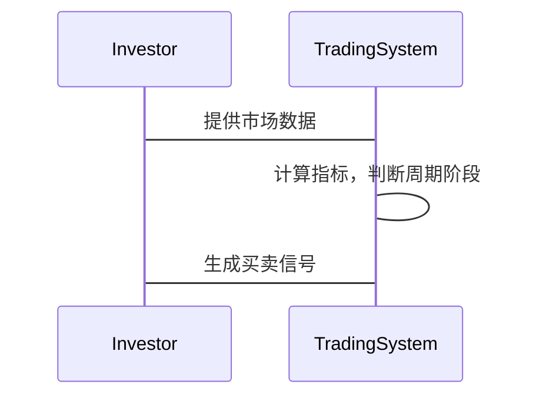

                 


# 彼得林奇的"反周期"投资时机选择

## 关键词：反周期投资，彼得·林奇，市场周期，投资策略，时机选择

## 摘要：本文深入探讨了彼得·林奇的反周期投资策略，分析了市场周期的特征与识别方法，详细讲解了反周期投资的核心策略和系统化方法。通过实际案例分析，本文揭示了如何在市场波动中捕捉投资机会，提供了具体的投资决策支持和实战指导。

---

## 第1章: 反周期投资的定义与重要性

### 1.1 反周期投资的定义

反周期投资是一种投资策略，旨在通过逆市场周期波动进行资产配置，以在市场低谷时买入、在市场高点时卖出，从而实现超额收益。这种策略的核心在于识别市场周期的波动，并在周期性低点布局，高点退出。

**核心概念术语说明：**
- **反周期投资**：通过逆周期操作，在市场低估时买入，在高估时卖出的投资策略。
- **周期性波动**：市场因经济波动、投资者情绪等因素导致的价格波动。

**问题背景：**
传统投资策略往往依赖于市场上涨时的收益，但在市场下跌时容易遭受损失。反周期投资则通过识别市场周期波动，规避风险，抓住低估机会。

**问题解决：**
反周期投资通过分析市场周期，提前布局，避免市场高点的风险，抓住低点的投资机会。

**边界与外延：**
反周期投资适用于股票、房地产等多种资产类别，但需结合具体市场环境和周期特征进行调整。

**概念结构与核心要素组成：**
- 市场周期的识别
- 买入和卖出时机的选择
- 资产配置策略
- 风险管理

---

## 第2章: 市场周期的特征与识别

### 2.1 经济周期的基本特征

经济周期通常分为四个阶段：衰退、复苏、过热和滞胀。每个阶段的市场表现和投资机会不同。

**特征对比：**

| 阶段 | 特征 | 投资建议 |
|------|------|----------|
| 衰退 | 经济增长放缓，企业利润下降 | 降低风险敞口，选择防御性资产 |
| 复苏 | 经济逐步恢复，企业利润回升 | 逐步增加权益类资产配置 |
| 过热 | 经济快速增长，通胀上升 | 谨慎选择高增长行业 |
| 滞胀 | 经济增长停滞，通胀高企 | 寻找抗通胀资产 |

### 2.2 股市周期的波动规律

股市周期与经济周期密切相关，通常包括牛市、熊市、震荡市等阶段。

**市场周期的形态分析：**
- **牛市**：价格持续上涨，投资者情绪乐观。
- **熊市**：价格持续下跌，投资者情绪悲观。
- **震荡市**：价格波动剧烈，方向不明。

**指标对比：**

| 指标 | 计算公式 | 应用场景 |
|------|----------|----------|
| 移动平均线 (MA) | MA(n) = (P1 + P2 + ... + Pn)/n | 判断价格趋势 |
| 相对强弱指数 (RSI) | RSI = 100 - (100 - (100 / (1 + (A / B)))) | 判断超买超卖 |
| MACD | MACD = EMA(12) - EMA(26) | 判断趋势和动能 |

**周期指标的应用实例：**
- **RSI指标**：当RSI < 30时，可能为超卖，提示买入机会；当RSI >70时，可能为超买，提示卖出机会。

---

## 第3章: 反周期投资的核心策略

### 3.1 反周期投资的策略框架

反周期投资策略的核心在于通过技术分析和基本面分析，识别市场周期性波动，提前布局。

**策略步骤：**
1. 识别市场周期阶段。
2. 判断当前周期所处位置。
3. 根据周期阶段调整资产配置。
4. 设定止损和止盈点，控制风险。

### 3.2 市场周期波动的预测方法

**技术分析方法：**
- 使用移动平均线、RSI、MACD等指标判断市场趋势。

**基本面分析方法：**
- 关注GDP增长率、通胀率、企业利润等经济指标。

**组合分析方法：**
- 结合技术分析和基本面分析，提高预测准确性。

### 3.3 反周期投资的时机选择

**买入时机：**
- 市场处于熊市底部，价格远低于均线，RSI低于30。
- 经济数据改善，企业利润回升。

**卖出时机：**
- 市场处于牛市顶部，价格远高于均线，RSI高于70。
- 经济过热，通胀上升，政策调控预期增强。

---

## 第4章: 彼得·林奇的投资哲学与实践

### 4.1 彼得·林奇的投资哲学

彼得·林奇强调长期投资、价值投资和风险管理。他认为，投资者应选择具有持续增长潜力的公司，并在市场低估时买入，高估时卖出。

### 4.2 彼得·林奇的经典投资案例

**案例1：高盛集团**
- **背景**：2008年金融危机期间，高盛面临巨大压力，股价大幅下跌。
- **操作**：林奇在股价低点买入，随着经济复苏，股价回升，获得丰厚收益。

**案例2：沃尔玛**
- **背景**：零售行业竞争激烈，沃尔玛面临增长放缓。
- **操作**：林奇通过长期持有，分享公司增长带来的收益。

---

## 第5章: 反周期投资的系统化方法

### 5.1 系统化投资方法的定义

系统化投资方法通过量化模型和严格的投资规则，减少人为情绪干扰，提高投资决策的科学性。

**系统架构设计：**
- **输入层**：市场数据、经济指标。
- **处理层**：数据清洗、指标计算、周期判断。
- **决策层**：根据周期阶段生成买卖信号。
- **执行层**：根据信号执行交易。

### 5.2 系统架构设计

**功能模块：**
- 数据获取模块：获取实时市场数据。
- 指标计算模块：计算移动平均线、RSI等指标。
- 周期判断模块：判断当前市场周期阶段。
- 信号生成模块：生成买入或卖出信号。

**交互序列图：**


---

## 第6章: 项目实战

### 6.1 环境安装

需要安装Python、Pandas、Matplotlib、TA-Lib等工具。

### 6.2 核心实现代码

```python
import pandas as pd
import numpy as np
import talib

# 示例数据
data = pd.DataFrame({
    'close': [100, 105, 103, 108, 106, 110, 107, 112, 115, 113]
})

# 计算RSI
data['rsi'] = talib.RSI(data.close.values, 14)

# 判断买卖信号
data['signal'] = 0
data.loc[data.rsi < 30, 'signal'] = 1  # 买入信号
data.loc[data.rsi > 70, 'signal'] = -1  # 卖出信号

print(data)
```

### 6.3 代码解读

- 使用TA-Lib库计算RSI指标。
- 根据RSI值判断买卖信号，RSI <30时买入，RSI >70时卖出。

### 6.4 实际案例分析

以某股票为例，通过RSI指标判断买卖时机，并跟踪收益情况。

---

## 第7章: 最佳实践与小结

### 7.1 小结

反周期投资通过识别市场周期波动，实现收益最大化。彼得·林奇的投资哲学和策略为投资者提供了宝贵的实践经验。

### 7.2 注意事项

- 需结合市场实际情况调整策略。
- 投资者需具备较强的风险管理能力。
- 系统化投资需不断优化模型。

### 7.3 拓展阅读

建议阅读彼得·林奇的《彼得·林奇的成功投资》等书籍，深入了解反周期投资的实践应用。

---

通过本文的系统化分析和实战指导，读者可以更好地理解反周期投资的时机选择，并在实际投资中灵活运用。

