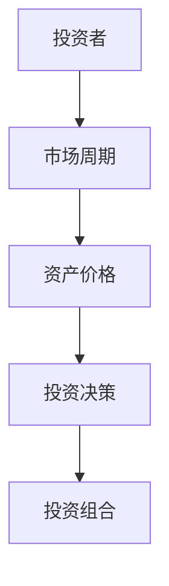
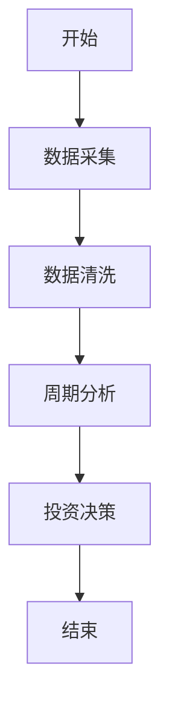
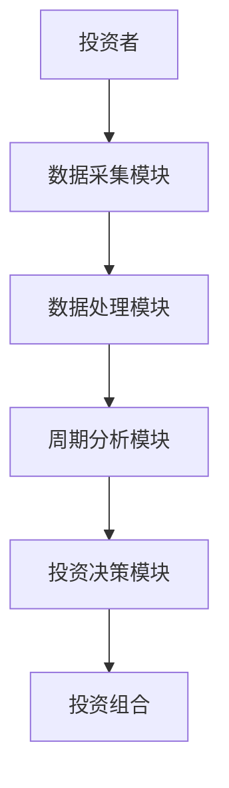

                 


# 彼得林奇的"反周期"投资策略探讨

---

## 关键词：
反周期投资、彼得林奇、投资策略、市场周期、价值投资、风险管理

---

## 摘要：
本文深入探讨了彼得林奇的"反周期"投资策略，分析了其核心概念、算法原理、系统架构及实际应用。文章从市场周期的角度出发，结合反周期投资的理论基础、数学模型和实践案例，全面解读了如何在市场低谷期把握投资机会。通过详细的算法实现和系统设计，本文为投资者提供了反周期投资的完整解决方案。

---

## 第一部分: 彼得林奇的"反周期"投资策略背景介绍

### 第1章: 反周期投资策略的核心概念

#### 1.1 什么是反周期投资
反周期投资是一种在市场周期性波动中，通过逆向思维寻找投资机会的投资策略。其核心理念是在市场低迷期买入低估资产，在市场高点卖出或规避风险。

**反周期投资的定义**：  
反周期投资是指在经济或市场周期的低谷期进行投资，以期在周期回升时获得超额收益。这种策略强调逆向思维，即“别人恐惧时我贪婪，别人贪婪时我恐惧”。

**反周期投资的核心要素**：  
- **市场周期性**：识别市场周期的波动规律。  
- **低估资产**：寻找在市场低谷期被低估的资产。  
- **逆向思维**：在市场恐慌时买入，在市场狂热时卖出。  

**反周期投资与传统投资的区别**：  
- **传统投资**：通常基于趋势跟踪或价值评估，较少考虑市场周期的波动。  
- **反周期投资**：主动识别市场周期的拐点，利用周期性波动获利。  

---

#### 1.2 彼得林奇投资理念概述

**彼得林奇的投资哲学**：  
彼得林奇是美国著名基金经理，曾管理富达麦哲伦基金，创造了年化13.7%的超额收益。他强调长期投资、分散投资和深入研究企业基本面。

**彼得林奇的投资策略**：  
1. **长期持有优质资产**：选择具有竞争优势的企业，长期持有，避免频繁交易。  
2. **分散投资**：通过分散投资降低风险，避免过度集中。  
3. **逆向投资**：在市场恐慌时买入低估资产，在市场狂热时卖出。  

**彼得林奇的成功案例**：  
- 他在2008年金融危机期间大举买入优质股票，抓住了市场的底部机会。  
- 他通过深入研究企业基本面，避免了投资雷区。  

---

#### 1.3 市场周期与投资机会

**市场周期的定义与特征**：  
市场周期是指市场从繁荣到衰退，再从衰退到复苏的循环过程。通常分为四个阶段：  
1. **复苏阶段**：市场逐步企稳，企业盈利能力回升。  
2. **上升阶段**：市场情绪高涨，资产价格快速上涨。  
3. **巅峰阶段**：市场达到高点，可能出现泡沫。  
4. **衰退阶段**：市场下跌，资产价格被低估。  

**不同周期的投资策略**：  
- **衰退阶段**：寻找基本面良好但被市场低估的企业。  
- **复苏阶段**：逐步增加仓位，布局长期增长股。  
- **上升阶段**：锁定收益，逐步减仓。  
- **巅峰阶段**：谨慎观望，避免追高。  

---

#### 1.4 反周期投资的理论基础

**投资学基本原理**：  
反周期投资基于有效市场假说和市场周期理论，认为市场在短期波动中会偏离其内在价值，但在长期会回归。

**市场周期理论**：  
市场周期理论认为，市场波动是周期性的，可以通过分析历史周期来预测未来走势。

**反周期投资的经济学解释**：  
在市场低谷期，资产价格通常低于其内在价值，此时买入可以在市场回升时获得超额收益。这种策略利用了市场的非理性波动，通过逆向操作实现超额收益。

---

## 第2章: 反周期投资的核心概念与联系

### 2.1 反周期投资的原理

**市场波动与投资机会**：  
市场波动是反周期投资的核心，通过分析市场的短期波动，投资者可以在市场低谷期寻找投资机会。

**反周期投资的逻辑框架**：  
1. 识别市场周期的阶段。  
2. 寻找被低估的资产。  
3. 在市场低谷期进行投资。  

**反周期投资的数学模型**：  
反周期投资可以通过统计模型预测市场周期，例如使用移动平均线、相对强弱指数（RSI）等指标。

---

### 2.2 反周期投资的核心概念对比

**概念属性特征对比表**：  

| 投资策略 | 投资时机 | 投资标的 | 风险特征 | 收益特征 |
|----------|----------|----------|----------|----------|
| 价值投资 | 市场低谷期 | 低估资产 | 较高     | 长期稳定 |
| 趋势投资 | 市场上升期 | 高涨资产 | 较低     | 短期高收益 |

---

### 2.3 反周期投资的ER实体关系图

**ER实体关系图的Mermaid流程图**：  


**实体关系图的详细解释**：  
投资者通过分析市场周期，判断资产价格是否被低估，从而做出投资决策，并构建投资组合。

**实体关系图的应用场景**：  
用于分析市场周期对投资决策的影响，帮助投资者在市场低谷期识别投资机会。

---

## 第3章: 反周期投资的算法原理

### 3.1 反周期投资策略的算法流程

**算法流程的Mermaid图**：  


**算法流程的详细步骤**：  
1. 数据采集：获取市场数据（如股票价格、指数等）。  
2. 数据清洗：去除异常值，填充缺失数据。  
3. 周期分析：使用统计方法判断市场所处周期阶段。  
4. 投资决策：根据周期阶段决定投资策略。  

---

### 3.2 反周期投资的数学模型

**移动平均线模型**：  
移动平均线（MA）用于判断市场的短期趋势。  
$$ MA_n = \frac{1}{n} \sum_{i=1}^{n} P_i $$
其中，$P_i$ 是第 $i$ 天的价格，$n$ 是天数。

**相对强弱指数模型**：  
相对强弱指数（RSI）用于判断市场的超买或超卖状态。  
$$ RSI = \frac{100}{1 + \frac{A}{B}} $$
其中，$A$ 是上涨幅度，$B$ 是下跌幅度。

---

### 3.3 反周期投资的Python实现

**数据采集与处理**：  
```python
import pandas as pd
import yfinance as yf

# 下载数据
data = yf.download('AAPL', start='2020-01-01', end='2023-12-31')

# 数据清洗
data = data.dropna()
```

**数据分析与建模**：  
```python
import matplotlib.pyplot as plt

# 绘制股价走势
data['Close'].plot()
plt.title('Apple Stock Price')
plt.xlabel('Date')
plt.ylabel('Price')
plt.show()
```

---

## 第4章: 反周期投资的系统分析与架构设计

### 4.1 问题场景介绍

**问题场景**：  
投资者需要在市场低谷期识别投资机会，避免市场风险。

**系统目标**：  
构建一个反周期投资系统，帮助投资者自动识别市场周期，做出投资决策。

---

### 4.2 系统功能设计

**领域模型Mermaid类图**：  


---

### 4.3 系统架构设计

**系统架构Mermaid图**：  


---

## 第5章: 反周期投资的项目实战

### 5.1 环境安装

**安装Python库**：  
```bash
pip install pandas numpy matplotlib yfinance
```

### 5.2 核心代码实现

**Python代码实现**：  
```python
import pandas as pd
import numpy as np
import matplotlib.pyplot as plt
import yfinance as yf

# 下载数据
data = yf.download(['AAPL', 'MSFT'], start='2020-01-01', end='2023-12-31')

# 计算移动平均线
data['MA_20'] = data['Close'].rolling(20).mean()

# 绘制股价和移动平均线
plt.figure(figsize=(10, 6))
data['Close'].plot(label='Close Price')
data['MA_20'].plot(label='20-Day MA')
plt.title('Stock Price and Moving Average')
plt.xlabel('Date')
plt.ylabel('Price')
plt.legend()
plt.show()
```

---

## 第6章: 反周期投资的最佳实践

### 6.1 小结

反周期投资是一种有效的投资策略，通过逆向思维在市场低谷期寻找投资机会。投资者需要结合市场周期、企业基本面和统计模型，制定合理的投资计划。

---

### 6.2 注意事项

1. **风险管理**：反周期投资风险较高，需合理控制仓位。  
2. **持续学习**：市场环境不断变化，需持续关注市场动态。  
3. **长期视角**：反周期投资需要耐心，避免短期波动干扰判断。  

---

### 6.3 拓展阅读

1. 彼得林奇的《彼得林奇选股术》  
2. 《投资学原理》  
3. 《有效市场假设》  

---

## 总结

彼得林奇的反周期投资策略通过逆向思维，帮助投资者在市场低谷期寻找投资机会。本文从理论到实践，详细分析了反周期投资的核心概念、算法原理和系统架构，并通过Python代码实现了一个简单的反周期投资系统。希望本文能为投资者提供有价值的参考，帮助他们在复杂的市场环境中实现长期收益。

---

