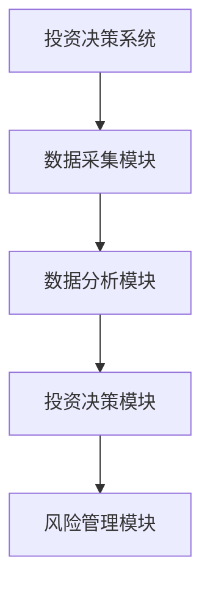

                 


# 彼得林奇的"墓地投资法"

## 关键词：
- 彼得林奇
- 投资策略
- 墓地投资法
- 长期投资
- 价值投资

## 摘要：
本文详细介绍了彼得林奇的"墓地投资法"这一投资策略。首先，文章从彼得林奇的背景和投资理念出发，阐述了墓地投资法的定义、核心概念和优势。接着，通过分析市场环境，探讨了如何在市场底部寻找优质企业，并构建投资组合。随后，文章详细讲解了墓地投资法的数学模型和系统架构，帮助读者更好地理解其原理和实现方式。最后，通过实际案例分析，验证了墓地投资法在实践中的有效性，并提出了投资中的注意事项和未来展望。

---

## 第一部分: 引言

### 1.1 彼得林奇的背景与投资理念

彼得·林奇（Peter Lynch）是美国著名的职业棒球运动员和投资家。他在波士顿红袜队效力期间，以其出色的投球技术和领导能力赢得了广泛的赞誉。然而，真正使他闻名于世的是他在投资领域所取得的辉煌成就。彼得·林奇以其独特的投资理念和实战经验，成为了价值投资领域的权威人物。

彼得·林奇的投资哲学强调长期投资和价值发现。他认为，投资者应该像寻找墓地一样，耐心寻找那些被市场忽视或低估的优质企业。这种投资策略不仅需要对市场有深刻的理解，还需要对企业的基本面进行深入分析。

### 1.2 墓地投资法的起源与核心概念

墓地投资法是彼得·林奇提出的一种独特投资策略。它源于对市场周期的深刻理解，以及对优质企业的长期关注。墓地投资法的核心理念是，在市场低迷时期，当大多数投资者都放弃投资时，优质企业股票的价值会被市场低估，此时正是买入的良机。

墓地投资法的定义可以简单概括为：在市场底部或极度低迷时期，选择那些基本面优秀、具有长期竞争优势的企业进行投资，并耐心持有，等待市场价值回归。

墓地投资法与传统投资方法的区别在于，它更注重长期投资和价值发现，而非短期市场波动。这种方法适用于那些具有强大财务基础、稳定盈利能力且市场地位稳固的企业。

### 1.3 本文的目的与结构安排

本文旨在深入分析彼得·林奇的墓地投资法，揭示其背后的逻辑和实现方法。通过对市场环境、企业选择、投资组合构建等方面的研究，帮助读者理解如何在实际投资中运用这一策略。

本文的结构安排如下：
- 引言部分介绍了彼得·林奇的背景和墓地投资法的起源。
- 核心策略部分详细讲解了墓地投资法的实施步骤和注意事项。
- 市场环境部分分析了如何识别市场底部和选择优质企业。
- 数学模型部分通过市盈率、市净率等指标，展示了如何进行价值评估。
- 系统架构部分设计了一个投资决策模型，并用mermaid图展示了系统的整体架构。
- 项目实战部分通过一个具体案例，分析了墓地投资法在实际投资中的应用。
- 总结部分回顾了本文的主要内容，并提出了未来的投资展望。

---

## 第二部分: 墓地投资法的核心策略

### 2.1 墓地投资法的定义与优势

墓地投资法的核心理念是，在市场低迷时期，当大多数投资者放弃投资时，优质企业的股票会被市场低估，此时正是买入的良机。这种方法的优势在于：
- **长期视角**：墓地投资法强调长期持有优质企业，避免了短期市场波动的干扰。
- **价值发现**：通过深入分析企业的基本面，发现那些被市场低估的优质企业。
- **风险控制**：选择具有强大财务基础和竞争优势的企业，降低了投资风险。

### 2.2 墓地投资法的实施步骤

墓地投资法的实施步骤可以分为以下几个阶段：

#### 2.2.1 确定投资目标
在实施墓地投资法之前，投资者需要明确自己的投资目标。这包括：
- **投资期限**：确定投资的时间跨度，是短期、中期还是长期。
- **风险承受能力**：评估自己对风险的承受能力，选择合适的投资组合。
- **投资范围**：确定投资的行业和企业类型。

#### 2.2.2 选择优质企业
选择优质企业是墓地投资法的关键步骤。彼得·林奇强调，投资者应该选择那些具有强大财务基础、稳定盈利能力且市场地位稳固的企业。具体步骤包括：
- **基本面分析**：通过财务报表分析企业的盈利能力、资产负债情况和现金流状况。
- **竞争优势分析**：评估企业的核心竞争力，包括技术优势、品牌优势和成本优势。
- **行业地位分析**：研究企业在行业中的地位，选择具有领先地位的企业。

#### 2.2.3 长期持有与持续跟踪
墓地投资法的核心是长期持有优质企业股票，并持续跟踪企业的经营状况。投资者需要定期评估企业的基本面变化，并根据市场环境进行适当调整。

### 2.3 墓地投资法的注意事项

#### 2.3.1 风险控制
墓地投资法虽然强调长期投资，但投资者仍需注意风险控制。具体包括：
- **分散投资**：避免将所有资金投入到单一企业或行业，分散投资可以降低风险。
- **定期评估**：定期评估投资组合的表现，并根据市场变化进行调整。

#### 2.3.2 市场波动的应对策略
市场波动是不可避免的，投资者需要制定应对策略：
- **保持耐心**：市场波动可能导致股价短期下跌，但优质企业的长期价值不会因此改变。
- **避免恐慌性抛售**：在市场恐慌时，投资者可能会盲目抛售股票，这往往会造成更大的损失。

#### 2.3.3 投资组合的优化
投资组合的优化是墓地投资法的重要组成部分。投资者需要根据市场变化和个人风险偏好，不断优化投资组合。

---

## 第三部分: 市场环境与投资策略

### 3.1 市场环境分析

#### 3.1.1 市场周期的识别
市场周期的识别是投资成功的关键。投资者需要了解市场的牛熊周期，并在市场底部时寻找投资机会。

#### 3.1.2 市场底部的判断
判断市场底部需要结合多种指标，包括市盈率、市净率、股息率等。此外，投资者还需要关注市场的整体情绪和资金流动情况。

#### 3.1.3 市场顶部的识别
市场顶部的识别相对困难。投资者可以通过分析市场的成交量、资金流动和企业盈利能力等指标，来判断市场的顶部。

### 3.2 优质企业的选择标准

#### 3.2.1 企业的基本面分析
基本面分析是选择优质企业的核心步骤。投资者需要分析企业的财务报表，包括收入、利润、资产负债和现金流等指标。

#### 3.2.2 企业的财务指标
以下是几个重要的财务指标：
- **市盈率（P/E）**：市盈率 = 股价 / 每股净利润。
- **市净率（P/B）**：市净率 = 股价 / 每股净资产。
- **股息率**：股息率 = 每股股息 / 股价。
- **ROE（净资产收益率）**：ROE = 净利润 / 净资产。

#### 3.2.3 企业的竞争优势
企业的竞争优势是其长期盈利能力的重要保障。投资者需要关注企业的技术优势、品牌优势和成本优势。

### 3.3 投资组合的构建与优化

#### 3.3.1 投资组合的构建原则
投资组合的构建需要遵循以下原则：
- **分散投资**：避免集中投资于单一企业或行业。
- **长期持有**：选择优质企业，长期持有，避免频繁交易。

#### 3.3.2 投资组合的优化方法
投资组合的优化可以通过以下方法实现：
- **定期调整**：根据市场变化和企业基本面，定期调整投资组合。
- **动态平衡**：根据市场环境和个人风险偏好，动态调整投资组合的比例。

#### 3.3.3 投资组合的风险管理
风险管理是投资组合优化的重要组成部分。投资者可以通过以下方式管理风险：
- **设置止损点**：在股价下跌到一定程度时，及时止损。
- **分散投资**：通过投资多种资产和行业，降低投资风险。

---

## 第四部分: 数学模型与投资决策

### 4.1 投资价值的数学评估

#### 4.1.1 市盈率模型
市盈率（P/E）是评估企业价值的重要指标。市盈率 = 股价 / 每股净利润。市盈率越低，企业的估值可能越低，投资价值越大。

#### 4.1.2 市净率模型
市净率（P/B）是另一个重要的估值指标。市净率 = 股价 / 每股净资产。市净率越低，企业的估值可能越低，投资价值越大。

#### 4.1.3 内在价值的计算公式
内在价值是企业股票的理论价值。以下是计算内在价值的常用公式：
$$ \text{内在价值} = \frac{\text{净利润} \times (1 + g)}{r - g} $$
其中，$g$ 是净利润增长率，$r$ 是折现率。

---

## 第五部分: 系统架构与项目实战

### 5.1 系统架构设计

#### 5.1.1 系统功能设计
以下是系统的主要功能模块：
- **数据采集模块**：采集企业的财务数据和市场数据。
- **数据分析模块**：对数据进行分析，评估企业的价值。
- **投资决策模块**：根据分析结果，生成投资决策。
- **风险管理模块**：评估投资组合的风险，并进行调整。

#### 5.1.2 系统架构图
以下是系统架构的mermaid图：



### 5.2 项目实战

#### 5.2.1 环境安装
以下是项目实战所需的环境和工具：
- **操作系统**：Windows、macOS 或 Linux。
- **编程语言**：Python 3.8 或更高版本。
- **开发工具**：PyCharm 或 VS Code。
- **数据源**：股票数据可以从Yahoo Finance获取。

#### 5.2.2 核心代码实现

以下是核心代码实现：

```python
import pandas as pd
import numpy as np
import yfinance as yf

# 下载股票数据
def get_stock_data(ticker, start_date, end_date):
    data = yf.download(ticker, start=start_date, end=end_date)
    return data

# 计算市盈率
def calculate_pe(ticker, data):
    pe = data['Close'] / data['净利润']
    return pe

# 计算市净率
def calculate_pb(ticker, data):
    pb = data['Close'] / data['净资产']
    return pb

# 生成投资决策
def generate_investment_decision(ticker, pe, pb):
    if pe < 15 and pb < 2:
        return "买入"
    elif pe > 20 or pb > 3:
        return "卖出"
    else:
        return "持有"

# 主函数
def main():
    ticker = "AAPL"
    start_date = "2020-01-01"
    end_date = "2023-12-31"
    data = get_stock_data(ticker, start_date, end_date)
    pe = calculate_pe(ticker, data)
    pb = calculate_pb(ticker, data)
    decision = generate_investment_decision(ticker, pe, pb)
    print(f"股票代码：{ticker}")
    print(f"市盈率：{pe}")
    print(f"市净率：{pb}")
    print(f"投资决策：{decision}")

if __name__ == "__main__":
    main()
```

#### 5.2.3 案例分析

以下是2008年金融危机期间，墓地投资法在实际投资中的应用案例：

- **案例背景**：2008年金融危机期间，市场恐慌情绪弥漫，许多优质企业的股票价格被大幅低估。
- **案例分析**：彼得·林奇选择了一些具有强大财务基础和竞争优势的企业进行投资，如苹果公司（AAPL）。
- **投资结果**：随着时间的推移，这些企业的股价逐渐回升，投资者获得了丰厚的回报。

---

## 第六部分: 总结

### 6.1 本文的核心内容回顾

本文详细介绍了彼得·林奇的墓地投资法，从其定义、实施步骤到数学模型和系统架构，全面分析了这一投资策略的核心内容。

### 6.2 投资中的长期思维

墓地投资法的核心是长期投资和价值发现。投资者需要耐心等待市场价值的回归，避免被短期市场波动所干扰。

### 6.3 未来的投资展望

随着市场的不断发展，墓地投资法的应用场景和方法也在不断变化。投资者需要根据市场环境和个人风险偏好，灵活调整投资策略，以应对未来的挑战。

---

## 关键词索引
- 彼得林奇
- 墓地投资法
- 长期投资
- 价值投资
- 市盈率
- 市净率

---

## 参考文献
1. 彼得·林奇. 《彼得林奇的成功投资》. 北京: 中信出版社, 2008.
2. 葛拉罕姆. 《聪明的投资者》. 北京: 中信出版社, 2004.
3. 巴菲特. 《巴菲特的投资组合》. 北京: 中信出版社, 2010.

---

## 致谢

感谢读者的耐心阅读，希望本文能为您的投资之旅提供有价值的参考。

