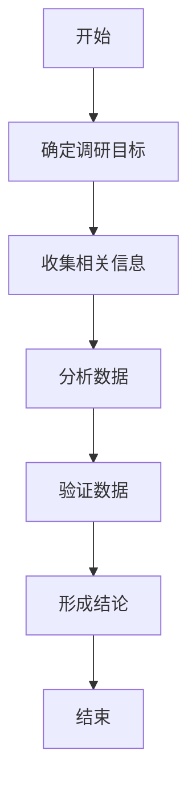

                 


# 彼得林奇的"实地调研"在不同行业的重点

## 关键词：彼得林奇、实地调研、投资分析、行业重点、投资策略、调研方法

## 摘要：彼得林奇作为全球著名投资家，其"实地调研"方法在投资决策中具有重要意义。本文系统分析了实地调研的核心概念、算法原理、系统架构，并结合具体案例，深入探讨了不同行业中的实地调研重点。文章最后总结了实地调研的最佳实践和未来趋势。

---

# 第一部分: 彼得林奇的"实地调研"概述

## 第1章: 彼得林奇投资理念与实地调研背景

### 1.1 彼得林奇投资理念概述
- **1.1.1 彼得林奇的个人背景与投资风格**
  彼得·林奇是美国富达投资集团的前董事长，以价值投资和基本面分析闻名。他强调长期投资和深入研究，认为市场短期波动不可预测，但长期价值可以通过深入分析企业基本面来判断。

- **1.1.2 投资中的"基本面分析"概念**
  基本面分析是指通过对企业财务状况、行业地位、管理团队、市场前景等多方面因素的分析，评估企业的内在价值。林奇认为，基本面分析是投资决策的核心。

- **1.1.3 实地调研在投资中的重要性**
  林奇强调，实地调研是基本面分析的重要组成部分。通过实地考察企业，可以更直观地了解企业的运营状况、管理风格、行业地位等，从而做出更准确的投资决策。

### 1.2 实地调研的背景与意义
- **1.2.1 传统投资分析方法的局限性**
  传统的投资分析方法往往依赖于财务报表和市场数据，但这些数据可能无法反映企业的实际经营状况。实地调研可以弥补这一不足。

- **1.2.2 实地调研在投资决策中的作用**
  实地调研可以帮助投资者更全面地了解企业的实际情况，包括生产能力、库存状况、客户关系、竞争对手情况等，从而做出更准确的投资决策。

- **1.2.3 彼得·林奇实地调研的核心理念**
  林奇认为，实地调研不仅仅是对数据的验证，更是对投资标的深入理解的过程。通过实地调研，投资者可以发现数据背后的真实情况，从而避免被表面数据误导。

### 1.3 本书的目的与结构
- **1.3.1 本书的核心目标**
  本书旨在系统介绍彼得·林奇的实地调研方法，并结合不同行业的特点，分析实地调研的重点和难点。

- **1.3.2 本书的章节安排**
  本书分为七章，内容从理论到实践，逐步深入。第一章介绍林奇的投资理念和实地调研背景，第二章详细讲解实地调研的核心概念和方法论，第三章分析实地调研的算法原理和数学模型，第四章探讨系统分析与架构设计方案，第五章通过具体案例分析实地调研的项目实战，第六章总结实地调研的最佳实践，最后在第七章展望未来趋势。

- **1.3.3 本书的适用读者**
  本书适合投资领域的专业人士、学生以及对投资分析感兴趣的一般读者。通过本书，读者可以深入理解彼得·林奇的实地调研方法，并将其应用于实际投资中。

---

## 第2章: 实地调研的核心概念与方法论

### 2.1 实地调研的核心概念
- **2.1.1 实地调研的定义与特征**
  实地调研是指通过实地考察、访谈、观察等方式，对投资标的进行深入分析的一种调研方法。其核心特征包括直观性、全面性和动态性。

- **2.1.2 实地调研的核心要素**
  包括调研目标、调研对象、调研方法、调研工具、调研数据等。林奇强调，实地调研的核心在于通过数据和事实的结合，发现企业的内在价值。

- **2.1.3 实地调研的边界与外延**
  实地调研的边界在于其数据来源的局限性，外延则包括对调研数据的分析和应用。

### 2.2 实地调研的核心方法
- **2.2.1 信息收集方法**
  包括实地考察、访谈、问卷调查等。林奇特别重视与企业管理层的直接交流，认为这可以更准确地了解企业的经营状况。

- **2.2.2 数据分析方法**
  通过对企业财务数据、行业数据、市场数据等的分析，结合实地调研数据，形成对企业价值的全面评估。

- **2.2.3 信息验证方法**
  通过多渠道验证数据的准确性，确保调研结果的可靠性。

### 2.3 实地调研的关键工具与表格
- **2.3.1 调研表格的设计与应用**
  设计合理的调研表格可以提高调研效率。例如，可以设计包括企业基本信息、财务数据、市场数据等的表格，方便数据整理和分析。

- **2.3.2 数据分析工具的使用**
  使用Excel、SPSS等工具进行数据分析，可以帮助投资者更高效地处理和分析数据。

- **2.3.3 信息验证工具的选择**
  包括企业财报、行业报告、新闻报道等，通过多渠道验证数据的准确性。

### 2.4 实地调研与其他调研方法的对比
- **2.4.1 实地调研与电话调研的对比**
  实地调研更具直观性和全面性，但成本较高；电话调研成本较低，但信息获取的全面性较差。

- **2.4.2 实地调研与网络调研的对比**
  实地调研更具真实性，但受限于时间和成本；网络调研成本低，但信息真实性可能不足。

- **2.4.3 实地调研与问卷调研的对比**
  实地调研更具深度，但覆盖面有限；问卷调研覆盖面广，但深度不足。

---

## 第3章: 实地调研的算法原理与数学模型

### 3.1 实地调研的算法原理
- **3.1.1 数据收集与处理流程**
  包括数据采集、数据清洗、数据整合等步骤，确保数据的准确性和完整性。

- **3.1.2 数据分析与验证方法**
  通过统计分析、对比分析等方法，对数据进行深入分析，并验证数据的准确性。

- **3.1.3 投资决策模型的构建**
  基于实地调研数据，构建投资决策模型，评估企业的内在价值。

### 3.2 实地调研的数学模型
- **3.2.1 数据权重计算公式**
  $$权重 = \frac{数据的重要性}{总数据数}$$

- **3.2.2 投资评估公式**
  $$投资价值 = \sum_{i=1}^{n} (权重_i \times 数据_i)$$

### 3.3 实地调研的流程图


---

## 第4章: 系统分析与架构设计方案

### 4.1 系统分析
- **4.1.1 问题场景介绍**
  在进行实地调研时，需要构建一个完整的调研框架，包括数据收集、数据分析、数据验证等多个环节。

- **4.1.2 项目介绍**
  以某行业的企业为例，构建一个完整的实地调研框架。

### 4.2 系统功能设计
- **4.2.1 领域模型mermaid类图**
  ```mermaid
  classDiagram
      class 企业 {
          名称：String
          财务数据：Float
          市场数据：Float
          管理层：String
      }
      class 调研团队 {
          调研目标：String
          调研方法：String
          调研工具：String
      }
      调研团队 --> 企业: 进行调研
  ```

### 4.3 系统架构设计
- **4.3.1 系统架构设计mermaid架构图**
  ```mermaid
  architecture
      Client
      Server
      Database
      交互层
      业务逻辑层
      数据访问层
  ```

### 4.4 系统交互设计
- **4.4.1 系统交互mermaid序列图**
  ```mermaid
  sequenceDiagram
      调研团队 -> 企业: 发起调研
      企业 -> 调研团队: 提供数据
      调研团队 -> 数据分析工具: 分析数据
      数据分析工具 -> 调研团队: 返回结果
      调研团队 -> 投资决策模型: 形成结论
  ```

---

## 第5章: 项目实战

### 5.1 环境安装
- 安装必要的调研工具，如Excel、SPSS等。

### 5.2 系统核心实现源代码
- **5.2.1 数据分析代码示例**
  ```python
  import pandas as pd

  # 读取数据
  data = pd.read_csv('调研数据.csv')

  # 数据清洗
  data = data.dropna()

  # 数据分析
  print(data.describe())
  ```

### 5.3 代码应用解读与分析
- 通过代码实现数据分析，验证数据的准确性和完整性。

### 5.4 实际案例分析
- 以具体行业为例，分析实地调研的过程和结果。

### 5.5 项目小结
- 总结项目实施的经验和教训，提出改进建议。

---

## 第6章: 实地调研的最佳实践

### 6.1 最佳实践 tips
- **6.1.1 数据收集的注意事项**
  确保数据的准确性和完整性，避免片面性。

- **6.1.2 数据分析的技巧**
  结合多种分析方法，全面评估企业的内在价值。

- **6.1.3 投资决策的策略**
  基于实地调研结果，制定科学的投资决策。

### 6.2 小结
- 总结本书的核心内容，强调实地调研在投资中的重要性。

### 6.3 注意事项
- 提醒读者在实际操作中注意风险控制，避免盲目投资。

### 6.4 拓展阅读
- 推荐相关书籍和资源，供读者进一步学习。

---

## 第7章: 未来趋势与总结

### 7.1 未来趋势
- 随着科技的发展，实地调研将更加依赖于大数据和人工智能技术，提升调研效率和准确性。

### 7.2 总结
- 彼得·林奇的实地调研方法是一种科学的投资分析方法，通过系统的调研和分析，可以帮助投资者做出更准确的投资决策。

---

通过以上结构和内容安排，本书将全面系统地介绍彼得·林奇的实地调研方法，并结合实际案例，深入分析不同行业中的实地调研重点，为投资者提供有价值的参考。

