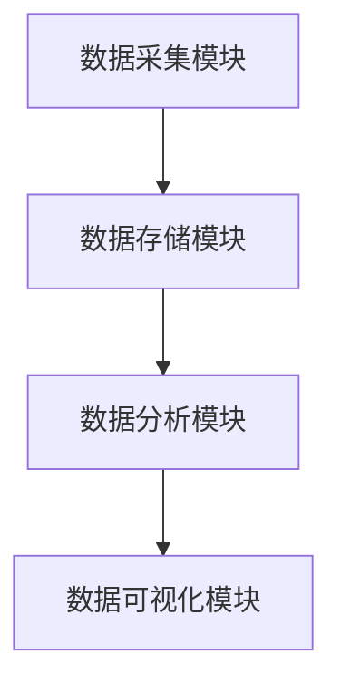
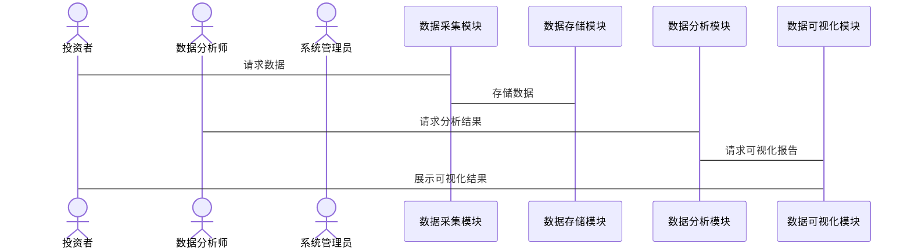

                 


# 彼得林奇的"实地调研"在大数据时代的方法创新

## 关键词：
- 彼得林奇
- 大数据
- 投资分析
- 机器学习
- 数据驱动

## 摘要：
本文探讨了彼得·林奇的传统实地调研方法在大数据时代的创新应用，结合大数据分析、机器学习和自然语言处理技术，提出数据驱动的投资分析新范式。通过具体案例分析，展示了如何利用大数据技术提升投资决策的准确性和效率。

---

## 第一部分: 彼得林奇的实地调研方法在大数据时代的背景与核心概念

### 第1章: 彼得林奇的实地调研方法概述

#### 1.1 彼得林奇投资理念的核心要素

##### 1.1.1 彼得林奇的投资哲学
彼得·林奇是美国著名的共同基金管理人，以其独特的投资哲学闻名。他强调长期投资、深入研究和分散投资，认为市场波动是投资机会的来源。

##### 1.1.2 传统实地调研的核心步骤
1. **行业研究**：分析行业趋势、竞争格局和市场结构。
2. **公司基本面分析**：研究财务报表、管理团队和企业战略。
3. **管理层访谈**：通过与公司高管交流，获取内部信息和未来规划。
4. **竞争对手分析**：研究竞争对手的优势和劣势，评估行业地位。
5. **实地考察**：通过实地访问工厂、仓库和销售网点，了解企业运营状况。

##### 1.1.3 实地调研在投资决策中的作用
实地调研是彼得林奇投资方法的核心，通过深入的调研，他能够发现市场中的潜在机会和风险，从而做出更准确的投资决策。

#### 1.2 大数据时代对投资分析的挑战与机遇

##### 1.2.1 大数据时代的定义与特征
大数据时代指的是数据量急剧增长、数据类型多样化、数据生成速度快的时代。金融行业的数据量以指数级增长，包括股票价格、财务数据、新闻报道、社交媒体信息等。

##### 1.2.2 大数据在金融投资中的应用现状
1. **量化投资**：利用大数据分析和算法交易，寻找市场中的套利机会。
2. **风险控制**：通过大数据分析，识别和评估投资组合中的风险。
3. **市场情绪分析**：利用社交媒体和新闻数据，分析市场情绪，预测市场走势。

##### 1.2.3 实地调研方法在大数据时代的创新需求
随着数据量的爆炸式增长，传统的实地调研方法面临效率和成本的挑战。如何将大数据技术与传统调研方法结合，成为投资分析领域的重要课题。

#### 1.3 本书的核心目标与研究框架

##### 1.3.1 本书的核心目标
探讨如何在大数据时代，将彼得林奇的实地调研方法与大数据分析技术相结合，创新投资分析方法。

##### 1.3.2 研究框架与方法论
1. **文献综述**：总结大数据在金融领域的应用现状。
2. **理论分析**：探讨大数据技术如何提升实地调研的效率和准确性。
3. **案例分析**：通过具体案例，展示大数据驱动的投资分析方法。

##### 1.3.3 本书的结构安排
本书分为四个部分：背景介绍、核心概念、算法实现和系统架构设计。

---

## 第2章: 大数据时代下的投资分析方法创新

### 2.1 数据驱动的投资分析新范式

#### 2.1.1 数据驱动投资分析的定义
数据驱动投资分析是指通过收集和分析大量数据，利用统计学和机器学习方法，发现数据中的规律和趋势，指导投资决策。

#### 2.1.2 数据驱动与传统调研方法的对比

| 对比维度 | 传统调研方法 | 数据驱动方法 |
|----------|--------------|--------------|
| 数据来源 | 以实地考察为主 | 以大数据为主 |
| 数据量 | 较小 | 巨大 |
| 数据类型 | 主要为结构化数据 | 结构化和非结构化数据 |
| 分析效率 | 较低 | 较高 |
| 成本 | 较高 | 较低 |

#### 2.1.3 数据驱动方法的核心优势
1. **高效性**：能够快速处理大量数据，提高分析效率。
2. **准确性**：通过机器学习算法，提高预测的准确性。
3. **全面性**：能够从多源数据中提取信息，发现潜在机会和风险。

### 2.2 大数据技术在金融投资中的应用

#### 2.2.1 数据清洗与特征提取
1. **数据清洗**：去除重复数据、处理缺失值、纠正异常值。
2. **特征提取**：从原始数据中提取有用的特征，如财务指标、市场情绪指标等。

#### 2.2.2 数据挖掘与预测模型
1. **数据挖掘**：利用数据挖掘技术发现数据中的模式和规律。
2. **预测模型**：构建预测模型，如回归模型、分类模型等，预测市场走势。

#### 2.2.3 自然语言处理在文本分析中的应用
1. **文本挖掘**：从新闻、社交媒体等文本数据中提取情感倾向和关键词。
2. **实体识别**：识别文本中的公司名称、人物名称等实体。
3. **情感分析**：分析文本中的情感倾向，预测市场情绪。

### 2.3 机器学习在投资决策中的作用

#### 2.3.1 机器学习的基本概念
机器学习是一种人工智能技术，通过训练模型从数据中学习规律，并利用这些规律进行预测和决策。

#### 2.3.2 常见机器学习算法在投资中的应用
1. **线性回归**：用于预测股票价格走势。
2. **支持向量机（SVM）**：用于分类问题，如判断股票是否为买入信号。
3. **随机森林**：用于特征重要性分析和分类。

#### 2.3.3 机器学习模型的优缺点
| 优缺点 | 优点 | 缺点 |
|--------|-------|------|
| 线性回归 | 简单易懂 | 易受异常值影响 |
| 支持向量机 | 高准确性 | 参数敏感 |
| 随机森林 | 抗过拟合 | 计算复杂 |

---

## 第3章: 数据驱动的实地调研方法论

### 3.1 数据收集与预处理

#### 3.1.1 数据来源的多样性
数据来源包括：
1. **公开数据**：如股票价格、财务报表等。
2. **社交媒体**：如Twitter、Reddit等平台的用户评论。
3. **新闻媒体**：如新闻网站、财经媒体的报道。

#### 3.1.2 数据清洗与标准化
1. **数据清洗**：去除重复数据、处理缺失值、纠正异常值。
2. **数据标准化**：将数据标准化到统一的格式，方便后续分析。

#### 3.1.3 数据特征的提取与选择
1. **特征提取**：从文本数据中提取关键词、情感倾向等特征。
2. **特征选择**：通过统计方法或机器学习方法，选择最重要的特征。

### 3.2 数据分析与投资决策模型构建

#### 3.2.1 数据分析的基本流程
1. **数据探索**：通过可视化工具，探索数据的分布和趋势。
2. **数据建模**：构建预测模型，如回归模型、分类模型等。
3. **模型验证**：通过回测等方式，验证模型的有效性。

#### 3.2.2 投资决策模型的设计与实现
1. **模型设计**：根据投资目标，设计预测模型。
2. **模型实现**：利用Python等编程语言，实现模型的训练和预测。

#### 3.2.3 模型的验证与优化
1. **模型验证**：通过回测、交叉验证等方式，验证模型的准确性。
2. **模型优化**：通过调整参数、选择最优算法，优化模型性能。

### 3.3 机器学习算法在投资分析中的应用

#### 3.3.1 常见机器学习算法介绍
1. **线性回归**：用于预测连续型变量，如股票价格。
2. **逻辑回归**：用于分类问题，如判断股票是否为买入信号。
3. **随机森林**：用于特征重要性分析和分类。

#### 3.3.2 算法选择与优化策略
1. **算法选择**：根据数据类型和任务需求，选择合适的算法。
2. **参数优化**：通过网格搜索等方法，优化模型参数。
3. **模型评估**：通过准确率、召回率等指标，评估模型性能。

#### 3.3.3 算法在投资分析中的具体应用
1. **股票价格预测**：利用历史数据，预测未来股票价格。
2. **市场情绪分析**：通过社交媒体数据，分析市场情绪，预测市场走势。

---

## 第4章: 实地调研与大数据分析的结合

### 4.1 传统实地调研的数字化转型

#### 4.1.1 传统调研方法的局限性
1. **效率低下**：实地调研需要大量时间和人力资源。
2. **成本高昂**：需要支付差旅费、住宿费等。
3. **信息不全面**：仅依赖于现场观察，可能忽略其他重要的数据。

#### 4.1.2 数字化转型的必要性
1. **提高效率**：通过数字化工具，提高调研效率。
2. **降低成本**：减少实地调研的人力和时间成本。
3. **全面性**：结合大数据分析，获取更全面的信息。

#### 4.1.3 数字化转型的具体实现方式
1. **在线调研工具**：利用在线调查工具，进行问卷调查。
2. **数据分析工具**：利用大数据分析工具，处理和分析调研数据。
3. **可视化工具**：利用数据可视化工具，展示调研结果。

### 4.2 大数据分析在实地调研中的应用

#### 4.2.1 大数据分析在行业研究中的应用
1. **行业趋势分析**：通过分析行业数据，预测行业发展趋势。
2. **竞争格局分析**：通过分析竞争对手数据，评估企业的市场地位。

#### 4.2.2 大数据分析在公司基本面分析中的应用
1. **财务数据挖掘**：通过分析财务报表，识别企业的财务风险。
2. **管理团队分析**：通过分析高管的社交媒体数据，评估管理团队的稳定性。

#### 4.2.3 大数据分析在市场情绪分析中的应用
1. **社交媒体分析**：通过分析社交媒体数据，了解市场情绪。
2. **新闻媒体分析**：通过分析新闻数据，预测市场走势。

### 4.3 数据驱动的实地调研方法创新

#### 4.3.1 数据驱动的实地调研流程
1. **数据收集**：收集相关数据，如财务数据、社交媒体数据等。
2. **数据分析**：利用大数据分析技术，处理和分析数据。
3. **模型构建**：构建预测模型，指导投资决策。

#### 4.3.2 创新点
1. **数据来源的多样性**：结合传统调研和大数据分析，获取更全面的信息。
2. **分析效率的提升**：利用机器学习算法，提高分析效率和准确性。
3. **决策的科学性**：通过数据驱动的方法，提高投资决策的科学性和准确性。

---

## 第5章: 系统架构与技术实现

### 5.1 系统功能设计

#### 5.1.1 数据采集模块
1. **数据接口设计**：设计API接口，获取股票价格、财务数据等。
2. **数据存储设计**：设计数据库结构，存储采集的数据。

#### 5.1.2 数据分析模块
1. **数据预处理**：清洗和标准化数据。
2. **特征提取**：从文本数据中提取关键词、情感倾向等特征。
3. **模型训练**：训练机器学习模型，如线性回归、随机森林等。

#### 5.1.3 数据可视化模块
1. **数据可视化工具**：利用Matplotlib、Seaborn等工具，展示数据分析结果。
2. **可视化报告生成**：生成可视化报告，帮助投资者理解分析结果。

### 5.2 系统架构设计

#### 5.2.1 系统架构图


#### 5.2.2 系统接口设计
1. **数据接口**：提供API接口，供其他模块调用。
2. **可视化接口**：提供可视化结果的接口，供前端展示。

#### 5.2.3 系统交互设计


### 5.3 项目实战

#### 5.3.1 环境安装
1. **Python安装**：安装Python 3.8以上版本。
2. **库安装**：安装Pandas、NumPy、Scikit-learn、Matplotlib等库。

#### 5.3.2 核心代码实现

##### 数据采集模块
```python
import requests
import pandas as pd

def get_stock_data(ticker):
    url = f"https://api.example.com/stock/{ticker}"
    response = requests.get(url)
    data = response.json()
    df = pd.DataFrame(data)
    return df
```

##### 数据分析模块
```python
from sklearn.linear_model import LinearRegression
import numpy as np

def train_model(X, y):
    model = LinearRegression()
    model.fit(X, y)
    return model
```

##### 数据可视化模块
```python
import matplotlib.pyplot as plt

def plot_results(predicted, actual):
    plt.plot(predicted, label='预测值')
    plt.plot(actual, label='实际值')
    plt.legend()
    plt.show()
```

#### 5.3.3 代码应用解读与分析
1. **数据采集模块**：通过API接口获取股票数据。
2. **数据分析模块**：利用线性回归模型，训练预测模型。
3. **数据可视化模块**：将预测结果和实际值进行对比，评估模型性能。

#### 5.3.4 案例分析和详细讲解剖析
通过具体案例，展示如何利用上述模块进行股票价格预测。

#### 5.3.5 项目小结
本项目展示了如何将大数据技术与传统调研方法结合，构建数据驱动的投资分析系统。

---

## 第6章: 最佳实践与小结

### 6.1 最佳实践

#### 6.1.1 数据质量的重要性
1. **数据清洗**：确保数据的准确性和完整性。
2. **数据标准化**：将数据标准化到统一的格式，方便后续分析。

#### 6.1.2 模型调优的必要性
1. **参数优化**：通过网格搜索等方法，优化模型参数。
2. **模型评估**：通过准确率、召回率等指标，评估模型性能。

#### 6.1.3 持续学习的重要性
1. **模型更新**：定期更新模型，适应市场变化。
2. **技术学习**：持续学习新技术，提升分析能力。

### 6.2 小结
本文探讨了彼得林奇的实地调研方法在大数据时代的创新应用，结合大数据分析、机器学习和自然语言处理技术，提出数据驱动的投资分析新范式。通过具体案例分析，展示了如何利用大数据技术提升投资决策的准确性和效率。

### 6.3 注意事项
1. **数据隐私**：注意保护数据隐私，遵守相关法律法规。
2. **模型解释性**：确保模型的可解释性，方便投资者理解。
3. **风险控制**：建立完善的风险控制机制，降低投资风险。

### 6.4 拓展阅读
1. **《彼得林奇的投资哲学》**：深入理解彼得林奇的投资理念。
2. **《大数据金融》**：学习大数据在金融领域的具体应用。
3. **《机器学习实战》**：掌握机器学习的核心算法和技术。

---

## 总结

本文通过详细分析彼得林奇的实地调研方法在大数据时代的创新应用，结合大数据分析、机器学习和自然语言处理技术，提出数据驱动的投资分析新范式。通过具体案例分析，展示了如何利用大数据技术提升投资决策的准确性和效率。未来，随着大数据技术的不断发展，数据驱动的投资分析方法将更加成熟，为投资者提供更强大的工具和方法。

--- 

如果需要进一步的细节或更深入的分析，请随时告诉我！

