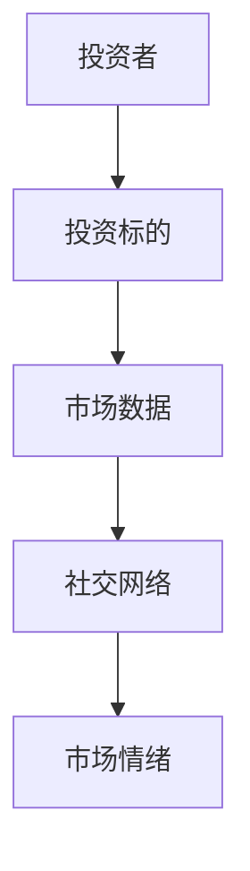
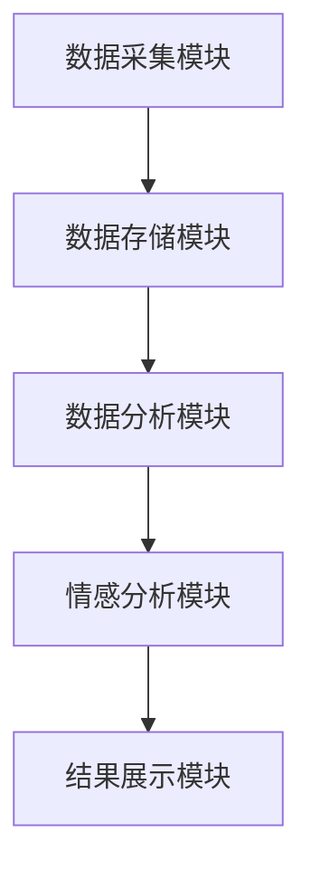
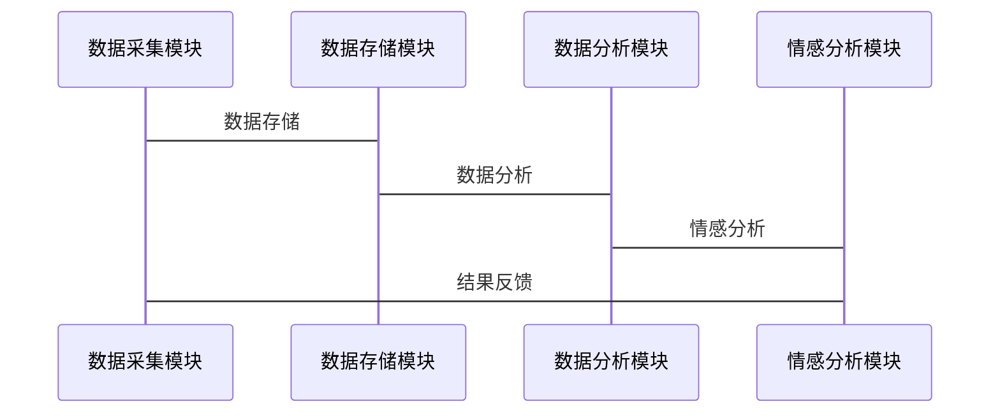

                 


# 彼得林奇的"实地调研"在虚拟经济时代的方法创新

> 关键词：彼得林奇、实地调研、虚拟经济、数据驱动、社交网络分析、市场情绪、投资分析

> 摘要：本文探讨了彼得林奇的实地调研方法在虚拟经济时代的创新应用，通过数据分析、社交网络和市场情绪分析等技术，提出了适用于虚拟经济的新方法。

---

# 第一章: 引言

## 1.1 彼得林奇的实地调研方法概述
### 1.1.1 彼得林奇的实地调研方法的核心理念
彼得林奇以其独特的方法在投资领域取得了巨大成功。他的实地调研方法强调深入研究、数据分析和市场洞察，这种方法在传统经济中表现出了极强的竞争力。

### 1.1.2 实地调研方法在投资分析中的应用
实地调研方法包括数据收集、分析和预测，帮助投资者做出更明智的决策。

### 1.1.3 传统实地调研方法的局限性
随着虚拟经济的发展，传统实地调研方法的效率和覆盖范围逐渐显露出不足。

## 1.2 虚拟经济时代的背景
### 1.2.1 虚拟经济的定义与特点
虚拟经济指的是基于数字技术、网络和数据的经济活动。其特点是数据驱动、快速变化和高度互联。

### 1.2.2 虚拟经济时代对投资分析的影响
虚拟经济的兴起改变了传统投资分析的方式，数据量和复杂性都显著增加。

### 1.2.3 虚拟经济时代实地调研方法的创新需求
为了适应虚拟经济的特点，实地调研方法需要进行创新，以更高效地处理数据和分析市场。

## 1.3 本书的目的与结构
### 1.3.1 本书的核心目标
通过创新和实践，将彼得林奇的实地调研方法应用于虚拟经济。

### 1.3.2 本书的章节安排
- 第二章：虚拟经济时代实地调研的核心概念
- 第三章：虚拟经济时代实地调研的核心概念与联系
- 第四章：虚拟经济时代实地调研的算法原理
- 第五章：虚拟经济时代实地调研的系统架构设计
- 第六章：虚拟经济时代实地调研的项目实战
- 第七章：虚拟经济时代实地调研的最佳实践
- 第八章：结论

### 1.3.3 本书的阅读方法
建议读者按章节顺序阅读，结合实际案例深入理解理论。

---

# 第二章: 虚拟经济时代实地调研的核心概念

## 2.1 虚拟经济中的数据采集与分析
### 2.1.1 数据采集的多样性
虚拟经济中的数据来源广泛，包括社交媒体、交易数据和新闻等。

### 2.1.2 数据分析的挑战与机遇
数据量大、维度高，对分析方法提出了更高的要求。

### 2.1.3 数据驱动的决策模式
通过数据分析，投资者可以做出更精准的决策。

## 2.2 虚拟经济中的社交网络分析
### 2.2.1 社交网络在虚拟经济中的重要性
社交网络是虚拟经济中的重要组成部分，影响市场情绪和趋势。

### 2.2.2 社交网络数据的特征提取
通过分析用户的互动数据，提取关键特征用于市场预测。

### 2.2.3 社交网络分析的算法原理
使用图论和机器学习算法对社交网络进行分析，识别关键节点和趋势。

## 2.3 虚拟经济中的市场情绪分析
### 2.3.1 市场情绪的定义与分类
市场情绪反映了投资者的心理状态，通常分为乐观、中性和悲观。

### 2.3.2 市场情绪分析的指标体系
通过分析关键词、情感分数等指标，量化市场情绪。

### 2.3.3 市场情绪分析的实现方法
利用自然语言处理和机器学习技术，对文本数据进行情感分析。

---

# 第三章: 虚拟经济时代实地调研的核心概念与联系

## 3.1 核心概念的原理
### 3.1.1 数据驱动的调研方法
通过大量数据的分析，找到市场的规律和趋势。

### 3.1.2 社交网络分析的数学模型
使用图论和网络分析算法，研究社交网络的结构和影响。

### 3.1.3 市场情绪分析的算法流程
从数据采集到特征提取，再到模型训练，形成完整的分析流程。

## 3.2 核心概念的属性特征对比表
| 概念 | 属性 | 特征 |
|------|------|------|
| 数据采集 | 数据来源 | 多样化 |
| 数据分析 | 方法 | 多维度 |
| 市场情绪 | 分析指标 | 综合性 |

## 3.3 实体关系图（ER图）


---

# 第四章: 虚拟经济时代实地调研的算法原理

## 4.1 数据清洗与预处理
### 4.1.1 数据清洗的必要性
数据清洗是保证分析结果准确性的基础。

### 4.1.2 数据预处理的步骤
包括数据去重、缺失值处理和标准化等。

### 4.1.3 数据清洗的数学模型
$$
\text{数据清洗} = \text{原始数据} - \text{噪声} - \text{异常值}
$$

## 4.2 数据分析与建模
### 4.2.1 数据分析的目标
通过分析数据，发现市场规律和趋势。

### 4.2.2 数据建模的算法选择
使用回归分析、聚类分析和神经网络等方法。

### 4.2.3 数据分析的数学模型
$$
\text{预测值} = \text{权重} \times \text{特征} + \text{偏置}
$$

## 4.3 市场情绪分析的实现
### 4.3.1 情感分析算法
使用自然语言处理技术对文本进行情感分类。

### 4.3.2 情感分析的实现步骤
包括数据预处理、特征提取和模型训练。

### 4.3.3 情感分析的数学模型
$$
\text{情感分数} = \sum (\text{关键词权重} \times \text{关键词出现次数}) + \text{调整因子}
$$

---

# 第五章: 虚拟经济时代实地调研的系统架构设计

## 5.1 问题场景介绍
### 5.1.1 虚拟经济中的数据驱动需求
投资者需要实时数据支持决策。

### 5.1.2 系统设计的目标
构建一个高效、智能的数据分析平台。

## 5.2 系统功能设计
### 5.2.1 数据采集模块
负责收集市场数据和社交网络信息。

### 5.2.2 数据分析模块
对数据进行清洗、分析和建模。

### 5.2.3 情感分析模块
对市场情绪进行实时监测和预警。

## 5.3 系统架构设计
### 5.3.1 系统架构图


### 5.3.2 系统接口设计
定义各模块之间的接口和数据流。

## 5.4 系统交互设计
### 5.4.1 系统交互流程
从数据采集到结果展示的完整流程。

### 5.4.2 交互序列图


---

# 第六章: 虚拟经济时代实地调研的项目实战

## 6.1 项目背景
### 6.1.1 项目目标
分析虚拟经济中的市场情绪，预测市场趋势。

## 6.2 项目核心实现
### 6.2.1 环境配置
安装必要的工具和库，如Python、Pandas、NLTK等。

### 6.2.2 核心代码实现
```python
import pandas as pd
from sklearn.model import LinearRegression

# 数据预处理
data = pd.read_csv('market_data.csv')
data_cleaned = data.dropna()

# 模型训练
model = LinearRegression()
model.fit(data_cleaned[['feature1', 'feature2']], data_cleaned['target'])
```

### 6.2.3 代码应用解读
详细解读代码的功能和作用，结合实际案例进行分析。

## 6.3 案例分析
### 6.3.1 数据分析结果
展示模型的预测结果和实际数据的对比。

### 6.3.2 实例分析与解读
结合具体案例，分析市场的变化和趋势。

## 6.4 项目小结
总结项目的成果和经验，提出改进建议。

---

# 第七章: 虚拟经济时代实地调研的最佳实践

## 7.1 实践中的注意事项
### 7.1.1 数据质量的重要性
强调数据清洗和预处理的必要性。

### 7.1.2 模型选择的策略
根据数据特点选择合适的分析方法。

## 7.2 小结
总结全文的主要内容和创新点。

## 7.3 注意事项
提醒读者在实际操作中注意数据隐私和合规性。

## 7.4 拓展阅读
推荐相关领域的书籍和资源，供读者深入学习。

---

# 第八章: 结论

## 8.1 本文的主要结论
彼得林奇的实地调研方法在虚拟经济时代需要进行创新，通过数据分析和社交网络等技术，提高调研的效率和准确性。

## 8.2 对未来的展望
随着技术的进步，虚拟经济的分析方法将更加智能化和数据驱动。

---

# 结语

通过本文的探讨，我们了解了彼得林奇实地调研方法在虚拟经济时代的创新应用，希望读者能够在实际投资中灵活运用这些方法，取得更好的结果。

